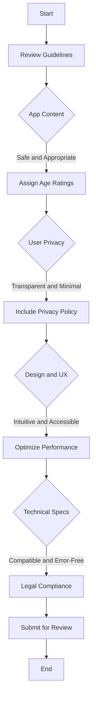

---

linkTitle: "10.2.1 App Store Guidelines Compliance"
title: "App Store Guidelines Compliance: Navigating Apple's Requirements for Flutter Apps"
description: "Master the intricacies of Apple's App Store guidelines to ensure your Flutter app meets all necessary requirements for a successful submission."
categories:
- App Development
- Mobile Apps
- Flutter
tags:
- App Store
- Compliance
- Flutter
- Mobile Development
- Guidelines
date: 2024-10-25
type: docs
nav_weight: 10210

canonical: "https://fluttermasterylibrary.com/2/10/2/1"
license: "© 2023 Tokenizer Inc. CC BY-NC-SA 4.0"
---

## 10.2.1 App Store Guidelines Compliance

Publishing an app on the Apple App Store is a significant milestone for any developer. However, the journey from development to publication involves navigating a complex landscape of guidelines and requirements set forth by Apple. This section aims to equip you with a comprehensive understanding of these guidelines, ensuring your Flutter app is well-prepared for submission, thereby minimizing the risk of rejection.

### Understanding Apple's App Store Guidelines

Apple's App Store guidelines are designed to ensure apps are safe, reliable, and respectful of user privacy. They cover a broad range of topics, from content and design to legal and technical specifications. As a developer, it's crucial to read and interpret these guidelines in the context of your app. Documenting how your app complies with each relevant section can be an invaluable exercise, both for your understanding and for future reference.

#### Deep Dive into the Guidelines

The guidelines are divided into five main categories: Safety, Performance, Business, Design, and Legal. Each category contains specific rules and recommendations that your app must adhere to. Let's explore these categories in detail:

1. **Safety and Health**

   - **Harmful Content:** Ensure your app does not contain content that could harm users or encourage dangerous activities. This includes violent, abusive, or excessively graphic content.
   - **Health and Safety:** Apps that provide health-related services should be backed by credible sources and must not mislead users. For example, if your app offers fitness advice, ensure it is scientifically sound and clearly communicated.

2. **Objectionable Material**

   - **Offensive Content:** Remove or modify any content that could be considered offensive or inappropriate. This includes content that is sexually explicit, defamatory, or discriminatory.
   - **Age Ratings:** Assign accurate age ratings based on the content of your app. This helps users make informed decisions and ensures your app is accessible to the appropriate audience.

3. **User Privacy and Data Use**

   - **Transparency:** Clearly inform users about your data collection practices. This includes what data is collected, how it is used, and with whom it is shared.
   - **Data Minimization:** Collect only the data necessary for your app's functionality. Avoid requesting permissions that are not essential to the user experience.
   - **Privacy Policy:** Provide a link to your privacy policy within the app and on the App Store listing. This is a mandatory requirement and helps build trust with your users.

4. **Design and User Experience**

   - **Intuitive Navigation:** Ensure your app is easy to navigate. Users should be able to find what they need without unnecessary complexity.
   - **Consistent UI Elements:** Use standard UI components where appropriate to provide a familiar experience. Consistency in design helps users feel comfortable and confident in using your app.
   - **Accessibility:** Incorporate features like VoiceOver support to make your app accessible to all users, including those with disabilities.

5. **Technical Specifications**

   - **Performance:** Optimize your app for speed and responsiveness. Slow or unresponsive apps can lead to a poor user experience and may be rejected by Apple.
   - **Compatibility:** Test your app on all supported devices and OS versions. This ensures your app functions correctly across different environments.
   - **Error Handling:** Ensure your app handles errors gracefully without crashing. Implement robust error handling to manage unexpected situations.

6. **Legal Requirements**

   - **Intellectual Property:** Verify that all content in your app is original or properly licensed. This includes images, music, and other media.
   - **Export Compliance:** Comply with export laws and regulations. This is particularly important if your app includes encryption or is available in multiple countries.

### Practical Code Examples and Snippets

To illustrate some of the key points, let's look at a few practical code examples and snippets that can help ensure compliance with Apple's guidelines.

#### Example: Implementing Privacy Policy Link

In your Flutter app, you can easily provide a link to your privacy policy using a simple `TextButton` widget:

```dart
import 'package:flutter/material.dart';
import 'package:url_launcher/url_launcher.dart';

class PrivacyPolicyLink extends StatelessWidget {
  final String privacyPolicyUrl = 'https://yourapp.com/privacy-policy';

  @override
  Widget build(BuildContext context) {
    return TextButton(
      onPressed: () async {
        if (await canLaunch(privacyPolicyUrl)) {
          await launch(privacyPolicyUrl);
        } else {
          throw 'Could not launch $privacyPolicyUrl';
        }
      },
      child: Text('Privacy Policy'),
    );
  }
}
```

This code snippet demonstrates how to create a button that opens your privacy policy in the user's default web browser, ensuring transparency about your data practices.

#### Example: Handling Permissions

To comply with data minimization principles, request only the permissions necessary for your app's functionality. Here's an example using the `permission_handler` package to request location access:

```dart
import 'package:flutter/material.dart';
import 'package:permission_handler/permission_handler.dart';

class LocationPermission extends StatelessWidget {
  Future<void> requestLocationPermission() async {
    var status = await Permission.location.status;
    if (!status.isGranted) {
      await Permission.location.request();
    }
  }

  @override
  Widget build(BuildContext context) {
    return ElevatedButton(
      onPressed: requestLocationPermission,
      child: Text('Request Location Permission'),
    );
  }
}
```

This snippet checks if location permission is granted and requests it if not, adhering to the principle of data minimization.

### Visual Aids: Compliance Checklists and Diagrams

To help you assess your app's compliance, consider using checklists and diagrams. These tools can provide a structured approach to ensuring your app meets all necessary guidelines.

#### Compliance Checklist

Here's a sample checklist to guide your compliance efforts:

- [ ] Does the app contain any harmful or objectionable content?
- [ ] Are age ratings accurately assigned?
- [ ] Is user data collection transparent and minimized?
- [ ] Is a privacy policy link included in the app and App Store listing?
- [ ] Is the app's navigation intuitive and consistent?
- [ ] Are accessibility features implemented?
- [ ] Is the app optimized for performance and compatibility?
- [ ] Are all legal requirements, including intellectual property and export compliance, met?

#### Compliance Verification Process Flowchart

Below is a flowchart illustrating the compliance verification process:



This flowchart provides a visual representation of the steps involved in ensuring your app complies with Apple's guidelines.

### Best Practices and Common Pitfalls

#### Best Practices

- **Stay Updated:** Apple's guidelines are subject to change. Regularly review the latest version to ensure ongoing compliance.
- **Document Compliance:** Keep a record of how your app meets each guideline. This can be useful if your app is ever questioned during the review process.
- **Seek Feedback:** Before submission, have others review your app for compliance. Fresh eyes can catch issues you might have missed.

#### Common Pitfalls

- **Overlooking Privacy:** Failing to provide a clear privacy policy or collecting unnecessary data can lead to rejection.
- **Ignoring Accessibility:** Not incorporating accessibility features can limit your app's audience and lead to compliance issues.
- **Neglecting Performance:** Apps that are slow or crash frequently are likely to be rejected.

### Troubleshooting Tips

If your app is rejected, don't panic. Apple provides feedback on why an app was not approved, allowing you to address the issues and resubmit. Here are some tips for troubleshooting:

- **Review Feedback:** Carefully read the feedback provided by Apple. It will guide you on what needs to be fixed.
- **Test Thoroughly:** Conduct thorough testing to ensure all issues are resolved before resubmitting.
- **Seek Support:** If you're unsure about the feedback or how to address it, consider reaching out to Apple's support or consulting with other developers.

### Conclusion

Ensuring compliance with Apple's App Store guidelines is a critical step in the app development process. By understanding and adhering to these guidelines, you not only increase the chances of your app being approved but also enhance the overall quality and user experience of your app. Remember, compliance benefits both the developer and the users, fostering trust and reliability.

## Quiz Time!



### What is the primary purpose of Apple's App Store guidelines?

- [x] To ensure apps are safe, reliable, and respectful of user privacy.
- [ ] To increase the number of apps on the App Store.
- [ ] To promote Apple's own apps over third-party apps.
- [ ] To make app development more difficult.

> **Explanation:** Apple's guidelines are designed to ensure that apps are safe, reliable, and respectful of user privacy, which benefits both developers and users.

### Which of the following is NOT a category in Apple's guidelines?

- [ ] Safety
- [x] Marketing
- [ ] Design
- [ ] Legal

> **Explanation:** The main categories in Apple's guidelines are Safety, Performance, Business, Design, and Legal. Marketing is not a separate category.

### What should you do if your app is rejected by Apple?

- [x] Review the feedback provided by Apple and address the issues.
- [ ] Immediately resubmit the app without changes.
- [ ] Abandon the app project.
- [ ] Complain to Apple about the rejection.

> **Explanation:** Reviewing Apple's feedback and addressing the issues is the best course of action if your app is rejected.

### Why is it important to assign accurate age ratings to your app?

- [x] To ensure the app is accessible to the appropriate audience.
- [ ] To increase the app's visibility on the App Store.
- [ ] To avoid paying higher fees to Apple.
- [ ] To ensure the app is featured by Apple.

> **Explanation:** Accurate age ratings help users make informed decisions and ensure the app is accessible to the appropriate audience.

### What is a key component of user privacy compliance?

- [x] Providing a link to the privacy policy within the app.
- [ ] Collecting as much user data as possible.
- [ ] Hiding data collection practices from users.
- [ ] Using complex legal jargon in the privacy policy.

> **Explanation:** Providing a link to the privacy policy within the app is crucial for transparency and compliance with user privacy guidelines.

### How can you ensure your app is accessible?

- [x] Incorporate features like VoiceOver support.
- [ ] Use only custom UI components.
- [ ] Focus solely on visual design.
- [ ] Ignore accessibility features.

> **Explanation:** Incorporating features like VoiceOver support ensures that your app is accessible to all users, including those with disabilities.

### What is a common pitfall that can lead to app rejection?

- [x] Failing to provide a clear privacy policy.
- [ ] Including too many features.
- [ ] Offering a free version of the app.
- [ ] Using standard UI components.

> **Explanation:** Failing to provide a clear privacy policy is a common reason for app rejection, as it violates user privacy guidelines.

### What is the benefit of documenting how your app complies with guidelines?

- [x] It can be useful if your app is questioned during the review process.
- [ ] It guarantees your app will be featured by Apple.
- [ ] It increases the app's download count.
- [ ] It allows you to bypass the review process.

> **Explanation:** Documenting compliance can be useful if your app is questioned during the review process, providing evidence of adherence to guidelines.

### What should you do to ensure your app handles errors gracefully?

- [x] Implement robust error handling.
- [ ] Ignore error handling to focus on features.
- [ ] Use error messages as a marketing tool.
- [ ] Allow the app to crash to gather user feedback.

> **Explanation:** Implementing robust error handling ensures that your app can manage unexpected situations without crashing, improving user experience.

### True or False: Apple's guidelines are static and do not change.

- [ ] True
- [x] False

> **Explanation:** Apple's guidelines are subject to change, and developers should regularly review the latest version to ensure ongoing compliance.


