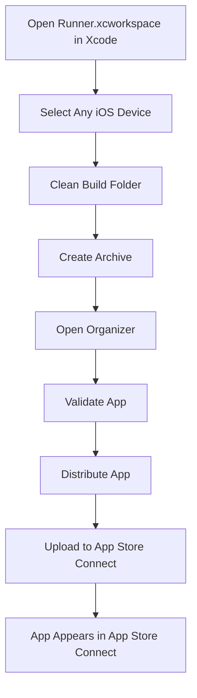

## 10.3.1 Archiving and Uploading Your Flutter App

Publishing your Flutter app to the App Store is an exciting milestone in your app development journey. This section will guide you through the process of archiving your app in Xcode and uploading it to App Store Connect for submission. We will cover everything from final testing to using Xcode and Transporter for uploading your app.

### Preparing the App for Submission

Before you can archive and upload your app, you need to ensure that it is ready for submission. This involves final testing and updating version and build numbers.

#### Final Testing

Before submitting your app, it is crucial to test it thoroughly in release mode. This ensures that the app behaves as expected and performs optimally for end-users. To test your app in release mode, run the following command in your terminal:

```bash
flutter build ios --release
```

This command compiles your Flutter app in release mode, optimizing it for performance and size.

#### Version and Build Numbers

Every app submission to the App Store requires a unique version and build number. Increment these numbers appropriately to reflect updates and changes. In your `pubspec.yaml` file, update the `version` field:

```yaml
version: 1.0.1+2
```

In this example, `1.0.1` is the version number, and `2` is the build number. Ensure that these numbers are incremented from your previous submission.

### Archiving the App

Once your app is ready, the next step is to archive it using Xcode. This process involves several steps, which we will outline below.

#### Open Project in Xcode

Navigate to your Flutter project's `ios` directory and open the `Runner.xcworkspace` file in Xcode. This file is crucial as it includes all necessary configurations for your Flutter app.

```bash
open ios/Runner.xcworkspace
```

#### Select the Correct Scheme

In Xcode, ensure that the target device is set to **Any iOS Device (arm64)**. This setting ensures that your app is built for all compatible iOS devices.

#### Clean the Build

Cleaning the build folder removes any cached data that might interfere with the archiving process. In Xcode, go to **Product > Clean Build Folder**.

#### Create an Archive

To create an archive of your app, follow these steps:

1. Go to **Product > Archive**.
2. Wait for the archiving process to complete.

Once the archive is created, Xcode will automatically open the Organizer window, where you can manage your app archives.

### Uploading the Archive

With your app archived, the next step is to upload it to App Store Connect.

#### Open Organizer

After archiving, Xcode opens the Organizer window, displaying a list of your app archives.

#### Validate the Archive

Before uploading, validate your app archive to ensure it meets App Store requirements:

1. Select the archive in the Organizer.
2. Click **Validate App**.
3. Follow the prompts and address any validation errors that arise.

Validation errors can occur due to various reasons, such as missing icons or incorrect provisioning profiles. Address these issues before proceeding.

#### Upload to App Store Connect

Once your archive is validated, you can upload it to App Store Connect:

1. Click **Distribute App**.
2. Choose **App Store Connect** and follow the prompts.
3. Select the appropriate distribution options, such as whether to include bitcode or symbols.
4. Review your app details and submit.

This process may take some time, so be patient. Once uploaded, your app will appear in App Store Connect, where you can manage its submission.

### Using Transporter (Alternative Method)

If you prefer, you can use Apple's Transporter app to upload your app to the App Store. This method involves exporting your app as an IPA file and using Transporter to upload it.

#### Exporting the IPA File

To export your app as an IPA file:

1. In Xcode, select your archive in the Organizer.
2. Click **Distribute App**.
3. Choose **Ad Hoc** or **Enterprise**, depending on your distribution needs.
4. Follow the prompts to export the IPA file to your desired location.

#### Uploading with Transporter

Transporter is a standalone app provided by Apple for uploading apps to the App Store. To use Transporter:

1. Download and install Transporter from the Mac App Store.
2. Open Transporter and sign in with your Apple ID.
3. Drag and drop your IPA file into Transporter.
4. Click **Deliver** to upload your app.

Transporter provides a simple interface for managing app uploads, making it a convenient alternative to Xcode.

### Visual Aids

To help you navigate the archiving and uploading process, we have included step-by-step screenshots and a flowchart illustrating the workflow.

#### Step-by-Step Screenshots

1. **Open Project in Xcode:**

   

2. **Select the Correct Scheme:**

   

3. **Clean the Build:**

   

4. **Create an Archive:**

   

5. **Validate the Archive:**

   

6. **Upload to App Store Connect:**

   

#### Flowchart

Below is a flowchart illustrating the archiving and uploading process:



### Troubleshooting Tips

During the archiving and uploading process, you may encounter various issues. Here are some common problems and their solutions:

- **Validation Errors:** Ensure all app icons are included, and your provisioning profiles are correct.
- **Upload Failures:** Check your internet connection and ensure you are signed in with the correct Apple ID.
- **Certificate Issues:** Verify that your certificates are valid and not expired.

### Best Practices

- **Increment Version Numbers:** Always update your version and build numbers for each submission.
- **Thorough Testing:** Test your app extensively in release mode to catch any issues before submission.
- **Patience:** The archiving and uploading process can take time, so be patient and follow each step carefully.

### Conclusion

Archiving and uploading your Flutter app to the App Store is a critical step in reaching your audience. By following this guide, you can ensure a smooth submission process. Remember to test thoroughly, validate your archive, and address any issues promptly. With patience and attention to detail, your app will soon be available to users worldwide.

## Quiz Time!



### What is the first step in preparing your app for submission to the App Store?

- [x] Final testing in release mode
- [ ] Creating an archive
- [ ] Uploading to App Store Connect
- [ ] Incrementing version numbers

> **Explanation:** Final testing in release mode ensures that the app is optimized and behaves as expected before submission.

### Which file should you open in Xcode to begin the archiving process for a Flutter app?

- [x] Runner.xcworkspace
- [ ] Runner.xcodeproj
- [ ] main.dart
- [ ] pubspec.yaml

> **Explanation:** The `Runner.xcworkspace` file includes all necessary configurations for the Flutter app and should be opened in Xcode.

### What should you do if you encounter validation errors during the archiving process?

- [x] Address the errors before proceeding
- [ ] Ignore the errors and continue
- [ ] Restart Xcode
- [ ] Rebuild the app in debug mode

> **Explanation:** Validation errors must be addressed to ensure the app meets App Store requirements before submission.

### What is the purpose of the Transporter app?

- [x] To upload IPA files to the App Store
- [ ] To build Flutter apps
- [ ] To test apps in release mode
- [ ] To manage app certificates

> **Explanation:** Transporter is a standalone app used to upload IPA files to the App Store.

### How do you increment the version and build numbers in a Flutter app?

- [x] Update the `version` field in `pubspec.yaml`
- [ ] Change the version in Xcode
- [ ] Modify the `main.dart` file
- [ ] Edit the `Info.plist` file

> **Explanation:** The `version` field in `pubspec.yaml` should be updated to reflect new version and build numbers.

### What should you do after creating an archive in Xcode?

- [x] Validate the archive
- [ ] Upload directly to the App Store
- [ ] Clean the build folder
- [ ] Rebuild the app in debug mode

> **Explanation:** Validating the archive ensures it meets App Store requirements before uploading.

### Which scheme should be selected in Xcode for archiving a Flutter app?

- [x] Any iOS Device (arm64)
- [ ] iPhone Simulator
- [ ] Debug
- [ ] Release

> **Explanation:** Selecting **Any iOS Device (arm64)** ensures the app is built for all compatible iOS devices.

### What is the role of the Organizer window in Xcode?

- [x] To manage app archives
- [ ] To edit app code
- [ ] To test apps on simulators
- [ ] To configure app settings

> **Explanation:** The Organizer window in Xcode is used to manage app archives, including validation and distribution.

### What is a common reason for upload failures to the App Store?

- [x] Incorrect Apple ID or internet connection issues
- [ ] Incorrect app code
- [ ] Outdated Xcode version
- [ ] Invalid app icons

> **Explanation:** Upload failures often occur due to incorrect Apple ID credentials or internet connection issues.

### True or False: It is necessary to increment the build number for each app submission to the App Store.

- [x] True
- [ ] False

> **Explanation:** Incrementing the build number for each submission is necessary to ensure a unique identifier for each version of the app.


