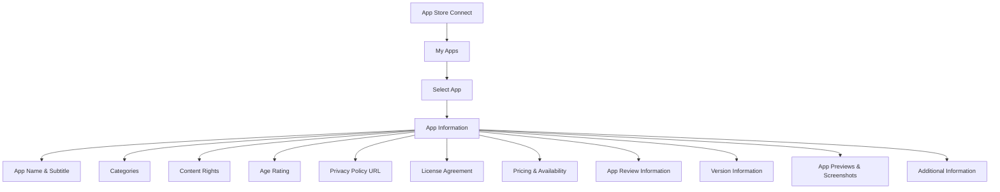

## 10.3.2 Filling Out App Information

Publishing your Flutter app to the App Store is an exciting milestone, but it requires careful attention to detail, especially when filling out the app information in App Store Connect. This step is crucial for ensuring compliance with Apple's guidelines and maximizing your app's visibility and appeal to potential users. In this section, we'll guide you through the process of accurately and effectively completing all necessary app information.

### Accessing App Information

To begin, you'll need to access the App Information section in App Store Connect. Follow these steps:

1. **Sign in to [App Store Connect](https://appstoreconnect.apple.com/):** Use your Apple ID to log in.
2. **Select Your App:** Navigate to the **My Apps** section and choose the app you wish to publish.
3. **Navigate to the App Information Tab:** This is where you'll fill out all the essential details about your app.

### App Name and Subtitle

The app name and subtitle are the first things users will see, so it's important to make a strong impression.

- **App Name:**
  - Limit to 30 characters.
  - Choose a unique and memorable name that reflects your app's purpose.
  - Avoid using generic terms or names that could be confused with existing apps.

- **Subtitle:**
  - Also limited to 30 characters.
  - Provide a brief, engaging summary of your app's main features or benefits.
  - Use this space to highlight what makes your app stand out.

### Categories

Selecting the right categories helps users find your app more easily.

- **Primary Category:**
  - Choose the category that best describes your app's main function.
  - Ensure compliance with Apple's category definitions.

- **Secondary Category (Optional):**
  - Select an additional category if applicable to broaden discoverability.
  - Research where similar apps are listed to make an informed choice.

### Content Rights

If your app contains third-party content, you need to indicate this and confirm that you have the necessary rights and permissions.

- Be prepared to provide documentation upon request.
- Ensure all content complies with Apple's guidelines to avoid rejection.

### Age Rating

The age rating is determined by a questionnaire about your app's content.

- Answer questions honestly about content such as violence, profanity, or mature themes.
- The rating affects app visibility and compliance, so accuracy is important.

### App Privacy Policy URL

If your app collects any user data, you must provide a direct link to your privacy policy.

- Ensure the policy is accessible and complies with legal requirements.
- The privacy policy should clearly explain what data is collected and how it is used.

### License Agreement

You can use Apple's standard agreement or upload a custom End User License Agreement (EULA) if necessary.

- Ensure any custom EULA complies with local laws and Apple's policies.
- A clear and concise EULA can help prevent legal issues.

### Pricing and Availability

Determine your app's pricing and where it will be available.

- **Price Tier:**
  - Choose from predefined price tiers or select "Free."
  - Consider market demand and competition when setting your price.

- **Availability:**
  - Select the countries and regions where you want your app to be available.
  - Consider regional laws, language support, and market demand.

### App Review Information

Providing accurate review information can help expedite the review process.

- **Contact Information:**
  - Provide a name, phone number, and email that Apple can use during the review process.

- **Sign-In Information:**
  - If your app requires login credentials, supply a demo account with instructions.

- **Notes for the Reviewer:**
  - Include any additional information that might help the reviewer, such as specific settings or configurations.

### Version Information

This section includes details about your app's features and benefits.

- **Description:**
  - Enter a detailed description of your app's features and benefits. Reference Section 10.2.3 for guidance.

- **Promotional Text:**
  - Highlight timely events or updates. This text can be updated without submitting a new version.

- **Keywords:**
  - Enter relevant keywords to improve search results, separated by commas.

- **Support URL:**
  - Provide a link to your support website or contact page.

- **Marketing URL (Optional):**
  - Include a link to a website or page that promotes your app.

### App Previews and Screenshots

Visuals are crucial for attracting users, so upload high-quality screenshots for all required device sizes.

- Ensure screenshots accurately represent the app and comply with guidelines (reference Section 10.2.2).
- Consider using annotated screenshots to highlight key features.

### Additional Information

Before submitting your app, double-check the following:

- **Build Version:**
  - Confirm that the correct build is selected for submission.

- **Attachments:**
  - Upload any necessary documents, such as licenses or permissions, under the **General > App Information** section.

### Visual Aids

To help you navigate the App Information page, we've included annotated screenshots and a table summarizing character limits and requirements for each field.

### Writing Tips

- **Accuracy and Clarity:**
  - Double-check all information for accuracy.
  - Use clear, concise language free of spelling and grammatical errors.

- **Consistency:**
  - Ensure that the information provided matches the app's functionality and content.

- **Optimization:**
  - Write engaging descriptions and use effective keywords to enhance discoverability.

- **Review and Feedback:**
  - Get feedback from others to improve the quality and appeal of your app information.

### Common Pitfalls and Best Practices

- **Avoid Overloading Keywords:** While keywords are important, stuffing them can lead to rejection. Focus on relevance and quality.
- **Keep Descriptions User-Centric:** Write descriptions that speak to the user's needs and how your app addresses them.
- **Regularly Update Information:** Keep your app information current with updates and new features to maintain user interest.

### Conclusion

Filling out app information in App Store Connect is a critical step in the app publishing process. By following the guidelines outlined in this section, you can ensure compliance with Apple's requirements and enhance your app's appeal to potential users. Remember, the effort you put into this stage can significantly impact your app's success on the App Store.

## Quiz Time!



### What is the character limit for the app name in App Store Connect?

- [x] 30 characters
- [ ] 50 characters
- [ ] 100 characters
- [ ] 150 characters

> **Explanation:** The app name is limited to 30 characters to ensure it is concise and easily readable.

### Why is it important to choose the correct primary category for your app?

- [x] It helps users find your app more easily.
- [ ] It determines the app's price.
- [ ] It affects the app's color scheme.
- [ ] It sets the app's default language.

> **Explanation:** The primary category helps users find your app by placing it in the correct section of the App Store.

### What should you provide if your app contains third-party content?

- [x] Documentation of rights and permissions
- [ ] A list of third-party developers
- [ ] A copy of the app's source code
- [ ] A detailed user guide

> **Explanation:** You must confirm that you have the necessary rights and permissions for any third-party content in your app.

### What is required if your app collects user data?

- [x] A privacy policy URL
- [ ] A user manual
- [ ] A list of data points collected
- [ ] A data encryption certificate

> **Explanation:** A privacy policy URL is mandatory if your app collects any user data, ensuring transparency and compliance with legal requirements.

### What is the purpose of the App Review Information section?

- [x] To provide Apple with contact and sign-in information for the review process
- [ ] To set the app's price
- [ ] To upload app screenshots
- [ ] To select the app's primary category

> **Explanation:** The App Review Information section is used to provide Apple with the necessary information to review your app efficiently.

### How can you improve your app's discoverability on the App Store?

- [x] Use relevant keywords
- [ ] Increase the app's price
- [ ] Change the app's icon frequently
- [ ] Limit the app's availability to one country

> **Explanation:** Using relevant keywords helps improve your app's search results and discoverability on the App Store.

### What should you do if your app requires login credentials for review?

- [x] Provide a demo account with instructions
- [ ] Disable the login feature temporarily
- [ ] Send the credentials via email after submission
- [ ] Create a new account for each reviewer

> **Explanation:** Providing a demo account with instructions ensures that the reviewer can access and test your app's features.

### What is the benefit of using Apple's standard license agreement?

- [x] It ensures compliance with Apple's policies
- [ ] It allows for unlimited app downloads
- [ ] It guarantees higher app rankings
- [ ] It provides free marketing services

> **Explanation:** Using Apple's standard license agreement ensures that your app complies with Apple's policies and legal requirements.

### What should you include in the app's promotional text?

- [x] Timely events or updates
- [ ] The app's source code
- [ ] A list of competitors
- [ ] The app's development timeline

> **Explanation:** The promotional text is used to highlight timely events or updates and can be updated without submitting a new version.

### True or False: You can select multiple primary categories for your app.

- [ ] True
- [x] False

> **Explanation:** You can only select one primary category for your app, but you have the option to choose a secondary category.


