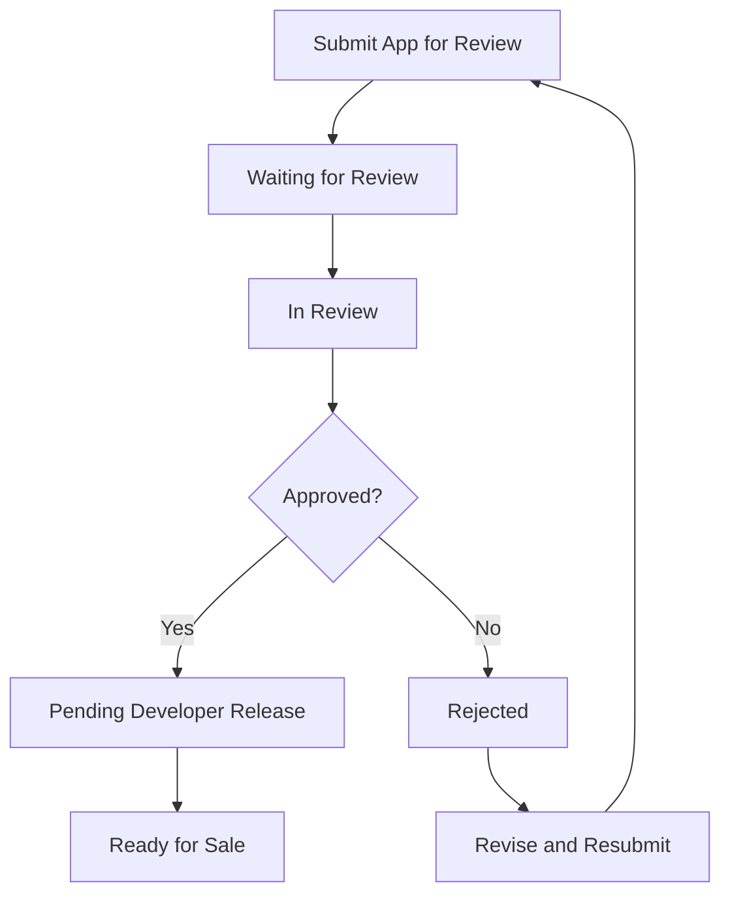

## 10.3.3 App Review Process

Publishing an app on the Apple App Store is a significant milestone for any developer. However, it involves navigating through Apple's rigorous app review process. This section will guide you through understanding the review timeline, stages, criteria, and how to prepare your Flutter app for a successful review. By the end of this chapter, you'll be equipped with the knowledge and strategies to ensure your app meets Apple's standards and reaches your audience smoothly.

### Understanding the Review Timeline

The app review process is a critical step in getting your app live on the App Store. Typically, the review process takes between 1-3 days, but this can vary based on several factors, including the complexity of your app and the current volume of submissions Apple is handling. It's important to set realistic expectations for this timeline:

- **New Submissions:** These generally take longer as they require a thorough review.
- **App Updates:** These are often reviewed more quickly, especially if the changes are minor or address specific issues previously identified.

Understanding these timelines helps in planning your release strategy, especially if you're aiming for a specific launch date.

### Stages of the Review

The app review process is structured into several stages, each representing a different phase of the review. Here's a detailed look at each stage:

#### 1. Waiting for Review

Once you submit your app, it enters the "Waiting for Review" stage. Your app is essentially in a queue, waiting for a reviewer to pick it up. During this time, it's crucial to ensure all your app's metadata and assets are correctly uploaded and that you've provided any necessary information in the "Notes for the Reviewer."

#### 2. In Review

When your app reaches the "In Review" stage, a reviewer is actively examining it. This includes checking the app's functionality, user interface, content, and compliance with Apple's guidelines. This stage is where the bulk of the review process occurs.

#### 3. Rejected

If the reviewer finds issues, your app will be marked as "Rejected." Common reasons for rejection include crashes, non-compliance with content guidelines, or functionality issues. If your app is rejected, you'll receive detailed feedback on what needs to be fixed. It's important to address these issues promptly and resubmit your app.

#### 4. Pending Developer Release

Once your app passes the review, it enters the "Pending Developer Release" stage. This means your app is approved but not yet live on the App Store. You have the control to release it at your chosen time, which is useful for coordinating marketing efforts or aligning with specific launch dates.

#### 5. Ready for Sale

Finally, when you release your app, it moves to the "Ready for Sale" stage. At this point, your app is live on the App Store and available for download by users worldwide.

Here's a visual representation of the review process:

### Review Criteria

Apple evaluates apps based on several criteria to ensure they meet quality and safety standards. Understanding these criteria can help you prepare your app effectively:

#### Functionality

Your app must be fully functional and free of crashes. Test your app extensively on real devices to ensure it performs well under various conditions. Consider edge cases and unexpected user behaviors that might cause issues.

#### Content

Content must comply with Apple's guidelines. This means avoiding offensive, illegal, or inappropriate content. Ensure your app's content is suitable for the intended audience and aligns with Apple's standards.

#### User Interface

Apple places a strong emphasis on user interface design. Your app should be intuitive, easy to navigate, and visually appealing. Follow Apple's Human Interface Guidelines to ensure your app meets these expectations.

#### Compliance

Your app must adhere to all relevant laws and Apple's policies. This includes data privacy regulations, intellectual property rights, and any specific rules related to your app's category or functionality.

### Preparing for Review

Preparation is key to a successful app review. Here are strategies to ensure your app is ready:

#### Test Extensively

- **Use Real Devices:** Test your app on multiple devices to catch issues that might not appear in simulators.
- **Simulate User Scenarios:** Consider various user paths and interactions to ensure your app handles them gracefully.

#### Validate In-App Purchases

If your app includes in-app purchases, verify that transactions work correctly. Test all purchase flows and ensure users receive the correct content or features after a purchase.

#### Check Connectivity

Test your app's behavior under different network conditions, including offline scenarios. Ensure your app handles connectivity issues gracefully and provides appropriate feedback to users.

#### Provide Clear Review Notes

If your app requires specific configurations or has unique features, explain them in the "Notes for the Reviewer." This helps reviewers understand your app's functionality and reduces the chances of misunderstandings.

### Monitoring the Review

Once your app is submitted, regularly check App Store Connect for status updates. Be prepared to respond quickly if the reviewer requests additional information or clarification. Timely responses can expedite the review process and demonstrate your commitment to quality.

### Communicating with the Review Team

If your app is rejected or if you have questions, use the Resolution Center in App Store Connect to communicate with the review team. Maintain a professional and respectful tone in all communications. Clearly address the issues raised and provide any requested information promptly.

### Visual Aids

To assist you in navigating App Store Connect, here are screenshots of the status indicators you might encounter:

- **Waiting for Review:** 
- **In Review:** 
- **Rejected:** 
- **Pending Developer Release:** 
- **Ready for Sale:** 

### Writing Tips

#### Stay Informed

Familiarize yourself with the latest App Store Review Guidelines. Apple frequently updates these guidelines, and staying informed can help you preemptively address potential issues.

#### Be Proactive

Before submitting your app, review it thoroughly to identify and fix potential issues. This proactive approach can save time and reduce the likelihood of rejection.

#### Patience

Understand that the review process takes time. Avoid rushing or submitting incomplete apps, as this can lead to rejection and further delays.

### Conclusion

Navigating Apple's app review process can be challenging, but with careful preparation and attention to detail, you can increase your chances of a successful review. By understanding the review timeline, stages, and criteria, and by thoroughly preparing your app, you'll be well on your way to seeing your Flutter app live on the App Store.

## Quiz Time!



### What is the typical timeline for Apple's app review process?

- [x] 1-3 days
- [ ] 4-7 days
- [ ] 1-2 weeks
- [ ] Over a month

> **Explanation:** The typical review process takes 1-3 days, although this can vary based on several factors.

### Which stage indicates that your app is approved but not yet live?

- [ ] In Review
- [ ] Rejected
- [x] Pending Developer Release
- [ ] Ready for Sale

> **Explanation:** "Pending Developer Release" means your app is approved and waiting for you to release it.

### What should you do if your app is rejected?

- [ ] Submit a complaint
- [x] Address the issues and resubmit
- [ ] Wait for automatic approval
- [ ] Ignore the feedback

> **Explanation:** If your app is rejected, you should address the issues identified by the reviewer and resubmit your app.

### What is a key aspect of preparing your app for review?

- [ ] Only test on simulators
- [x] Test extensively on real devices
- [ ] Ignore network conditions
- [ ] Skip in-app purchase validation

> **Explanation:** Testing extensively on real devices is crucial to ensure your app functions correctly under various conditions.

### Which of the following is NOT a review criterion?

- [ ] Functionality
- [ ] Content
- [ ] User Interface
- [x] Marketing Strategy

> **Explanation:** Marketing Strategy is not a review criterion. Apple focuses on functionality, content, user interface, and compliance.

### How should you communicate with the review team if needed?

- [ ] Use social media
- [ ] Send an email
- [x] Use the Resolution Center
- [ ] Call Apple Support

> **Explanation:** The Resolution Center in App Store Connect is the appropriate channel for communicating with the review team.

### What is the purpose of the "Notes for the Reviewer"?

- [ ] To provide marketing material
- [x] To explain special configurations or features
- [ ] To list app features
- [ ] To request expedited review

> **Explanation:** The "Notes for the Reviewer" section is used to explain any special configurations or features that the reviewer should be aware of.

### What should you do if the reviewer requests additional information?

- [ ] Ignore the request
- [ ] Wait for a week before responding
- [x] Respond quickly with the requested information
- [ ] Submit a new version

> **Explanation:** Responding quickly with the requested information can expedite the review process.

### What does the "Ready for Sale" status indicate?

- [ ] The app is still in review
- [ ] The app is rejected
- [x] The app is live on the App Store
- [ ] The app is pending release

> **Explanation:** "Ready for Sale" indicates that the app is live on the App Store and available for download.

### True or False: You should only test your app on the latest iOS version.

- [ ] True
- [x] False

> **Explanation:** It's important to test your app on multiple iOS versions to ensure compatibility across different devices.


