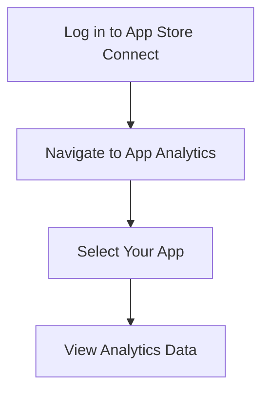

## 10.4.1 Monitoring Analytics and Sales

In the competitive world of mobile applications, understanding how your app performs in the market is crucial for its success. This section will guide you through the process of using App Store Connect's analytics and sales data to gain insights into your app's performance, helping you make informed decisions for future updates and marketing strategies.

### Accessing Analytics

To begin monitoring your app's performance, you need to access App Store Connect:

1. **Log in to App Store Connect**: Use your Apple Developer account credentials to log in.
2. **Navigate to App Analytics**: Once logged in, select **App Analytics** from the dashboard.
3. **Select Your App**: Choose your app from the list to view specific analytics data.

Here is a simple flowchart to visualize the process:

### Understanding Key Metrics

App Store Connect provides a wealth of data. Here are some key metrics you should focus on:

- **Impressions**: This metric shows the number of times your app was viewed on the App Store. High impressions indicate good visibility, but you need to correlate this with downloads to assess effectiveness.
  
- **Product Page Views**: This indicates how many users viewed your app's detailed page. A high number of page views with low downloads may suggest issues with your app's description or screenshots.

- **App Units**: Represents the number of first-time downloads. This metric is crucial for understanding how many new users are acquiring your app.

- **Installations**: Total number of times the app was installed, including re-downloads. This helps in understanding the overall reach of your app.

- **Sessions**: The number of times the app was used. High session counts can indicate good user engagement.

- **Retention**: This is the percentage of users who return to the app over time. High retention rates are a positive indicator of user satisfaction and app quality.

### Analyzing Sales Data

To understand the financial performance of your app, you need to analyze sales data:

1. **Navigate to Sales and Trends**: In App Store Connect, go to the **Sales and Trends** section.
2. **Earnings Overview**: View total revenue and breakdowns by product or region. This helps identify which products or regions are most profitable.
3. **Subscription Metrics**: If your app includes subscriptions, monitor active subscribers, cancellations, and renewals to understand the lifecycle of your subscription products.

### Interpreting Data

Interpreting the data correctly is key to making informed decisions:

- **Look for Patterns and Trends**: Analyze the data for patterns over time. Are there certain times of the year when downloads spike? Do certain updates lead to increased user engagement?

- **Correlate Spikes with Marketing Campaigns or Updates**: If you notice a spike in downloads or revenue, correlate it with any marketing campaigns or app updates you have launched.

- **Identify High-Performing Regions or Demographics**: Use regional data to identify where your app is performing well. This can help tailor marketing efforts to specific demographics.

### Using Insights

Once you have gathered insights from the data, it's time to put them into action:

- **User Engagement**: Enhance features that are popular among users. If a particular feature is driving high engagement, consider expanding it or adding complementary features.

- **Marketing Efforts**: Allocate resources to strategies that yield results. If a particular marketing campaign led to a spike in downloads, consider replicating or expanding it.

- **Update Planning**: Address issues contributing to user drop-off. If you notice a decline in retention rates, investigate potential causes and plan updates to address them.

### Additional Tools

While App Store Connect provides valuable insights, integrating with third-party analytics tools can offer deeper insights:

- **Firebase Analytics**: Consider using Firebase Analytics for more detailed user behavior data. It provides real-time insights and allows you to track custom events within your app.

- **Privacy Compliance**: Ensure compliance with privacy policies when collecting data. Always inform users about data collection practices and obtain necessary consents.

### Visual Aids

Visual aids can help you better understand and communicate your app's performance:

- **Dashboard Screenshots**: Capture screenshots of key analytics sections to share with your team or stakeholders.
  
- **Graph Examples**: Create graphs to visualize user retention or sales over time. This can help identify trends and make data-driven decisions.

### Writing Tips

To effectively use analytics and sales data, consider the following tips:

- **Goal Setting**: Define clear objectives for what you want to achieve with the data. Are you looking to increase downloads, improve user engagement, or boost revenue?

- **Regular Reviews**: Schedule consistent times to analyze data. Regular reviews help you stay on top of trends and make timely decisions.

- **Actionable Insights**: Focus on metrics that can inform decisions. Avoid getting bogged down in data that doesn't contribute to actionable insights.

By leveraging the analytics and sales data available through App Store Connect, you can make informed decisions that enhance your app's performance and drive business success. Regularly reviewing and interpreting this data is crucial for staying competitive in the app market.

## Quiz Time!



### What is the first step to access your app's analytics on App Store Connect?

- [x] Log in to App Store Connect
- [ ] Navigate to Sales and Trends
- [ ] Select Your App
- [ ] View Analytics Data

> **Explanation:** The first step is to log in to App Store Connect using your Apple Developer account credentials.

### Which metric indicates the number of first-time downloads of your app?

- [ ] Impressions
- [ ] Product Page Views
- [x] App Units
- [ ] Sessions

> **Explanation:** App Units represent the number of first-time downloads of your app.

### What should you do if you notice a high number of product page views but low downloads?

- [ ] Increase marketing budget
- [x] Review app description and screenshots
- [ ] Update app features
- [ ] Reduce app price

> **Explanation:** A high number of product page views with low downloads may suggest issues with your app's description or screenshots.

### What section in App Store Connect provides a breakdown of revenue by product or region?

- [ ] App Analytics
- [x] Sales and Trends
- [ ] Subscription Metrics
- [ ] Earnings Overview

> **Explanation:** The Sales and Trends section provides a breakdown of revenue by product or region.

### How can you identify high-performing regions for your app?

- [ ] By analyzing Impressions
- [x] By using regional sales data
- [ ] By tracking App Units
- [ ] By monitoring Sessions

> **Explanation:** Regional sales data helps identify where your app is performing well, allowing you to tailor marketing efforts.

### What tool can you integrate with App Store Connect for deeper insights into user behavior?

- [ ] Google Analytics
- [ ] Mixpanel
- [x] Firebase Analytics
- [ ] Tableau

> **Explanation:** Firebase Analytics can be integrated for more detailed user behavior data.

### What is the benefit of high retention rates for your app?

- [ ] Increased marketing costs
- [ ] Lower user engagement
- [ ] Higher app units
- [x] Positive indicator of user satisfaction

> **Explanation:** High retention rates are a positive indicator of user satisfaction and app quality.

### What should you do if you notice a decline in retention rates?

- [ ] Increase app price
- [ ] Launch a new marketing campaign
- [x] Investigate potential causes and plan updates
- [ ] Ignore the data

> **Explanation:** Investigating potential causes and planning updates can address issues contributing to user drop-off.

### What is the purpose of setting clear objectives for data analysis?

- [x] To focus on metrics that inform decisions
- [ ] To increase data complexity
- [ ] To reduce app features
- [ ] To ignore user feedback

> **Explanation:** Setting clear objectives helps focus on metrics that can inform decisions and drive business success.

### True or False: Regular reviews of analytics data are unnecessary for app success.

- [ ] True
- [x] False

> **Explanation:** Regular reviews of analytics data are crucial for staying on top of trends and making timely decisions.


