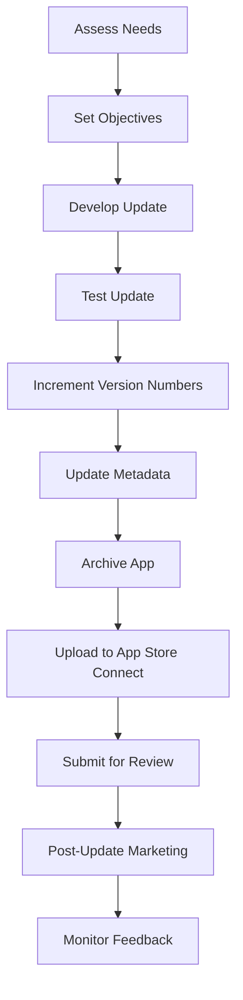

## 10.4.3 Updating Your App

Updating your app is a crucial part of the mobile app lifecycle. It not only helps in fixing bugs and improving performance but also keeps your app relevant and competitive in the market. This section will guide you through the process of planning, developing, and releasing updates for your Flutter app, ensuring that each update enhances user experience and maintains compliance with App Store policies.

### Planning Updates

#### Assessing Needs

Before diving into development, it's essential to assess the need for an update. This involves gathering user feedback, analyzing crash reports, and reviewing analytics data. These insights will help you identify areas that require improvement or new features that users desire.

- **User Feedback:** Collect feedback through app reviews, surveys, and direct communication channels. Tools like Firebase Analytics or Google Analytics can provide valuable insights into user behavior and preferences.
- **Crash Reports:** Utilize tools like Crashlytics to monitor app crashes and identify recurring issues that need to be addressed.
- **Analytics Data:** Analyze user engagement metrics to understand how users interact with your app and identify potential areas for enhancement.

#### Setting Objectives

Once you've assessed the needs, define clear objectives for the update. This could include introducing new features, improving existing functionalities, or addressing security vulnerabilities. Setting specific goals will help guide the development process and ensure that the update delivers tangible benefits to users.

- **New Features:** Identify features that align with user needs and business goals.
- **Performance Improvements:** Focus on optimizing app performance, reducing load times, and enhancing user experience.
- **Security Patches:** Address any security vulnerabilities to protect user data and maintain trust.

### Development

#### Coding Standards

Adhering to coding best practices is crucial for maintaining a clean and manageable codebase. This not only facilitates easier updates but also ensures that your app remains scalable and robust.

- **Code Organization:** Follow a consistent project structure and naming conventions to improve code readability.
- **Modularization:** Break down the app into smaller, reusable components to simplify maintenance and testing.
- **Documentation:** Maintain comprehensive documentation for all code changes to facilitate future updates and onboarding of new developers.

#### Testing

Thorough testing is essential to ensure that the update functions as intended and does not introduce new issues. Utilize both simulators and real devices to test the app under various conditions.

- **Unit Testing:** Write unit tests for individual components to verify their functionality.
- **Integration Testing:** Test the interaction between different components to ensure seamless operation.
- **Regression Testing:** Perform regression testing to ensure that new changes do not break existing functionality.

### Version Management

#### Increment Version Numbers

Updating the version number is a critical step in the release process. This helps users and app stores distinguish between different versions of your app.

- **Version Number:** Update the version number (e.g., from 1.0 to 1.1) in your `pubspec.yaml` file and Xcode project settings.
- **Build Number:** Always increment the build number for each submission to App Store Connect. This is crucial for tracking different builds and ensuring a smooth review process.

```yaml
version: 1.1.0+2
```

### Updating Metadata

#### Release Notes

Release notes provide users with clear and concise information about what's new in the update. They should highlight major changes, new features, and any bug fixes.

- **Clarity:** Use simple language to explain the changes.
- **Brevity:** Keep the notes concise and focused on key updates.
- **Transparency:** Be transparent about any changes that affect user data or workflows.

#### Screenshots and Previews

If the UI has significantly changed, update the app's screenshots and previews in App Store Connect. This ensures that users have an accurate representation of the app's current state.

### Submission

#### Archive the App

Before submitting the update, build and archive the app in Xcode. This process packages the app for distribution and ensures that it meets the necessary requirements for submission.

- **Build Configuration:** Ensure that the build configuration is set to 'Release' for optimal performance.
- **Archive:** Use Xcode's 'Product > Archive' feature to create an archive of the app.

#### Upload

Once the app is archived, upload the new build to App Store Connect. This involves using Xcode or Transporter to transfer the build to Apple's servers.

- **Transporter:** Use Apple's Transporter app for a streamlined upload process.
- **App Store Connect:** Verify that the build appears in App Store Connect and is ready for submission.

#### Review Process

Submit the update for review, following the same guidelines as the initial submission. Ensure that all necessary metadata and assets are updated and comply with App Store policies.

- **Compliance:** Review Apple's guidelines to ensure compliance with all policies.
- **Submission:** Use App Store Connect to submit the update for review.

### Post-Update Actions

#### Marketing

Announce the update through various channels to inform users and encourage them to download the latest version.

- **Social Media:** Use platforms like Twitter, Facebook, and Instagram to reach a broad audience.
- **Newsletters:** Send out newsletters to your subscriber base highlighting the new features and improvements.
- **In-App Messages:** Use in-app messaging to notify users about the update and encourage them to explore the new features.

#### Monitoring

After the update is released, monitor analytics and user feedback to identify any new issues or areas for further improvement.

- **Analytics Tools:** Use tools like Firebase Analytics to track user engagement and performance metrics.
- **User Feedback:** Continue to gather feedback through reviews and direct communication to understand user satisfaction and areas for improvement.

### Visual Aids

#### Process Flowchart

Below is a flowchart outlining the steps from planning to release:



#### Checklist

Here's a pre-submission checklist to ensure that all necessary steps are completed before releasing an update:

- [ ] Gather user feedback and analytics data.
- [ ] Define clear objectives for the update.
- [ ] Develop and test the update thoroughly.
- [ ] Increment version and build numbers.
- [ ] Update release notes and metadata.
- [ ] Archive and upload the app to App Store Connect.
- [ ] Submit the update for review.
- [ ] Announce the update through marketing channels.
- [ ] Monitor user feedback and analytics post-release.

### Writing Tips

#### Document Changes

Keep detailed records of all updates for internal use. This documentation will be invaluable for future reference and can aid in troubleshooting any issues that arise post-release.

#### User Communication

Be transparent with users about changes, especially if they affect user data or workflows. Clear communication builds trust and encourages user engagement.

#### Continuous Improvement

Embrace updates as opportunities to enhance your app's value. Regularly review user feedback and analytics to identify areas for improvement and ensure that your app remains competitive in the market.

## Quiz Time!



### What is the first step in planning an app update?

- [x] Assessing needs through user feedback and analytics
- [ ] Developing new features
- [ ] Submitting the app for review
- [ ] Marketing the update

> **Explanation:** The first step is to assess needs by gathering user feedback, crash reports, and analytics data to identify areas for improvement.

### Why is it important to increment the version number?

- [x] To distinguish between different versions of the app
- [ ] To make the app look newer
- [ ] To reset user data
- [ ] To increase app size

> **Explanation:** Incrementing the version number helps users and app stores distinguish between different versions of your app.

### Which tool can be used to monitor app crashes?

- [x] Crashlytics
- [ ] Google Maps
- [ ] Firebase Hosting
- [ ] App Store Connect

> **Explanation:** Crashlytics is a tool that helps monitor app crashes and identify recurring issues.

### What should be included in release notes?

- [x] Clear and concise information about what's new
- [ ] Personal opinions
- [ ] Detailed code changes
- [ ] User passwords

> **Explanation:** Release notes should provide users with clear and concise information about what's new in the update.

### What is the purpose of regression testing?

- [x] To ensure new changes don't break existing functionality
- [ ] To test the app's performance under load
- [ ] To check the app's compatibility with new devices
- [ ] To verify user feedback

> **Explanation:** Regression testing ensures that new changes do not break existing functionality.

### What should you do if the UI has significantly changed?

- [x] Update screenshots and previews in App Store Connect
- [ ] Ignore the changes
- [ ] Remove the app from the store
- [ ] Change the app's name

> **Explanation:** If the UI has significantly changed, update the app's screenshots and previews to reflect the current state.

### How can you announce an app update?

- [x] Through social media, newsletters, and in-app messages
- [ ] By sending emails to random users
- [ ] By changing the app's icon
- [ ] By deleting the old version

> **Explanation:** Announce the update through social media, newsletters, and in-app messages to inform users and encourage downloads.

### What is the role of analytics tools post-update?

- [x] To track user engagement and performance metrics
- [ ] To increase app downloads automatically
- [ ] To delete user data
- [ ] To change app permissions

> **Explanation:** Analytics tools help track user engagement and performance metrics to identify any new issues or areas for further improvement.

### What is the benefit of modularizing your code?

- [x] It simplifies maintenance and testing
- [ ] It makes the app larger
- [ ] It reduces app functionality
- [ ] It hides code from users

> **Explanation:** Modularizing code breaks down the app into smaller, reusable components, simplifying maintenance and testing.

### True or False: Continuous improvement is not necessary once the app is successful.

- [ ] True
- [x] False

> **Explanation:** Continuous improvement is essential to keep the app relevant and competitive, even after achieving initial success.


