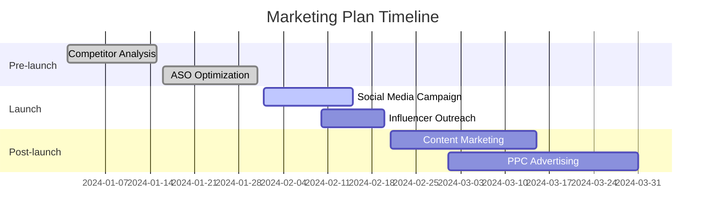

## 11.1.1 Creating a Marketing Plan

In the world of mobile applications, having a great app is only half the battle. The other half lies in ensuring that your app reaches its target audience and gains the traction it deserves. This is where a well-crafted marketing plan comes into play. In this section, we will guide you through the process of developing a comprehensive marketing plan for your Flutter app, aimed at increasing its visibility and user adoption post-launch.

### Understanding the Importance of Marketing

Even the most innovative and well-designed apps can go unnoticed without effective marketing. A marketing plan serves as a roadmap, helping you set clear objectives and strategies to reach your target audience. It ensures that your efforts are focused and aligned with your business goals, ultimately leading to increased downloads, user engagement, and revenue.

### Defining Marketing Goals

Setting specific, measurable goals is crucial for the success of your marketing efforts. These goals will guide your strategies and help you track progress over time.

#### Specific Goals

Begin by identifying what you want to achieve with your marketing efforts. This could include:

- **Total Downloads:** Aim for a specific number of downloads within a certain timeframe.
- **Active Users:** Set a target for the number of daily or monthly active users.
- **Revenue Targets:** Define revenue goals from in-app purchases, subscriptions, or ads.

#### Time-bound Objectives

Establish both short-term and long-term objectives to monitor your progress. Short-term goals might focus on initial launch activities, while long-term goals could involve sustained growth and user retention.

### Identifying Target Audience

Understanding your target audience is fundamental to creating effective marketing strategies. This involves defining both the demographics and psychographics of your ideal users.

#### Demographics

Consider the following demographic factors:

- **Age:** What age group is most likely to use your app?
- **Gender:** Is your app targeted towards a specific gender?
- **Location:** Are there particular regions or countries where your app will be more popular?
- **Occupation:** What professions might benefit from your app?
- **Interests:** What hobbies or interests align with your app's features?

#### Psychographics

Explore the lifestyle, behaviors, and motivations of your users:

- **Lifestyle:** What are the daily habits and routines of your target audience?
- **Behaviors:** How do they interact with technology and mobile apps?
- **Motivations:** What drives them to download and use apps like yours?

#### User Personas

Create detailed user personas to personalize your marketing efforts. A user persona is a fictional character that represents a segment of your target audience. It includes demographic and psychographic details, as well as goals and challenges.

### Analyzing the Market

Conducting a thorough market analysis will help you understand the competitive landscape and identify opportunities for your app.

#### Competitor Analysis

Research similar apps to understand their strengths and weaknesses. Analyze their marketing strategies, user reviews, and app features. This will help you identify gaps in the market that your app can fill.

#### Unique Selling Proposition (USP)

Determine what sets your app apart from competitors. Your USP should highlight the unique features or benefits that make your app stand out. This could be a specific functionality, a superior user experience, or a more affordable price point.

### Marketing Channels

Choosing the right marketing channels is essential for reaching your target audience effectively. Consider a mix of organic and paid channels to maximize your reach.

#### Organic Channels

- **App Store Optimization (ASO):** Optimize your app's listing to improve its visibility in app store search results. This includes using relevant keywords, crafting compelling descriptions, and selecting eye-catching visuals.
- **Content Marketing:** Create valuable content such as blogs, articles, or videos that educate and engage your audience. This can drive traffic to your app and establish your brand as an authority in your niche.
- **Social Media Engagement:** Leverage platforms like Instagram, Twitter, and Facebook to connect with your audience and promote your app. Share updates, engage with users, and run contests to increase visibility.
- **Email Marketing:** Build an email list and send regular newsletters to keep your audience informed about updates, promotions, and new features.

#### Paid Channels

- **Pay-per-click (PPC) Advertising:** Use platforms like Google Ads to run targeted ad campaigns that drive traffic to your app's landing page or app store listing.
- **Social Media Ads:** Run paid ads on social media platforms to reach a broader audience and increase app downloads.
- **Influencer Partnerships:** Collaborate with influencers in your niche to promote your app to their followers. This can increase credibility and reach a wider audience.

### Budgeting

Allocate resources based on the expected return on investment (ROI) from each channel. Consider both paid and organic strategies, and prioritize those that align with your goals and budget.

#### Low-cost or No-cost Strategies

For those with limited budgets, focus on low-cost strategies such as ASO, content marketing, and social media engagement. These can be highly effective when executed well.

### Timeline and Milestones

Create a marketing calendar outlining key activities and campaigns. This will help you stay organized and ensure that your efforts are timely and coordinated.

#### Sample Timeline

#### Milestones

Set milestones to evaluate progress and make adjustments. These could include reaching a certain number of downloads, achieving a specific user retention rate, or hitting revenue targets.

### Measuring Success

Define key performance indicators (KPIs) to measure the success of your marketing efforts. These could include:

- **User Acquisition Cost:** The cost of acquiring a new user.
- **User Retention Rate:** The percentage of users who continue to use your app over time.
- **Conversion Rates:** The percentage of users who take a desired action, such as making a purchase or signing up for a newsletter.

#### Analytics Tools

Utilize analytics tools to track performance and gather insights. Recommended tools include:

- **Google Analytics:** Provides detailed insights into user behavior and app performance.
- **Firebase Analytics:** Offers real-time data on user engagement and app usage.

### Risk Management

Identify potential challenges and plan contingencies. This could involve preparing for technical issues, negative reviews, or changes in market trends. Stress the importance of flexibility and adapting the plan as needed.

### Visual Aids

#### Marketing Plan Template

Provide a template with sections for goals, target audience, strategies, budget, and KPIs. This will help you organize your thoughts and create a structured plan.

#### Sample Timeline or Gantt Chart

Use charts and diagrams to visualize your marketing activities and timelines. This will make it easier to track progress and ensure that all tasks are completed on schedule.

#### Case Study Example

Consider a case study of a successful app marketing plan. Analyze what worked well and what could be improved. This will provide valuable insights and inspiration for your own plan.

### Writing Tips

- Use clear and actionable language to empower readers to create their own plans.
- Encourage readers to research and understand their market deeply.
- Remind them to align marketing efforts with their app's branding and messaging.
- Suggest revisiting and revising the marketing plan regularly based on performance data.

## Quiz Time!



### Why is a marketing plan important for an app?

- [x] It helps set clear objectives and strategies.
- [ ] It guarantees immediate success.
- [ ] It eliminates the need for further marketing efforts.
- [ ] It is only necessary for large companies.

> **Explanation:** A marketing plan helps set clear objectives and strategies, ensuring that marketing efforts are focused and aligned with business goals.

### What should be included in the demographics of your target audience?

- [x] Age, gender, location, occupation, interests
- [ ] Only age and gender
- [ ] Only location and occupation
- [ ] Only interests

> **Explanation:** Demographics should include age, gender, location, occupation, and interests to fully understand the target audience.

### What is a Unique Selling Proposition (USP)?

- [x] It highlights what sets your app apart from competitors.
- [ ] It is a list of all app features.
- [ ] It is a pricing strategy.
- [ ] It is a type of advertisement.

> **Explanation:** A USP highlights the unique features or benefits that make your app stand out from competitors.

### Which of the following is an organic marketing channel?

- [x] App Store Optimization (ASO)
- [ ] Pay-per-click (PPC) advertising
- [ ] Social media ads
- [ ] Influencer partnerships

> **Explanation:** ASO is an organic marketing channel focused on optimizing your app's listing to improve visibility in app store search results.

### What is a key performance indicator (KPI)?

- [x] A metric used to measure the success of marketing efforts
- [ ] A type of advertisement
- [ ] A user persona
- [ ] A marketing channel

> **Explanation:** A KPI is a metric used to measure the success of marketing efforts, such as user acquisition cost or conversion rates.

### What is the purpose of a marketing calendar?

- [x] To outline key activities and campaigns
- [ ] To track app downloads
- [ ] To manage user feedback
- [ ] To set app pricing

> **Explanation:** A marketing calendar outlines key activities and campaigns, helping to organize and coordinate marketing efforts.

### What tool can be used for app analytics?

- [x] Google Analytics
- [ ] Microsoft Word
- [ ] Adobe Photoshop
- [ ] Slack

> **Explanation:** Google Analytics is a tool that provides detailed insights into user behavior and app performance.

### What should you do if your marketing plan is not achieving the desired results?

- [x] Adapt the plan based on performance data
- [ ] Continue without changes
- [ ] Stop all marketing efforts
- [ ] Change the app entirely

> **Explanation:** If the marketing plan is not achieving the desired results, it is important to adapt the plan based on performance data.

### What is a low-cost marketing strategy?

- [x] Content marketing
- [ ] Television advertising
- [ ] Celebrity endorsements
- [ ] Large-scale events

> **Explanation:** Content marketing is a low-cost strategy that involves creating valuable content to engage and educate the audience.

### True or False: A marketing plan should be revisited and revised regularly.

- [x] True
- [ ] False

> **Explanation:** A marketing plan should be revisited and revised regularly based on performance data to ensure it remains effective.


