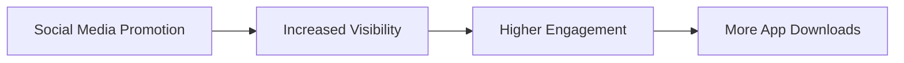

---

linkTitle: "11.1.2 Social Media Promotion"
title: "Social Media Promotion: Boost Your Flutter App's Visibility"
description: "Learn how to effectively use social media platforms to promote your Flutter app, build a community, and engage with potential users."
categories:
- App Development
- Marketing
- Social Media
tags:
- Flutter
- App Promotion
- Social Media Marketing
- Community Building
- Engagement Strategies
date: 2024-10-25
type: docs
nav_weight: 11120

canonical: "https://fluttermasterylibrary.com/2/11/1/2"
license: "© 2023 Tokenizer Inc. CC BY-NC-SA 4.0"
---

## 11.1.2 Social Media Promotion

In today's digital age, social media is an indispensable tool for promoting your Flutter app. It offers a platform to reach a vast audience, engage with users, and build a community around your app. This section will guide you through the process of leveraging social media effectively to boost your app's visibility and success.

### Choosing the Right Platforms

#### Identify Platforms

The first step in social media promotion is selecting the right platforms. Each platform has its unique audience and content style, so it's crucial to choose those that align with your target audience. Here are some popular platforms to consider:

- **Facebook**: Ideal for reaching a broad audience with diverse demographics. It's great for community building and sharing detailed content.
- **Twitter**: Known for real-time updates and engaging with users through short, impactful messages.
- **Instagram**: Focuses on visual content, making it perfect for showcasing app features through images and videos.
- **LinkedIn**: Best for professional networking and B2B marketing.
- **TikTok**: Popular among younger audiences, it's excellent for creative and viral content.
- **YouTube**: The go-to platform for video content, ideal for tutorials, demos, and vlogs.

#### Audience Alignment

To choose the right platforms, you need to understand where your target audience spends their time. Conduct market research to identify the demographics of your potential users and align your social media strategy accordingly. For instance, if your app targets professionals, LinkedIn might be more effective than TikTok.

### Establishing a Social Media Presence

#### Creating Professional Profiles

Your social media profiles are the face of your app online. Ensure they are professional and consistent across all platforms. Here are some tips:

- **Branding**: Use your app's logo as the profile picture and maintain a consistent color scheme and style.
- **Cover Images**: Design cover images that reflect your app's theme and message.
- **Bios**: Write concise and engaging bios that clearly convey what your app does and its unique value proposition.

#### Consistency

Consistency is key to building a recognizable brand. Post regularly and maintain a consistent voice and style. This helps in establishing trust and familiarity with your audience.

### Content Strategy

#### Types of Content

A successful social media strategy involves a mix of content types to keep your audience engaged. Consider the following:

- **Educational Posts**: Share tips, how-tos, and insights related to your app's domain.
- **Promotional Content**: Highlight app features, updates, and special offers.
- **Interactive Content**: Engage users with polls, quizzes, and questions.
- **User-Generated Content**: Encourage users to share their experiences and creations with your app.

#### Content Calendar

Planning your posts in advance using a content calendar ensures a steady flow of content and helps in maintaining consistency. Here's a simple template to get started:

```plaintext
| Date       | Platform | Content Type    | Description                               | Visuals Needed | Hashtags         |
|------------|----------|-----------------|-------------------------------------------|----------------|------------------|
| 2024-11-01 | Facebook | Educational     | How to use feature X                      | Infographic    | #AppTips #FeatureX |
| 2024-11-03 | Twitter  | Promotional     | New update release                        | Screenshot     | #AppUpdate       |
| 2024-11-05 | Instagram| User-Generated  | Share user testimonial                    | User photo     | #UserStory       |
```

#### Visuals

Visual content is more engaging and shareable. Use high-quality images, graphics, and videos to capture attention. Tools like Canva or Adobe Spark can help create stunning visuals without needing advanced design skills.

### Engagement Techniques

#### Building Community

Building a community around your app fosters loyalty and word-of-mouth promotion. Here are some techniques:

- **Interaction**: Respond to comments and messages promptly. Show appreciation for user feedback and suggestions.
- **Groups and Discussions**: Join relevant groups or forums and contribute valuable insights. This positions you as an authority in your niche.

#### Hashtags

Hashtags increase your content's visibility. Use relevant hashtags to reach a broader audience and create a unique hashtag for your app to encourage user participation.

#### Influencer Collaboration

Collaborating with influencers can amplify your reach. Identify influencers in your app's niche and reach out with collaboration proposals. Offer them exclusive access to your app or create joint content that benefits both parties.

### Paid Social Media Advertising

#### Campaign Objectives

Define clear goals for your advertising campaigns. Common objectives include:

- **App Installs**: Drive downloads and installations.
- **Brand Awareness**: Increase visibility and recognition.
- **Engagement**: Boost interactions with your content.

#### Targeting Options

Social media platforms offer advanced targeting options. Use demographic and interest-based targeting to reach your ideal audience. This ensures your ads are shown to users most likely to be interested in your app.

#### Ad Formats

Explore various ad formats to find what works best for your app:

- **Image Ads**: Simple and effective for showcasing app features.
- **Video Ads**: Engaging and informative, ideal for demos.
- **Carousel Ads**: Allow showcasing multiple features or testimonials.
- **Stories**: Short, immersive ads that appear in users' stories.

#### Budget Management

Start with a test budget to evaluate ad performance. Use metrics like cost per install (CPI) to measure effectiveness and adjust your strategy accordingly.

### Measuring Success

#### Analytics Tools

Use native platform analytics and third-party tools to track engagement metrics. These insights help refine your strategy and improve results.

#### Key Metrics

Focus on the following metrics to gauge success:

- **Followers Growth**: Track the increase in your social media following.
- **Engagement Rate**: Measure likes, comments, and shares.
- **Click-Through Rates (CTR)**: Monitor clicks to app store links.

#### Adjustments

Regularly analyze data to refine your content strategy and posting times. Experiment with different content types and formats to see what resonates with your audience.

### Visual Aids

#### Example Posts

Here are examples of effective social media posts with annotations:

```plaintext
Post Example 1: Educational
- Platform: Instagram
- Content: "Did you know you can use Feature X to achieve Y? Here's how! [Link to blog post]"
- Visual: Infographic explaining Feature X
- Hashtags: #AppTips #FeatureX

Post Example 2: Promotional
- Platform: Twitter
- Content: "Exciting news! Our latest update is live. Check out the new features! [Link to app store]"
- Visual: Screenshot of new features
- Hashtags: #AppUpdate #NewFeatures
```

#### Templates

Include a content calendar template to help plan your posts:

```plaintext
| Date       | Platform | Content Type    | Description                               | Visuals Needed | Hashtags         |
|------------|----------|-----------------|-------------------------------------------|----------------|------------------|
| 2024-11-01 | Facebook | Educational     | How to use feature X                      | Infographic    | #AppTips #FeatureX |
| 2024-11-03 | Twitter  | Promotional     | New update release                        | Screenshot     | #AppUpdate       |
| 2024-11-05 | Instagram| User-Generated  | Share user testimonial                    | User photo     | #UserStory       |
```

#### Statistics

Use graphs to illustrate how social media can drive app downloads. For example:



### Writing Tips

- **Authenticity**: Stay true to your brand's voice. Authenticity builds trust and connection with your audience.
- **Engagement Over Promotion**: Focus on engaging with your audience rather than constantly promoting your app.
- **Compliance**: Adhere to each platform's guidelines and policies to avoid penalties.
- **Experimentation**: Try different types of content to see what resonates with your audience. Be open to adjusting your strategy based on feedback and analytics.

By following these guidelines, you can effectively use social media to promote your Flutter app, build a community, and engage with potential users. Remember, social media is a dynamic and ever-evolving landscape, so stay informed about the latest trends and best practices to keep your strategy fresh and effective.

## Quiz Time!



### Which platform is best for professional networking and B2B marketing?

- [ ] Instagram
- [ ] TikTok
- [x] LinkedIn
- [ ] Facebook

> **Explanation:** LinkedIn is tailored for professional networking and B2B marketing, making it ideal for reaching a business-oriented audience.

### What is a key benefit of using a content calendar?

- [x] Ensures consistent posting
- [ ] Increases follower count
- [ ] Guarantees viral content
- [ ] Reduces content quality

> **Explanation:** A content calendar helps plan and schedule posts in advance, ensuring consistent and timely content delivery.

### What type of content is best for engaging users on social media?

- [ ] Only promotional content
- [x] A mix of educational, promotional, and interactive content
- [ ] Only user-generated content
- [ ] Only educational content

> **Explanation:** A diverse mix of content types keeps the audience engaged and interested, catering to different preferences and needs.

### What is the primary goal of using hashtags in social media posts?

- [ ] To make posts look trendy
- [x] To increase content visibility
- [ ] To confuse competitors
- [ ] To limit audience reach

> **Explanation:** Hashtags categorize content, making it discoverable to a broader audience interested in similar topics.

### Which metric is crucial for measuring the effectiveness of a social media advertising campaign?

- [ ] Number of posts
- [x] Cost per install (CPI)
- [ ] Number of comments
- [ ] Number of followers

> **Explanation:** Cost per install (CPI) measures the cost-effectiveness of driving app downloads through advertising.

### What should be the focus when collaborating with influencers?

- [ ] Offering them monetary compensation only
- [x] Creating mutually beneficial content
- [ ] Ignoring their audience
- [ ] Dictating strict content guidelines

> **Explanation:** Collaborations should benefit both parties, leveraging the influencer's reach while providing value to their audience.

### Which type of ad is best for showcasing multiple app features?

- [ ] Image Ads
- [ ] Video Ads
- [x] Carousel Ads
- [ ] Story Ads

> **Explanation:** Carousel ads allow multiple images or videos in a single ad, ideal for showcasing various features or testimonials.

### What is a key advantage of using high-quality visuals in social media posts?

- [ ] They reduce the need for text
- [x] They enhance engagement
- [ ] They increase production costs
- [ ] They replace the need for hashtags

> **Explanation:** High-quality visuals capture attention and encourage users to engage with the content.

### What is the importance of maintaining a consistent voice on social media?

- [ ] It confuses the audience
- [ ] It reduces brand recognition
- [x] It builds trust and familiarity
- [ ] It limits creativity

> **Explanation:** A consistent voice helps establish a recognizable brand identity, fostering trust and familiarity with the audience.

### True or False: Social media promotion is only about increasing app downloads.

- [ ] True
- [x] False

> **Explanation:** Social media promotion also involves building a community, engaging with users, and increasing brand awareness, not just driving downloads.


