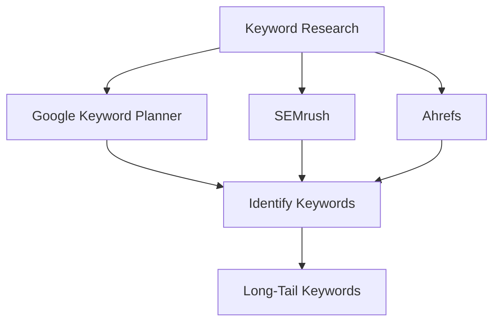

## 11.1.3 Content Marketing and SEO

In the competitive world of mobile applications, simply developing a great app is not enough. To ensure your Flutter app reaches its intended audience, you must engage in strategic content marketing and search engine optimization (SEO). This section will guide you through the essentials of using these powerful tools to boost your app's visibility and attract organic traffic.

### Understanding Content Marketing

#### Definition

Content marketing involves creating and sharing valuable, relevant content to attract and retain a clearly defined audience. Unlike traditional advertising, content marketing focuses on delivering information that your audience finds useful, thereby building trust and loyalty.

#### Benefits

1. **Improve Brand Awareness:** By consistently providing valuable content, you can increase your brand's visibility and recognition.
2. **Position as a Thought Leader:** Sharing insightful content positions your app and brand as an authority in your niche.
3. **Drive Organic Traffic:** Quality content can attract visitors to your app's website or store listing, increasing the likelihood of downloads.

### Developing a Content Strategy

#### Identify Audience Needs

Understanding your audience is crucial. Conduct research to identify the topics and issues that resonate with your target users. Use surveys, social media insights, and competitor analysis to gather data.

#### Content Types

- **Blog Posts:** Write articles that address common questions or challenges faced by your audience.
- **Tutorials and How-To Guides:** Provide step-by-step instructions to help users solve problems or use your app more effectively.
- **Infographics:** Use visual content to simplify complex information and make it more digestible.
- **Videos and Webinars:** Engage users with dynamic content that can demonstrate your app's features or provide educational value.
- **Podcasts:** Reach audiences who prefer audio content by discussing relevant topics or interviewing industry experts.

#### Editorial Calendar

An editorial calendar helps you plan and schedule content publication. It ensures consistency and allows you to align content with key dates or events in your industry.

#### Quality over Quantity

Focus on producing high-quality, engaging content. Quality content is more likely to be shared and linked to, which can improve your SEO performance.

### SEO Fundamentals

#### Keyword Research

Keyword research is the foundation of effective SEO. Use tools like Google Keyword Planner, SEMrush, or Ahrefs to identify relevant keywords. Look for long-tail keywords, which are longer and more specific phrases that typically have lower competition.

#### On-Page SEO

- **Incorporate Keywords:** Naturally include keywords in your titles, headings, and content. Avoid keyword stuffing, which can harm your SEO.
- **Optimize Meta Descriptions and URLs:** Ensure your meta descriptions are compelling and your URLs are clean and descriptive.

#### Technical SEO

- **Mobile-Friendly Website:** Ensure your website is responsive and provides a good user experience on mobile devices.
- **Fast Load Times:** Optimize images and use caching to improve your site's speed.
- **SSL Certificates:** Use HTTPS to secure your website, which can also boost your SEO rankings.

### Content Distribution

#### Social Sharing

Promote your content on social media platforms where your audience is active. Use engaging visuals and compelling captions to encourage sharing.

#### Email Marketing

Build an email list and send newsletters or updates to keep subscribers informed about new content or app features.

#### Guest Posting

Write articles for other websites or blogs in your industry. This can help you reach new audiences and build backlinks to your site.

#### Community Engagement

Participate in forums like Reddit, Quora, or industry-specific communities. Engage in discussions and share your content where relevant.

### Measuring Content Performance

#### Analytics

Use Google Analytics to track website traffic, bounce rates, and user behavior. This data can help you understand how users interact with your content.

#### SEO Tools

Monitor your keyword rankings and backlinks using SEO tools. This information can guide your strategy and highlight areas for improvement.

#### Adjusting Strategy

Refine your content strategy based on performance data and user feedback. Be willing to adapt and try new approaches to improve results.

### App Store Optimization (ASO)

#### Keywords in App Store Listings

Optimize your app's title, description, and keywords field with relevant terms. This can improve your app's visibility in app store searches.

#### High-Quality Screenshots and Videos

Use high-quality visuals to showcase your app's features. This can increase conversion rates from store visits to downloads.

### Visual Aids

#### Keyword Research Examples

Include screenshots of keyword research tools in action to illustrate how to find and select keywords.

#### Content Planning Templates

Provide an editorial calendar template to help readers plan their content strategy.

#### SEO Checklist

Offer a checklist for on-page and technical SEO factors to ensure all aspects are covered.

### Writing Tips

- **User-Centric Content:** Always prioritize the needs and interests of your audience when creating content.
- **Avoid Black-Hat SEO Practices:** Steer clear of tactics like keyword stuffing or link farming, which can lead to penalties.
- **Ongoing Education:** Stay informed about SEO trends and algorithm updates to maintain your competitive edge.
- **Synergy with Other Efforts:** Integrate content marketing with other promotional activities for a cohesive strategy.

By leveraging content marketing and SEO, you can significantly enhance your Flutter app's online presence and attract a steady stream of organic traffic. Implement these strategies thoughtfully to maximize your app's success in the marketplace.

## Quiz Time!



### What is the primary goal of content marketing?

- [x] To attract and retain a clearly defined audience by providing valuable content
- [ ] To create as much content as possible, regardless of quality
- [ ] To focus solely on paid advertising strategies
- [ ] To engage in black-hat SEO practices

> **Explanation:** Content marketing aims to attract and retain a clearly defined audience by providing valuable, relevant content that builds trust and loyalty.

### Which of the following is NOT a benefit of content marketing?

- [ ] Improve brand awareness
- [ ] Position the app as a thought leader
- [ ] Drive organic traffic
- [x] Increase app development speed

> **Explanation:** Content marketing focuses on improving brand awareness, positioning as a thought leader, and driving organic traffic, but it does not directly affect app development speed.

### What is a long-tail keyword?

- [x] A longer and more specific keyword phrase with lower competition
- [ ] A short and generic keyword with high competition
- [ ] A keyword that is not relevant to your content
- [ ] A keyword used only in meta descriptions

> **Explanation:** Long-tail keywords are longer, more specific phrases that typically have lower competition and can attract more targeted traffic.

### What is the purpose of an editorial calendar?

- [x] To plan and schedule content publication
- [ ] To track keyword rankings
- [ ] To design app interfaces
- [ ] To manage app store reviews

> **Explanation:** An editorial calendar helps plan and schedule content publication, ensuring consistency and alignment with key dates or events.

### Which of the following is a key aspect of technical SEO?

- [x] Ensuring the website is mobile-friendly
- [ ] Using as many keywords as possible
- [ ] Creating only video content
- [ ] Ignoring SSL certificates

> **Explanation:** Technical SEO involves ensuring the website is mobile-friendly, among other factors like fast load times and using SSL certificates.

### How can you measure content performance?

- [x] Using Google Analytics to track website traffic and user behavior
- [ ] By counting the number of words in each article
- [ ] By the number of social media followers
- [ ] By the number of emails sent

> **Explanation:** Google Analytics can track website traffic, bounce rates, and user behavior, providing insights into content performance.

### What is the role of App Store Optimization (ASO)?

- [x] To optimize app title, description, and keywords for better visibility
- [ ] To create as many apps as possible
- [ ] To focus only on social media marketing
- [ ] To ignore user reviews

> **Explanation:** ASO involves optimizing the app title, description, and keywords to improve visibility and conversion rates in app store searches.

### Why is it important to avoid black-hat SEO practices?

- [x] They can lead to penalties and harm your SEO
- [ ] They are the best way to quickly improve rankings
- [ ] They are recommended by search engines
- [ ] They have no impact on SEO

> **Explanation:** Black-hat SEO practices can lead to penalties from search engines, harming your SEO performance and credibility.

### What is a benefit of guest posting?

- [x] Reaching new audiences and building backlinks
- [ ] Creating content only for your own website
- [ ] Ignoring other industry websites
- [ ] Focusing solely on video content

> **Explanation:** Guest posting allows you to reach new audiences and build backlinks, enhancing your SEO and brand visibility.

### True or False: Content marketing should focus on quantity over quality.

- [ ] True
- [x] False

> **Explanation:** Content marketing should prioritize quality over quantity, as high-quality content is more likely to engage users and improve SEO performance.


