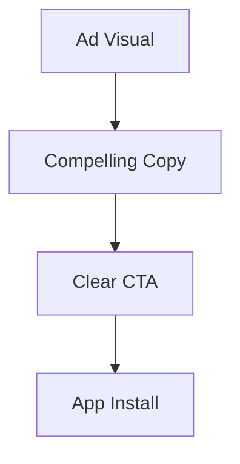
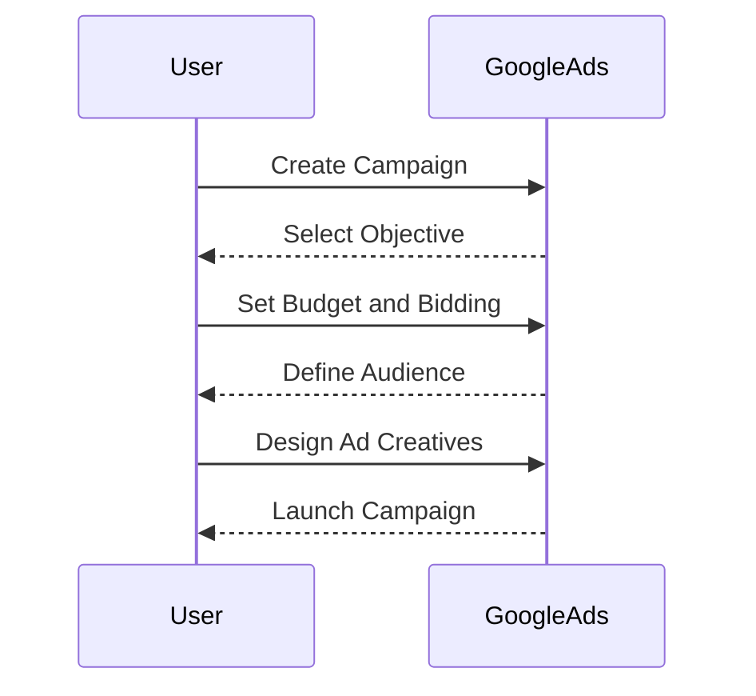
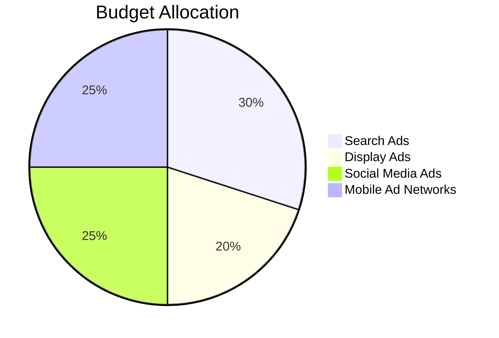

## 11.1.4 Paid Advertising

In the competitive world of mobile apps, simply developing a great app is not enough. To ensure your app reaches its intended audience, you must invest in effective marketing strategies. Paid advertising is a powerful tool that can significantly boost your app's visibility and user base. This section will guide you through understanding, planning, executing, and optimizing paid advertising campaigns to promote your Flutter app successfully.

### Understanding Paid Advertising Channels

Paid advertising encompasses a variety of channels, each with unique strengths and targeting capabilities. Selecting the right mix of channels is crucial for reaching your target audience effectively.

#### Search Ads

**Google Ads (formerly AdWords):**  
Google Ads allows you to display your app in search results when users search for related keywords. This is a powerful way to capture intent-driven traffic.

**Apple Search Ads for App Store Promotion:**  
Apple Search Ads enable you to promote your app directly within the App Store. This is particularly effective for iOS apps, as it targets users actively searching for apps.

#### Display Ads

**Google Display Network:**  
The Google Display Network reaches over 90% of internet users worldwide, allowing you to display visual ads across a vast network of websites and apps.

**Programmatic Advertising Platforms:**  
These platforms use automated technology to buy ad space in real-time, optimizing for the best placements and prices.

#### Social Media Ads

**Facebook and Instagram Ads:**  
These platforms offer robust targeting options based on user demographics, interests, and behaviors, making them ideal for reaching a broad audience.

**Twitter Ads:**  
Twitter Ads can help you engage with a highly active audience, particularly for apps related to news, entertainment, and trending topics.

**LinkedIn Ads (for B2B apps):**  
LinkedIn is the go-to platform for B2B marketing, allowing you to target professionals based on industry, job title, and more.

**TikTok Ads:**  
TikTok's rapidly growing user base and engaging ad formats make it an attractive option for reaching younger audiences.

#### Mobile Ad Networks

**Platforms like AdMob, Unity Ads for In-App Advertising:**  
These networks allow you to display ads within other apps, reaching users while they are engaged with mobile content.

### Setting Advertising Objectives

Before launching any campaign, it's essential to define clear objectives. This will guide your strategy and help measure success.

#### Campaign Goals

- **User Acquisition:** Focus on driving app installs and expanding your user base.
- **Brand Awareness:** Increase visibility and recognition of your app.
- **Engagement and Retention:** Encourage existing users to engage more frequently with your app.

#### Defining Success Metrics

- **Click-Through Rates (CTR):** Measure the effectiveness of your ad in prompting users to click.
- **Conversion Rates:** Track the percentage of users who complete a desired action, such as installing the app.
- **Cost Per Install (CPI):** Calculate the cost associated with acquiring a new user.
- **Return on Ad Spend (ROAS):** Evaluate the revenue generated for every dollar spent on advertising.

### Budget Planning

Effective budget planning ensures that your advertising efforts are sustainable and yield the best possible return on investment.

#### Allocating Funds

Determine your overall budget and allocate it across different channels based on expected ROI. Consider starting with a smaller budget to test the waters and gradually increase spending on high-performing channels.

#### Bidding Strategies

- **Manual vs. Automated Bidding:** Manual bidding gives you control over bid amounts, while automated bidding uses algorithms to optimize for conversions.
- **Cost-Per-Click (CPC) vs. Cost-Per-Thousand Impressions (CPM):** Choose CPC for performance-driven campaigns and CPM for brand awareness.

### Creating Effective Ad Campaigns

Crafting compelling ad campaigns involves understanding your audience, designing engaging creatives, and optimizing the user journey.

#### Audience Targeting

Use demographics, interests, behaviors, and custom audiences to reach the right users. Platforms like Facebook and Google offer advanced targeting options to refine your audience.

#### Ad Creatives

Design eye-catching visuals and compelling ad copy. Use clear calls-to-action (CTAs) to encourage users to take the next step.

#### Landing Pages

Ensure a seamless user experience from ad click to app download. Optimize your app store listing or create a dedicated landing page to maximize conversions.

### Campaign Execution

Executing a successful campaign requires careful setup, compliance with platform policies, and effective tracking.

#### Setting Up Campaigns

Provide step-by-step instructions for major platforms like Google Ads, Facebook Ads, and Apple Search Ads. Ensure your campaigns are configured correctly to achieve your objectives.

#### Compliance

Adhere to platform policies to avoid disapprovals. Each platform has specific guidelines regarding ad content, targeting, and user privacy.

#### Tracking and Attribution

Use tools like Facebook Pixel, Google Analytics, or mobile measurement partners (MMPs) to track conversions and attribute them to specific campaigns.

### Monitoring and Optimization

Continuous monitoring and optimization are key to maximizing the effectiveness of your ad campaigns.

#### A/B Testing

Test different ad creatives, headlines, and CTAs to identify what resonates best with your audience.

#### Analyzing Performance

Regularly review campaign metrics to identify underperforming ads. Adjust targeting, creatives, or bidding strategies as needed.

#### Reinvesting in High Performers

Allocate more budget to campaigns with better ROI. This ensures your advertising spend is directed towards the most effective channels.

### Retargeting Strategies

Retargeting allows you to re-engage users who have interacted with your app or website but have not yet converted.

#### Re-engaging Users

Target users who installed your app but are inactive. Use personalized messages to encourage them to return.

#### Personalization

Use dynamic ads to show relevant content to different user segments. This increases the likelihood of conversion by catering to individual preferences.

### Legal and Ethical Considerations

Adhering to legal and ethical standards is crucial in maintaining user trust and avoiding penalties.

#### User Privacy

Comply with regulations like GDPR, CCPA, and others. Ensure that your advertising practices respect user privacy and data protection laws.

#### Transparency

Avoid misleading advertising practices. Be clear about what users can expect from your app and how their data will be used.

### Visual Aids

To enhance your understanding, let's look at some visual aids that illustrate key concepts in paid advertising.

#### Ad Creation Examples

Below are examples of successful app ads that effectively use visuals and CTAs to engage users.

#### Platform Interface Screenshots

Screenshots from ad platforms can help you understand the campaign setup process. Here is an example of setting up a campaign in Google Ads.

#### Budget Allocation Chart

Illustrate how to distribute your budget across different channels to maximize ROI.

### Writing Tips

- **Start Small:** Begin with smaller budgets to test the effectiveness of different channels and strategies.
- **Consider the User Journey:** Ensure a seamless transition from ad click to app usage, optimizing every step of the user journey.
- **Continuous Learning:** Stay updated with changes in ad platform algorithms and best practices. Consider taking platform-specific certification courses for deeper insights.

### Resources for Further Learning

To further enhance your knowledge, explore these resources:

- [Google Ads Certification](https://skillshop.withgoogle.com/)
- [Facebook Blueprint Certification](https://www.facebook.com/business/learn/certification)
- [LinkedIn Marketing Labs](https://business.linkedin.com/marketing-solutions/blog/linkedin-marketing-labs)

By following these guidelines, you'll be well-equipped to leverage paid advertising effectively, driving more users to your Flutter app and achieving your marketing objectives.

## Quiz Time!



### Which of the following is a key benefit of using Apple Search Ads?

- [x] Targets users actively searching for apps in the App Store
- [ ] Provides access to a wide network of websites for display ads
- [ ] Offers advanced demographic targeting options
- [ ] Allows for programmatic ad buying

> **Explanation:** Apple Search Ads target users who are actively searching for apps in the App Store, making it an effective channel for capturing intent-driven traffic.

### What is the primary goal of a user acquisition campaign?

- [x] Driving app installs
- [ ] Increasing brand awareness
- [ ] Enhancing user engagement
- [ ] Improving app retention

> **Explanation:** User acquisition campaigns focus on driving app installs and expanding the user base.

### Which metric is used to measure the cost associated with acquiring a new user?

- [ ] Click-through rate (CTR)
- [ ] Conversion rate
- [x] Cost per install (CPI)
- [ ] Return on ad spend (ROAS)

> **Explanation:** Cost per install (CPI) measures the cost associated with acquiring a new user through advertising.

### What is the advantage of using automated bidding strategies?

- [x] Optimizes for conversions using algorithms
- [ ] Provides full control over bid amounts
- [ ] Ensures the lowest possible cost per click
- [ ] Guarantees the highest ad placement

> **Explanation:** Automated bidding strategies use algorithms to optimize for conversions, making them efficient for performance-driven campaigns.

### Which platform is ideal for B2B app promotion?

- [ ] TikTok Ads
- [ ] Instagram Ads
- [x] LinkedIn Ads
- [ ] Twitter Ads

> **Explanation:** LinkedIn Ads are ideal for B2B app promotion due to their ability to target professionals based on industry and job title.

### What is a key consideration when designing ad creatives?

- [x] Use clear calls-to-action (CTAs)
- [ ] Focus solely on visuals
- [ ] Avoid using text
- [ ] Limit targeting options

> **Explanation:** Clear calls-to-action (CTAs) are essential in ad creatives to guide users towards the desired action, such as installing the app.

### Which tool can be used for tracking conversions in Facebook Ads?

- [x] Facebook Pixel
- [ ] Google Analytics
- [ ] Apple Search Console
- [ ] LinkedIn Insights

> **Explanation:** Facebook Pixel is a tool used for tracking conversions and attributing them to specific Facebook ad campaigns.

### What is the purpose of A/B testing in advertising?

- [x] Test different ad creatives and CTAs
- [ ] Increase ad spend
- [ ] Reduce campaign duration
- [ ] Simplify audience targeting

> **Explanation:** A/B testing involves testing different ad creatives and CTAs to identify what resonates best with the audience.

### What is a key benefit of retargeting strategies?

- [x] Re-engages users who have interacted with your app
- [ ] Increases initial app installs
- [ ] Reduces advertising costs
- [ ] Guarantees higher conversion rates

> **Explanation:** Retargeting strategies re-engage users who have interacted with your app but have not yet converted, increasing the likelihood of conversion.

### True or False: Complying with GDPR and CCPA is optional for app advertisers.

- [ ] True
- [x] False

> **Explanation:** Complying with GDPR, CCPA, and other regulations is mandatory for app advertisers to ensure user privacy and data protection.


