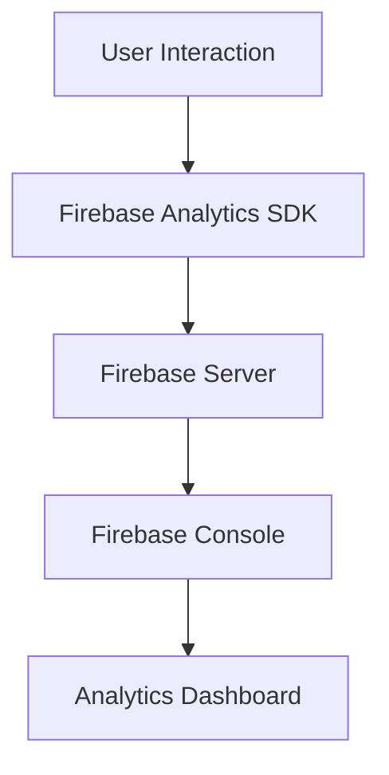

## 11.2.1 Setting Up Analytics Tools

In today's competitive app market, understanding how users interact with your app is crucial for its success. Analytics tools provide invaluable insights into user behavior, engagement, and app performance, enabling you to make informed, data-driven decisions. In this section, we'll explore how to set up analytics tools in your Flutter app, focusing on Firebase Analytics, Google Analytics for Firebase, and other alternatives.

### Understanding the Importance of Analytics

Analytics tools are not just about collecting data; they are about understanding your users and improving their experience. By analyzing user behavior, you can identify which features are popular, which parts of the app are underused, and where users encounter problems. This information is essential for:

- **Enhancing User Experience:** By understanding user behavior, you can make informed decisions to improve the app's usability and functionality.
- **Increasing Engagement:** Analytics can help you identify what keeps users engaged and what drives them away.
- **Optimizing Performance:** By tracking app performance metrics, you can identify and fix performance bottlenecks.
- **Driving Business Decisions:** Data-driven insights can guide marketing strategies, feature development, and monetization efforts.

### Choosing the Right Analytics Tools

Selecting the right analytics tool depends on your app's needs, your team's expertise, and your budget. Here are some popular options:

#### Firebase Analytics

Firebase Analytics is a free and powerful analytics solution that integrates seamlessly with Flutter. It offers features like event tracking, user property analysis, and more. Firebase Analytics is part of the Firebase platform, which provides a suite of tools for app development.

**Key Features:**
- **Event Tracking:** Automatically tracks user interactions and allows you to log custom events.
- **User Properties:** Analyze user demographics and preferences.
- **Integration with Firebase Services:** Works well with other Firebase tools like Crashlytics and Remote Config.

#### Google Analytics for Firebase

Google Analytics for Firebase extends Firebase Analytics with advanced features like cohort analysis and predictive metrics. It's ideal for apps that require more sophisticated analytics capabilities.

**Key Features:**
- **Cohort Analysis:** Understand user behavior over time by grouping users into cohorts.
- **Predictive Metrics:** Use machine learning to predict user behavior and outcomes.
- **Cross-Platform Support:** Analyze data from both iOS and Android apps in one place.

#### Other Options

While Firebase Analytics is a popular choice, there are other analytics tools worth considering:

- **Mixpanel:** Offers advanced analytics features like funnel analysis and A/B testing.
- **Amplitude:** Focuses on product analytics and user behavior insights.
- **Flurry:** Provides a free and easy-to-use analytics solution for mobile apps.

### Integrating Analytics into a Flutter App

Integrating analytics into your Flutter app involves several steps, from installing the necessary plugins to configuring tracking and user properties.

#### Installation

To get started with Firebase Analytics, you need to add the `firebase_analytics` plugin to your Flutter project. Update your `pubspec.yaml` file as follows:

```yaml
dependencies:
  firebase_analytics: ^9.0.0
```

Next, you need to configure your app for Firebase. This involves adding the `google-services.json` file for Android and the `GoogleService-Info.plist` file for iOS. Follow these steps:

1. **Create a Firebase Project:** Go to the [Firebase Console](https://console.firebase.google.com/) and create a new project.
2. **Add Your App:** Register your app with Firebase and download the configuration files.
3. **Configure Android:** Place the `google-services.json` file in the `android/app` directory.
4. **Configure iOS:** Place the `GoogleService-Info.plist` file in the `ios/Runner` directory.

#### Initialization

Initialize Firebase in your app's main file. This step ensures that Firebase services are available when your app starts.

```dart
import 'package:flutter/material.dart';
import 'package:firebase_core/firebase_core.dart';

void main() async {
  WidgetsFlutterBinding.ensureInitialized();
  await Firebase.initializeApp();
  runApp(MyApp());
}
```

#### Setting Up Tracking

Once Firebase is initialized, you can start logging events and setting user properties.

**Logging Custom Events:**

Custom events allow you to track specific user interactions. Here's an example of logging a custom event:

```dart
import 'package:firebase_analytics/firebase_analytics.dart';

FirebaseAnalytics analytics = FirebaseAnalytics();

// Logging an event
await analytics.logEvent(
  name: 'level_up',
  parameters: {'level': 5},
);
```

**Default Events:**

Firebase Analytics automatically tracks several default events, such as `first_open`, `in_app_purchase`, and `app_update`. These events provide a baseline understanding of user interactions without additional configuration.

#### Configuring User Properties

User properties help you segment users based on demographics or preferences. Here's how to set a user property:

```dart
await analytics.setUserProperty(
  name: 'preferred_language',
  value: 'English',
);
```

### Ensuring Privacy Compliance

When collecting user data, it's crucial to comply with privacy regulations and obtain user consent.

#### User Consent

Before collecting data, inform users about what data you collect and why. Obtain explicit consent, especially if your app targets users in regions with strict privacy laws like the GDPR in Europe.

#### Anonymization

To protect user privacy, consider anonymizing IP addresses and other sensitive data. Firebase Analytics provides options to anonymize IP addresses, ensuring compliance with privacy regulations.

### Testing Analytics Implementation

Testing is a critical step to ensure your analytics setup is working as expected.

#### Debugging Events

Use Firebase's debug mode to verify that events are being logged correctly. This mode allows you to see real-time data in the Firebase Console.

#### Using Analytics Dashboards

Access the Firebase Analytics dashboard to monitor incoming data. The dashboard provides insights into user behavior, engagement, and more.

### Setting up Conversion Tracking

Conversion tracking helps you understand how users progress through your app and identify key actions that contribute to your business goals.

#### Defining Conversion Events

Identify key actions in your app, such as user registration or in-app purchases, as conversion goals. Track these events to measure their impact on your app's success.

#### Attribution

Link conversions to marketing efforts to understand which campaigns drive user actions. Firebase Analytics provides attribution tools to help you analyze the effectiveness of your marketing strategies.

### Visual Aids

To help you visualize the analytics setup process, here are some diagrams and screenshots:

#### Data Flow Diagram



#### Firebase Analytics Dashboard


### Best Practices and Troubleshooting

- **Plan Your Tracking:** Before implementing analytics, decide which events and user properties are most important for your app's success.
- **Test Thoroughly:** Use debug mode and the Firebase Console to verify that your analytics setup is working correctly.
- **Stay Compliant:** Ensure that your app complies with privacy regulations and obtain user consent for data collection.
- **Troubleshoot Common Issues:** If you encounter issues with event logging or data accuracy, consult the Firebase documentation or community forums for solutions.

By following these guidelines, you can effectively set up analytics tools in your Flutter app, gaining valuable insights that drive app improvements and business success.

## Quiz Time!



### What is the primary purpose of integrating analytics tools into a Flutter app?

- [x] To gather insights into user behavior and app performance
- [ ] To increase the app's download size
- [ ] To make the app more visually appealing
- [ ] To reduce the app's loading time

> **Explanation:** Analytics tools provide insights into user behavior and app performance, enabling data-driven decisions.

### Which of the following is a feature of Firebase Analytics?

- [x] Event tracking
- [ ] Real-time chat
- [ ] Image processing
- [ ] Video editing

> **Explanation:** Firebase Analytics offers event tracking, which allows developers to monitor user interactions within the app.

### What is the purpose of setting user properties in Firebase Analytics?

- [x] To segment users based on demographics or preferences
- [ ] To increase app download speed
- [ ] To enhance app graphics
- [ ] To improve app security

> **Explanation:** User properties help segment users based on demographics or preferences, allowing for targeted analysis.

### What file is required for Firebase configuration on Android?

- [x] google-services.json
- [ ] AndroidManifest.xml
- [ ] build.gradle
- [ ] settings.gradle

> **Explanation:** The `google-services.json` file is required for Firebase configuration on Android.

### What is a key benefit of using Google Analytics for Firebase over Firebase Analytics?

- [x] Advanced features like cohort analysis and predictive metrics
- [ ] Lower cost
- [ ] Simpler integration
- [ ] Better graphics

> **Explanation:** Google Analytics for Firebase offers advanced features like cohort analysis and predictive metrics.

### How can you ensure privacy compliance when using analytics tools?

- [x] Obtain user consent and anonymize data
- [ ] Increase app size
- [ ] Use more plugins
- [ ] Disable analytics

> **Explanation:** Ensuring privacy compliance involves obtaining user consent and anonymizing data to protect user privacy.

### What is the purpose of conversion tracking in analytics?

- [x] To understand key actions that contribute to business goals
- [ ] To increase app download speed
- [ ] To enhance app graphics
- [ ] To improve app security

> **Explanation:** Conversion tracking helps understand key actions that contribute to business goals, such as user registration or purchases.

### Which of the following is a common alternative to Firebase Analytics?

- [x] Mixpanel
- [ ] Photoshop
- [ ] Illustrator
- [ ] After Effects

> **Explanation:** Mixpanel is a common alternative to Firebase Analytics, offering advanced analytics features.

### What is a default event automatically tracked by Firebase Analytics?

- [x] first_open
- [ ] user_login
- [ ] image_upload
- [ ] video_play

> **Explanation:** `first_open` is a default event automatically tracked by Firebase Analytics.

### True or False: Firebase Analytics can be used to track user interactions in both iOS and Android apps.

- [x] True
- [ ] False

> **Explanation:** Firebase Analytics can track user interactions in both iOS and Android apps, providing cross-platform support.


