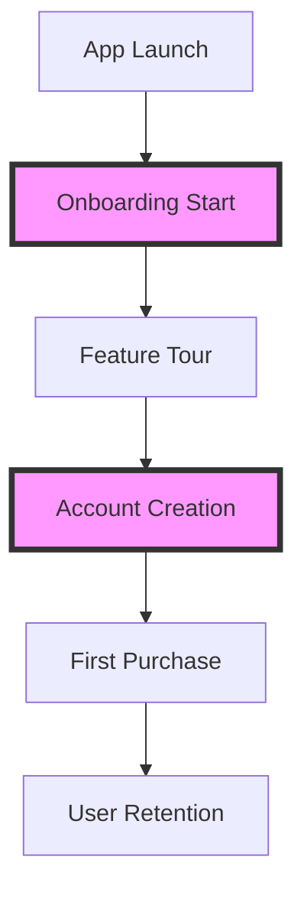
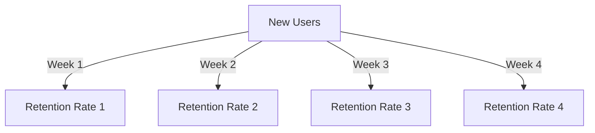
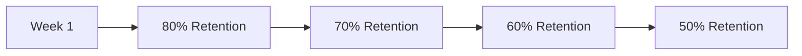
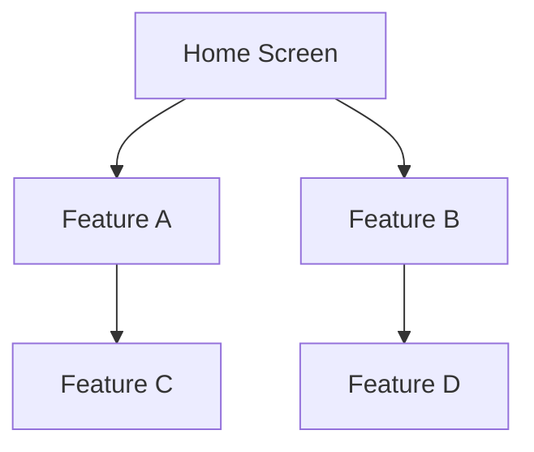

## 11.2.2 Understanding User Behavior

In the competitive world of mobile applications, understanding user behavior is crucial for creating an app that not only attracts users but keeps them engaged and satisfied. This section will guide you through the process of interpreting analytics data to gain insights into user behavior, identify patterns, and make informed decisions to enhance your Flutter app. We will explore key metrics to monitor, analyze user journeys, identify user segments, and map insights to actionable strategies.

### Key Metrics to Monitor

To effectively understand user behavior, it's essential to track specific metrics that provide insights into how users interact with your app. Here are some key metrics to focus on:

#### Active Users

- **Daily Active Users (DAU):** This metric indicates the number of unique users who engage with your app on a daily basis. Monitoring DAU helps you understand the app's daily reach and engagement levels.
- **Monthly Active Users (MAU):** This metric measures the number of unique users who engage with your app over a month. It provides a broader view of user retention and growth.

#### Session Length and Frequency

- **Average Time Spent per Session:** This metric shows how long users typically spend in your app during a single session. Longer session lengths often indicate higher engagement.
- **Number of Sessions per User:** This metric tracks how frequently users return to your app. A higher number of sessions per user suggests that your app is compelling enough to bring users back.

#### User Engagement

- **Screen Views:** Track the number of times each screen in your app is viewed. This helps identify the most and least popular sections of your app.
- **Button Clicks:** Monitor which buttons are clicked most frequently to understand user preferences and interactions.
- **Feature Usage:** Identify which features are used most often to prioritize development efforts and optimize user experience.

### Analyzing User Journeys

Understanding how users navigate through your app is crucial for identifying potential bottlenecks and improving the user experience. Two effective methods for analyzing user journeys are funnel analysis and cohort analysis.

#### Funnel Analysis

Funnel analysis involves defining critical paths within your app, such as the onboarding process or purchase flow, and identifying where users drop off. This analysis helps you pinpoint areas where users may be experiencing friction.

In the diagram above, the onboarding process is visualized as a funnel. By analyzing drop-off rates at each stage, you can identify where improvements are needed to enhance user retention.

#### Cohort Analysis

Cohort analysis groups users based on shared characteristics or signup dates and tracks their behavior over time. This analysis helps assess retention and engagement by comparing different user groups.

The diagram illustrates how cohort analysis tracks retention rates over several weeks, providing insights into user engagement trends.

### Identifying User Segments

Segmenting users based on demographics and behavior allows you to tailor your app's features and marketing strategies to specific groups.

#### Demographics

Understanding the demographics of your user base, such as age, gender, and location, can help you create targeted content and offers.

#### Behavioral Segments

- **Power Users vs. Casual Users:** Identify users who engage with your app frequently and those who use it occasionally. This segmentation helps tailor experiences to different user needs.
- **Feature-Specific Users:** Recognize users who engage with specific features, allowing you to prioritize feature development and marketing efforts.

### Mapping Insights to Actions

Once you've gathered insights from analytics, it's time to translate them into actionable strategies to enhance your app.

#### Optimizing User Experience

Address pain points identified in the user journey to improve the overall user experience. For example, if users frequently drop off during the onboarding process, consider simplifying or enhancing the onboarding flow.

#### Feature Prioritization

Focus development efforts on the most used or valued features. By understanding which features drive engagement, you can allocate resources effectively.

#### Personalization

Tailor content or offers based on user behavior. Personalization can significantly enhance user satisfaction and retention by providing relevant experiences.

### User Feedback Integration

In addition to quantitative data, qualitative insights from user feedback are invaluable for understanding user behavior.

#### Qualitative Data

Combine analytics with user reviews and feedback to gain a comprehensive understanding of user needs and preferences.

#### Surveys and Interviews

Conduct user surveys and interviews to gather deeper insights into user motivations and pain points. This qualitative data can complement your quantitative analysis.

### Visual Aids

Visual aids such as graphs, charts, and diagrams can help you better understand and communicate user behavior insights.

#### Graphs and Charts

Use cohort retention graphs and funnel drop-off rate charts to visualize user engagement trends and identify areas for improvement.

#### User Flow Diagrams

Visualize typical user interactions within your app to identify common paths and potential bottlenecks.

#### Heatmaps

If applicable, use heatmaps to demonstrate areas of high user interaction. Heatmaps provide a visual representation of where users spend the most time within your app.

### Writing Tips

- Encourage readers to look beyond surface-level metrics and analyze data in context.
- Remind them that data should inform decisions but not be the sole factor. Consider qualitative insights and user feedback.
- Stress the importance of continuous analysis rather than one-time assessments. User behavior can change over time, and regular analysis helps you stay informed.
- Suggest collaborating with team members when interpreting complex data. Different perspectives can lead to more comprehensive insights.

By understanding user behavior through analytics, you can make informed decisions to enhance your Flutter app, improve user satisfaction, and drive growth. Remember that data is a powerful tool, but it should be used in conjunction with creativity and empathy to create truly exceptional user experiences.

## Quiz Time!



### What is the significance of Daily Active Users (DAU)?

- [x] It indicates the number of unique users who engage with your app daily.
- [ ] It measures the total number of app downloads.
- [ ] It tracks the average session length of users.
- [ ] It shows the number of new users acquired each day.

> **Explanation:** DAU helps you understand the daily engagement level of your app, which is crucial for assessing user retention and activity.

### Which metric helps you understand how long users typically spend in your app during a single session?

- [x] Average Time Spent per Session
- [ ] Number of Sessions per User
- [ ] Monthly Active Users (MAU)
- [ ] Screen Views

> **Explanation:** Average Time Spent per Session provides insights into user engagement by showing how long users stay in the app during each visit.

### What is the purpose of funnel analysis in user journey analysis?

- [x] To define critical paths and identify where users drop off.
- [ ] To group users based on demographics.
- [ ] To track the number of sessions per user.
- [ ] To measure the average time spent per session.

> **Explanation:** Funnel analysis helps identify bottlenecks in critical paths, such as onboarding or purchase flows, by analyzing where users drop off.

### How does cohort analysis help in understanding user behavior?

- [x] By grouping users based on shared characteristics and tracking their behavior over time.
- [ ] By measuring the number of button clicks in the app.
- [ ] By identifying the most viewed screens in the app.
- [ ] By calculating the average session length.

> **Explanation:** Cohort analysis allows you to compare different user groups over time, providing insights into retention and engagement trends.

### Which user segment focuses on users who engage with specific features?

- [x] Feature-Specific Users
- [ ] Power Users
- [ ] Casual Users
- [ ] Demographic Segments

> **Explanation:** Feature-Specific Users are those who frequently use certain features, helping prioritize feature development and marketing efforts.

### What is the benefit of combining analytics with user reviews and feedback?

- [x] It provides a comprehensive understanding of user needs and preferences.
- [ ] It increases the number of app downloads.
- [ ] It reduces the average session length.
- [ ] It tracks the number of sessions per user.

> **Explanation:** Combining quantitative and qualitative data offers a holistic view of user behavior, enhancing decision-making.

### Why is it important to conduct user surveys and interviews?

- [x] To gather deeper insights into user motivations and pain points.
- [ ] To increase the number of screen views.
- [ ] To measure the average time spent per session.
- [ ] To track the number of button clicks.

> **Explanation:** Surveys and interviews provide qualitative data that complements analytics, offering deeper insights into user behavior.

### What is a key benefit of using heatmaps in user behavior analysis?

- [x] They visually represent areas of high user interaction.
- [ ] They measure the number of sessions per user.
- [ ] They track the average session length.
- [ ] They identify demographic segments.

> **Explanation:** Heatmaps highlight areas where users spend the most time, helping identify popular features and potential improvements.

### Why is continuous analysis of user behavior important?

- [x] User behavior can change over time, and regular analysis helps you stay informed.
- [ ] It increases the number of app downloads.
- [ ] It reduces the average session length.
- [ ] It tracks the number of button clicks.

> **Explanation:** Continuous analysis ensures you remain aware of changing user behavior, allowing you to adapt and improve your app accordingly.

### True or False: Data should be the sole factor in making decisions about app enhancements.

- [ ] True
- [x] False

> **Explanation:** While data is a powerful tool, decisions should also consider qualitative insights, creativity, and empathy to create exceptional user experiences.


