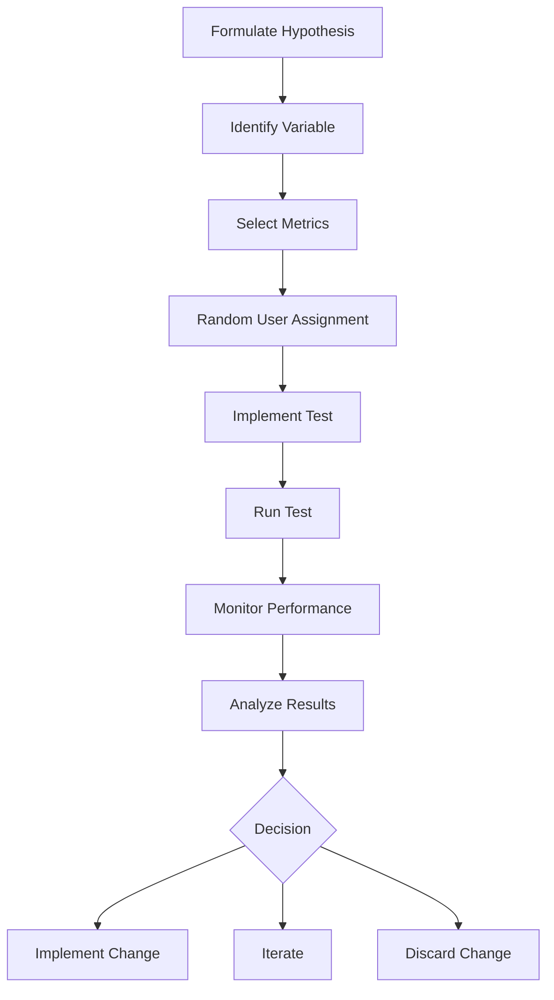

## 11.2.3 A/B Testing Features

In the competitive world of mobile applications, making informed decisions about app features and design is crucial for success. A/B testing is a powerful tool that allows you to experiment with different versions of your app to determine which performs better. This section will guide you through implementing A/B testing in your Flutter app, enabling you to make data-driven decisions that improve user engagement and satisfaction.

### Understanding A/B Testing

#### Definition

A/B testing, also known as split testing, is a method of comparing two versions of an app feature to determine which one performs better. By randomly assigning users to either version A (the control) or version B (the variant), you can measure the impact of changes on user behavior and app performance.

#### Purpose

The primary purpose of A/B testing is to optimize various aspects of your app, such as features, UI layouts, onboarding flows, and more. By systematically testing changes, you can identify what resonates with users and drives desired outcomes, such as increased engagement, higher conversion rates, or improved retention.

#### Hypothesis-Driven

A/B testing is most effective when driven by a hypothesis. Before running a test, formulate a hypothesis about what change might improve a specific metric. For example, you might hypothesize that changing the color of a call-to-action button will increase click-through rates.

### Setting Up A/B Tests

#### Identifying Variables

The first step in setting up an A/B test is to identify the variable you want to test. This could be anything from the color of a button to the placement of a feature. It's important to change only one element at a time to ensure that any observed differences in performance can be attributed to that specific change.

#### Selecting Metrics

Define the success criteria for your test by selecting the metrics you will use to evaluate performance. Common metrics include click-through rates, conversion rates, user retention, and engagement levels. Clearly defining these metrics will help you determine whether the variant outperforms the control.

#### Random User Assignment

To ensure the validity of your test, users must be randomly assigned to either the control group (version A) or the variant group (version B). Random assignment helps eliminate bias and ensures that the groups are comparable.

### Implementing A/B Testing in Flutter

#### Firebase Remote Config

One of the most popular tools for implementing A/B testing in Flutter apps is Firebase Remote Config. This service allows you to remotely toggle features or change variables without requiring users to update the app. Here's how to integrate Firebase Remote Config into your Flutter app:

1. **Add Firebase to Your Flutter App:**
   - Follow the [official Firebase documentation](https://firebase.google.com/docs/flutter/setup) to add Firebase to your Flutter project.

2. **Initialize Firebase Remote Config:**
   ```dart
   import 'package:firebase_remote_config/firebase_remote_config.dart';

   void main() async {
     WidgetsFlutterBinding.ensureInitialized();
     await Firebase.initializeApp();
     runApp(MyApp());
   }
   ```

3. **Fetch and Activate Remote Config Values:**
   ```dart
   final RemoteConfig remoteConfig = RemoteConfig.instance;

   Future<void> setupRemoteConfig() async {
     await remoteConfig.setConfigSettings(RemoteConfigSettings(
       fetchTimeout: const Duration(hours: 1),
       minimumFetchInterval: const Duration(hours: 1),
     ));
     await remoteConfig.fetchAndActivate();
   }
   ```

4. **Use Remote Config Parameters:**
   ```dart
   bool showNewFeature = remoteConfig.getBool('show_new_feature');

   Widget build(BuildContext context) {
     return MaterialApp(
       home: Scaffold(
         appBar: AppBar(title: Text('A/B Testing Example')),
         body: showNewFeature ? NewFeatureWidget() : OldFeatureWidget(),
       ),
     );
   }
   ```

#### Alternative Tools

While Firebase Remote Config is a popular choice, there are other A/B testing platforms compatible with Flutter, such as:

- **Optimizely:** Offers robust A/B testing capabilities and integrates with mobile apps.
- **Mixpanel:** Provides A/B testing along with advanced analytics.
- **Leanplum:** Focuses on mobile A/B testing and personalization.

### Running the Test

#### Duration

Run your A/B test for a sufficient duration to gather meaningful data. The length of the test will depend on factors such as the size of your user base and the expected impact of the change. Avoid ending the test prematurely, as this can lead to inaccurate conclusions.

#### Sample Size

Ensure that a sufficient number of users participate in the test to achieve statistical significance. A larger sample size increases the reliability of your results and reduces the margin of error.

#### Monitoring Performance

Track relevant metrics in real-time to monitor the performance of both the control and variant groups. Use analytics tools to visualize data and identify trends.

### Analyzing Results

#### Statistical Significance

Understanding statistical significance is key to interpreting A/B test results. In simple terms, statistical significance indicates whether the observed differences between the control and variant are likely due to the change rather than random chance. Key concepts include:

- **Confidence Intervals:** A range of values that likely contain the true effect size.
- **P-Values:** A measure of the probability that the observed results occurred by chance. A p-value less than 0.05 is commonly considered statistically significant.

#### Result Interpretation

Once the test is complete, analyze the data to determine whether the variant outperformed the control. Consider both the magnitude and significance of the observed differences.

#### Decision Making

Based on the results, decide whether to implement, iterate, or discard the change. Even if the variant does not outperform the control, the insights gained can inform future tests and improvements.

### Best Practices

#### One Variable at a Time

To isolate the impact of a specific change, test only one variable at a time. Changing multiple elements simultaneously can confound results and make it difficult to attribute observed differences to a particular change.

#### Avoid Bias

Ensure that user groups are comparable by randomly assigning users to the control and variant groups. This helps eliminate bias and ensures the validity of your results.

#### Legal and Ethical Considerations

Consider legal and ethical implications when conducting A/B tests. Inform users if necessary, and respect their privacy by adhering to data protection regulations.

### Visual Aids

#### Flowchart of A/B Testing Process

Below is a flowchart outlining the A/B testing process from hypothesis formulation to decision making:



#### Statistical Graphs

Visualizing data can help in understanding the results of your A/B test. Consider using bar charts or line graphs to compare metrics between the control and variant groups.

### Conclusion

A/B testing is a valuable tool for making data-driven decisions that enhance your Flutter app's user experience. By following a structured approach, you can systematically test changes, analyze results, and implement improvements that drive user engagement and satisfaction. Remember, even failed tests provide valuable insights that can guide future optimizations.

### Encourage Experimentation

Start with small tests to build confidence in the process before moving on to larger changes. Document all tests, regardless of the outcome, to create a knowledge base that can inform future decisions.

## Quiz Time!



### What is the primary purpose of A/B testing in mobile apps?

- [x] To optimize app features and improve user engagement
- [ ] To increase app download numbers
- [ ] To reduce app development time
- [ ] To enhance app security

> **Explanation:** A/B testing is used to optimize app features and improve user engagement by comparing different versions of an app feature to determine which performs better.

### Which tool is commonly used for A/B testing in Flutter apps?

- [x] Firebase Remote Config
- [ ] Google Analytics
- [ ] AWS Lambda
- [ ] Azure Functions

> **Explanation:** Firebase Remote Config is commonly used for A/B testing in Flutter apps as it allows developers to remotely toggle features or change variables.

### What is a key consideration when setting up an A/B test?

- [x] Identifying a single variable to test
- [ ] Testing multiple variables simultaneously
- [ ] Ensuring all users see the same version
- [ ] Running the test for a very short duration

> **Explanation:** Identifying a single variable to test is crucial to isolate the impact of that specific change and ensure accurate results.

### What does a p-value indicate in A/B testing?

- [x] The probability that observed results occurred by chance
- [ ] The average time users spend on the app
- [ ] The total number of users in the test
- [ ] The cost of running the test

> **Explanation:** A p-value indicates the probability that the observed results occurred by chance, helping determine statistical significance.

### Why is random user assignment important in A/B testing?

- [x] To eliminate bias and ensure comparable groups
- [ ] To increase the test duration
- [ ] To reduce the number of participants needed
- [ ] To ensure all users see the variant

> **Explanation:** Random user assignment eliminates bias and ensures that the control and variant groups are comparable, which is essential for valid results.

### What should you do if an A/B test shows no significant difference between versions?

- [x] Analyze the data for insights and consider iterating
- [ ] Discard the test results immediately
- [ ] Run the test indefinitely
- [ ] Change multiple variables at once

> **Explanation:** If an A/B test shows no significant difference, analyze the data for insights and consider iterating on the test or hypothesis.

### What is a confidence interval in the context of A/B testing?

- [x] A range of values that likely contain the true effect size
- [ ] The time period over which the test is run
- [ ] The number of users needed for the test
- [ ] The cost range for implementing changes

> **Explanation:** A confidence interval is a range of values that likely contain the true effect size, providing insight into the reliability of the test results.

### Which of the following is a best practice for A/B testing?

- [x] Test one variable at a time
- [ ] Test multiple variables simultaneously
- [ ] Ensure all users see the variant
- [ ] Run tests for very short durations

> **Explanation:** Testing one variable at a time is a best practice to ensure that any observed differences can be attributed to that specific change.

### What should you consider regarding legal and ethical aspects of A/B testing?

- [x] Informing users if necessary and respecting privacy
- [ ] Only testing on a small group of users
- [ ] Keeping test results confidential
- [ ] Running tests without user consent

> **Explanation:** Legal and ethical considerations include informing users if necessary and respecting their privacy by adhering to data protection regulations.

### True or False: A/B testing can help identify which app version increases user engagement.

- [x] True
- [ ] False

> **Explanation:** True. A/B testing can help identify which app version increases user engagement by comparing different versions and measuring their impact on user behavior.


