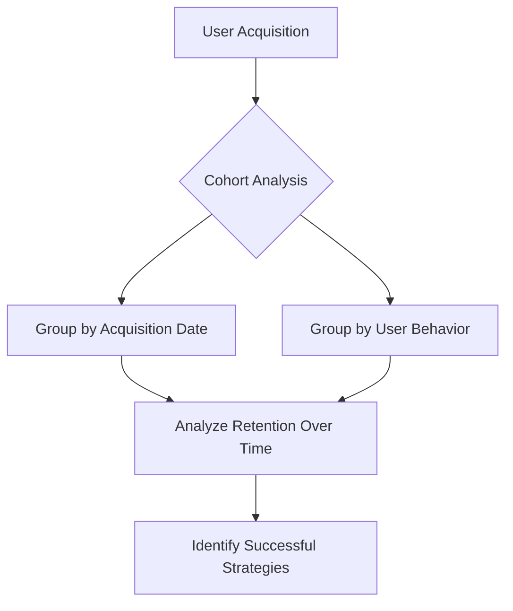
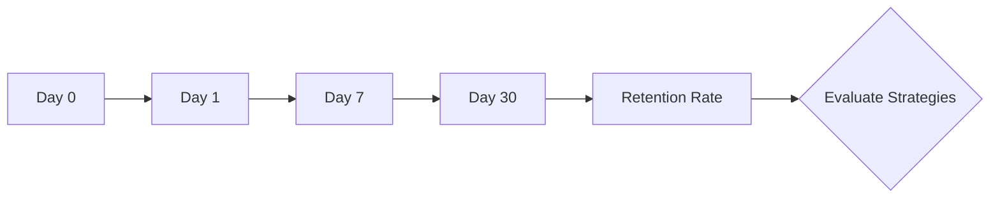
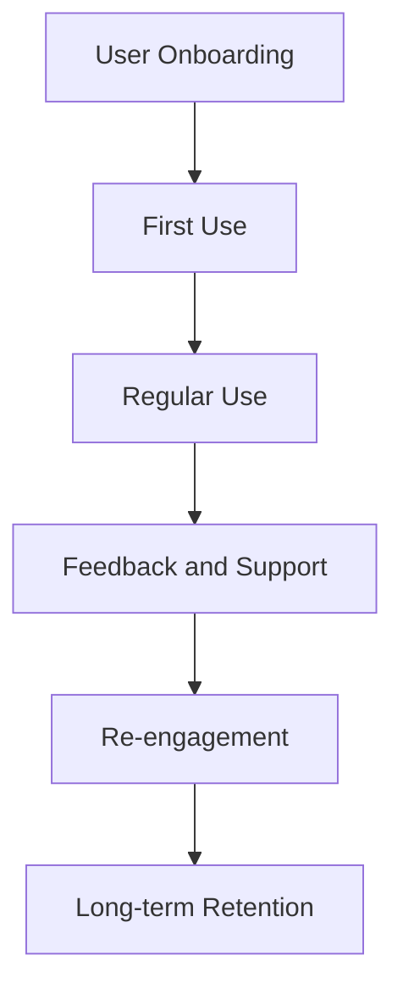

## 11.2.4 Retention Strategies

In the competitive world of mobile apps, retaining users is just as crucial as acquiring them. User retention is the ability to keep users returning to your app over time, and it plays a vital role in the long-term success of your app. This section will equip you with strategies to improve user retention, enhance engagement, and reduce churn rates for your Flutter app.

### Understanding User Retention

#### Definition

User retention refers to the ability of an app to keep its users engaged and returning over time. It is a critical metric that indicates the app's success in delivering value and maintaining user interest.

#### Importance

Retaining existing users is often more cost-effective than acquiring new ones. According to industry studies, acquiring a new user can be five times more expensive than retaining an existing one. High retention rates lead to increased lifetime value, better monetization opportunities, and a more sustainable user base.

#### Key Metrics

To effectively measure retention, consider tracking the following metrics:

- **1-Day Retention Rate:** The percentage of users who return to the app one day after their first use.
- **7-Day Retention Rate:** The percentage of users who return to the app seven days after their first use.
- **30-Day Retention Rate:** The percentage of users who return to the app thirty days after their first use.

These metrics provide insights into how well your app retains users over time and can help identify areas for improvement.

### Strategies for Improving Retention

#### Onboarding Experience

A smooth and engaging onboarding experience is crucial for retaining new users. Here are some tips to enhance the onboarding process:

- **Simplify the Initial User Experience:** Avoid overwhelming users with too much information at once. Focus on the core features and gradually introduce additional functionalities.

- **Provide Tutorials or Walkthroughs:** Use interactive tutorials or walkthroughs to guide users through the app's features. This helps users understand the app's value proposition and how to use it effectively.

```dart
// Example of a simple onboarding screen in Flutter
class OnboardingScreen extends StatelessWidget {
  @override
  Widget build(BuildContext context) {
    return Scaffold(
      body: PageView(
        children: <Widget>[
          OnboardingPage(
            title: "Welcome to MyApp",
            description: "Discover new features and functionalities.",
            image: AssetImage('assets/onboarding1.png'),
          ),
          OnboardingPage(
            title: "Stay Connected",
            description: "Connect with friends and family easily.",
            image: AssetImage('assets/onboarding2.png'),
          ),
          OnboardingPage(
            title: "Get Started",
            description: "Sign up now to explore more.",
            image: AssetImage('assets/onboarding3.png'),
          ),
        ],
      ),
    );
  }
}
```

#### Personalization

Personalization enhances user engagement by tailoring content and recommendations to individual preferences. Consider implementing the following:

- **User Profiles:** Allow users to create profiles and customize their experience based on their interests and preferences.

- **Content Recommendations:** Use machine learning algorithms to recommend content or features that align with user behavior and preferences.

#### Push Notifications

Push notifications are a powerful tool for re-engaging users and driving retention. However, they must be used wisely to avoid annoying users:

- **Send Timely and Relevant Notifications:** Ensure notifications are relevant and add value to the user's experience. For example, notify users about new features, updates, or personalized content.

- **Avoid Over-Messaging:** Too many notifications can lead to user frustration and app uninstalls. Implement a frequency cap to prevent over-messaging.

```dart
// Example of sending a push notification using Firebase Cloud Messaging
Future<void> sendPushNotification(String title, String body) async {
  await FirebaseMessaging.instance.sendMessage(
    notification: Notification(
      title: title,
      body: body,
    ),
    topic: 'all',
  );
}
```

#### Gamification

Gamification involves incorporating game-like elements into your app to increase user engagement and retention. Consider the following strategies:

- **Reward Systems:** Implement a reward system where users earn points, badges, or achievements for completing specific actions or milestones.

- **Challenges and Competitions:** Introduce challenges or competitions that encourage users to engage with the app regularly.

#### Regular Updates

Regular updates keep your app fresh and exciting for users. Here are some tips for maintaining user interest:

- **Introduce New Features:** Regularly add new features or content to keep users engaged and encourage them to return.

- **Fix Bugs and Improve Performance:** Address user feedback by fixing bugs and optimizing app performance. This shows users that you are committed to providing a high-quality experience.

#### Feedback Channels

Encouraging users to provide feedback is essential for improving retention. Consider the following approaches:

- **In-App Feedback Forms:** Include feedback forms within the app to make it easy for users to share their thoughts and suggestions.

- **Respond to User Feedback:** Show users that their feedback is valued by responding promptly and implementing suggested improvements.

### Re-engagement Techniques

#### Email Marketing

Email marketing is an effective way to re-engage inactive users and keep them informed about app updates. Consider the following strategies:

- **Send Newsletters:** Regularly send newsletters with updates, new features, and personalized content to keep users engaged.

- **Target Inactive Users:** Identify inactive users and send targeted emails with incentives to encourage them to return to the app.

#### In-App Messages

In-app messages are a direct way to communicate with users while they are using the app. Use them to:

- **Promote New Features:** Highlight new features or content that users may find interesting.

- **Announce Promotions:** Inform users about special promotions, discounts, or exclusive content.

#### Special Offers

Offering special incentives can encourage users to return to the app. Consider the following:

- **Discounts and Free Trials:** Provide discounts or free trials for premium features to entice users to re-engage with the app.

- **Exclusive Content:** Offer exclusive content or features to users who return to the app after a period of inactivity.

### Measuring Retention Efforts

#### Cohort Analysis

Cohort analysis involves grouping users based on shared characteristics and analyzing their behavior over time. This helps assess how retention rates change with different strategies:



#### Churn Analysis

Churn analysis focuses on identifying common characteristics of users who leave the app. This helps in understanding why users churn and how to address the underlying issues:

- **Identify Churn Patterns:** Analyze user behavior to identify patterns that lead to churn.

- **Implement Retention Strategies:** Use insights from churn analysis to implement targeted retention strategies.

### Preventing Uninstalls

#### Performance Optimization

Ensuring your app runs smoothly is crucial for preventing uninstalls. Consider the following optimization techniques:

- **Reduce Load Times:** Optimize app performance by reducing load times and improving responsiveness.

- **Minimize Crashes:** Regularly test the app to identify and fix bugs that may cause crashes.

#### User Education

Educating users about the app's value proposition can help prevent uninstalls. Consider the following approaches:

- **Provide Onboarding Tutorials:** Use onboarding tutorials to educate users about the app's features and benefits.

- **Highlight Key Features:** Regularly highlight key features and updates to remind users of the app's value.

#### Customer Support

Providing accessible customer support can help address user issues and prevent uninstalls. Consider the following:

- **In-App Support:** Include in-app support options, such as chat or FAQs, to help users resolve issues quickly.

- **Responsive Support Team:** Ensure your support team is responsive and helpful in addressing user concerns.

### Visual Aids

#### Retention Curve Charts

Retention curve charts illustrate how retention percentages change over time. They provide insights into the effectiveness of retention strategies:



#### User Journey Maps

User journey maps visualize touchpoints that can influence retention. They help identify areas for improvement in the user experience:



#### Case Studies

Including case studies of apps that improved retention through specific strategies can provide valuable insights and inspiration. Consider highlighting successful apps and the strategies they implemented.

### Writing Tips

- **Encourage Empathy:** Consider the app from the user's perspective to better understand their needs and preferences.

- **Advise Continuous Monitoring:** Continuously monitor and adapt retention strategies based on user feedback and data analysis.

- **Align with User Experience:** Ensure retention efforts align with the overall user experience to provide consistent value.

- **Suggest Incremental Implementation:** Implement retention strategies incrementally to measure their impact and make data-driven decisions.

By implementing these retention strategies, you can enhance user engagement, reduce churn rates, and ensure the long-term success of your Flutter app.

## Quiz Time!



### What is user retention?

- [x] The ability to keep users returning to the app over time.
- [ ] The process of acquiring new users for the app.
- [ ] The method of increasing app downloads.
- [ ] The strategy for improving app performance.

> **Explanation:** User retention refers to the ability to keep users engaged and returning to the app over time.

### Why is user retention important?

- [x] Retaining existing users is more cost-effective than acquiring new ones.
- [ ] It increases the number of app downloads.
- [ ] It reduces the need for app updates.
- [ ] It eliminates the need for customer support.

> **Explanation:** Retaining existing users is often more cost-effective than acquiring new ones, leading to increased lifetime value and better monetization opportunities.

### Which metric measures the percentage of users returning one day after their first use?

- [x] 1-Day Retention Rate
- [ ] 7-Day Retention Rate
- [ ] 30-Day Retention Rate
- [ ] Churn Rate

> **Explanation:** The 1-Day Retention Rate measures the percentage of users who return to the app one day after their first use.

### What is a key strategy for improving the onboarding experience?

- [x] Simplify the initial user experience.
- [ ] Increase the number of features.
- [ ] Reduce app performance.
- [ ] Eliminate user feedback channels.

> **Explanation:** Simplifying the initial user experience helps avoid overwhelming users and encourages them to continue using the app.

### How can personalization improve user retention?

- [x] By tailoring content and recommendations to individual user preferences.
- [ ] By increasing app download size.
- [ ] By reducing app features.
- [ ] By eliminating user profiles.

> **Explanation:** Personalization enhances user engagement by tailoring content and recommendations to individual preferences.

### What is a potential downside of over-messaging with push notifications?

- [x] It can lead to user frustration and app uninstalls.
- [ ] It increases app download size.
- [ ] It improves app performance.
- [ ] It reduces user engagement.

> **Explanation:** Too many notifications can lead to user frustration and app uninstalls, so it's important to avoid over-messaging.

### What is cohort analysis used for?

- [x] Assessing how retention rates change over time with different strategies.
- [ ] Increasing app download size.
- [ ] Reducing app features.
- [ ] Eliminating user feedback channels.

> **Explanation:** Cohort analysis helps assess how retention rates change over time with different strategies by grouping users based on shared characteristics.

### How can performance optimization prevent uninstalls?

- [x] By ensuring the app runs smoothly without crashes.
- [ ] By increasing app download size.
- [ ] By reducing app features.
- [ ] By eliminating user profiles.

> **Explanation:** Performance optimization ensures the app runs smoothly without crashes, which helps prevent uninstalls.

### What is a benefit of providing accessible customer support?

- [x] It helps address user issues and prevent uninstalls.
- [ ] It increases app download size.
- [ ] It reduces app features.
- [ ] It eliminates user feedback channels.

> **Explanation:** Providing accessible customer support helps address user issues and prevent uninstalls by offering assistance when needed.

### True or False: Regular updates can help keep the app fresh and exciting for users.

- [x] True
- [ ] False

> **Explanation:** Regular updates introduce new features or content, keeping the app fresh and exciting for users, which can improve retention.


