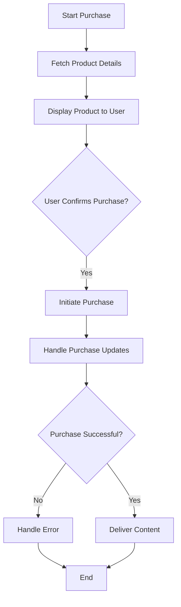

## 11.3.1 In-App Purchases

In-app purchases (IAPs) are a powerful way to generate revenue from your Flutter app while offering valuable features and content to your users. This section will guide you through understanding, implementing, and optimizing IAPs in your Flutter app, ensuring a seamless and secure experience for your users.

### Understanding In-App Purchases

In-app purchases can be categorized into three main types, each serving different purposes and user needs:

#### Types of IAPs

1. **Consumables:**
   - These are items that users can purchase multiple times, as they are consumed upon use. Examples include virtual currency, extra lives, or power-ups in a game.
   - **Example:** A user buys 100 coins to spend on in-game items.

2. **Non-Consumables:**
   - These are one-time purchases that provide permanent benefits to the user. Examples include removing ads or unlocking a premium feature.
   - **Example:** A user pays to remove ads from an app permanently.

3. **Subscriptions:**
   - These provide access to content or features for a specific period, such as a monthly or yearly subscription. They are ideal for apps offering ongoing services or content updates.
   - **Example:** A monthly subscription to access premium content in a news app.

### Implementing IAPs in Flutter

To implement in-app purchases in your Flutter app, you need to choose the right package and configure your app for both Android and iOS platforms.

#### Choosing a Package

The `in_app_purchase` package is the recommended choice for handling in-app purchases in Flutter, as it supports both iOS and Android platforms.

```dart
import 'package:in_app_purchase/in_app_purchase.dart';
```

#### Setup and Configuration

##### Android

1. **Set up IAPs in Google Play Console:**
   - Navigate to the Google Play Console and select your app.
   - Go to the "Monetize" section and select "Products" to create new in-app products.
   - Define product IDs, pricing, and other details.

2. **Add Product IDs and Details:**
   - Ensure that the product IDs match those used in your app code.

##### iOS

1. **Configure IAPs in App Store Connect:**
   - Log in to App Store Connect and select your app.
   - Go to "Features" and then "In-App Purchases" to create new products.
   - Set up product entries with IDs, pricing, and descriptions.

2. **Create Product Entries:**
   - Ensure that the product IDs are consistent with those in your app code.

#### Code Integration

##### Initializing Purchase Updates

To handle purchase updates, you need to initialize listeners that will notify your app of any changes in purchase status.

```dart
final InAppPurchase inAppPurchase = InAppPurchase.instance;
final Stream<List<PurchaseDetails>> purchaseUpdates = inAppPurchase.purchaseStream;

void _listenToPurchaseUpdates() {
  purchaseUpdates.listen((purchases) {
    _handlePurchaseUpdates(purchases);
  });
}

void _handlePurchaseUpdates(List<PurchaseDetails> purchases) {
  for (var purchase in purchases) {
    if (purchase.status == PurchaseStatus.purchased) {
      // Handle successful purchase
    } else if (purchase.status == PurchaseStatus.error) {
      // Handle error
    }
  }
}
```

##### Fetching Products

Request product details from the app store to display them to users.

```dart
Future<void> _loadProducts() async {
  final bool available = await inAppPurchase.isAvailable();
  if (!available) {
    // Handle the error
    return;
  }

  const Set<String> _kIds = {'product_id_1', 'product_id_2'};
  final ProductDetailsResponse response = await inAppPurchase.queryProductDetails(_kIds);
  if (response.notFoundIDs.isNotEmpty) {
    // Handle the error
  }

  List<ProductDetails> products = response.productDetails;
  // Display products to the user
}
```

##### Making a Purchase

Implement the purchase flow to handle user transactions.

```dart
void _buyProduct(ProductDetails productDetails) {
  final PurchaseParam purchaseParam = PurchaseParam(productDetails: productDetails);
  inAppPurchase.buyNonConsumable(purchaseParam: purchaseParam);
}
```

#### Handling Purchases

##### Verification

For security, verify purchase receipts. Server-side verification is recommended to prevent fraud.

```dart
// Example of server-side verification
Future<bool> _verifyPurchase(PurchaseDetails purchase) async {
  // Send purchase details to your server for verification
  // Return true if verified, false otherwise
}
```

##### Delivering Content

Unlock features or deliver items upon successful purchase.

```dart
void _deliverProduct(PurchaseDetails purchase) {
  if (purchase.productID == 'product_id_1') {
    // Unlock feature or deliver content
  }
}
```

#### Restoring Purchases

Provide options for users to restore non-consumable purchases on new devices.

```dart
void _restorePurchases() {
  inAppPurchase.restorePurchases();
}
```

### Designing Effective IAPs

Designing your IAP strategy involves understanding your users and offering them meaningful value.

#### Value Proposition

Ensure that your IAPs provide significant value to your users. This could be through exclusive content, enhanced features, or time-saving benefits.

#### Pricing Strategy

Research market standards and adjust your pricing accordingly. Consider offering various price points to cater to different user segments.

#### User Experience

Integrate purchase prompts seamlessly into your app. Avoid disrupting the core app experience and ensure that purchase flows are intuitive.

### Compliance and Guidelines

Adhering to platform policies and guidelines is crucial for a successful IAP implementation.

#### Platform Policies

- **Google Play and App Store Policies:** Ensure compliance with both platforms' policies regarding in-app purchases.
- **Revenue Sharing:** Understand the commission structure, typically a 15-30% platform fee.

#### User Consent

Provide clear information about charges before confirming purchases. Transparency is key to building trust with your users.

### Security Considerations

Security is paramount when handling in-app purchases to prevent fraud and protect user data.

#### Preventing Fraud

Implement receipt validation to prevent unauthorized access to purchased content.

#### Data Protection

Securely handle user data in compliance with privacy laws. Ensure that sensitive information is encrypted and stored safely.

### Promotion of IAPs

Promoting your in-app purchases effectively can significantly boost your revenue.

#### Onboarding

Introduce IAPs during the onboarding process if appropriate. This can help users understand the value of your offerings early on.

#### In-App Marketing

Use banners or notifications to highlight your IAP offerings. Ensure that these are well-timed and relevant to the user's current experience.

#### Limited-Time Offers

Create urgency with sales or special deals. Limited-time offers can encourage users to make a purchase decision more quickly.

### Visual Aids

#### Flowcharts

Below is a flowchart illustrating the purchase process from initiation to completion.



#### UI Mockups

Consider designing intuitive and attractive purchase prompts that guide users through the purchase process without confusion.

### Writing Tips

- Encourage ethical monetization that prioritizes user satisfaction.
- Remind readers to test purchases thoroughly on both platforms.
- Suggest monitoring user feedback to refine IAP offerings.
- Provide references to official documentation for deeper technical guidance.

### Conclusion

Integrating in-app purchases into your Flutter app can be a rewarding endeavor, both in terms of revenue and user satisfaction. By following best practices and ensuring a seamless user experience, you can create a successful monetization strategy that benefits both you and your users.

## Quiz Time!



### What are consumable in-app purchases?

- [x] Items that can be purchased multiple times and are consumed upon use.
- [ ] Permanent features that are purchased once.
- [ ] Subscriptions for ongoing access.
- [ ] Items that are free to use.

> **Explanation:** Consumable in-app purchases are items that users can buy multiple times, such as coins or extra lives, and are used up upon consumption.

### Which package is recommended for handling in-app purchases in Flutter?

- [x] `in_app_purchase`
- [ ] `flutter_iap`
- [ ] `purchase_handler`
- [ ] `app_store_connect`

> **Explanation:** The `in_app_purchase` package is recommended for handling in-app purchases in Flutter as it supports both iOS and Android platforms.

### What is the purpose of server-side receipt verification?

- [x] To prevent fraud and unauthorized access to purchased content.
- [ ] To display purchase details to the user.
- [ ] To increase app performance.
- [ ] To handle refunds automatically.

> **Explanation:** Server-side receipt verification is used to ensure that purchases are legitimate and to prevent fraud by verifying purchase receipts with the app store.

### How should non-consumable purchases be handled on new devices?

- [x] Provide options for users to restore purchases.
- [ ] Require users to repurchase items.
- [ ] Automatically unlock all features.
- [ ] Ignore previous purchases.

> **Explanation:** Non-consumable purchases should be restorable on new devices, allowing users to regain access to their purchased content without repurchasing.

### What is a key consideration when designing effective IAPs?

- [x] Ensuring that IAPs offer meaningful value to users.
- [ ] Making all features free.
- [ ] Limiting user access to basic features.
- [ ] Increasing app size significantly.

> **Explanation:** Effective IAPs should provide meaningful value to users, enhancing their experience and encouraging purchases.

### What should be included in the onboarding process regarding IAPs?

- [x] Introduction to IAPs and their benefits.
- [ ] Detailed technical specifications.
- [ ] Advertising for other apps.
- [ ] Instructions for uninstalling the app.

> **Explanation:** Introducing IAPs during the onboarding process helps users understand their benefits early on, potentially increasing engagement and purchases.

### What is the typical platform fee for in-app purchases?

- [x] 15-30%
- [ ] 5-10%
- [ ] 50-60%
- [ ] 70-80%

> **Explanation:** The typical platform fee for in-app purchases is between 15-30%, which is deducted from the revenue generated by the app store.

### How can you promote IAPs effectively within your app?

- [x] Use banners or notifications to highlight offerings.
- [ ] Hide IAP options deep within settings.
- [ ] Only promote IAPs on external websites.
- [ ] Limit IAP promotions to once a year.

> **Explanation:** Using in-app banners or notifications to highlight IAP offerings can effectively promote them to users.

### Why is it important to comply with platform policies regarding IAPs?

- [x] To ensure the app remains available on the app stores.
- [ ] To increase app download speeds.
- [ ] To reduce app development time.
- [ ] To avoid user feedback.

> **Explanation:** Complying with platform policies is crucial to ensure that the app remains available on the app stores and adheres to legal and ethical standards.

### True or False: In-app purchases should disrupt the core app experience to encourage purchases.

- [ ] True
- [x] False

> **Explanation:** In-app purchases should be integrated seamlessly and should not disrupt the core app experience, ensuring that users enjoy the app without feeling pressured to make purchases.


