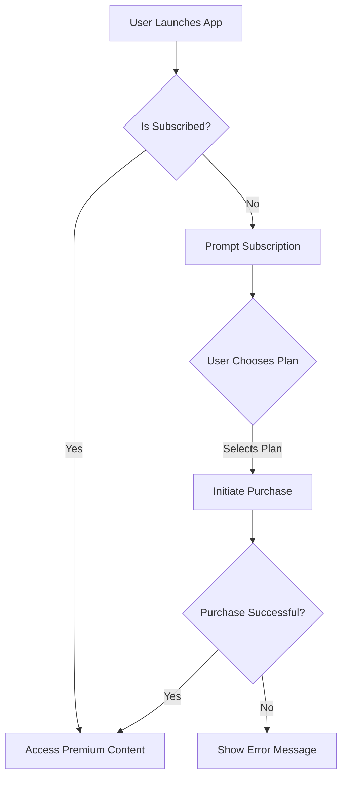

## 11.3.2 Subscription Models

In the rapidly evolving landscape of mobile app development, subscription models have emerged as a powerful monetization strategy. They provide a recurring revenue stream and encourage ongoing user engagement, making them an attractive option for developers. This section will guide you through the intricacies of implementing subscription-based monetization in your Flutter app, detailing best practices and compliance requirements.

### Understanding Subscriptions

#### Benefits of Subscription Models

Subscriptions offer several advantages over traditional one-time purchases:

- **Recurring Revenue Stream:** Subscriptions provide a steady income, allowing for better financial planning and resource allocation.
- **Ongoing Engagement:** By offering continuous value, subscriptions encourage users to engage with your app regularly, fostering loyalty and reducing churn.

#### Subscription Types

There are two primary types of subscriptions you can implement in your app:

- **Auto-Renewable Subscriptions:** These subscriptions automatically renew at the end of each billing cycle unless canceled by the user. They are ideal for services that provide ongoing value, such as media streaming or cloud storage.
  
- **Non-Renewing Subscriptions:** Users need to manually renew these subscriptions upon expiration. They are suitable for seasonal content or time-limited access to features.

### Implementing Subscriptions in Flutter

#### Using the `in_app_purchase` Package

The `in_app_purchase` package is a powerful tool for implementing in-app purchases (IAPs) in Flutter, including subscriptions. Here's a step-by-step guide to setting up subscriptions using this package:

1. **Add the Package to Your Project:**

   Add the `in_app_purchase` package to your `pubspec.yaml` file:

   ```yaml
   dependencies:
     flutter:
       sdk: flutter
     in_app_purchase: ^0.5.2
   ```

2. **Configure Products as Subscriptions:**

   Configure your products in the respective app stores as subscriptions. This involves setting up subscription groups, pricing, and other details.

3. **Initialize the Purchase Connection:**

   Initialize the purchase connection in your app:

   ```dart
   import 'package:in_app_purchase/in_app_purchase.dart';

   void main() {
     InAppPurchaseConnection.enablePendingPurchases();
     runApp(MyApp());
   }
   ```

4. **Fetch Available Subscriptions:**

   Fetch the list of available subscriptions from the store:

   ```dart
   Future<void> _getSubscriptions() async {
     final bool available = await InAppPurchaseConnection.instance.isAvailable();
     if (!available) {
       // Handle the error
       return;
     }

     const Set<String> _kIds = {'your_subscription_id'};
     final ProductDetailsResponse response = await InAppPurchaseConnection.instance.queryProductDetails(_kIds);
     if (response.notFoundIDs.isNotEmpty) {
       // Handle the error
     }

     List<ProductDetails> products = response.productDetails;
     // Display products to the user
   }
   ```

5. **Initiate Subscription Purchase:**

   Initiate the purchase flow when the user selects a subscription:

   ```dart
   void _buySubscription(ProductDetails productDetails) {
     final PurchaseParam purchaseParam = PurchaseParam(productDetails: productDetails);
     InAppPurchaseConnection.instance.buyNonConsumable(purchaseParam: purchaseParam);
   }
   ```

#### Platform-Specific Setup

##### iOS

For iOS, you need to configure subscription groups and offers in App Store Connect:

- **Subscription Groups:** Group similar subscriptions to allow users to upgrade or downgrade within the group.
- **Offers:** Set up introductory pricing, free trials, and promotional offers.

##### Android

For Android, set up subscriptions in the Google Play Console:

- **Free Trials and Introductory Pricing:** Offer users a trial period or a discounted rate for the initial subscription period.

#### Handling Subscription Logic

##### Purchase Flow

The purchase flow for subscriptions is similar to that of IAPs. Ensure that you handle user interactions and errors gracefully.

##### Managing Access

To manage access to premium content based on subscription status:

- **Check Subscription Status on App Startup:** Verify the user's subscription status each time the app starts.
- **Provide Access Accordingly:** Enable or restrict access to premium features based on the subscription status.

##### Receipt Validation

Implement server-side receipt validation to ensure that the subscription status is accurate and up-to-date. This involves sending the purchase receipt to your server and verifying it with the app store.

##### Handling Cancellations and Renewals

- **Update User Access:** Adjust user access if a subscription is canceled or expires.
- **Grace Periods:** Consider providing a grace period to allow users to renew their subscription without losing access immediately.

### Designing Subscription Offerings

#### Tiered Plans

Offer different levels of access at varying price points to cater to diverse user needs and budgets. For example, you might offer:

- **Basic Plan:** Access to essential features.
- **Premium Plan:** Access to all features, including exclusive content.
- **Enterprise Plan:** Additional benefits such as priority support.

#### Free Trials

Allow users to experience premium features before committing to a subscription. This can significantly increase conversion rates.

#### Introductory Prices

Provide discounted rates for the initial subscription period to entice users to subscribe.

### Compliance and Guidelines

#### Platform Policies

Adhere to platform-specific policies regarding subscription disclosures and billing practices. Both Apple and Google have strict guidelines that you must follow to avoid app rejection.

#### Billing Agreements

Ensure that the terms of the subscription are clear to the user before they subscribe. This includes details about pricing, billing frequency, and cancellation policies.

#### Cancellation Management

Provide easy access for users to manage or cancel their subscriptions. This can be done through the app or by directing users to the appropriate app store settings.

### Optimizing Subscription Conversions

#### Onboarding Integration

Introduce subscription options early in the user journey, ideally during the onboarding process. This helps set user expectations and highlights the value of subscribing.

#### Value Communication

Clearly articulate the benefits of subscribing. Use compelling messaging and visuals to convey the value of premium features.

#### Personalization

Tailor subscription offerings based on user behavior or preferences. For example, you might offer personalized recommendations or discounts based on user activity.

### Visual Aids

#### Subscription Flow Diagrams

Visualize the user interaction with subscription features using flow diagrams. This helps in understanding the user journey and identifying potential areas for improvement.



#### UI Examples

Show layouts for subscription selection screens to provide inspiration for designing intuitive and engaging interfaces.

```dart
Widget buildSubscriptionScreen(List<ProductDetails> products) {
  return ListView.builder(
    itemCount: products.length,
    itemBuilder: (context, index) {
      final product = products[index];
      return ListTile(
        title: Text(product.title),
        subtitle: Text(product.description),
        trailing: TextButton(
          onPressed: () => _buySubscription(product),
          child: Text('Subscribe'),
        ),
      );
    },
  );
}
```

### Writing Tips

- **Emphasize Clarity and Transparency:** Be clear and transparent with users regarding billing and subscription terms.
- **Encourage Compliance:** Stay updated with legal requirements, such as GDPR, for handling user data.
- **Provide Excellent Customer Support:** Address subscription issues promptly to maintain user trust and satisfaction.
- **Stay Updated with Platform Policies:** Regularly review changes in platform policies affecting subscriptions to ensure compliance.

By following these guidelines, you can effectively implement subscription models in your Flutter app, providing value to your users while generating a sustainable revenue stream.

## Quiz Time!



### What is a key benefit of implementing subscription models in mobile apps?

- [x] Recurring revenue stream
- [ ] One-time payment
- [ ] Increased app size
- [ ] Reduced user engagement

> **Explanation:** Subscriptions provide a recurring revenue stream, which is a key benefit for app developers.

### Which type of subscription automatically renews unless canceled by the user?

- [x] Auto-Renewable Subscriptions
- [ ] Non-Renewing Subscriptions
- [ ] One-Time Purchase
- [ ] Consumable Purchase

> **Explanation:** Auto-renewable subscriptions automatically renew at the end of each billing cycle unless canceled by the user.

### What is the purpose of server-side receipt validation?

- [x] To ensure subscription status is accurate
- [ ] To increase app performance
- [ ] To reduce app size
- [ ] To improve UI design

> **Explanation:** Server-side receipt validation ensures that the subscription status is accurate and up-to-date.

### What should you consider providing if a subscription is canceled or expires?

- [x] Grace periods
- [ ] Free upgrades
- [ ] Additional charges
- [ ] New subscriptions

> **Explanation:** Grace periods allow users to renew their subscription without losing access immediately.

### What is a benefit of offering free trials for subscriptions?

- [x] Increased conversion rates
- [ ] Decreased user engagement
- [x] User experience of premium features
- [ ] Reduced app functionality

> **Explanation:** Free trials allow users to experience premium features, which can increase conversion rates.

### What should you include in your app to comply with platform policies?

- [x] Subscription disclosures
- [ ] Hidden charges
- [ ] Unclear terms
- [ ] Complex cancellation process

> **Explanation:** Subscription disclosures are required to comply with platform policies and ensure transparency.

### How can you optimize subscription conversions during onboarding?

- [x] Introduce subscription options early
- [ ] Hide subscription options
- [x] Highlight value of subscribing
- [ ] Delay subscription offers

> **Explanation:** Introducing subscription options early and highlighting their value can optimize conversions.

### What is a key aspect of managing user access based on subscription status?

- [x] Checking subscription status on app startup
- [ ] Ignoring subscription status
- [ ] Providing access to all users
- [ ] Charging users twice

> **Explanation:** Checking subscription status on app startup ensures that users receive the correct access.

### What is an important consideration when designing subscription offerings?

- [x] Tiered plans
- [ ] Single pricing
- [ ] No trials
- [ ] Complex UI

> **Explanation:** Tiered plans offer different levels of access at varying price points, catering to diverse user needs.

### True or False: Auto-renewable subscriptions require users to manually renew them.

- [ ] True
- [x] False

> **Explanation:** Auto-renewable subscriptions automatically renew unless canceled by the user.


