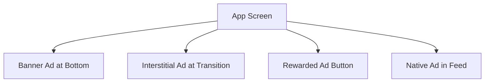
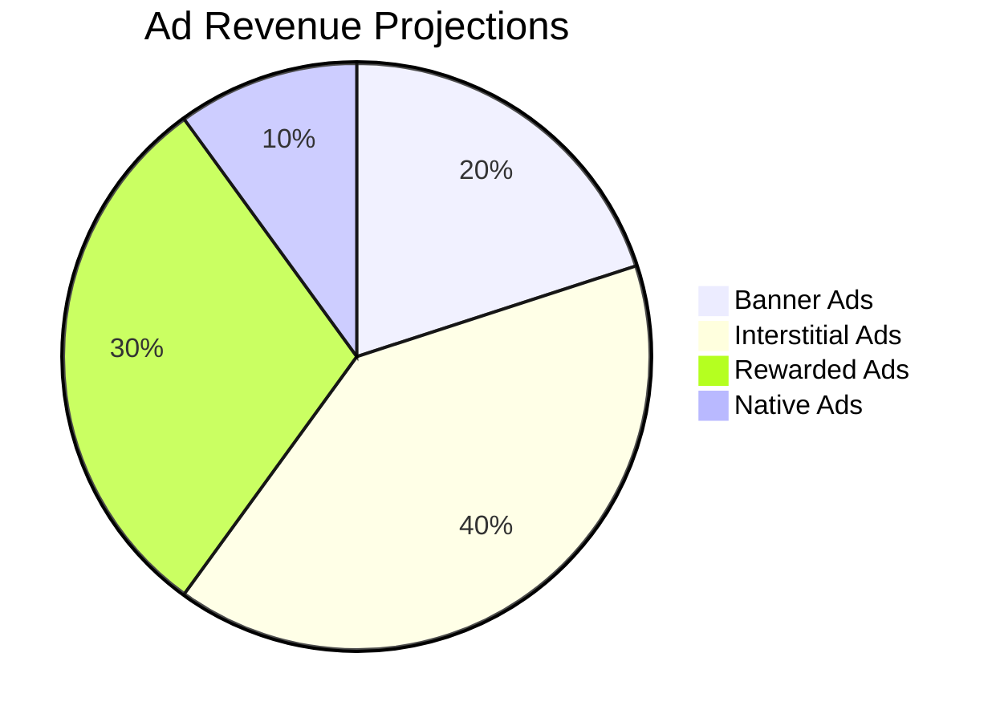

## 11.3.3 Advertising in Your App

In the competitive world of mobile applications, monetization is a critical aspect of sustaining and growing your app. One of the most effective ways to monetize your app is through in-app advertising. This section will guide you through the process of integrating advertising into your Flutter app, ensuring you can generate revenue while maintaining a positive user experience.

### Understanding In-App Advertising

In-app advertising allows developers to earn revenue by displaying ads to users. The key to successful in-app advertising is choosing the right ad formats and integrating them seamlessly into your app's user experience.

#### Ad Formats

1. **Banner Ads:**
   - Banner ads are small, rectangular ads that can be static or animated. They are typically placed at the top or bottom of the screen.
   - **Pros:** Non-intrusive, easy to implement.
   - **Cons:** Lower engagement and revenue compared to other formats.

2. **Interstitial Ads:**
   - These are full-screen ads that appear at natural transition points, such as between levels in a game.
   - **Pros:** High engagement and revenue potential.
   - **Cons:** Can be intrusive if not placed strategically.

3. **Rewarded Ads:**
   - Users opt-in to watch these ads in exchange for in-app rewards, such as extra lives or virtual currency.
   - **Pros:** High user engagement, positive user experience.
   - **Cons:** Requires careful implementation to ensure rewards are valuable.

4. **Native Ads:**
   - Native ads match the look and feel of the app content, providing a seamless user experience.
   - **Pros:** High engagement, non-intrusive.
   - **Cons:** More complex to implement.

### Integrating Ad Networks

To display ads in your Flutter app, you need to integrate an ad network. Google AdMob is one of the most popular choices due to its wide reach and compatibility with Flutter.

#### Google AdMob Integration

1. **Install the Package:**

   Add the `google_mobile_ads` package to your `pubspec.yaml` file:

   ```yaml
   dependencies:
     google_mobile_ads: ^1.0.0
   ```

   Run `flutter pub get` to install the package.

2. **Initialize the SDK:**

   Initialize the Mobile Ads SDK in your app's main entry point:

   ```dart
   import 'package:google_mobile_ads/google_mobile_ads.dart';

   void main() {
     WidgetsFlutterBinding.ensureInitialized();
     MobileAds.instance.initialize();
     runApp(MyApp());
   }
   ```

3. **Load and Display Ads:**

   - **Banner Ads:**

     ```dart
     BannerAd myBanner = BannerAd(
       adUnitId: '<YOUR_AD_UNIT_ID>',
       size: AdSize.banner,
       request: AdRequest(),
       listener: BannerAdListener(),
     );

     myBanner.load();
     ```

   - **Interstitial Ads:**

     ```dart
     InterstitialAd myInterstitial = InterstitialAd(
       adUnitId: '<YOUR_AD_UNIT_ID>',
       request: AdRequest(),
       listener: AdListener(
         onAdLoaded: (Ad ad) => myInterstitial.show(),
         onAdFailedToLoad: (Ad ad, LoadAdError error) {
           ad.dispose();
         },
         onAdClosed: (Ad ad) {
           ad.dispose();
         },
       ),
     );

     myInterstitial.load();
     ```

   - **Rewarded Ads:**

     ```dart
     RewardedAd myRewardedAd = RewardedAd(
       adUnitId: '<YOUR_AD_UNIT_ID>',
       request: AdRequest(),
       listener: RewardedAdListener(
         onRewardedAdUserEarnedReward: (Ad ad, RewardItem reward) {
           // Reward the user for watching the ad.
         },
         onAdClosed: (Ad ad) {
           ad.dispose();
         },
       ),
     );

     myRewardedAd.load();
     ```

   - **Native Ads:**

     Native ads require custom implementation to match your app's UI. Refer to the [Google Mobile Ads SDK documentation](https://developers.google.com/admob/flutter/native) for detailed guidance.

#### Alternative Networks

While Google AdMob is a popular choice, consider exploring other networks like Unity Ads, Facebook Audience Network, or AppLovin to diversify your revenue streams.

### Designing Ad Placement

The placement and timing of ads are crucial to maintaining a positive user experience.

#### User Experience

- Ensure ads do not interfere with app usability. For example, avoid placing banner ads over important UI elements.
- Use interstitial ads sparingly to prevent user frustration.

#### Frequency Capping

- Control how often ads are shown to the same user to avoid ad fatigue. This can be managed through the ad network's settings.

#### Strategic Timing

- Display ads at natural breaks or transition points where they feel less intrusive, such as after completing a task or level.

### Optimizing Ad Revenue

Maximizing ad revenue involves more than just displaying ads. Consider the following strategies:

#### Ad Mediation

- Use mediation platforms to maximize fill rates and eCPMs by serving ads from multiple networks. This increases competition and can lead to higher revenue.

#### Targeting Ads

- Enable relevant ads to improve click-through rates. Most ad networks offer targeting options based on user demographics and interests.

#### Ad Testing

- A/B test different ad formats and placements to determine what works best for your app and audience.

### Compliance and Best Practices

Adhering to ad network policies and best practices is essential to avoid account suspension and ensure a positive user experience.

#### Ad Policies

- Follow the ad network's policies regarding ad placement, content, and user interaction. Violations can lead to account suspension.

#### Content Guidelines

- Monitor the quality and appropriateness of ads shown in your app. Use filters to block sensitive or inappropriate content.

#### User Consent

- Implement consent mechanisms for personalized ads, especially in regions like the EU where GDPR compliance is required.

### Measuring Performance

Tracking ad performance is crucial to understanding and optimizing your monetization strategy.

#### Key Metrics

- Monitor key metrics such as impressions, clicks, and revenue per mille (RPM) to gauge ad performance.

#### Analytics Integration

- Integrate analytics tools to track ad performance alongside user engagement metrics. This provides a holistic view of your app's performance and user behavior.

### Visual Aids

#### Code Snippets

Below are examples for loading and displaying each ad format, as discussed earlier.

#### UI Mockups

Visualize ad placements within your app interface to ensure they blend seamlessly with your app's design.



#### Charts

Show potential revenue projections based on different ad formats and placements.



### Writing Tips

- Stress the importance of balancing monetization with user satisfaction. Ads should enhance, not detract from, the user experience.
- Encourage testing ads on various devices for compatibility and performance.
- Advise on starting with one ad format and expanding cautiously to avoid overwhelming users.
- Provide guidelines on avoiding accidental clicks (click fraud) by ensuring ads are placed away from interactive elements.

## Quiz Time!



### What is a key benefit of using rewarded ads in your app?

- [x] High user engagement and positive user experience
- [ ] They are the easiest to implement
- [ ] They generate the most revenue
- [ ] They require no user interaction

> **Explanation:** Rewarded ads offer high user engagement because users opt-in to watch them in exchange for in-app rewards, enhancing the user experience.

### Which ad format is typically placed at the top or bottom of the screen?

- [x] Banner Ads
- [ ] Interstitial Ads
- [ ] Rewarded Ads
- [ ] Native Ads

> **Explanation:** Banner ads are small, rectangular ads placed at the top or bottom of the screen.

### What is the purpose of frequency capping in ad placement?

- [x] To control how often ads are shown to the same user
- [ ] To increase the number of ads displayed
- [ ] To ensure ads are always visible
- [ ] To maximize ad revenue

> **Explanation:** Frequency capping controls how often ads are shown to the same user to avoid ad fatigue and maintain a positive user experience.

### Which ad network is widely used and compatible with Flutter?

- [x] Google AdMob
- [ ] Unity Ads
- [ ] Facebook Audience Network
- [ ] AppLovin

> **Explanation:** Google AdMob is a widely used ad network that is compatible with Flutter through the `google_mobile_ads` package.

### What is a benefit of using ad mediation?

- [x] Maximizing fill rates and eCPMs
- [ ] Reducing the number of ads shown
- [ ] Simplifying ad implementation
- [ ] Ensuring ads are always relevant

> **Explanation:** Ad mediation maximizes fill rates and eCPMs by serving ads from multiple networks, increasing competition and potential revenue.

### Why is it important to follow ad network policies?

- [x] To avoid account suspension
- [ ] To increase ad revenue
- [ ] To reduce the number of ads shown
- [ ] To simplify ad implementation

> **Explanation:** Following ad network policies is crucial to avoid account suspension and ensure compliance with guidelines.

### What is a key metric to monitor for ad performance?

- [x] Impressions
- [ ] User reviews
- [ ] App downloads
- [ ] Screen time

> **Explanation:** Impressions are a key metric to monitor for ad performance, indicating how often ads are displayed to users.

### What should you implement for personalized ads in regions like the EU?

- [x] User consent mechanisms
- [ ] More frequent ads
- [ ] Higher ad revenue targets
- [ ] Simplified ad formats

> **Explanation:** Implementing user consent mechanisms is important for personalized ads, especially in regions like the EU where GDPR compliance is required.

### What is a potential downside of interstitial ads?

- [x] They can be intrusive if not placed strategically
- [ ] They generate the least revenue
- [ ] They are the easiest to implement
- [ ] They require user interaction

> **Explanation:** Interstitial ads can be intrusive if not placed strategically, as they are full-screen ads that interrupt the user experience.

### True or False: Native ads are the simplest ad format to implement.

- [ ] True
- [x] False

> **Explanation:** False. Native ads are more complex to implement as they need to match the look and feel of the app content for a seamless user experience.


