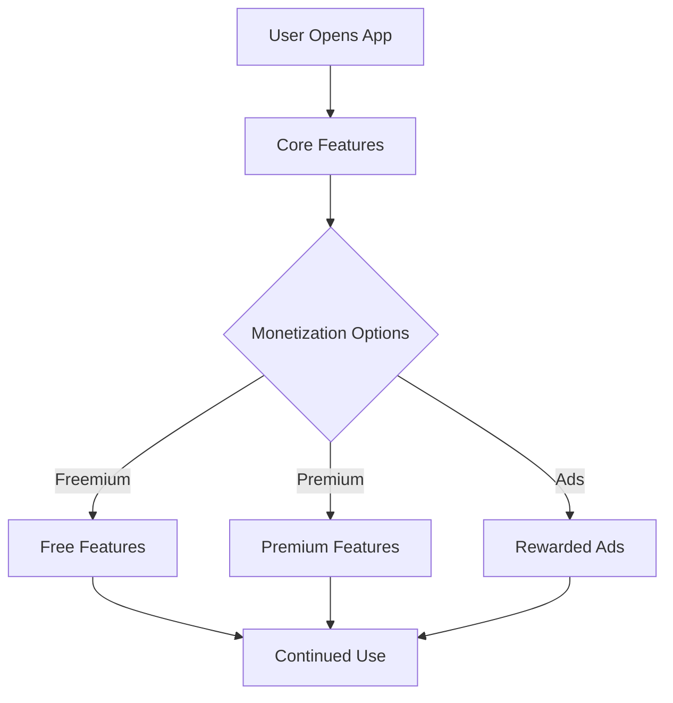

## 11.3.4 Balancing Monetization and User Experience

Monetizing a mobile app is a crucial step for developers aiming to generate revenue and sustain their projects. However, achieving a balance between monetization and user experience is essential to ensure long-term success and user retention. This section will guide you through strategies and best practices to monetize your Flutter app effectively without compromising the user experience.

### Prioritizing User Experience

#### Value Delivery

The primary goal of any app should be to deliver value to its users. Monetization strategies should enhance or at least not detract from this core value. When users feel that the app provides genuine value, they are more likely to engage with monetization elements willingly.

- **Focus on Core Features:** Ensure that the app's main functionalities are accessible without mandatory payments. Users should feel that they are getting a complete experience even without spending money.
- **Enhance with Premium:** Offer additional features or content that enhance the core experience for users who choose to pay. This could include advanced features, exclusive content, or customization options.

#### User-Centric Design

Designing monetization elements with the user's needs and preferences in mind is crucial. A user-centric approach ensures that monetization does not become a barrier to a seamless experience.

- **Intuitive Placement:** Place monetization elements, such as ads or purchase prompts, in locations that are logical and non-intrusive.
- **User-Friendly Design:** Ensure that the design of monetization features aligns with the overall app design, maintaining consistency and ease of use.

### Strategies for Balance

#### Transparent Communication

Being upfront about costs, ads, or data usage builds trust with users. Transparency can mitigate negative reactions to monetization efforts.

- **Clear Pricing Information:** Clearly display the cost of in-app purchases or subscriptions before users commit to a purchase.
- **Ad Disclosure:** Inform users about the presence of ads and how they support the app's free features.

#### Optional Monetization

Offering premium features without restricting core functionality allows users to choose how they want to engage with monetization.

- **Freemium Model:** Provide a free version of the app with optional premium upgrades. This model allows users to experience the app before deciding to pay for additional features.
- **Rewarded Ads:** Implement rewarded ads that offer users incentives, such as in-app currency or extra features, in exchange for watching ads.

#### Feedback Integration

Listening to user feedback regarding monetization impact is vital for maintaining a positive user experience.

- **User Surveys:** Conduct surveys to gather user opinions on monetization strategies and their impact on the app experience.
- **Feedback Channels:** Provide easy-to-access channels for users to share their thoughts and suggestions.

### Best Practices

#### Non-Intrusive Ads

Ads should be visible but not disruptive to the user experience. Consider the following best practices:

- **Strategic Placement:** Place ads in areas that do not interfere with the app's main functions, such as between levels in a game or on a separate screen.
- **Frequency Control:** Limit the frequency of ads to prevent user frustration. Avoid interrupting users during critical tasks.

#### Fair Pricing

Pricing in-app purchases and subscriptions reasonably relative to the value provided is crucial for user satisfaction.

- **Competitive Analysis:** Research similar apps to determine competitive pricing for your offerings.
- **Value Proposition:** Clearly communicate the benefits of premium features to justify their cost.

#### Ethical Incentives

Avoid manipulative tactics or dark patterns to drive purchases. Ethical monetization builds trust and long-term user loyalty.

- **Transparent Offers:** Clearly explain what users will receive in exchange for their payment.
- **No Pressure Tactics:** Avoid using language or design that pressures users into making purchases.

### Testing and Monitoring

#### User Testing

Conduct usability tests to assess the impact of monetization elements on the user experience.

- **A/B Testing:** Test different monetization strategies to determine which approach resonates best with users.
- **Focus Groups:** Gather qualitative feedback from users to understand their perceptions and experiences.

#### Analytics

Monitoring user engagement and churn rates post-monetization changes provides valuable insights into the effectiveness of your strategies.

- **Engagement Metrics:** Track metrics such as session length, frequency of use, and conversion rates to evaluate user engagement.
- **Churn Analysis:** Analyze churn rates to identify any negative impacts of monetization on user retention.

#### Iterative Improvement

Adjust strategies based on data and feedback to continuously improve the balance between monetization and user experience.

- **Regular Updates:** Release updates that address user feedback and improve monetization features.
- **Continuous Learning:** Stay informed about industry trends and emerging monetization strategies.

### Legal and Ethical Considerations

#### Compliance

Adhering to laws such as consumer protection regulations is essential to avoid legal issues and maintain user trust.

- **Data Privacy:** Ensure compliance with data protection laws, such as GDPR or CCPA, when collecting and using user data.
- **Consumer Rights:** Respect consumer rights by providing clear refund policies and accessible customer support.

#### Age-Appropriate Content

Ensure monetization methods are suitable for the app's audience, especially if the app targets children or young users.

- **Content Ratings:** Use appropriate content ratings to inform users about the app's suitability for different age groups.
- **Parental Controls:** Implement parental controls to manage in-app purchases and content access for younger users.

### Case Studies

#### Successful Examples

Analyzing apps that effectively balance monetization and user experience can provide valuable insights.

- **Case Study: Duolingo:** Duolingo offers a freemium model with optional ads and premium subscriptions. The app maintains a strong focus on user experience by providing valuable language learning content for free, with the option to enhance the experience through premium features.
- **Case Study: Clash of Clans:** This game uses in-app purchases to enhance gameplay without restricting core functionality. Players can enjoy the game without spending money, but have the option to purchase resources to progress faster.

#### Lessons Learned

Learning from apps that faced backlash due to aggressive monetization can help avoid similar pitfalls.

- **Case Study: EA's Star Wars Battlefront II:** The game faced significant backlash for its aggressive monetization tactics, which were perceived as pay-to-win. The negative response led to changes in the game's monetization strategy and highlighted the importance of balancing monetization with user experience.

### Visual Aids

#### Comparison Tables

Comparison tables can help contrast different monetization strategies and their user experience impacts.

| Strategy          | User Experience Impact | Monetization Potential |
|-------------------|------------------------|------------------------|
| Freemium Model    | High                   | Moderate               |
| Rewarded Ads      | Moderate               | High                   |
| Subscription      | High                   | High                   |
| In-App Purchases  | Moderate               | High                   |

#### User Flow Diagrams

User flow diagrams can illustrate how users interact with monetization features, helping to identify potential pain points.

#### Survey Data

Including data on user preferences regarding monetization can provide insights into user expectations.

- **Survey Results:** A survey conducted by App Annie found that 70% of users prefer apps with optional ads and premium features over apps with mandatory purchases.

### Writing Tips

- **Empathy:** Encourage empathy by putting oneself in the user's shoes. Consider how monetization strategies impact the overall user experience.
- **Trust and Satisfaction:** Remind readers that trust and satisfaction can lead to higher lifetime value per user. A positive user experience encourages long-term engagement and loyalty.
- **User Involvement:** Suggest involving users in the decision-making process through surveys or beta testing. User feedback can guide the development of monetization strategies that align with user preferences.
- **Long-Term Gains:** Advocate for long-term gains over short-term profits. Sustainable monetization strategies prioritize user satisfaction and retention.

## Quiz Time!



### What is the primary goal of any app in terms of user experience?

- [x] Deliver value to its users
- [ ] Maximize revenue at all costs
- [ ] Implement as many monetization strategies as possible
- [ ] Focus solely on premium features

> **Explanation:** The primary goal of any app should be to deliver value to its users, ensuring a positive user experience and long-term engagement.

### How should monetization elements be designed?

- [x] With the user's needs and preferences in mind
- [ ] To maximize revenue regardless of user experience
- [ ] To be as prominent as possible
- [ ] To be hidden from users

> **Explanation:** Monetization elements should be designed with the user's needs and preferences in mind to ensure a seamless and positive user experience.

### What is a key benefit of transparent communication in monetization?

- [x] Builds trust with users
- [ ] Increases ad revenue
- [ ] Reduces development costs
- [ ] Guarantees higher conversion rates

> **Explanation:** Transparent communication builds trust with users by being upfront about costs, ads, or data usage, which can lead to a more positive user experience.

### Which monetization strategy allows users to choose how they engage with monetization?

- [x] Optional Monetization
- [ ] Mandatory Purchases
- [ ] Subscription Only
- [ ] Ad-Only Model

> **Explanation:** Optional monetization, such as offering premium features without restricting core functionality, allows users to choose how they engage with monetization.

### What is a best practice for placing ads in an app?

- [x] Place ads where they are visible but not disruptive
- [ ] Place ads on every screen
- [ ] Use pop-up ads frequently
- [ ] Hide ads from users

> **Explanation:** Ads should be placed where they are visible but not disruptive to ensure they do not interfere with the user experience.

### Why is fair pricing important for in-app purchases?

- [x] Ensures user satisfaction
- [ ] Maximizes short-term profits
- [ ] Reduces development costs
- [ ] Guarantees higher conversion rates

> **Explanation:** Fair pricing ensures user satisfaction by offering value relative to the cost, which can lead to higher engagement and retention.

### What should developers avoid when implementing monetization strategies?

- [x] Manipulative tactics or dark patterns
- [ ] Offering premium features
- [ ] Using rewarded ads
- [ ] Providing clear pricing information

> **Explanation:** Developers should avoid manipulative tactics or dark patterns, as these can damage trust and lead to negative user experiences.

### What is the purpose of user testing in monetization?

- [x] Assess the impact of monetization elements on user experience
- [ ] Increase ad revenue
- [ ] Reduce development time
- [ ] Guarantee higher conversion rates

> **Explanation:** User testing helps assess the impact of monetization elements on user experience, allowing developers to make informed adjustments.

### What should developers monitor after implementing monetization changes?

- [x] User engagement and churn rates
- [ ] Only ad revenue
- [ ] Development costs
- [ ] Number of downloads

> **Explanation:** Monitoring user engagement and churn rates provides insights into the effectiveness of monetization strategies and their impact on user experience.

### True or False: Long-term gains should be prioritized over short-term profits in app monetization.

- [x] True
- [ ] False

> **Explanation:** Long-term gains should be prioritized over short-term profits to ensure sustainable monetization strategies that prioritize user satisfaction and retention.


