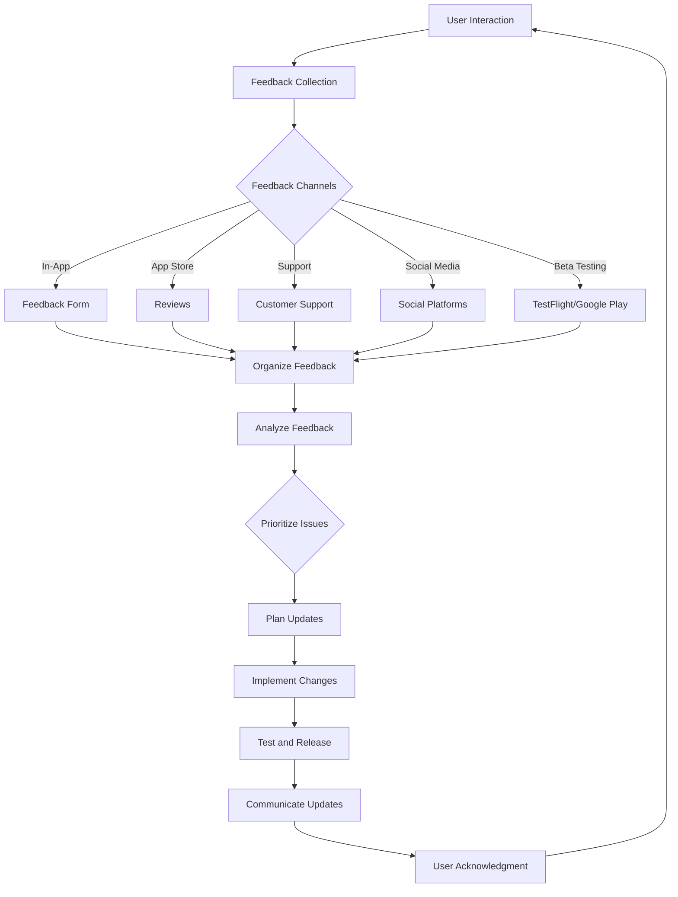
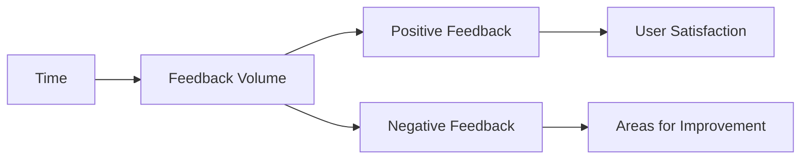

## 11.4.1 Collecting and Implementing Feedback

In the competitive world of mobile applications, user feedback is invaluable. It not only helps you understand what your users love about your app but also highlights areas that need improvement. In this section, we'll explore various strategies for collecting feedback and how to effectively implement it to enhance your Flutter app's functionality, fix issues, and improve user satisfaction.

### Channels for Collecting Feedback

#### In-App Feedback Mechanisms

Integrating feedback mechanisms directly into your app is one of the most effective ways to gather user insights. This can be achieved through:

- **Feedback Forms and Surveys:** Embed forms or surveys within your app to capture user opinions. These can be triggered after specific actions or at strategic points in the user journey.
- **Rating Prompts:** Encourage users to rate your app after a positive experience. This can be a simple star rating system or a more detailed review request.

**Example Code for In-App Feedback Form:**

```dart
import 'package:flutter/material.dart';

class FeedbackForm extends StatelessWidget {
  final _formKey = GlobalKey<FormState>();
  final TextEditingController _feedbackController = TextEditingController();

  @override
  Widget build(BuildContext context) {
    return Scaffold(
      appBar: AppBar(title: Text('Feedback')),
      body: Padding(
        padding: const EdgeInsets.all(16.0),
        child: Form(
          key: _formKey,
          child: Column(
            children: [
              TextFormField(
                controller: _feedbackController,
                decoration: InputDecoration(labelText: 'Your Feedback'),
                validator: (value) {
                  if (value == null || value.isEmpty) {
                    return 'Please enter your feedback';
                  }
                  return null;
                },
              ),
              SizedBox(height: 20),
              ElevatedButton(
                onPressed: () {
                  if (_formKey.currentState!.validate()) {
                    // Process feedback
                    print('Feedback submitted: ${_feedbackController.text}');
                  }
                },
                child: Text('Submit'),
              ),
            ],
          ),
        ),
      ),
    );
  }
}
```

#### App Store Reviews

Monitoring and responding to reviews on app marketplaces such as the Google Play Store and Apple App Store is crucial. These platforms provide a wealth of user feedback that can guide your app's development.

- **Responding to Reviews:** Engage with users by responding to their reviews. Thank them for positive feedback and address any concerns raised in negative reviews.

#### Customer Support

Providing accessible support channels is essential for collecting feedback and resolving user issues. Consider the following:

- **Email Support:** Offer a dedicated email address for user inquiries and feedback.
- **Live Chat:** Implement a live chat feature within your app for real-time support.
- **Helpdesk Systems:** Use helpdesk software to manage and track user issues effectively.

#### Social Media and Communities

Engage with your users on social media platforms like Twitter, Facebook, and Reddit. These platforms are excellent for gathering informal feedback and building a community around your app.

- **Social Listening:** Monitor mentions of your app to understand user sentiment and gather feedback.
- **Community Engagement:** Participate in discussions and encourage users to share their thoughts and suggestions.

#### Beta Testing Programs

Utilize beta testing programs to gather pre-release feedback. This can help identify issues before the app reaches a wider audience.

- **TestFlight (iOS):** Use TestFlight to distribute beta versions of your app to testers.
- **Google Play Testing Tracks:** Leverage Google Play's testing tracks to release beta versions to a select group of users.

### Effective Feedback Collection

Collecting feedback is only valuable if done effectively. Here are some best practices:

#### Timing

Prompt users for feedback after positive interactions, such as completing a task or achieving a milestone within the app. This increases the likelihood of receiving constructive feedback.

#### Simplicity

Keep feedback requests short and straightforward. Avoid overwhelming users with lengthy surveys or complex questions.

#### Incentivization

Consider offering rewards for detailed feedback, such as discounts or in-app credits. Ensure compliance with platform policies when providing incentives.

### Organizing and Analyzing Feedback

Once feedback is collected, it's essential to organize and analyze it effectively to make informed decisions.

#### Categorization

Group feedback into themes such as feature requests, bugs, and usability issues. This helps in identifying common patterns and areas for improvement.

#### Prioritization

Use criteria like frequency, impact, and feasibility to prioritize issues. Focus on high-impact changes that will benefit the majority of your users.

#### Tools

Utilize feedback management tools or CRM systems to track and manage user feedback. These tools can help in categorizing, prioritizing, and analyzing feedback efficiently.

### Implementing Changes

After analyzing feedback, the next step is to implement changes that will enhance your app.

#### Planning Updates

Incorporate high-priority feedback into your development roadmap. This ensures that user suggestions are addressed in future updates.

#### Transparency

Communicate changes to users, highlighting their contribution. This builds trust and encourages continued engagement.

#### Testing

Thoroughly test new features or fixes before release to ensure they meet user expectations and do not introduce new issues.

### Closing the Feedback Loop

Closing the feedback loop is crucial for maintaining a positive relationship with your users.

#### Acknowledgment

Thank users for their input and let them know how their feedback is being used to improve the app.

#### Updates

Inform users when their suggestions have been implemented. This reinforces the value of their feedback and encourages future contributions.

#### Continuous Engagement

Encourage ongoing dialogue with your users to gather feedback for future improvements. Regularly review feedback to stay responsive to user needs.

### Visual Aids

To better understand the feedback process, let's look at some visual aids.

#### Feedback Workflow Diagram

Below is a diagram illustrating the feedback collection and implementation process:



#### Feedback Form Template

Here's a simple template for a feedback form:

```plaintext
Feedback Form

1. How would you rate your experience with our app? (1-5 stars)
2. What did you like most about the app?
3. What improvements would you suggest?
4. Any additional comments or feedback?
```

#### Feedback Trends Graph

Tracking feedback trends over time can provide insights into user satisfaction and areas needing attention.



### Writing Tips

- **Emphasize the Value of User Contributions:** Highlight how user feedback directly influences app improvements.
- **Maintain a Respectful and Appreciative Tone:** Always communicate with users respectfully and thank them for their contributions.
- **Encourage Regular Reviews:** Regularly review feedback to stay responsive to user needs and adapt to changing expectations.
- **Learn from Negative Feedback:** Use negative feedback as an opportunity for growth and improvement.

By effectively collecting and implementing user feedback, you can create a Flutter app that not only meets but exceeds user expectations. This process is integral to maintaining user satisfaction and ensuring the long-term success of your app.

## Quiz Time!



### What is one of the most effective ways to gather user insights directly within your app?

- [x] In-App Feedback Mechanisms
- [ ] Social Media Engagement
- [ ] App Store Reviews
- [ ] Customer Support

> **Explanation:** In-app feedback mechanisms like feedback forms and surveys allow users to provide insights directly within the app, making it a highly effective method.

### Why is it important to monitor app store reviews?

- [x] To engage with users and address concerns
- [ ] To increase app downloads
- [ ] To improve app design
- [ ] To reduce app size

> **Explanation:** Monitoring app store reviews helps in engaging with users by responding to their feedback, addressing concerns, and improving user satisfaction.

### Which tool can be used for distributing beta versions of an iOS app?

- [x] TestFlight
- [ ] Google Play Console
- [ ] Firebase
- [ ] Xcode

> **Explanation:** TestFlight is a tool provided by Apple for distributing beta versions of iOS apps to testers.

### What should be considered when prioritizing feedback for implementation?

- [x] Frequency, impact, and feasibility
- [ ] User location, device type, and app version
- [ ] Developer preferences, app size, and color scheme
- [ ] Marketing strategy, app store ranking, and user age

> **Explanation:** Prioritizing feedback based on frequency, impact, and feasibility ensures that the most critical issues are addressed first.

### How can you close the feedback loop with users?

- [x] Acknowledge their input and inform them of implemented changes
- [ ] Ignore their feedback and focus on new features
- [ ] Only respond to positive feedback
- [ ] Focus solely on bug fixes

> **Explanation:** Closing the feedback loop involves acknowledging user input and informing them when their suggestions have been implemented, fostering a positive relationship.

### What is a benefit of engaging with users on social media platforms?

- [x] Gathering informal feedback and building a community
- [ ] Increasing app size
- [ ] Reducing server costs
- [ ] Improving app graphics

> **Explanation:** Engaging with users on social media helps gather informal feedback and build a community around your app.

### What is a key advantage of using beta testing programs?

- [x] Identifying issues before the app reaches a wider audience
- [ ] Increasing app revenue
- [ ] Improving app aesthetics
- [ ] Reducing app size

> **Explanation:** Beta testing programs allow developers to identify and fix issues before the app is released to a larger audience, improving overall quality.

### What should you do after implementing changes based on user feedback?

- [x] Test thoroughly and communicate updates to users
- [ ] Release immediately without testing
- [ ] Focus on new features only
- [ ] Ignore user feedback

> **Explanation:** After implementing changes, it's crucial to test thoroughly and communicate updates to users, ensuring they are aware of improvements.

### What is a common method to incentivize users for providing feedback?

- [x] Offering rewards such as discounts or in-app credits
- [ ] Increasing app prices
- [ ] Reducing app functionality
- [ ] Limiting app access

> **Explanation:** Offering rewards like discounts or in-app credits can incentivize users to provide detailed feedback, enhancing the feedback collection process.

### True or False: Negative feedback should be ignored as it does not contribute to app improvement.

- [ ] True
- [x] False

> **Explanation:** Negative feedback should not be ignored; it provides valuable insights into areas needing improvement and can guide app enhancements.


