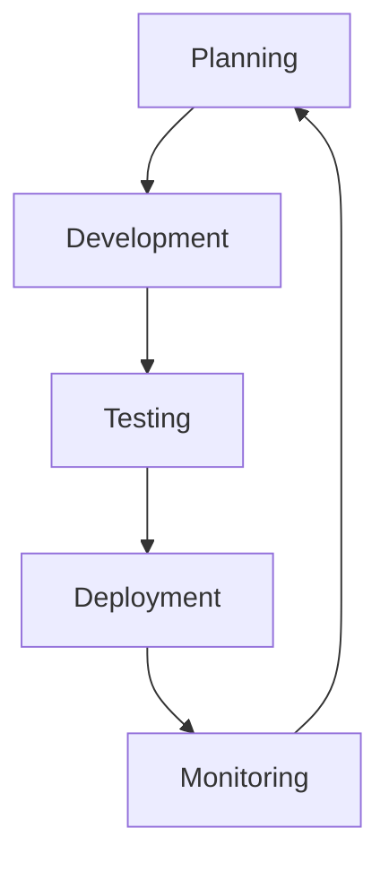
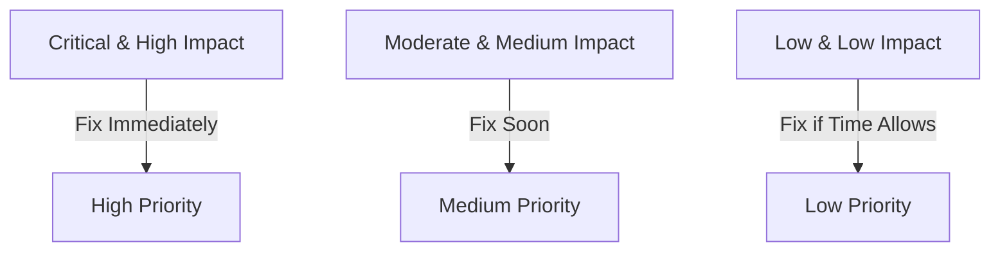

## 11.4.2 Regular Updates and Bug Fixes

In the fast-paced world of mobile app development, maintaining a robust update and bug-fix strategy is crucial for the success of your Flutter app. Regular updates not only enhance user trust and satisfaction but also ensure that your app remains secure and compatible with the latest operating systems and devices. This section will guide you through the importance of regular updates, establishing an effective update schedule, managing bugs efficiently, implementing updates, and monitoring post-update performance.

### Importance of Regular Updates

#### User Trust

Regular updates signal to users that you are committed to maintaining the quality and performance of your app. This builds trust and encourages users to continue using your app, knowing that any issues will be addressed promptly.

#### Security

With the ever-evolving landscape of cybersecurity threats, regular updates are essential to patch vulnerabilities and protect user data. Failing to address security issues can lead to data breaches and loss of user trust.

#### Compatibility

Operating systems and devices are constantly being updated. Regular updates ensure that your app remains functional and optimized for new OS versions and device models, providing a seamless experience for users.

### Establishing an Update Schedule

#### Frequency

Finding the right balance for update frequency is key. Too many updates can overwhelm users, while too few can leave issues unresolved for too long. Consider a schedule that includes monthly minor updates and quarterly major updates, adjusting as necessary based on user feedback and app performance.

#### Types of Updates

- **Minor Updates:** Focus on bug fixes and minor improvements. These updates should be released regularly to address any issues that arise and to make small enhancements to the app's functionality.

- **Major Updates:** Introduce significant new features, redesigns, or performance improvements. These updates require more planning and testing and should be communicated clearly to users.

### Bug Tracking and Management

#### Issue Tracking Tools

Utilize tools like Jira, GitHub Issues, or Trello to track and manage bugs effectively. These platforms allow you to organize, prioritize, and assign tasks, ensuring that nothing falls through the cracks.

#### Prioritizing Bugs

Not all bugs are created equal. Prioritize them based on severity, impact, and frequency. A bug that crashes the app for all users should be addressed before a minor UI glitch affecting a small subset of users.

#### Reproducibility

Documenting the steps to reproduce a bug is crucial for efficient resolution. Ensure that your team can replicate the issue consistently to understand its root cause and implement a fix.

### Implementing Updates

#### Development Practices

Adhere to coding standards and best practices to maintain code quality and reduce the likelihood of introducing new bugs. Regular code reviews and pair programming can help catch issues early in the development process.

#### Version Control

Use Git or a similar version control system to manage code changes. This allows you to track changes, collaborate with team members, and revert to previous versions if necessary.

#### Testing

Testing is a critical component of the update process. Implement both automated and manual testing to ensure that updates do not introduce new issues.

- **Automated Testing:** Use unit tests and integration tests to verify that individual components and the app as a whole function correctly. Flutter's testing framework provides tools for writing and running automated tests.

- **Manual Testing:** Conduct device testing and user acceptance testing to catch issues that automated tests might miss. This is especially important for major updates that introduce new features or redesigns.

```dart
// Example of a simple Flutter unit test
import 'package:flutter_test/flutter_test.dart';
import 'package:my_app/models/counter.dart';

void main() {
  test('Counter value should be incremented', () {
    final counter = Counter();

    counter.increment();

    expect(counter.value, 1);
  });
}
```

### Deployment

#### Staged Rollouts

Consider using staged rollouts to gradually release updates. This approach allows you to monitor for issues and gather user feedback before the update reaches your entire user base.

#### Communication

Communicate updates clearly to users, highlighting the benefits and any new features. Use in-app notifications, release notes, and social media to keep users informed and engaged.

### Monitoring Post-Update

#### Crash Reporting

Implement crash reporting tools like Crashlytics to monitor app stability post-update. These tools provide valuable insights into any issues that arise, allowing you to address them quickly.

#### User Feedback

Encourage users to provide feedback on updates. This can help you identify new issues and areas for improvement, ensuring that future updates continue to enhance the user experience.

### Visual Aids

#### Update Cycle Flowchart

A flowchart can help visualize the update process, from planning and development to deployment and monitoring. This can be a useful tool for your team to understand and follow the update workflow.



#### Bug Triage Matrix

A bug triage matrix can help prioritize bugs based on their severity and impact. This visual aid can assist your team in making informed decisions about which bugs to address first.



#### Screenshots

Include screenshots to demonstrate how to set up automated tests in Flutter. This can provide a visual reference for readers who are new to testing in Flutter.

### Best Practices and Tips

- **Thorough Testing:** Emphasize the importance of thorough testing to prevent introducing new bugs. A well-tested update is less likely to cause issues for users.

- **Clear Documentation:** Document changes clearly for both internal and external use. This helps team members understand the changes and provides users with information about what's new.

- **User Feedback:** Leverage user feedback to inform update priorities. Users can provide valuable insights into what features they want and what issues they are experiencing.

- **Impact on User Perception:** Remember that updates have a significant impact on user perception. A well-executed update can enhance user satisfaction, while a problematic update can lead to frustration and negative reviews.

### Conclusion

Regular updates and bug fixes are essential for maintaining a successful Flutter app. By establishing a consistent update process, prioritizing bugs effectively, and communicating changes clearly to users, you can ensure that your app remains stable, secure, and satisfying for users. Remember to leverage user feedback and monitor post-update performance to continuously improve your app.

## Quiz Time!



### Why are regular updates important for user trust?

- [x] They demonstrate a commitment to app quality and user experience.
- [ ] They allow developers to experiment with new features.
- [ ] They reduce the need for user feedback.
- [ ] They increase app size.

> **Explanation:** Regular updates show users that the developer is committed to maintaining and improving the app, which builds trust and encourages continued use.

### What is a key benefit of addressing security vulnerabilities promptly?

- [x] Protecting user data and maintaining trust.
- [ ] Increasing app download size.
- [ ] Reducing app performance.
- [ ] Decreasing user engagement.

> **Explanation:** Promptly addressing security vulnerabilities helps protect user data, which is crucial for maintaining user trust and preventing data breaches.

### What should be considered when establishing an update schedule?

- [x] Frequency and types of updates.
- [ ] The number of developers on the team.
- [ ] The app's download size.
- [ ] The app's color scheme.

> **Explanation:** When establishing an update schedule, it's important to consider how often updates will be released and what types of updates (minor or major) will be included.

### Which tool can be used for bug tracking and management?

- [x] Jira
- [ ] Photoshop
- [ ] Excel
- [ ] Slack

> **Explanation:** Jira is a popular tool for tracking and managing bugs, allowing teams to organize, prioritize, and assign tasks effectively.

### What is the purpose of a staged rollout?

- [x] To gradually release updates and monitor for issues.
- [ ] To release updates to all users at once.
- [ ] To hide updates from users.
- [ ] To increase app size.

> **Explanation:** A staged rollout allows developers to release updates gradually, monitoring for issues and gathering feedback before the update reaches the entire user base.

### Why is reproducibility important in bug tracking?

- [x] It helps in efficiently resolving issues by understanding their root cause.
- [ ] It increases the complexity of the bug.
- [ ] It makes the bug harder to fix.
- [ ] It reduces the need for documentation.

> **Explanation:** Reproducibility is important because it allows developers to consistently replicate the issue, understand its root cause, and implement an effective fix.

### What type of testing is crucial for ensuring updates do not introduce new issues?

- [x] Automated and manual testing.
- [ ] Only automated testing.
- [ ] Only manual testing.
- [ ] No testing is necessary.

> **Explanation:** Both automated and manual testing are crucial for ensuring that updates do not introduce new issues, as they cover different aspects of the app's functionality.

### What should be included in communication about updates to users?

- [x] Benefits and new features.
- [ ] The app's download size.
- [ ] The number of developers on the team.
- [ ] The app's color scheme.

> **Explanation:** Communication about updates should include the benefits and any new features to inform and engage users.

### What tool can be used for crash reporting?

- [x] Crashlytics
- [ ] Photoshop
- [ ] Excel
- [ ] Slack

> **Explanation:** Crashlytics is a tool used for crash reporting, providing valuable insights into app stability and helping developers address issues quickly.

### True or False: User feedback should be ignored when planning updates.

- [ ] True
- [x] False

> **Explanation:** User feedback should not be ignored; it provides valuable insights into what features users want and what issues they are experiencing, helping inform update priorities.


