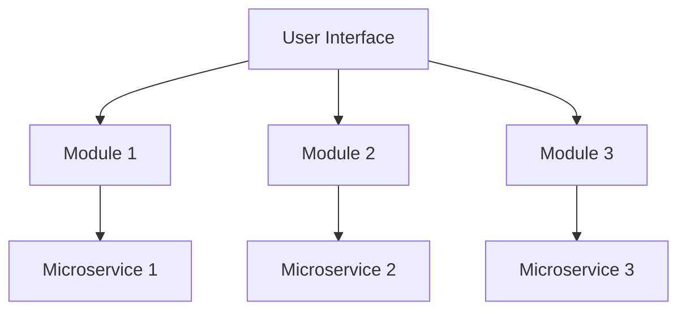
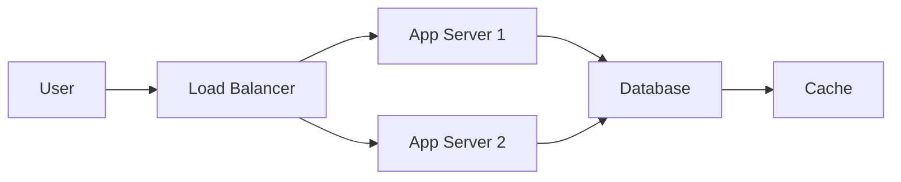

## 11.4.3 Scaling Your App

As you prepare to launch your Flutter app to a wider audience, it's crucial to ensure that your app can handle growth in both users and functionality. This section will guide you through the essential steps to make your app scalable and performant, ensuring a seamless user experience even as your user base expands.

### Understanding Scalability

#### Definition

Scalability refers to your app's ability to handle increased load without a degradation in performance. This involves both the app's architecture and the underlying infrastructure that supports it.

#### Importance

Scalability is vital for maintaining a positive user experience as your app grows. Without proper scalability measures, your app may suffer from slow performance, crashes, or downtime, leading to user dissatisfaction and potential loss of revenue.

### Technical Considerations

#### Architecture Design

A well-designed architecture is the foundation of a scalable app. Consider adopting scalable architectures such as modular or microservices architectures.

- **Modular Architecture:** Break down your app into smaller, independent modules that can be developed, tested, and deployed separately. This approach makes it easier to manage complexity and scale individual components as needed.

- **Microservices Architecture:** For backend services, consider using a microservices architecture where each service is responsible for a specific function. This allows you to scale services independently based on demand.



#### Backend Scalability

Utilize cloud services that support scaling, such as Firebase, AWS, or Google Cloud. These platforms offer tools and services that can help you manage increased load efficiently.

- **Load Balancing:** Distribute incoming network traffic across multiple servers to ensure no single server is overwhelmed.

- **Auto-Scaling:** Automatically adjust the number of active servers based on current demand, ensuring optimal resource utilization.

### Optimizing App Performance

#### Code Efficiency

Writing optimized code is crucial for reducing resource consumption and improving performance. Here are some tips:

- **Avoid Unnecessary Rebuilds:** Use `const` constructors and `ValueNotifier` to minimize widget rebuilds.
- **Optimize Loops and Iterations:** Use efficient data structures and algorithms to reduce processing time.

```dart
// Example of using const constructors to avoid unnecessary rebuilds
class MyWidget extends StatelessWidget {
  const MyWidget({Key? key}) : super(key: key);

  @override
  Widget build(BuildContext context) {
    return const Text('Hello, World!');
  }
}
```

#### Asynchronous Operations

Use `async` and `await` to perform non-blocking operations, ensuring the UI remains responsive.

```dart
Future<void> fetchData() async {
  final response = await http.get(Uri.parse('https://api.example.com/data'));
  if (response.statusCode == 200) {
    // Process data
  } else {
    // Handle error
  }
}
```

#### Data Management

Efficient data management is key to scalability. Implement caching strategies and optimize database queries.

- **Caching:** Use local storage or in-memory caches to reduce the need for repeated network requests.
- **Database Optimization:** Index frequently queried fields and use pagination to manage large datasets.

### Testing for Scalability

#### Stress Testing

Simulate high load scenarios to identify potential bottlenecks in your app. Tools like Apache JMeter or Gatling can help you perform stress tests.

#### Performance Monitoring

Use monitoring tools to track app performance metrics such as response time, error rates, and resource usage. Firebase Performance Monitoring and New Relic are popular options.

### Feature Scaling

#### Modular Development

Develop features in modules to manage complexity and facilitate scaling. This approach allows you to add new features without affecting existing functionality.

#### Feature Flags and Remote Config

Roll out new features incrementally using feature flags and remote config. This allows you to test new features with a subset of users before a full release.

### Infrastructure Considerations

#### Continuous Integration/Continuous Deployment (CI/CD)

Automate your build and deployment processes to improve efficiency and reduce the risk of errors. Tools like Jenkins, GitHub Actions, and GitLab CI/CD can help you set up a robust CI/CD pipeline.

#### Version Control Practices

Use branching strategies, such as Git Flow, to manage codebase growth and facilitate collaboration among team members.

### Planning for Global Expansion

#### Localization

Support multiple languages and cultural contexts to reach a global audience. Use Flutter's localization features to manage translations and adapt your app to different regions.

#### Regional Compliance

Adhere to regulations in different countries, such as GDPR in Europe or CCPA in California. Ensure your app complies with local data protection and privacy laws.

### Visual Aids

#### Architecture Diagrams

Visualize the components of a scalable app architecture using diagrams. This helps you understand the relationships between different parts of your app and identify potential areas for improvement.



#### Code Examples

Provide snippets demonstrating performance optimizations and best practices.

#### Graphs

Illustrate app performance under different load levels using graphs. This helps you identify trends and make informed decisions about scaling.

### Writing Tips

- **Plan for Scalability Early:** Consider scalability from the early stages of development to avoid costly refactoring later.
- **Balance Optimization with Needs:** Avoid premature optimization. Focus on current needs while keeping scalability in mind.
- **Regular Code Reviews and Refactoring:** Conduct regular code reviews to identify areas for improvement and refactor code as needed.
- **Document Scalability Efforts:** Maintain comprehensive documentation of your scalability strategies and decisions to facilitate future development.

By following these guidelines, you can ensure that your Flutter app is prepared to handle growth and deliver a consistent, high-quality user experience as your audience expands.

## Quiz Time!



### What is scalability in the context of app development?

- [x] The app's ability to handle increased load without degradation of performance.
- [ ] The app's ability to run on multiple platforms.
- [ ] The app's ability to integrate with third-party services.
- [ ] The app's ability to support multiple languages.

> **Explanation:** Scalability refers to the app's ability to handle increased load without degradation of performance, ensuring a positive user experience as the user base grows.

### Which architecture is recommended for scalable app development?

- [x] Modular Architecture
- [ ] Monolithic Architecture
- [ ] Layered Architecture
- [ ] Client-Server Architecture

> **Explanation:** Modular architecture is recommended for scalable app development as it allows for independent development, testing, and deployment of app components.

### What is the purpose of load balancing in backend scalability?

- [x] To distribute incoming network traffic across multiple servers.
- [ ] To increase the speed of database queries.
- [ ] To improve the user interface design.
- [ ] To reduce the size of the app bundle.

> **Explanation:** Load balancing distributes incoming network traffic across multiple servers to ensure no single server is overwhelmed, enhancing backend scalability.

### How can asynchronous operations improve app performance?

- [x] By preventing blocking of the UI thread.
- [ ] By reducing the app's memory usage.
- [ ] By increasing the app's download speed.
- [ ] By simplifying the app's code structure.

> **Explanation:** Asynchronous operations prevent blocking of the UI thread, ensuring the app remains responsive during long-running tasks.

### What is a benefit of using feature flags in app development?

- [x] To roll out new features incrementally.
- [ ] To reduce the app's file size.
- [x] To test new features with a subset of users.
- [ ] To improve the app's security.

> **Explanation:** Feature flags allow developers to roll out new features incrementally and test them with a subset of users before a full release.

### Why is it important to conduct stress testing on your app?

- [x] To identify potential bottlenecks under high load scenarios.
- [ ] To improve the app's visual design.
- [ ] To increase the app's download speed.
- [ ] To simplify the app's codebase.

> **Explanation:** Stress testing helps identify potential bottlenecks under high load scenarios, ensuring the app can handle increased traffic.

### What is the role of CI/CD in app scalability?

- [x] To automate build and deployment processes.
- [ ] To reduce the app's memory usage.
- [x] To improve efficiency and reduce errors.
- [ ] To enhance the app's visual design.

> **Explanation:** CI/CD automates build and deployment processes, improving efficiency and reducing errors, which is crucial for scalable app development.

### How does localization contribute to global expansion?

- [x] By supporting multiple languages and cultural contexts.
- [ ] By reducing the app's file size.
- [ ] By increasing the app's download speed.
- [ ] By simplifying the app's code structure.

> **Explanation:** Localization supports multiple languages and cultural contexts, allowing the app to reach a global audience and expand its user base.

### What is the benefit of using caching in data management?

- [x] To reduce the need for repeated network requests.
- [ ] To increase the app's download speed.
- [ ] To improve the app's visual design.
- [ ] To simplify the app's code structure.

> **Explanation:** Caching reduces the need for repeated network requests, improving data management and app performance.

### True or False: Premature optimization should always be avoided in app development.

- [x] True
- [ ] False

> **Explanation:** Premature optimization should be balanced with current needs, focusing on scalability while avoiding unnecessary complexity early in development.


