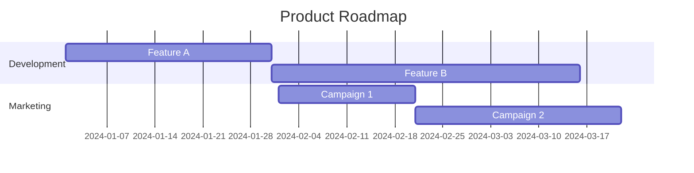
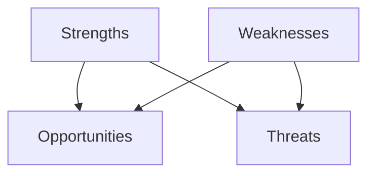

## 11.4.4 Planning for the Future

As you embark on the journey of publishing your Flutter app, it's crucial to think beyond the initial launch. Planning for the future involves setting strategic goals, developing a comprehensive product roadmap, and staying competitive in a rapidly evolving market. This section will guide you through the process of envisioning the long-term direction of your app, ensuring sustained growth and success.

### Setting Long-Term Goals

#### Vision and Mission

The first step in planning for the future is to define the overarching purpose of your app. Your vision and mission statements should articulate the impact you want your app to have and the core values that drive your development efforts.

- **Vision Statement:** A future-oriented declaration of your app's purpose and aspirations. It should inspire and guide your team and users.
- **Mission Statement:** A concise explanation of what your app does, who it serves, and how it stands out in the market.

**Example:**

- **Vision:** "To revolutionize personal finance management by empowering users with intuitive tools and insights."
- **Mission:** "To provide a seamless and secure platform for managing personal finances, helping users achieve financial freedom."

#### SMART Goals

Setting SMART goals ensures that your objectives are clear and attainable. SMART stands for Specific, Measurable, Achievable, Relevant, and Time-bound.

- **Specific:** Clearly define what you want to achieve.
- **Measurable:** Determine how you will measure success.
- **Achievable:** Ensure the goal is realistic given your resources.
- **Relevant:** Align the goal with your vision and mission.
- **Time-bound:** Set a deadline for achieving the goal.

**Example:**

- **Goal:** "Increase active user base by 20% within the next six months through targeted marketing campaigns and feature enhancements."

### Developing a Product Roadmap

A product roadmap is a strategic document that outlines the vision, direction, and progress of your app over time. It helps align your team and stakeholders on the priorities and timelines for future development.

#### Feature Prioritization

Prioritizing features involves aligning new developments with user needs and business objectives. Consider using frameworks like the MoSCoW method (Must have, Should have, Could have, Won't have) to categorize features based on their importance.

#### Timeline Planning

Creating a timeline for releases and milestones helps manage expectations and ensures steady progress. Use Gantt charts or timeline diagrams to visualize your roadmap.

#### Resource Allocation

As your app grows, you may need to expand your team or form partnerships. Plan for necessary resource allocation, including hiring new team members or collaborating with external experts.

### Staying Competitive

#### Market Research

Regularly monitor industry trends and competitor developments to stay ahead. Use tools like Google Trends, industry reports, and competitor analysis to gather insights.

#### Innovation

Embrace new technologies or methodologies to differentiate your app. Consider integrating AI, exploring new platforms, or adopting cutting-edge design practices.

### User Community Building

#### Engagement Strategies

Building a loyal user base involves fostering a sense of community. Consider creating forums, hosting events, or using social media to engage with users.

#### Feedback Loops

Maintain open channels for user input on future directions. Use surveys, feedback forms, and direct communication to gather insights and improve your app.

### Risk Management

#### Identifying Risks

Consider potential challenges like market shifts, technological changes, or regulatory updates. Conduct a SWOT analysis to identify strengths, weaknesses, opportunities, and threats.

#### Mitigation Strategies

Develop plans to address identified risks. This might include diversifying revenue streams, investing in research and development, or forming strategic partnerships.

### Financial Planning

#### Revenue Projections

Estimate future earnings based on growth models. Consider factors like user acquisition costs, retention rates, and monetization strategies.

#### Investment and Funding

Explore opportunities for external funding if needed. This could involve seeking venture capital, applying for grants, or launching crowdfunding campaigns.

### Legal and Compliance Considerations

#### Regulatory Changes

Stay informed about laws affecting your app, such as data privacy regulations or industry-specific compliance requirements.

#### Intellectual Property

Protect your app’s assets through patents or trademarks. Consult with legal experts to ensure your intellectual property is secure.

### Visual Aids

#### Roadmap Templates

Use templates to create strategic product roadmaps that clearly communicate your vision and plans.

#### Goal Setting Frameworks

Illustrate how to set and track SMART goals using frameworks and templates.

### Writing Tips

- **Encourage Adaptability:** Be willing to pivot if necessary based on new information or market changes.
- **Align with User Expectations:** Regularly review and adjust your plans to meet evolving user needs.
- **Think Big, Act Practically:** Inspire your team with ambitious goals while remaining grounded in practical steps.

By strategically planning for the future, you can ensure your Flutter app not only survives but thrives in a competitive market. Regularly review and adjust your plans to stay aligned with your vision and mission, and remain responsive to user feedback and industry trends.

## Quiz Time!



### What is the purpose of a vision statement?

- [x] To articulate the future-oriented purpose and aspirations of the app.
- [ ] To describe the specific features of the app.
- [ ] To outline the technical specifications of the app.
- [ ] To list the team members involved in the app development.

> **Explanation:** A vision statement is a future-oriented declaration of the app's purpose and aspirations, meant to inspire and guide the team and users.

### Which of the following is NOT a component of SMART goals?

- [ ] Specific
- [ ] Measurable
- [ ] Achievable
- [x] Random

> **Explanation:** SMART goals are Specific, Measurable, Achievable, Relevant, and Time-bound. "Random" is not a component of SMART goals.

### What is the MoSCoW method used for?

- [x] Prioritizing features based on their importance.
- [ ] Conducting market research.
- [ ] Developing marketing strategies.
- [ ] Analyzing financial projections.

> **Explanation:** The MoSCoW method is used to prioritize features by categorizing them as Must have, Should have, Could have, and Won't have.

### Why is market research important for staying competitive?

- [x] It helps monitor industry trends and competitor developments.
- [ ] It ensures compliance with legal regulations.
- [ ] It guarantees user satisfaction.
- [ ] It provides funding opportunities.

> **Explanation:** Market research is important for staying competitive as it helps monitor industry trends and competitor developments, allowing the app to adapt and innovate.

### How can you engage with your user community?

- [x] Hosting events and creating forums.
- [ ] Ignoring feedback.
- [ ] Limiting communication.
- [ ] Disabling comments.

> **Explanation:** Engaging with the user community can be done by hosting events, creating forums, and maintaining open communication channels for feedback.

### What is a SWOT analysis used for?

- [x] Identifying strengths, weaknesses, opportunities, and threats.
- [ ] Calculating revenue projections.
- [ ] Developing marketing campaigns.
- [ ] Designing user interfaces.

> **Explanation:** A SWOT analysis is used to identify strengths, weaknesses, opportunities, and threats, helping in strategic planning and risk management.

### What should be considered in financial planning for an app?

- [x] Revenue projections and investment opportunities.
- [ ] Only the initial development costs.
- [ ] The number of team members.
- [ ] The color scheme of the app.

> **Explanation:** Financial planning for an app should consider revenue projections and investment opportunities to ensure long-term sustainability and growth.

### Why is it important to stay informed about regulatory changes?

- [x] To ensure compliance with laws affecting the app.
- [ ] To increase app download speed.
- [ ] To improve app design.
- [ ] To enhance user interface.

> **Explanation:** Staying informed about regulatory changes is important to ensure compliance with laws affecting the app, avoiding legal issues.

### What is the benefit of setting a timeline for releases and milestones?

- [x] It helps manage expectations and ensures steady progress.
- [ ] It guarantees immediate success.
- [ ] It eliminates the need for a team.
- [ ] It reduces the app's features.

> **Explanation:** Setting a timeline for releases and milestones helps manage expectations and ensures steady progress in app development.

### True or False: Intellectual property protection is unnecessary for app development.

- [ ] True
- [x] False

> **Explanation:** Intellectual property protection is necessary for app development to secure the app's assets and prevent unauthorized use or replication.


