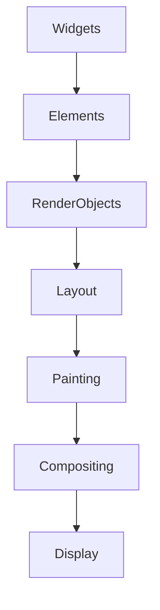

## 12.1.1 Advanced Flutter Concepts

As you delve deeper into Flutter development, mastering advanced concepts will enable you to build more sophisticated and efficient applications. This section introduces you to advanced Flutter topics that go beyond the basics, empowering you to enhance your development skills and create complex, high-performance apps.

### Custom Render Objects

#### Understanding Render Objects

Render objects are the backbone of Flutter's rendering system. They represent a part of the screen and are responsible for layout, painting, hit testing, and accessibility. Unlike widgets, which are immutable, render objects are mutable and manage their own state. This allows for fine-grained control over rendering, making them ideal for performance-critical applications.

#### Creating Custom Render Objects

Creating a custom render object involves extending the `RenderBox` or other render object classes. This allows you to define custom layout and painting logic. Here's a step-by-step guide to creating a simple custom render object:

```dart
class FancyBox extends SingleChildRenderObjectWidget {
  FancyBox({Widget? child}) : super(child: child);

  @override
  RenderObject createRenderObject(BuildContext context) {
    return _RenderFancyBox();
  }
}

class _RenderFancyBox extends RenderProxyBox {
  @override
  void paint(PaintingContext context, Offset offset) {
    // Custom painting code
    final Paint paint = Paint()..color = Colors.blue;
    context.canvas.drawRect(offset & size, paint);
    super.paint(context, offset);
  }
}
```

In this example, `FancyBox` is a custom widget that paints a blue rectangle. The `_RenderFancyBox` class extends `RenderProxyBox` and overrides the `paint` method to draw the rectangle.

#### Use Cases

Custom render objects are beneficial in scenarios where you need highly customized layouts or performance-critical widgets. For example, if you need to create a widget with complex animations or custom drawing logic, a custom render object can provide the necessary control and efficiency.

### Slivers and CustomScrollView

#### Understanding Slivers

Slivers are scrollable areas that can be composed to create complex scrolling effects. They are the building blocks of Flutter's scrolling system and allow for highly customizable scrollable layouts.

#### Implementing Slivers

Flutter provides several built-in slivers, such as `SliverList`, `SliverGrid`, and `SliverAppBar`, which can be used to create common scrolling patterns. Here's an example of using slivers in a `CustomScrollView`:

```dart
CustomScrollView(
  slivers: <Widget>[
    SliverAppBar(
      expandedHeight: 200.0,
      flexibleSpace: FlexibleSpaceBar(
        title: Text('SliverAppBar'),
      ),
    ),
    SliverList(
      delegate: SliverChildBuilderDelegate(
        (BuildContext context, int index) {
          return ListTile(
            title: Text('Item #$index'),
          );
        },
        childCount: 100,
      ),
    ),
  ],
)
```

This example creates a scrollable view with a collapsible app bar and a list of items.

#### Custom Slivers

Creating custom slivers allows you to achieve unique scrolling behaviors. You can extend `RenderSliver` to define custom layout and painting logic for your slivers.

### Gesture Recognition

#### Advanced Gesture Detection

Flutter's gesture detection system allows you to handle complex gestures with ease. It uses a combination of `GestureDetector` widgets and gesture recognizers to detect and respond to user interactions.

#### Creating Custom Gestures

To implement custom gestures, you can extend `GestureRecognizer` and define your own gesture logic. Here's an example of a custom gesture recognizer:

```dart
class CustomTapGestureRecognizer extends TapGestureRecognizer {
  @override
  void handleTapUp({required PointerUpEvent event}) {
    // Custom tap logic
    print('Custom tap detected!');
  }
}
```

This custom recognizer detects tap gestures and prints a message when a tap is detected.

#### Conflict Resolution

When multiple gestures are detected simultaneously, Flutter uses a `GestureArena` to resolve conflicts. You can manage gesture conflicts by using gesture disambiguation techniques, such as specifying gesture priorities or using `GestureDetector`'s `onHorizontalDragStart` and `onVerticalDragStart` callbacks.

### Isolates and Multithreading

#### Understanding Isolates

Isolates are Flutter's way of achieving concurrency. They allow you to perform heavy computations without blocking the UI thread, ensuring a smooth user experience.

#### Using Isolates

You can use the `compute` function to run expensive functions in a separate isolate. Here's an example:

```dart
Future<void> heavyComputation() async {
  int result = await compute(expensiveFunction, 1000000);
  print('Result: $result');
}

int expensiveFunction(int value) {
  // Perform intensive computation
  return value * 2;
}
```

In this example, `expensiveFunction` is executed in a separate isolate, allowing the UI to remain responsive.

#### Example Implementation

For more complex use cases, you can create an isolate manually using the `Isolate` class. This involves setting up message passing between the main isolate and the worker isolate.

### Metaprogramming with Dart

#### Reflection

Reflection in Dart allows you to inspect and manipulate code at runtime. However, due to performance considerations, reflection is limited in Flutter. Instead, code generation is often used to achieve similar results.

#### Code Generation

Code generation in Dart is facilitated by tools like `build_runner` and `source_gen`. These tools allow you to automatically generate code based on annotations, reducing boilerplate and improving maintainability.

#### Annotations and Builders

You can create custom annotations and write builders to generate code. For example, using the `json_serializable` package, you can automatically generate JSON serialization code for your models.

### Visual Aids

#### Flowcharts

Below is a flowchart explaining the rendering pipeline in Flutter:



This flowchart illustrates the process from widgets to the final display on the screen.

#### Annotated Code Samples

Key parts of the code are highlighted to emphasize important concepts and logic.

### Writing Tips

#### Clarity

Ensure explanations are clear and concise, avoiding unnecessary jargon. Use simple language to explain complex concepts.

#### Depth

Provide sufficient detail for readers to grasp advanced concepts. Include examples and explanations to reinforce understanding.

#### Practice

Encourage readers to experiment with code examples to solidify their understanding. Hands-on practice is crucial for mastering advanced topics.

#### Resources

Include references to official documentation and advanced tutorials for further learning. Here are some recommended resources:

- [Flutter Official Documentation](https://flutter.dev/docs)
- [Dart Language Tour](https://dart.dev/guides/language/language-tour)
- [Flutter Advanced Tutorials](https://medium.com/flutter)

By mastering these advanced Flutter concepts, you'll be well-equipped to build complex, high-performance applications that stand out in the app store.

## Quiz Time!



### What is the primary role of render objects in Flutter?

- [x] They handle layout, painting, hit testing, and accessibility.
- [ ] They define the app's navigation structure.
- [ ] They manage the app's state.
- [ ] They provide network connectivity.

> **Explanation:** Render objects are responsible for the rendering process, including layout, painting, hit testing, and accessibility.

### Which class would you extend to create a custom render object?

- [x] RenderBox
- [ ] StatelessWidget
- [ ] StatefulWidget
- [ ] MaterialApp

> **Explanation:** To create a custom render object, you typically extend `RenderBox` or another render object class.

### What are slivers used for in Flutter?

- [x] Creating scrollable areas with complex scrolling effects.
- [ ] Managing app state.
- [ ] Handling network requests.
- [ ] Defining widget styles.

> **Explanation:** Slivers are used to create scrollable areas that can be composed for complex scrolling effects.

### How can you resolve gesture conflicts in Flutter?

- [x] Using GestureArena and gesture disambiguation.
- [ ] By disabling gestures.
- [ ] By using only one gesture at a time.
- [ ] By increasing the gesture priority.

> **Explanation:** Gesture conflicts can be resolved using `GestureArena` and gesture disambiguation techniques.

### What is the purpose of isolates in Flutter?

- [x] To achieve concurrency without blocking the UI thread.
- [ ] To manage app state.
- [ ] To handle network requests.
- [ ] To define widget styles.

> **Explanation:** Isolates allow for concurrency by running tasks in parallel without blocking the UI thread.

### Which tool is commonly used for code generation in Dart?

- [x] build_runner
- [ ] flutter_test
- [ ] dartfmt
- [ ] pub get

> **Explanation:** `build_runner` is a tool used for code generation in Dart, often in conjunction with `source_gen`.

### How can you perform heavy computations without blocking the UI in Flutter?

- [x] Using the compute function or creating an isolate manually.
- [ ] By running computations on the main thread.
- [ ] By using a StatefulWidget.
- [ ] By increasing the app's memory.

> **Explanation:** Heavy computations can be performed in a separate isolate using the `compute` function or by creating an isolate manually.

### What is a limitation of using reflection in Flutter?

- [x] It has performance considerations and is limited.
- [ ] It cannot be used with widgets.
- [ ] It only works on Android.
- [ ] It requires internet access.

> **Explanation:** Reflection in Flutter is limited due to performance considerations, making code generation a preferred alternative.

### Which package can be used for automatic JSON serialization in Dart?

- [x] json_serializable
- [ ] http
- [ ] provider
- [ ] flutter_bloc

> **Explanation:** The `json_serializable` package is used for automatic JSON serialization of models in Dart.

### True or False: Custom render objects are immutable in Flutter.

- [ ] True
- [x] False

> **Explanation:** Custom render objects are mutable, allowing them to manage their own state and rendering logic.


