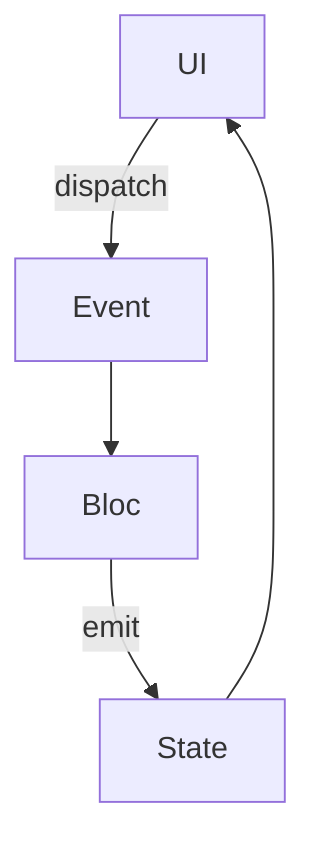

## 12.1.2 State Management Solutions

State management is a cornerstone of modern app development, particularly in Flutter, where the UI is built using a reactive framework. As your application grows in complexity, managing state effectively becomes crucial to ensure a smooth user experience and maintainable codebase. In this section, we will explore various state management solutions available in Flutter, including Provider, Bloc, Redux, and MobX. By understanding these approaches, you will be equipped to choose the most suitable solution for your project needs.

### Overview of State Management

State management refers to the handling of the state of an application, which includes data that can change over time, such as user inputs, UI updates, and network responses. Effective state management ensures that the UI reflects the current state of the application consistently and efficiently.

#### Why State Management is Crucial

1. **Consistency:** Ensures that the UI is always in sync with the underlying data.
2. **Scalability:** Facilitates the management of complex applications by organizing state in a structured manner.
3. **Maintainability:** Simplifies debugging and testing by isolating state changes and their effects.

#### Common Challenges

- **State Propagation:** Ensuring that state changes are efficiently propagated throughout the widget tree.
- **Performance:** Minimizing unnecessary rebuilds and optimizing state updates.
- **Complexity:** Balancing between simplicity and the need for advanced state management features.

### Popular State Management Approaches

#### Provider

Provider is one of the most popular state management solutions in Flutter. It leverages InheritedWidgets to propagate state changes efficiently throughout the widget tree.

##### Concept

Provider uses a combination of InheritedWidgets and ChangeNotifier to manage and propagate state. It allows you to expose a piece of state to the widget tree and listen for changes.

##### Usage

To use Provider, you typically set up a `ChangeNotifierProvider` at the root of your widget tree. You can then access and update the state using `Consumer` or `Provider.of`.

###### Code Example

```dart
import 'package:flutter/material.dart';
import 'package:provider/provider.dart';

class Counter extends ChangeNotifier {
  int _count = 0;

  int get count => _count;

  void increment() {
    _count++;
    notifyListeners();
  }
}

void main() {
  runApp(
    ChangeNotifierProvider(
      create: (context) => Counter(),
      child: MyApp(),
    ),
  );
}

class MyApp extends StatelessWidget {
  @override
  Widget build(BuildContext context) {
    return MaterialApp(
      home: CounterScreen(),
    );
  }
}

class CounterScreen extends StatelessWidget {
  @override
  Widget build(BuildContext context) {
    return Scaffold(
      appBar: AppBar(title: Text('Counter')),
      body: Center(
        child: Consumer<Counter>(
          builder: (context, counter, child) {
            return Text('Count: ${counter.count}');
          },
        ),
      ),
      floatingActionButton: FloatingActionButton(
        onPressed: () => context.read<Counter>().increment(),
        child: Icon(Icons.add),
      ),
    );
  }
}
```

In this example, the `Counter` class extends `ChangeNotifier`, and the `ChangeNotifierProvider` is used to provide an instance of `Counter` to the widget tree. The `Consumer` widget listens for changes and rebuilds when the `count` changes.

#### Bloc (Business Logic Component)

Bloc is a pattern that separates business logic from presentation, making it easier to manage complex state changes.

##### Concept

Bloc uses streams to handle events and states. It provides a clear separation between the UI and business logic, making your code more testable and maintainable.

##### Usage

Bloc involves defining events and states, and using a `Bloc` class to handle these events and emit new states.

###### Code Example

```dart
import 'package:flutter_bloc/flutter_bloc.dart';

// Define Events
abstract class CounterEvent {}

class Increment extends CounterEvent {}

// Define States
abstract class CounterState {
  final int count;
  CounterState(this.count);
}

class CounterInitial extends CounterState {
  CounterInitial() : super(0);
}

class CounterValue extends CounterState {
  CounterValue(int count) : super(count);
}

// Define Bloc
class CounterBloc extends Bloc<CounterEvent, CounterState> {
  CounterBloc() : super(CounterInitial());

  @override
  Stream<CounterState> mapEventToState(CounterEvent event) async* {
    if (event is Increment) {
      yield CounterValue(state.count + 1);
    }
  }
}

// Usage in Widget
class CounterScreen extends StatelessWidget {
  @override
  Widget build(BuildContext context) {
    return BlocProvider(
      create: (context) => CounterBloc(),
      child: Scaffold(
        appBar: AppBar(title: Text('Counter')),
        body: BlocBuilder<CounterBloc, CounterState>(
          builder: (context, state) {
            return Center(
              child: Text('Count: ${state.count}'),
            );
          },
        ),
        floatingActionButton: FloatingActionButton(
          onPressed: () => context.read<CounterBloc>().add(Increment()),
          child: Icon(Icons.add),
        ),
      ),
    );
  }
}
```

In this example, the `CounterBloc` handles `Increment` events and emits new `CounterState` instances. The `BlocProvider` and `BlocBuilder` are used to provide and consume the bloc in the widget tree.

#### Redux

Redux is a predictable state container that follows a unidirectional data flow pattern, making it easier to manage global app state.

##### Concept

Redux involves a single store that holds the entire state of the application. State changes are triggered by dispatching actions, which are processed by reducers to produce a new state.

##### Usage

Redux requires defining actions, reducers, and a store. Widgets can connect to the store to read state and dispatch actions.

###### Code Example

```dart
import 'package:flutter/material.dart';
import 'package:flutter_redux/flutter_redux.dart';
import 'package:redux/redux.dart';

// Define Actions
class IncrementAction {}

// Define Reducer
int counterReducer(int state, dynamic action) {
  if (action is IncrementAction) {
    return state + 1;
  }
  return state;
}

void main() {
  final store = Store<int>(counterReducer, initialState: 0);

  runApp(MyApp(store: store));
}

class MyApp extends StatelessWidget {
  final Store<int> store;

  MyApp({required this.store});

  @override
  Widget build(BuildContext context) {
    return StoreProvider<int>(
      store: store,
      child: MaterialApp(
        home: CounterScreen(),
      ),
    );
  }
}

class CounterScreen extends StatelessWidget {
  @override
  Widget build(BuildContext context) {
    return Scaffold(
      appBar: AppBar(title: Text('Counter')),
      body: StoreConnector<int, int>(
        converter: (store) => store.state,
        builder: (context, count) {
          return Center(
            child: Text('Count: $count'),
          );
        },
      ),
      floatingActionButton: StoreConnector<int, VoidCallback>(
        converter: (store) {
          return () => store.dispatch(IncrementAction());
        },
        builder: (context, callback) {
          return FloatingActionButton(
            onPressed: callback,
            child: Icon(Icons.add),
          );
        },
      ),
    );
  }
}
```

In this example, the `counterReducer` processes `IncrementAction` to update the state. The `StoreProvider` and `StoreConnector` are used to connect the Redux store to the widget tree.

#### MobX

MobX is a state management library that leverages reactive programming to manage state changes efficiently.

##### Concept

MobX uses observable state, actions, and reactions to automatically update the UI when state changes. It provides a simple and intuitive API for managing state.

##### Usage

MobX requires defining observable variables, actions to modify them, and reactions to respond to changes.

###### Code Example

```dart
import 'package:flutter/material.dart';
import 'package:flutter_mobx/flutter_mobx.dart';
import 'package:mobx/mobx.dart';

// Include generated file
part 'counter.g.dart';

// This is the class used by rest of your codebase
class Counter = _Counter with _$Counter;

// The store-class
abstract class _Counter with Store {
  @observable
  int count = 0;

  @action
  void increment() {
    count++;
  }
}

void main() {
  final counter = Counter();

  runApp(MyApp(counter: counter));
}

class MyApp extends StatelessWidget {
  final Counter counter;

  MyApp({required this.counter});

  @override
  Widget build(BuildContext context) {
    return MaterialApp(
      home: CounterScreen(counter: counter),
    );
  }
}

class CounterScreen extends StatelessWidget {
  final Counter counter;

  CounterScreen({required this.counter});

  @override
  Widget build(BuildContext context) {
    return Scaffold(
      appBar: AppBar(title: Text('Counter')),
      body: Center(
        child: Observer(
          builder: (_) => Text('Count: ${counter.count}'),
        ),
      ),
      floatingActionButton: FloatingActionButton(
        onPressed: counter.increment,
        child: Icon(Icons.add),
      ),
    );
  }
}
```

In this example, the `Counter` class uses MobX annotations to define observable state and actions. The `Observer` widget listens for changes and rebuilds the UI accordingly.

### Comparing State Management Solutions

#### Performance

- **Provider:** Efficient for small to medium-sized applications. Uses InheritedWidgets to minimize rebuilds.
- **Bloc:** Streams provide efficient state updates, suitable for complex applications.
- **Redux:** Can be less performant due to global state updates, but middleware can optimize performance.
- **MobX:** Reactive updates are efficient, but performance can degrade with large observable trees.

#### Complexity

- **Provider:** Simple to set up and use, with a gentle learning curve.
- **Bloc:** More complex due to the need to manage events and states, but offers clear separation of concerns.
- **Redux:** High complexity due to boilerplate code and global state management.
- **MobX:** Moderate complexity, with a focus on reactive programming.

#### Community and Support

- **Provider:** Strong community support and extensive documentation.
- **Bloc:** Popular with a robust community and comprehensive resources.
- **Redux:** Well-established with a large ecosystem and community.
- **MobX:** Growing community with good documentation and examples.

### Choosing the Right Solution

Selecting the right state management solution depends on your project requirements and team expertise. Here are some guidelines:

- **Provider:** Ideal for small to medium-sized projects where simplicity and ease of use are priorities.
- **Bloc:** Suitable for large, complex applications that require clear separation of business logic and presentation.
- **Redux:** Best for projects that need a predictable state container with a unidirectional data flow.
- **MobX:** Great for applications that benefit from reactive programming and automatic UI updates.

### Visual Aids

#### Diagrams

Below is a diagram illustrating the data flow in the Bloc pattern:



#### Comparison Table

| Solution | Performance | Complexity | Community Support |
|----------|-------------|------------|-------------------|
| Provider | High        | Low        | Strong            |
| Bloc     | High        | Medium     | Robust            |
| Redux    | Medium      | High       | Established       |
| MobX     | High        | Medium     | Growing           |

### Practical Advice

- **Combine Solutions:** In some cases, combining multiple state management solutions can provide the best results. For example, using Provider for simple state management and Bloc for complex business logic.
- **Experiment:** Try different patterns to find the best fit for your project. Each solution has its strengths and weaknesses, and the best choice depends on your specific needs.

## Quiz Time!



### Why is state management crucial in app development?

- [x] Ensures UI consistency and maintainability
- [ ] Increases app size
- [ ] Reduces code complexity
- [ ] Eliminates the need for testing

> **Explanation:** State management ensures that the UI is consistent with the underlying data, making the app more maintainable.

### Which Flutter state management solution uses InheritedWidgets?

- [x] Provider
- [ ] Bloc
- [ ] Redux
- [ ] MobX

> **Explanation:** Provider uses InheritedWidgets to propagate state changes efficiently.

### What is a key feature of the Bloc pattern?

- [x] Separation of business logic from presentation
- [ ] Global state management
- [ ] Reactive programming
- [ ] Direct state mutation

> **Explanation:** Bloc separates business logic from presentation, making the code more testable and maintainable.

### In Redux, what is the role of reducers?

- [x] Process actions to produce a new state
- [ ] Dispatch actions to the store
- [ ] Connect state to widgets
- [ ] Manage streams

> **Explanation:** Reducers process actions and return a new state based on the action.

### Which state management solution is known for its unidirectional data flow?

- [x] Redux
- [ ] Provider
- [ ] Bloc
- [ ] MobX

> **Explanation:** Redux follows a unidirectional data flow pattern, where state changes are triggered by actions.

### What does MobX use to automatically update the UI?

- [x] Observables
- [ ] Streams
- [ ] Actions
- [ ] Reducers

> **Explanation:** MobX uses observables to automatically update the UI when state changes.

### Which state management solution is ideal for small to medium-sized projects?

- [x] Provider
- [ ] Bloc
- [ ] Redux
- [ ] MobX

> **Explanation:** Provider is simple to set up and use, making it ideal for small to medium-sized projects.

### What is a common challenge in state management?

- [x] State propagation
- [ ] Increasing app size
- [ ] Reducing code complexity
- [ ] Eliminating the need for testing

> **Explanation:** Ensuring that state changes are efficiently propagated throughout the widget tree is a common challenge.

### Which solution is best for projects that benefit from reactive programming?

- [x] MobX
- [ ] Provider
- [ ] Bloc
- [ ] Redux

> **Explanation:** MobX leverages reactive programming to manage state changes efficiently.

### True or False: Combining multiple state management solutions can sometimes provide the best results.

- [x] True
- [ ] False

> **Explanation:** Combining multiple solutions can leverage the strengths of each to better meet project needs.


