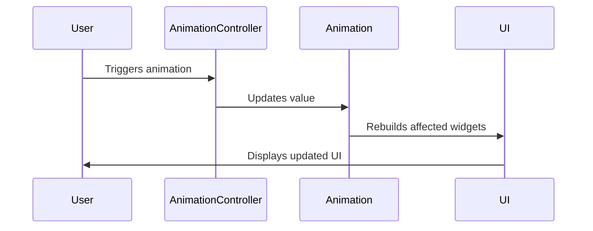

## 12.1.3 Animations and Custom Transitions

Animations play a crucial role in enhancing the user experience of mobile applications. They can guide users' attention, provide visual feedback, and make interactions feel more natural. In this section, we will delve into advanced animation techniques in Flutter, focusing on Animation Controllers, Tweens, Staggered Animations, and Custom Transitions. By the end of this chapter, you'll be equipped to create visually appealing and smooth animations that elevate your app's user experience.

### Advanced Animation Concepts

#### Animation Controllers and Tweens

At the heart of Flutter's animation system are `AnimationController` and `Tween`. These components allow you to define the behavior and timing of animations.

**AnimationController** is a special type of `Animation` object that generates a new value whenever the hardware is ready for a new frame. It controls the animation's duration and provides methods to start, stop, and reverse animations.

**Tween**, short for "in-between", defines a range of values that an animation can take. It interpolates between the start and end values over the duration of the animation.

Here's a basic example of using `AnimationController` and `Tween`:

```dart
class SimpleAnimation extends StatefulWidget {
  @override
  _SimpleAnimationState createState() => _SimpleAnimationState();
}

class _SimpleAnimationState extends State<SimpleAnimation> with SingleTickerProviderStateMixin {
  late AnimationController _controller;
  late Animation<double> _animation;

  @override
  void initState() {
    super.initState();
    _controller = AnimationController(
      duration: const Duration(seconds: 2),
      vsync: this,
    );

    _animation = Tween<double>(begin: 0, end: 300).animate(_controller);

    _controller.forward();
  }

  @override
  Widget build(BuildContext context) {
    return AnimatedBuilder(
      animation: _animation,
      builder: (context, child) {
        return Container(
          width: _animation.value,
          height: _animation.value,
          color: Colors.blue,
        );
      },
    );
  }

  @override
  void dispose() {
    _controller.dispose();
    super.dispose();
  }
}
```

In this example, the `AnimationController` runs for 2 seconds, and the `Tween` interpolates the size of a square from 0 to 300.

#### Staggered Animations

Staggered animations involve sequencing multiple animations to create a coordinated effect. This can be particularly useful for animating complex UI elements that consist of multiple parts.

To implement staggered animations, you can use multiple `Animation` objects and control their start times using `Interval`.

```dart
class StaggerDemo extends StatefulWidget {
  @override
  _StaggerDemoState createState() => _StaggerDemoState();
}

class _StaggerDemoState extends State<StaggerDemo> with SingleTickerProviderStateMixin {
  late AnimationController _controller;
  late Animation<double> _opacity;
  late Animation<double> _width;
  late Animation<double> _height;

  @override
  void initState() {
    super.initState();
    _controller = AnimationController(
      duration: const Duration(seconds: 3),
      vsync: this,
    );

    _opacity = Tween<double>(begin: 0, end: 1).animate(
      CurvedAnimation(
        parent: _controller,
        curve: Interval(0.0, 0.5, curve: Curves.easeIn),
      ),
    );

    _width = Tween<double>(begin: 50, end: 200).animate(
      CurvedAnimation(
        parent: _controller,
        curve: Interval(0.5, 0.75, curve: Curves.easeIn),
      ),
    );

    _height = Tween<double>(begin: 50, end: 200).animate(
      CurvedAnimation(
        parent: _controller,
        curve: Interval(0.75, 1.0, curve: Curves.easeIn),
      ),
    );

    _controller.forward();
  }

  @override
  Widget build(BuildContext context) {
    return AnimatedBuilder(
      animation: _controller,
      builder: (context, child) {
        return Opacity(
          opacity: _opacity.value,
          child: Container(
            width: _width.value,
            height: _height.value,
            color: Colors.blue,
          ),
        );
      },
    );
  }

  @override
  void dispose() {
    _controller.dispose();
    super.dispose();
  }
}
```

In this example, the opacity, width, and height of a container are animated in sequence, creating a staggered effect.

#### AnimationBuilder Widgets

Flutter provides several widgets to simplify the process of building animations. Two of the most commonly used are `AnimatedBuilder` and `AnimatedWidget`.

- **AnimatedBuilder**: This widget separates the animation logic from the widget tree, resulting in cleaner code. It rebuilds only the parts of the widget tree that depend on the animation.

- **AnimatedWidget**: This is a base class for widgets that need to be animated. It reduces the boilerplate code by handling the `addListener` and `setState` calls internally.

Here's an example using `AnimatedBuilder`:

```dart
class AnimatedBuilderExample extends StatelessWidget {
  final Animation<double> animation;

  AnimatedBuilderExample({required this.animation});

  @override
  Widget build(BuildContext context) {
    return AnimatedBuilder(
      animation: animation,
      builder: (context, child) {
        return Transform.scale(
          scale: animation.value,
          child: child,
        );
      },
      child: Container(
        width: 100,
        height: 100,
        color: Colors.red,
      ),
    );
  }
}
```

### Implementing Custom Page Transitions

Custom page transitions can significantly enhance the navigation experience in your app. Flutter allows you to define custom transitions by extending `PageRoute` and overriding the `buildTransitions` method.

#### Custom Route Transitions

To create a custom route transition, you can extend `PageRouteBuilder` and define your transition in the `transitionsBuilder` method.

```dart
class SlidePageRoute extends PageRouteBuilder {
  final Widget page;

  SlidePageRoute({required this.page})
      : super(
          pageBuilder: (context, animation, secondaryAnimation) => page,
          transitionsBuilder: (context, animation, secondaryAnimation, child) {
            var begin = Offset(1.0, 0.0);
            var end = Offset.zero;
            var tween = Tween(begin: begin, end: end);
            var offsetAnimation = animation.drive(tween);

            return SlideTransition(
              position: offsetAnimation,
              child: child,
            );
          },
        );
}
```

In this example, the new page slides in from the right. You can customize the `begin` and `end` offsets to achieve different slide directions.

#### Shared Element Transitions

Shared element transitions, also known as hero animations, create a seamless transition between two screens by animating a shared element. This is achieved using the `Hero` widget.

```dart
Hero(
  tag: 'hero-tag',
  child: Image.network('https://example.com/image.jpg'),
)
```

To implement a hero animation, wrap the shared element on both screens with a `Hero` widget and provide a unique `tag`.

#### Custom Transition Animations

Beyond slide transitions, you can create custom animations like fade, scale, or a combination of effects.

**Fade Transition:**

```dart
class FadePageRoute extends PageRouteBuilder {
  final Widget page;

  FadePageRoute({required this.page})
      : super(
          pageBuilder: (context, animation, secondaryAnimation) => page,
          transitionsBuilder: (context, animation, secondaryAnimation, child) {
            return FadeTransition(
              opacity: animation,
              child: child,
            );
          },
        );
}
```

**Scale Transition:**

```dart
class ScalePageRoute extends PageRouteBuilder {
  final Widget page;

  ScalePageRoute({required this.page})
      : super(
          pageBuilder: (context, animation, secondaryAnimation) => page,
          transitionsBuilder: (context, animation, secondaryAnimation, child) {
            var scaleAnimation = Tween<double>(begin: 0.0, end: 1.0).animate(animation);
            return ScaleTransition(
              scale: scaleAnimation,
              child: child,
            );
          },
        );
}
```

### Animation Libraries

Flutter's ecosystem includes several libraries that simplify the creation of complex animations.

#### Using Packages

- **animated_builder**: This package provides additional widgets and utilities for building animations.
- **flutter_sequence_animation**: Allows you to create complex animations by sequencing multiple animations.
- **flare_flutter**: Integrates Flare (now Rive) animations, enabling you to use vector animations created in the Rive editor.

#### Integrating Flare Animations

Flare (Rive) is a powerful tool for creating vector animations. You can integrate Flare animations into your Flutter app using the `flare_flutter` package.

```yaml
dependencies:
  flare_flutter: ^3.0.0
```

To use a Flare animation, add a `.flr` file to your assets and use the `FlareActor` widget:

```dart
FlareActor(
  "assets/animation.flr",
  animation: "animation_name",
)
```

### Best Practices for Animations

#### Performance Optimization

To ensure smooth animations, consider the following tips:

- **Minimize Rebuilds**: Use `AnimatedBuilder` and `AnimatedWidget` to minimize unnecessary rebuilds.
- **Profile Your App**: Use Flutter's performance profiling tools to identify and address performance bottlenecks.
- **Optimize Asset Sizes**: Reduce the size of image and animation assets to improve load times.

#### User Experience Considerations

Animations should enhance the user experience, not distract from it. Here are some guidelines:

- **Subtlety**: Use subtle animations to guide users' attention without overwhelming them.
- **Purpose**: Ensure animations have a clear purpose, such as providing feedback or indicating a state change.
- **Consistency**: Maintain consistency in animation styles and durations throughout your app.

### Visual Aids

To better understand the flow of staggered animations, consider the following sequence diagram:



### Conclusion

Animations and custom transitions are powerful tools for creating engaging and intuitive user interfaces in Flutter. By mastering these techniques, you can significantly enhance the visual appeal and usability of your app. Remember to test your animations on real devices to ensure they perform smoothly and meet user expectations.

## Quiz Time!



### What is the role of an AnimationController in Flutter?

- [x] It controls the duration and timing of animations.
- [ ] It defines the range of values for animations.
- [ ] It provides pre-built animations.
- [ ] It is used to create vector animations.

> **Explanation:** AnimationController is responsible for controlling the duration and timing of animations in Flutter.

### Which widget helps in separating animation logic from the widget tree?

- [x] AnimatedBuilder
- [ ] AnimatedWidget
- [ ] AnimationController
- [ ] Tween

> **Explanation:** AnimatedBuilder separates the animation logic from the widget tree, resulting in cleaner code.

### How can you create a staggered animation in Flutter?

- [x] By using multiple Animation objects with different Intervals.
- [ ] By using a single Animation object.
- [ ] By using a Tween with different begin and end values.
- [ ] By using a Hero widget.

> **Explanation:** Staggered animations are created using multiple Animation objects with different Intervals to sequence the animations.

### What is the purpose of a Tween in Flutter animations?

- [x] It defines a range of values that an animation can take.
- [ ] It controls the duration of an animation.
- [ ] It provides pre-built animations.
- [ ] It is used for creating custom page transitions.

> **Explanation:** Tween defines the range of values that an animation can interpolate between.

### Which package is used for integrating vector animations created in Rive?

- [x] flare_flutter
- [ ] animated_builder
- [ ] flutter_sequence_animation
- [ ] animation_controller

> **Explanation:** The flare_flutter package is used for integrating vector animations created in Rive.

### What is a key consideration for ensuring smooth animations?

- [x] Minimizing rebuilds
- [ ] Using large image assets
- [ ] Increasing animation duration
- [ ] Using complex animations

> **Explanation:** Minimizing rebuilds is crucial for ensuring smooth animations by reducing unnecessary processing.

### How can you implement a custom slide transition in Flutter?

- [x] By extending PageRouteBuilder and overriding transitionsBuilder.
- [ ] By using a Tween with different begin and end values.
- [ ] By using a Hero widget.
- [ ] By using AnimatedBuilder.

> **Explanation:** Custom slide transitions can be implemented by extending PageRouteBuilder and defining the transition in transitionsBuilder.

### What is the benefit of using AnimatedWidget?

- [x] It reduces boilerplate code by handling addListener and setState internally.
- [ ] It separates animation logic from the widget tree.
- [ ] It controls the duration of animations.
- [ ] It defines a range of values for animations.

> **Explanation:** AnimatedWidget reduces boilerplate code by handling addListener and setState internally, simplifying the animation process.

### Which of the following is a best practice for animations?

- [x] Ensuring animations have a clear purpose.
- [ ] Using animations for every UI change.
- [ ] Making animations as complex as possible.
- [ ] Using large assets for animations.

> **Explanation:** Ensuring animations have a clear purpose is a best practice to enhance user experience without overwhelming users.

### True or False: Shared element transitions are implemented using the Hero widget.

- [x] True
- [ ] False

> **Explanation:** Shared element transitions, also known as hero animations, are implemented using the Hero widget to create seamless transitions between screens.


