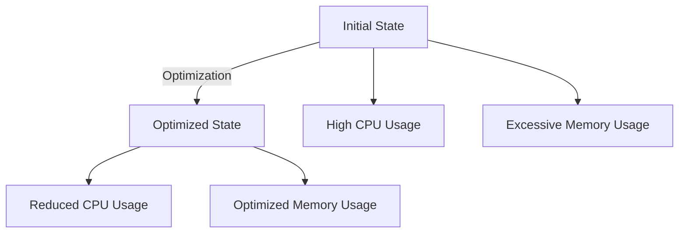

## 12.1.4 Performance Optimization

In the competitive world of mobile applications, performance is a key differentiator that can significantly impact user satisfaction and retention. Flutter, with its expressive UI and fast development cycle, provides a robust platform for building high-performance apps. However, to fully leverage Flutter's capabilities, developers must be adept at optimizing their apps for smooth and efficient operation. This section will guide you through the essential strategies for performance optimization in Flutter apps, ensuring your app not only meets but exceeds user expectations.

### Identifying Performance Bottlenecks

Before diving into optimization techniques, it's crucial to identify where your app's performance may be lacking. Performance bottlenecks can arise from various sources, including inefficient rendering, excessive computations, or memory mismanagement.

#### Using Flutter DevTools

Flutter DevTools is an indispensable tool for profiling and diagnosing performance issues in your app. It provides a suite of features to monitor CPU usage, memory allocation, and rendering performance.

- **Performance Tab**: This tab allows you to record and analyze the performance of your app. You can capture a timeline trace to visualize the execution of frames and identify jank (frame drops) or slow frames.

- **CPU Profiler**: Use the CPU profiler to identify functions that consume excessive CPU time. This can help pinpoint areas of your code that require optimization.

- **Memory Profiler**: Monitor memory usage to detect leaks and excessive allocations. The memory profiler provides a real-time view of memory consumption and helps identify objects that are not being properly disposed of.

#### Common Issues

- **Excessive Widget Rebuilds**: Flutter's UI is built using widgets, and excessive rebuilds can lead to performance degradation. Identifying and reducing unnecessary rebuilds is crucial for maintaining smooth performance.

- **Heavy Computations on the Main Thread**: Performing intensive computations on the main thread can block the UI and lead to jank. Offloading these tasks to background threads or isolates is essential.

- **Memory Leaks**: Failing to dispose of resources such as controllers, streams, or listeners can lead to memory leaks, which degrade performance over time.

### Optimizing Rendering Performance

Rendering performance is a critical aspect of app performance, as it directly affects how smooth and responsive your app feels to users.

#### Widget Build Optimization

- **Use `const` Constructors**: Wherever possible, use `const` constructors for widgets. This allows Flutter to reuse instances of widgets, reducing the need for rebuilds.

  ```dart
  class MyWidget extends StatelessWidget {
    final Widget child;

    const MyWidget({Key? key, required this.child}) : super(key: key);

    @override
    Widget build(BuildContext context) {
      return Container(
        child: child,
      );
    }
  }
  ```

- **Avoid Unnecessary Rebuilds**: Use state management solutions like `Provider`, `ValueListenableBuilder`, or memoization techniques to minimize rebuilds. For instance, `Provider` can efficiently manage state and notify only the parts of the UI that need updating.

- **Employ `RepaintBoundary`**: Use `RepaintBoundary` to isolate parts of the widget tree that should not repaint unnecessarily. This can significantly reduce the rendering workload.

  ```dart
  RepaintBoundary(
    child: ComplexWidget(),
  )
  ```

#### Image and Asset Management

- **Optimize Image Sizes**: Ensure that images are appropriately sized for the target device. Use tools to compress and resize images to reduce memory usage and improve load times.

- **Use `cached_network_image`**: For network images, use the `cached_network_image` package to cache images locally, reducing network requests and improving performance.

### Efficient Animations

Animations enhance the user experience but can also be a source of performance issues if not implemented efficiently.

#### Hardware Acceleration

- **Ensure GPU Acceleration**: Flutter automatically uses GPU acceleration for animations, but ensure that your animations are simple enough to be handled efficiently by the GPU.

#### Avoiding Jank

- **Keep Animation Computations Lightweight**: Avoid performing heavy computations during animations. Use precomputed values or lightweight calculations to ensure smooth animations.

### Asynchronous Programming

Efficient asynchronous programming is essential for maintaining a responsive UI, especially when dealing with network requests or heavy computations.

#### Using Isolates

- **Offload Heavy Tasks**: Use isolates to run heavy computations in parallel without blocking the main thread. This is particularly useful for tasks like data parsing or image processing.

#### Efficient Data Handling

- **Streamline Data Fetching and Parsing**: Use asynchronous methods to fetch and parse data. Consider using packages like `dio` for efficient HTTP requests and `json_serializable` for parsing JSON data.

### Memory Management

Effective memory management ensures that your app runs efficiently without consuming excessive resources.

#### Avoid Memory Leaks

- **Dispose of Controllers and Streams**: Always dispose of controllers, streams, and other resources when they are no longer needed. This prevents memory leaks and ensures that resources are freed up.

#### Profiling Memory Usage

- **Use DevTools**: Monitor memory usage with Flutter DevTools to identify leaks and excessive allocations. The memory profiler provides insights into memory consumption patterns and helps identify problematic areas.

### App Size Reduction

Reducing the size of your app can improve load times and reduce storage requirements, enhancing the overall user experience.

#### Code Shrinking and Obfuscation

- **Use `flutter build` with `--split-debug-info` and `--obfuscate`**: These options reduce the size of your app by removing unused code and obfuscating the remaining code to protect it from reverse engineering.

#### Asset Optimization

- **Remove Unused Assets**: Regularly audit your assets and remove any that are not used in the app. This reduces the app size and improves load times.

### Visual Aids

#### Performance Charts

Visualizing performance metrics before and after optimization can provide valuable insights into the effectiveness of your efforts. Use charts to compare CPU usage, memory consumption, and frame rates.



#### Screenshots of DevTools

Include screenshots of Flutter DevTools highlighting key areas for performance monitoring, such as the timeline view, CPU profiler, and memory profiler.

### Writing Tips

#### Actionable Advice

Provide clear, actionable steps that readers can follow to optimize their apps. For example, guide them through setting up and using Flutter DevTools, or demonstrate how to implement `RepaintBoundary` in their widget trees.

#### Real-World Examples

Reference case studies or experiences from actual app optimizations to illustrate the impact of performance improvements. Share insights from developers who have successfully optimized their apps.

#### Caveats

Warn readers about potential pitfalls, such as over-optimization, which can lead to code complexity without significant performance gains. Encourage a balanced approach that prioritizes user experience.

## Quiz Time!



### What tool can you use to profile and diagnose performance issues in Flutter apps?

- [x] Flutter DevTools
- [ ] Android Studio
- [ ] Xcode
- [ ] Visual Studio Code

> **Explanation:** Flutter DevTools is specifically designed for profiling and diagnosing performance issues in Flutter apps, offering features such as CPU and memory profiling.

### Which of the following can help reduce unnecessary widget rebuilds?

- [x] Using `const` constructors
- [x] Using `Provider` for state management
- [ ] Using `setState` excessively
- [ ] Avoiding `RepaintBoundary`

> **Explanation:** `const` constructors and `Provider` help reduce unnecessary rebuilds by optimizing widget creation and state management.

### What is the benefit of using `RepaintBoundary` in Flutter?

- [x] It isolates parts of the widget tree to prevent unnecessary repaints.
- [ ] It increases the size of the widget tree.
- [ ] It decreases the performance of the app.
- [ ] It is used for debugging purposes only.

> **Explanation:** `RepaintBoundary` helps optimize rendering performance by isolating parts of the widget tree, reducing the workload during repaints.

### How can you ensure animations are GPU-accelerated in Flutter?

- [x] By keeping animations simple and lightweight
- [ ] By using only CPU for animations
- [ ] By increasing the complexity of animations
- [ ] By disabling hardware acceleration

> **Explanation:** Keeping animations simple and lightweight ensures they can be efficiently handled by the GPU, enhancing performance.

### What is the purpose of using isolates in Flutter?

- [x] To offload heavy tasks and avoid blocking the UI thread
- [ ] To increase the complexity of the main thread
- [ ] To decrease app performance
- [ ] To simplify asynchronous programming

> **Explanation:** Isolates allow heavy tasks to run in parallel, preventing them from blocking the UI thread and maintaining app responsiveness.

### How can you avoid memory leaks in Flutter?

- [x] By disposing of controllers and streams properly
- [ ] By keeping all resources active
- [ ] By avoiding the use of streams
- [ ] By increasing memory allocation

> **Explanation:** Properly disposing of controllers and streams ensures resources are freed up, preventing memory leaks.

### What command options can you use to reduce app size in Flutter?

- [x] `--split-debug-info`
- [x] `--obfuscate`
- [ ] `--increase-size`
- [ ] `--disable-optimization`

> **Explanation:** The `--split-debug-info` and `--obfuscate` options help reduce app size by removing unused code and obfuscating the remaining code.

### Why is it important to optimize image sizes in Flutter apps?

- [x] To reduce memory usage and improve load times
- [ ] To increase the size of the app
- [ ] To decrease performance
- [ ] To complicate asset management

> **Explanation:** Optimizing image sizes reduces memory usage and improves load times, enhancing overall app performance.

### What can be a potential pitfall of over-optimization?

- [x] Increased code complexity without significant performance gains
- [ ] Improved performance in all cases
- [ ] Simplified codebase
- [ ] Reduced app size

> **Explanation:** Over-optimization can lead to increased code complexity without yielding significant performance improvements, making maintenance more difficult.

### True or False: Using `cached_network_image` can help improve performance for network images.

- [x] True
- [ ] False

> **Explanation:** `cached_network_image` caches images locally, reducing network requests and improving performance for network images.


