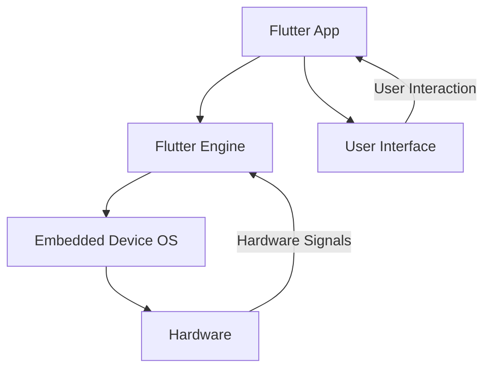

## 12.2.3 Flutter for Embedded Devices

As Flutter continues to grow in popularity for mobile and web applications, its potential for embedded devices opens up exciting new opportunities. This section explores how Flutter can be harnessed for embedded systems, such as IoT devices, kiosks, automotive interfaces, and more. By the end of this chapter, you will have a comprehensive understanding of how to set up, build, and deploy Flutter applications on embedded hardware.

### Understanding Embedded Flutter

#### Use Cases

Flutter's versatility extends beyond mobile and web applications, making it a compelling choice for embedded systems. Here are some prominent use cases:

- **Kiosks:** Interactive kiosks in retail or information centers can benefit from Flutter's rich UI capabilities, providing seamless and engaging user experiences.
- **Automotive Interfaces:** Flutter can power infotainment systems in vehicles, offering customizable and responsive interfaces.
- **Smart Appliances:** From smart refrigerators to washing machines, Flutter can enhance user interaction with household appliances.
- **IoT Devices:** Flutter can be used to create control panels and dashboards for IoT devices, enabling real-time data visualization and interaction.

#### Supported Hardware

While Flutter is traditionally associated with mobile and web platforms, it can also run on various embedded devices. One of the most popular platforms for experimenting with embedded Flutter is the **Raspberry Pi**. This affordable and versatile single-board computer provides a great starting point for developers looking to explore Flutter on embedded systems.

### Setting Up for Embedded Development

#### Hardware Requirements

To get started with Flutter on embedded devices, you will need the following hardware components:

- **Raspberry Pi:** A Raspberry Pi 3 or 4 is recommended due to their processing power and support for Flutter.
- **MicroSD Card:** A high-speed microSD card (16GB or larger) to install the operating system and store your Flutter application.
- **Power Supply:** A reliable power supply for the Raspberry Pi.
- **Display and Input Devices:** A monitor, keyboard, and mouse for interacting with the Raspberry Pi.
- **Network Connectivity:** Ethernet or Wi-Fi for internet access and remote development.

#### Compiler Toolchains

Setting up a cross-compilation environment is crucial for building Flutter applications for embedded devices. Cross-compilation allows you to compile code on your development machine for execution on a different architecture (e.g., ARM for Raspberry Pi).

##### Setting Up Cross-Compilation

1. **Install Required Tools:** Ensure you have the necessary tools installed on your development machine, such as `gcc`, `make`, and `cmake`.
2. **Download Toolchain:** Obtain a cross-compilation toolchain for your target device. For Raspberry Pi, you can use the `arm-linux-gnueabihf` toolchain.
3. **Configure Environment:** Set up environment variables to point to the cross-compilation tools. This typically involves setting paths for the compiler and linker.

```bash
export CC=/path/to/arm-linux-gnueabihf-gcc
export CXX=/path/to/arm-linux-gnueabihf-g++
```

### Building for Embedded Devices

#### Custom Engine Builds

To run Flutter on an embedded device, you may need to compile a custom version of the Flutter engine tailored to your hardware's architecture. This process involves several steps:

1. **Clone the Flutter Engine Repository:** Start by cloning the Flutter engine source code from the official repository.

```bash
git clone https://github.com/flutter/engine.git
```

2. **Configure the Build:** Use the `gn` tool to configure the build for your target architecture. For Raspberry Pi, you would specify ARM as the target.

```bash
cd engine/src
gn gen out/arm --target-os=linux --target-cpu=arm
```

3. **Build the Engine:** Compile the engine using the `ninja` build system.

```bash
ninja -C out/arm
```

#### Creating a Flutter App

When developing Flutter applications for embedded systems, consider the following code considerations:

- **Resource Management:** Embedded devices often have limited resources, so optimize your app to minimize memory and CPU usage.
- **UI Design:** Design your UI to accommodate different screen sizes and resolutions typical of embedded displays.
- **Hardware Interaction:** Use platform channels to communicate with device-specific hardware and sensors.

### Deployment

#### Transferring the App

Once your Flutter application is built, you need to transfer it to the embedded device. Here are some common methods:

- **SD Card:** Copy the application files to the microSD card used by the Raspberry Pi.
- **SSH/SCP:** Use SSH or SCP to transfer files over the network to the device.
- **USB Drive:** Use a USB drive to manually transfer files if network access is unavailable.

#### Running the App

To launch and test your Flutter app on the embedded device, follow these steps:

1. **Connect to the Device:** Use SSH to remotely access the Raspberry Pi.

```bash
ssh pi@raspberrypi.local
```

2. **Navigate to the App Directory:** Change to the directory where your Flutter app is located.

```bash
cd /path/to/flutter/app
```

3. **Run the App:** Use the Flutter command-line tools to launch the app.

```bash
flutter run
```

### Challenges and Considerations

#### Performance Constraints

Embedded devices often have limited processing power and memory compared to traditional computers. To optimize performance:

- **Optimize Images and Assets:** Use compressed images and minimize asset sizes.
- **Efficient Code:** Write efficient Dart code and avoid unnecessary computations.
- **Profiling Tools:** Use Flutter's profiling tools to identify and address performance bottlenecks.

#### Hardware Integration

Accessing device peripherals and sensors is a key aspect of embedded development. Flutter provides platform channels to facilitate communication between Dart and native code, enabling you to interact with hardware components.

```dart
import 'package:flutter/services.dart';

class HardwareIntegration {
  static const platform = MethodChannel('com.example/hardware');

  Future<void> accessPeripheral() async {
    try {
      final result = await platform.invokeMethod('accessPeripheral');
      print('Peripheral accessed: $result');
    } on PlatformException catch (e) {
      print('Failed to access peripheral: ${e.message}');
    }
  }
}
```

### Visual Aids

#### Architecture Diagram

Below is a diagram illustrating the architecture of an embedded Flutter application:



#### Setup Photos

Include photos of your hardware setup, showing connections between the Raspberry Pi, display, and input devices. These visuals can help readers better understand the physical setup required for embedded development.

### Writing Tips

#### Technical Accuracy

Given the complexity of embedded development, ensure all instructions are precise and accurate. Double-check commands, paths, and configurations to prevent errors.

#### Safety Warnings

When handling hardware, remind readers to follow safety procedures. For example, ensure the Raspberry Pi is powered off before connecting or disconnecting components to avoid damage.

#### Encouragement

Encourage readers to explore the exciting possibilities of Flutter for embedded devices. This advanced application of Flutter can lead to innovative projects and solutions in various industries.

## Quiz Time!



### What is a common use case for Flutter on embedded devices?

- [x] Kiosks
- [ ] Mobile games
- [ ] Desktop applications
- [ ] Cloud computing

> **Explanation:** Flutter is well-suited for creating interactive kiosks due to its rich UI capabilities.

### Which device is commonly used for experimenting with Flutter on embedded systems?

- [x] Raspberry Pi
- [ ] Arduino
- [ ] BeagleBone
- [ ] ESP32

> **Explanation:** The Raspberry Pi is a popular choice for running Flutter on embedded systems due to its versatility and support.

### What tool is used for cross-compilation in embedded development?

- [x] gcc
- [ ] npm
- [ ] pip
- [ ] yarn

> **Explanation:** `gcc` is a compiler used for cross-compilation, allowing code to be compiled for different architectures.

### What is the purpose of a custom engine build for Flutter on embedded devices?

- [x] To tailor the Flutter engine to the target device's architecture
- [ ] To increase app size
- [ ] To simplify the codebase
- [ ] To improve network connectivity

> **Explanation:** Custom engine builds are necessary to optimize the Flutter engine for the specific architecture of the target device.

### How can you transfer a Flutter app to an embedded device?

- [x] SSH/SCP
- [ ] FTP
- [x] SD Card
- [ ] Email

> **Explanation:** SSH/SCP and SD Card are common methods for transferring files to an embedded device.

### What is a key consideration when developing Flutter apps for embedded systems?

- [x] Resource Management
- [ ] Unlimited memory
- [ ] High-speed internet
- [ ] Large screen size

> **Explanation:** Resource management is crucial due to the limited resources available on embedded devices.

### How can you access device peripherals in a Flutter app?

- [x] Platform Channels
- [ ] HTTP requests
- [x] Method Channels
- [ ] REST API

> **Explanation:** Platform channels and method channels allow communication between Dart and native code for hardware interaction.

### What is a common performance constraint on embedded devices?

- [x] Limited processing power
- [ ] Unlimited storage
- [ ] High-speed graphics
- [ ] Infinite battery life

> **Explanation:** Embedded devices often have limited processing power, requiring optimization for performance.

### What should you do before connecting components to a Raspberry Pi?

- [x] Power off the device
- [ ] Install software
- [ ] Update firmware
- [ ] Connect to Wi-Fi

> **Explanation:** Powering off the Raspberry Pi before connecting components helps prevent damage to the device.

### True or False: Flutter can only be used for mobile and web applications.

- [x] False
- [ ] True

> **Explanation:** Flutter can also be used for embedded devices, expanding its application beyond mobile and web.


