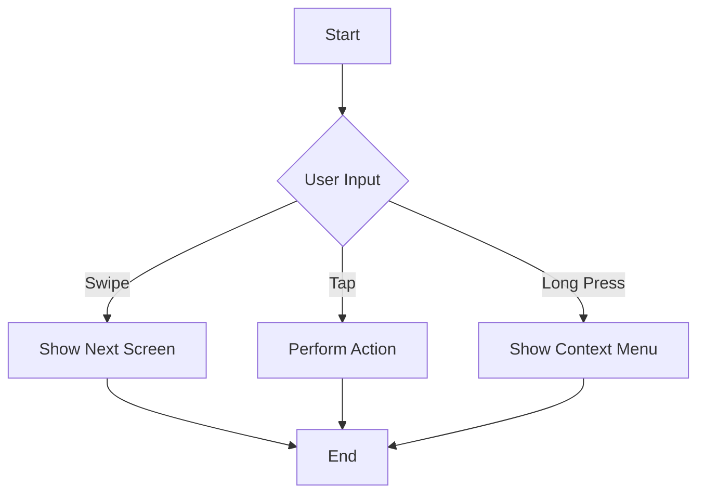

## 12.2.4 Integrating with Wearables

As the world of technology continues to evolve, wearable devices such as smartwatches have become increasingly popular. These devices offer unique opportunities for developers to extend their applications beyond traditional smartphones and tablets. In this section, we will explore how to integrate Flutter applications with wearable devices, focusing on Wear OS by Google. We will discuss the current support for Flutter on Wear OS, design considerations for small screens, platform integration, and the challenges and limitations of developing for wearables. Additionally, we will provide practical guidance on deploying and testing your Flutter applications on wearable devices.

### Flutter on Wear OS

#### Current Support

Flutter, Google's UI toolkit for building natively compiled applications, has been gaining traction for mobile app development. However, when it comes to Wear OS, the support is still evolving. As of the latest updates, Flutter does not officially support Wear OS out of the box. This means that developers need to rely on workarounds and experimental methods to deploy Flutter apps on Wear OS devices.

#### Workarounds

Despite the lack of official support, there are several ways to get Flutter apps running on Wear OS:

1. **Using Plugins:** There are community-driven plugins and packages that can help bridge the gap between Flutter and Wear OS. For example, the `wear` package provides basic functionality to interact with Wear OS features.

2. **Experimental Methods:** Developers can experiment with creating a Flutter module and integrating it with a native Android Wear OS app. This involves using platform channels to communicate between Flutter and the native code.

3. **Custom Solutions:** Some developers have created custom solutions by modifying Flutter's engine or using third-party tools to enable Wear OS support.

While these methods can be effective, they often require a deeper understanding of both Flutter and Android development.

### Designing for Small Screens

Designing for wearables presents unique challenges due to the limited screen real estate. Here are some key considerations:

#### UI Considerations

1. **Simplicity and Readability:** Wearable apps should prioritize simplicity. Use large, readable fonts and avoid clutter. The UI should be intuitive and easy to navigate.

2. **Scalable and Adaptive Layouts:** Utilize Flutter's responsive design capabilities to create layouts that adapt to different screen sizes and orientations. The `LayoutBuilder` widget can be particularly useful for this purpose.

3. **Minimalist Design:** Focus on essential features and minimize the number of interactions required. This enhances user experience and reduces cognitive load.

#### Interaction Models

1. **Touch and Gesture Inputs:** Wearables primarily rely on touch and gesture inputs. Design your app to accommodate swipes, taps, and long presses. Consider using Flutter's `GestureDetector` widget to handle these interactions.

2. **Voice Commands:** Some wearables support voice commands. Integrating voice input can enhance accessibility and provide a hands-free experience.

3. **Haptic Feedback:** Utilize haptic feedback to provide tactile responses to user interactions. This can improve user engagement and make the app feel more responsive.

### Platform Integration

Integrating with the unique features of wearable devices can enhance the functionality of your app. Here are some key areas to focus on:

#### Sensors and Health Data

Wearables often come equipped with various sensors, such as heart rate monitors, accelerometers, and gyroscopes. Accessing these sensors can provide valuable data for health and fitness applications.

- **Heart Rate Monitor:** Use platform channels to access heart rate data from the device's sensors. This can be useful for fitness tracking apps.

- **Accelerometer and Gyroscope:** These sensors can be used to detect movement and orientation, enabling features like step counting and activity recognition.

#### Notifications and Complications

Wearables offer unique ways to engage users through notifications and complications.

- **Notifications:** Implement wearable-specific notifications to deliver timely information to users. Use the `flutter_local_notifications` package to create notifications that are optimized for wearables.

- **Complications:** Complications are small widgets that display information on the watch face. They can be used to show real-time data, such as weather updates or calendar events.

### Limitations and Challenges

Developing for wearables comes with its own set of challenges. Here are some common limitations to be aware of:

#### Hardware Constraints

Wearable devices typically have less processing power and memory compared to smartphones. This means that apps need to be optimized for performance and efficiency.

- **Memory Management:** Be mindful of memory usage and avoid memory leaks. Use Flutter's `MemoryProfiler` to monitor and optimize memory consumption.

- **Processing Power:** Limit intensive computations and offload tasks to the cloud when possible. This can help improve app performance and responsiveness.

#### Battery Life

Battery life is a critical consideration for wearable devices. Here are some tips to optimize your app for energy efficiency:

- **Background Processing:** Minimize background processing and use efficient algorithms to reduce battery consumption.

- **Network Usage:** Optimize network requests and use caching to reduce data usage and save battery life.

- **Sensor Usage:** Limit the frequency and duration of sensor data collection to conserve battery power.

### Deployment and Testing

Testing and deploying your Flutter app on wearable devices is an essential step in the development process. Here are some methods to consider:

#### Emulators

Wearable emulators can be used to test your app without the need for physical devices. Android Studio provides Wear OS emulators that simulate various watch models and configurations.

- **Setting Up Emulators:** Use the Android Virtual Device (AVD) Manager to create and configure Wear OS emulators. Test your app on different screen sizes and orientations to ensure compatibility.

#### Physical Devices

Testing on physical devices provides a more accurate representation of how your app will perform in real-world scenarios.

- **Deploying to Devices:** Connect your wearable device to your development machine and use Flutter's `flutter run` command to deploy your app. Ensure that your device is in developer mode and has USB debugging enabled.

- **Testing User Interactions:** Test touch and gesture interactions on the physical device to ensure a smooth user experience.

### Visual Aids

#### Design Mockups

Creating design mockups can help visualize the layout and interactions of your wearable app. Use tools like Figma or Sketch to create mockups that reflect the unique constraints of wearable screens.

#### Flowcharts

Flowcharts can be used to map out user interactions and app logic. Here is an example of a flowchart for a simple wearable app:

### Writing Tips

#### Set Realistic Expectations

Be honest about the current capabilities and limitations of Flutter on wearables. While there are workarounds, the lack of official support means that some features may not be fully supported.

#### Encourage Innovation

Encourage readers to experiment and innovate with Flutter on wearables. The community is constantly evolving, and contributions can help shape the future of Flutter on these platforms.

#### Provide Resources

Provide links to communities and forums focused on wearables development. Here are some useful resources:

- [Flutter Community on GitHub](https://github.com/flutter/flutter)
- [Wear OS Developer Documentation](https://developer.android.com/wear)
- [Flutter Dev Forum](https://flutter.dev/community)

By following these guidelines and leveraging the unique features of wearable devices, you can create engaging and innovative applications that extend the reach of your Flutter apps to new platforms.

## Quiz Time!



### What is the current status of Flutter support for Wear OS?

- [x] Flutter does not officially support Wear OS.
- [ ] Flutter fully supports Wear OS.
- [ ] Flutter supports Wear OS with limited functionality.
- [ ] Flutter only supports Wear OS through third-party plugins.

> **Explanation:** As of the latest updates, Flutter does not officially support Wear OS out of the box. Developers need to rely on workarounds and experimental methods to deploy Flutter apps on Wear OS devices.

### Which widget can be used in Flutter to handle touch and gesture inputs?

- [x] GestureDetector
- [ ] ListView
- [ ] Container
- [ ] Stack

> **Explanation:** The `GestureDetector` widget in Flutter is used to handle touch and gesture inputs, which are essential for wearable app interactions.

### What is a key UI consideration when designing for wearable devices?

- [x] Simplicity and readability
- [ ] Complex animations
- [ ] Large data tables
- [ ] Multiple navigation bars

> **Explanation:** Wearable apps should prioritize simplicity and readability due to the limited screen size. The UI should be intuitive and easy to navigate.

### What is a complication in the context of wearable devices?

- [x] A small widget displaying information on the watch face
- [ ] A complex algorithm for data processing
- [ ] A type of error in the app
- [ ] A feature that complicates user interactions

> **Explanation:** Complications are small widgets that display information on the watch face, such as weather updates or calendar events.

### Which sensor is commonly used in wearables for fitness tracking?

- [x] Heart rate monitor
- [ ] Proximity sensor
- [ ] Light sensor
- [ ] Temperature sensor

> **Explanation:** The heart rate monitor is commonly used in wearables for fitness tracking, providing valuable health data.

### What is a common limitation when developing apps for wearable devices?

- [x] Hardware constraints
- [ ] Unlimited processing power
- [ ] Large screen sizes
- [ ] High memory availability

> **Explanation:** Wearable devices typically have less processing power and memory compared to smartphones, which poses a limitation for app development.

### How can battery life be optimized for wearable apps?

- [x] Minimize background processing
- [ ] Increase network requests
- [ ] Use high-frequency sensor data
- [ ] Implement complex animations

> **Explanation:** Minimizing background processing and optimizing network requests can help conserve battery life in wearable apps.

### What is the purpose of using wearable emulators?

- [x] To test apps without physical devices
- [ ] To increase app performance
- [ ] To deploy apps to the app store
- [ ] To create complex animations

> **Explanation:** Wearable emulators allow developers to test apps without the need for physical devices, simulating various watch models and configurations.

### What is a benefit of testing on physical wearable devices?

- [x] Accurate representation of real-world performance
- [ ] Unlimited testing scenarios
- [ ] Automated deployment
- [ ] Increased app size

> **Explanation:** Testing on physical devices provides a more accurate representation of how the app will perform in real-world scenarios, ensuring a smooth user experience.

### True or False: Voice commands can enhance accessibility on wearable devices.

- [x] True
- [ ] False

> **Explanation:** Voice commands can enhance accessibility on wearable devices by providing a hands-free experience and allowing users to interact with the app using voice input.


