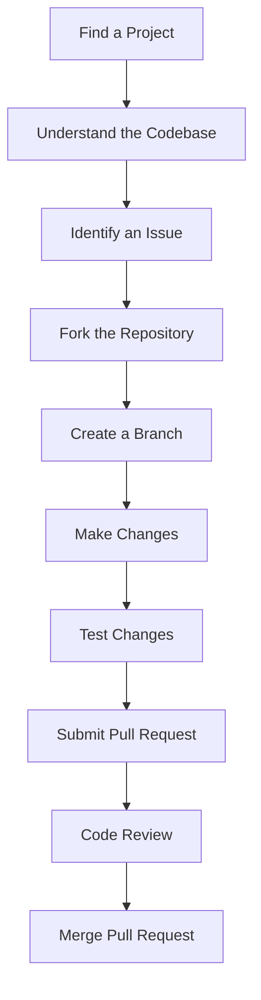

## 12.3.1 Open Source Contributions

Contributing to open source projects is a rewarding way to enhance your skills, connect with other developers, and give back to the community that supports the tools and libraries you use. In this section, we'll explore the benefits of contributing to open source, how to find projects to contribute to, the contribution process, best practices, and legal considerations. We'll also provide visual aids to help you understand the workflow and encourage you to take the first step in contributing.

### Benefits of Contributing

#### Skill Development

Contributing to open source projects is an excellent way to improve your coding skills. By working on real-world projects, you can learn from experienced developers, understand different coding styles, and gain exposure to new technologies and tools. You'll also have the opportunity to solve complex problems and receive feedback on your work, which can help you grow as a developer.

#### Networking

Open source contributions can help you connect with other developers and industry professionals. By collaborating on projects, you can build relationships with like-minded individuals, learn from their experiences, and potentially open doors to new career opportunities. Networking within the open source community can also lead to mentorship opportunities and collaborations on future projects.

#### Giving Back

Contributing to open source is a way to support the tools and libraries you use in your projects. By giving back to the community, you help ensure the continued development and improvement of these resources. Your contributions can make a significant impact, whether by fixing bugs, adding new features, or improving documentation.

### Finding Projects to Contribute To

#### Flutter Framework

The Flutter framework itself is an open source project hosted on GitHub. Contributing to the Flutter source code is a great way to get involved with the core development of the framework. You can find the Flutter repository on GitHub and explore the issues and pull requests to see where you can help.

#### Packages and Plugins

Flutter's ecosystem includes a wide range of packages and plugins that extend the framework's capabilities. Many of these packages are open source and welcome contributions. You can help maintain or enhance existing packages by fixing bugs, adding features, or improving documentation.

#### Community Projects

In addition to the Flutter framework and packages, there are numerous open source apps and tools built with Flutter that need assistance. You can find these projects on platforms like GitHub, GitLab, or Bitbucket by searching for Flutter-related repositories. Look for projects that align with your interests and skills.

### Contribution Process

#### Understanding the Codebase

Before contributing to a project, it's essential to understand the codebase. Start by reading the project's documentation and contributing guidelines, which often provide valuable information on the project's structure, coding standards, and contribution process. Familiarize yourself with the project's architecture and key components to ensure your contributions align with the project's goals.

#### Communication

Effective communication is crucial when contributing to open source projects. Join the project's mailing lists, forums, or chat groups to stay informed about the latest developments and connect with other contributors. Engaging with the community can help you understand the project's needs and priorities and provide opportunities to ask questions and seek guidance.

#### Identifying Issues

When looking for issues to work on, start by checking the project's issue tracker. Many projects label issues as "good first issue" or "help wanted" to indicate tasks suitable for new contributors. These issues are often well-defined and provide a manageable scope for your first contribution.

#### Submitting Contributions

Once you've identified an issue to work on, fork the repository and create a new branch for your changes. Make the necessary modifications, ensuring your code follows the project's coding standards. Test your changes thoroughly before submitting a pull request. In your pull request, provide a clear description of the changes you've made and reference the issue you're addressing.

#### Code Reviews

After submitting a pull request, engage constructively in the code review process. Be open to feedback and willing to make revisions as needed. Code reviews are an opportunity to learn from others and improve your contributions. Respond to comments promptly and respectfully, and collaborate with reviewers to ensure your changes meet the project's standards.

### Best Practices

#### Code Quality

Maintaining high code quality is essential when contributing to open source projects. Follow the project's coding standards and write clear, maintainable code. Use meaningful variable names, add comments where necessary, and ensure your code is well-organized and easy to read.

#### Documentation

Good documentation is crucial for the success of any project. When contributing to open source, update or improve documentation where needed. This may include adding comments to your code, updating README files, or creating new documentation for features you've added.

#### Testing

Testing is a critical aspect of software development. Write tests for any new features or bug fixes you implement to ensure they work as expected and don't introduce new issues. Follow the project's testing guidelines and use the appropriate testing frameworks and tools.

### Legal Considerations

#### Licensing

Respect open source licenses when contributing to projects. Ensure you understand the project's license and comply with its terms. If you're unsure about the licensing requirements, consult the project's documentation or reach out to the maintainers for clarification.

#### Contributor License Agreements (CLAs)

Some projects require contributors to sign a Contributor License Agreement (CLA) before accepting contributions. A CLA is a legal document that clarifies the rights and responsibilities of contributors and the project maintainers. If a project requires a CLA, follow the instructions provided to sign it before submitting your contributions.

### Visual Aids

#### Workflow Diagrams

To help you understand the contribution process, we've included a workflow diagram illustrating the steps from finding an issue to merging a pull request.

#### Screenshots

Here are some examples of contributing guidelines and issue trackers from popular open source projects:

- **Contributing Guidelines:** Most projects have a `CONTRIBUTING.md` file in the root of the repository. This file outlines the steps for contributing, including coding standards, testing requirements, and the pull request process.

- **Issue Trackers:** Projects often use GitHub Issues or similar tools to track bugs, feature requests, and tasks. Look for labels like "good first issue" or "help wanted" to find suitable issues for new contributors.

### Writing Tips

#### Encouraging Tone

We encourage you to take the first step in contributing to open source. Remember that every contribution, no matter how small, makes a difference. Don't be afraid to ask questions or seek help from the community. Open source is a collaborative effort, and your contributions are valued.

#### Transparency

Contributing to open source can be challenging, especially if you're new to the process. Be prepared to encounter obstacles, such as understanding complex codebases or navigating the code review process. Approach these challenges with a positive attitude and a willingness to learn. The open source community is supportive, and you'll find many resources and individuals willing to help you succeed.

#### Support Resources

To help you get started with open source contributions, here are some useful resources:

- [GitHub Guides: How to Contribute to Open Source](https://guides.github.com/activities/contributing-to-open-source/)
- [Open Source Guides: How to Contribute](https://opensource.guide/how-to-contribute/)
- [Flutter's Contribution Guide](https://github.com/flutter/flutter/blob/master/CONTRIBUTING.md)
- [Git Documentation](https://git-scm.com/doc)

By contributing to open source projects, you can enhance your skills, build valuable connections, and make a meaningful impact on the software you use and love. We hope this section has inspired you to get involved and start contributing to the Flutter ecosystem.

## Quiz Time!



### What is one of the primary benefits of contributing to open source projects?

- [x] Skill Development
- [ ] Earning Money
- [ ] Free Software Licenses
- [ ] Guaranteed Job Offers

> **Explanation:** Contributing to open source projects helps improve coding skills and allows developers to learn from others.

### Which platform is commonly used to host the Flutter framework's source code?

- [x] GitHub
- [ ] Bitbucket
- [ ] GitLab
- [ ] SourceForge

> **Explanation:** The Flutter framework's source code is hosted on GitHub, where developers can contribute to its development.

### What label should you look for when identifying issues suitable for new contributors?

- [x] Good first issue
- [ ] Critical bug
- [ ] High priority
- [ ] Urgent

> **Explanation:** Issues labeled "good first issue" are often well-defined and suitable for new contributors.

### What is a Contributor License Agreement (CLA)?

- [x] A legal document clarifying rights and responsibilities of contributors
- [ ] A software license for open source projects
- [ ] A contract for employment in open source projects
- [ ] A guide for writing code in open source projects

> **Explanation:** A CLA is a legal document that clarifies the rights and responsibilities of contributors and project maintainers.

### Which of the following is a best practice when contributing to open source projects?

- [x] Writing tests for new features or fixes
- [ ] Ignoring coding standards
- [ ] Submitting changes without testing
- [ ] Avoiding documentation updates

> **Explanation:** Writing tests for new features or fixes is a best practice to ensure code quality and reliability.

### What should you do before submitting a pull request?

- [x] Test your changes thoroughly
- [ ] Ignore the project's coding standards
- [ ] Submit without a description
- [ ] Avoid referencing the issue you're addressing

> **Explanation:** Testing your changes thoroughly ensures they work as expected and don't introduce new issues.

### Why is effective communication important in open source contributions?

- [x] It helps you connect with the community and understand project needs
- [ ] It allows you to bypass the code review process
- [ ] It guarantees your contributions will be accepted
- [ ] It eliminates the need for documentation

> **Explanation:** Effective communication helps you connect with the community and understand the project's needs and priorities.

### What is the purpose of a project's contributing guidelines?

- [x] To outline the steps for contributing, including coding standards and testing requirements
- [ ] To provide a list of project maintainers
- [ ] To detail the project's history and origin
- [ ] To offer a summary of the project's financial status

> **Explanation:** Contributing guidelines outline the steps for contributing, including coding standards and testing requirements.

### How can you find open source projects to contribute to?

- [x] Search for Flutter-related repositories on platforms like GitHub
- [ ] Wait for projects to contact you
- [ ] Only contribute to projects you have created
- [ ] Avoid using online platforms

> **Explanation:** Searching for Flutter-related repositories on platforms like GitHub is a common way to find open source projects to contribute to.

### True or False: Every contribution, no matter how small, makes a difference in open source projects.

- [x] True
- [ ] False

> **Explanation:** Every contribution, no matter how small, makes a difference in open source projects by supporting their development and improvement.


