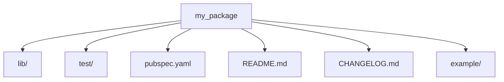

## 12.3.2 Writing Plugins and Packages

In the world of Flutter development, the ability to extend the framework's capabilities through plugins and packages is a powerful skill. This section will guide you through the process of creating, testing, documenting, and publishing your own Flutter plugins and packages. By the end of this chapter, you will be equipped with the knowledge to contribute to the Flutter ecosystem and share your innovations with the global developer community.

### Understanding Plugins vs. Packages

Before diving into the creation process, it's crucial to understand the difference between plugins and packages in the Flutter ecosystem.

#### Plugins

Plugins are a combination of Dart code and platform-specific code (Java/Kotlin for Android, Swift/Objective-C for iOS). They enable Flutter apps to interact with native platform features, such as accessing the camera, GPS, or Bluetooth.

#### Packages

Packages, on the other hand, contain only Dart code. They are used to share reusable code that doesn't require platform-specific implementations. Examples include utility libraries, state management solutions, and UI components.

### Creating a Package

Let's start by creating a simple Dart package. This will help you understand the process of structuring, developing, and publishing a package.

#### Starting a Package Project

To create a new package, use the following command in your terminal:

```bash
flutter create --template=package my_package
```

This command sets up a new package project with the necessary files and folders.

#### Structure

A typical package project has the following structure:

```plaintext
my_package/
  ├── lib/
  │   └── my_package.dart
  ├── test/
  ├── pubspec.yaml
  ├── README.md
  ├── CHANGELOG.md
  └── example/
```

- **lib/**: Contains the Dart code for your package.
- **test/**: Contains unit tests for your package.
- **pubspec.yaml**: Metadata about your package, including dependencies.
- **README.md**: Instructions on how to use your package.
- **CHANGELOG.md**: A log of changes for each version.
- **example/**: An example app demonstrating how to use your package.

#### Developing the Package

When developing your package, focus on writing reusable, well-documented Dart code. Here's a simple example of a utility function in `my_package.dart`:

```dart
/// A utility function that adds two numbers.
int add(int a, int b) {
  return a + b;
}
```

Ensure your code is well-documented using Dart's documentation comments (`///`). This helps users understand how to use your package.

### Creating a Plugin

Creating a plugin involves more complexity as it requires writing platform-specific code. Let's walk through the process.

#### Starting a Plugin Project

To create a new plugin, use the following command:

```bash
flutter create --template=plugin my_plugin
```

This command generates a plugin project with the necessary files and folders for both Dart and platform-specific code.

#### Platform Channel Basics

Flutter uses platform channels to communicate between Dart and native code. Here's a basic overview of how it works:

- **Dart Side**: Sends messages to the native platform using `MethodChannel`.
- **Native Side**: Listens for messages and responds using platform-specific code.

#### Implementing Platform Code

Let's implement a simple plugin that retrieves the device's battery level.

**Dart Code (lib/my_plugin.dart):**

```dart
import 'dart:async';
import 'package:flutter/services.dart';

class MyPlugin {
  static const MethodChannel _channel = MethodChannel('my_plugin');

  /// Gets the battery level of the device.
  static Future<int> getBatteryLevel() async {
    final int batteryLevel = await _channel.invokeMethod('getBatteryLevel');
    return batteryLevel;
  }
}
```

**Android Code (android/src/main/java/com/example/my_plugin/MyPlugin.java):**

```java
package com.example.my_plugin;

import androidx.annotation.NonNull;
import io.flutter.embedding.engine.plugins.FlutterPlugin;
import io.flutter.plugin.common.MethodCall;
import io.flutter.plugin.common.MethodChannel;
import io.flutter.plugin.common.MethodChannel.MethodCallHandler;
import io.flutter.plugin.common.MethodChannel.Result;

public class MyPlugin implements FlutterPlugin, MethodCallHandler {
  private MethodChannel channel;

  @Override
  public void onAttachedToEngine(@NonNull FlutterPluginBinding flutterPluginBinding) {
    channel = new MethodChannel(flutterPluginBinding.getBinaryMessenger(), "my_plugin");
    channel.setMethodCallHandler(this);
  }

  @Override
  public void onMethodCall(@NonNull MethodCall call, @NonNull Result result) {
    if (call.method.equals("getBatteryLevel")) {
      int batteryLevel = getBatteryLevel();
      result.success(batteryLevel);
    } else {
      result.notImplemented();
    }
  }

  private int getBatteryLevel() {
    // Implement battery level retrieval logic here
    return 100; // Placeholder value
  }

  @Override
  public void onDetachedFromEngine(@NonNull FlutterPluginBinding binding) {
    channel.setMethodCallHandler(null);
  }
}
```

**iOS Code (ios/Classes/MyPlugin.swift):**

```swift
import Flutter
import UIKit

public class MyPlugin: NSObject, FlutterPlugin {
  public static func register(with registrar: FlutterPluginRegistrar) {
    let channel = FlutterMethodChannel(name: "my_plugin", binaryMessenger: registrar.messenger())
    let instance = MyPlugin()
    registrar.addMethodCallDelegate(instance, channel: channel)
  }

  public func handle(_ call: FlutterMethodCall, result: @escaping FlutterResult) {
    if call.method == "getBatteryLevel" {
      result(getBatteryLevel())
    } else {
      result(FlutterMethodNotImplemented)
    }
  }

  private func getBatteryLevel() -> Int {
    // Implement battery level retrieval logic here
    return 100 // Placeholder value
  }
}
```

### Testing Plugins and Packages

Testing is crucial to ensure the reliability of your plugins and packages.

#### Unit Testing

For Dart code, write unit tests in the `test/` directory. Here's an example test for the `add` function:

```dart
import 'package:flutter_test/flutter_test.dart';
import 'package:my_package/my_package.dart';

void main() {
  test('adds two numbers', () {
    expect(add(2, 3), 5);
  });
}
```

#### Integration Testing

For platform-specific functionality, write integration tests to verify the behavior of your plugin on different devices.

### Documenting the Package/Plugin

Proper documentation is essential for users to understand and use your package or plugin effectively.

#### Pubspec.yaml

Configure your `pubspec.yaml` with accurate metadata, dependencies, and versioning:

```yaml
name: my_package
description: A sample Dart package.
version: 0.1.0
author: Your Name <your.email@example.com>
dependencies:
  flutter:
    sdk: flutter
```

#### README and Examples

Write a clear `README.md` with usage instructions and provide sample code in the `example/` directory.

### Publishing to pub.dev

Once your package or plugin is ready, you can publish it to [pub.dev](https://pub.dev/).

#### Account Setup

Create a publisher account if needed and verify your email address.

#### Publishing Process

Use the following command to publish your package:

```bash
flutter pub publish
```

Address any validation warnings or errors before publishing.

### Maintaining Your Package/Plugin

Maintaining your package or plugin is an ongoing process.

#### Responding to Issues

Monitor and address bug reports and feature requests from users.

#### Updating

Keep your package up-to-date with Flutter's evolution and release new versions as needed.

### Visual Aids

#### Project Structure Diagrams

Visualize the anatomy of a plugin/package with diagrams:



#### Code Samples

Provide snippets of implementing platform channels to enhance understanding.

### Writing Tips

#### Clarity

Break down complex steps into manageable instructions to ensure clarity.

#### Real-World Examples

Encourage readers to build packages/plugins that solve actual problems.

#### Encourage Best Practices

Highlight the importance of testing and documentation throughout the development process.

## Quiz Time!



### What is the primary difference between a Flutter plugin and a package?

- [x] Plugins contain platform-specific code, while packages contain only Dart code.
- [ ] Plugins are for UI components, while packages are for backend logic.
- [ ] Plugins are larger than packages.
- [ ] Plugins are easier to create than packages.

> **Explanation:** Plugins include platform-specific code for Android and iOS, whereas packages contain only Dart code.

### Which command is used to create a new Flutter package?

- [ ] flutter create --template=plugin my_package
- [x] flutter create --template=package my_package
- [ ] flutter init package my_package
- [ ] flutter new package my_package

> **Explanation:** The correct command to create a new Flutter package is `flutter create --template=package my_package`.

### What file contains metadata about a Flutter package?

- [ ] README.md
- [ ] CHANGELOG.md
- [x] pubspec.yaml
- [ ] LICENSE

> **Explanation:** The `pubspec.yaml` file contains metadata about a Flutter package, including dependencies and versioning.

### What is the purpose of the `MethodChannel` in a Flutter plugin?

- [x] To communicate between Dart and native platform code.
- [ ] To manage state in a Flutter app.
- [ ] To handle HTTP requests.
- [ ] To render UI components.

> **Explanation:** `MethodChannel` is used to send messages between Dart and native platform code in a Flutter plugin.

### How can you test the Dart code in a Flutter package?

- [x] By writing unit tests in the test/ directory.
- [ ] By running the app on a simulator.
- [ ] By using integration tests only.
- [ ] By manually checking the code.

> **Explanation:** Unit tests for Dart code are written in the `test/` directory to ensure functionality.

### What should you do before publishing a package to pub.dev?

- [x] Address any validation warnings or errors.
- [ ] Delete the example/ directory.
- [ ] Remove all comments from the code.
- [ ] Change the package name to include "flutter".

> **Explanation:** It's important to address any validation warnings or errors before publishing to ensure the package meets pub.dev standards.

### What is the role of the example/ directory in a Flutter package?

- [x] To provide sample code demonstrating how to use the package.
- [ ] To store additional libraries.
- [ ] To contain platform-specific code.
- [ ] To hold configuration files.

> **Explanation:** The `example/` directory contains sample code that demonstrates how to use the package.

### How do you update a Flutter package to keep it current with Flutter's evolution?

- [x] Release new versions as needed.
- [ ] Ignore user feedback.
- [ ] Remove all dependencies.
- [ ] Change the package name frequently.

> **Explanation:** Releasing new versions as needed helps keep the package up-to-date with Flutter's evolution.

### What is the purpose of the CHANGELOG.md file in a Flutter package?

- [x] To log changes for each version of the package.
- [ ] To store user feedback.
- [ ] To contain platform-specific code.
- [ ] To manage dependencies.

> **Explanation:** The `CHANGELOG.md` file logs changes for each version of the package, providing a history of updates.

### True or False: A Flutter plugin can only be used on Android devices.

- [ ] True
- [x] False

> **Explanation:** A Flutter plugin can be used on both Android and iOS devices, as it contains platform-specific code for both platforms.


