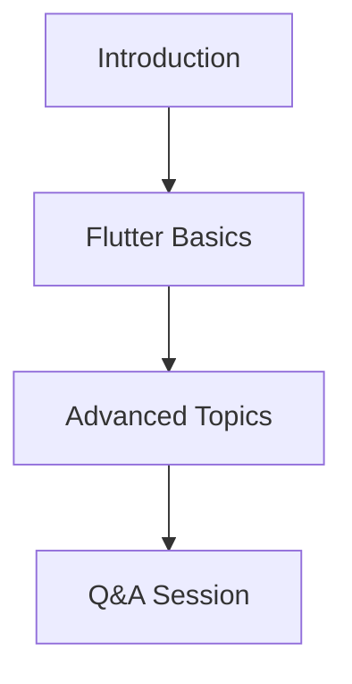

---

linkTitle: "12.3.3 Sharing Knowledge"
title: "Sharing Knowledge: Empowering the Flutter Community"
description: "Discover how to contribute to the Flutter community by sharing your knowledge through blogging, speaking, and mentoring. Learn tips for effective communication and community engagement."
categories:
- Flutter Development
- Community Engagement
- Knowledge Sharing
tags:
- Flutter
- Blogging
- Public Speaking
- Mentoring
- Community Building
date: 2024-10-25
type: docs
nav_weight: 1233000
canonical: "https://fluttermasterylibrary.com/2/12/3/3"
license: "© 2023 Tokenizer Inc. CC BY-NC-SA 4.0"
---

## 12.3.3 Sharing Knowledge

As you journey from zero to publishing your first Flutter app on the App Store, you accumulate a wealth of knowledge and experience. Sharing this knowledge not only contributes to the growth of the Flutter community but also enhances your personal and professional development. In this section, we will explore various ways you can share your expertise, including blogging, speaking at events, and mentoring others. We will also discuss the benefits of sharing and provide practical tips to get you started.

### Blogging: Sharing Your Journey and Insights

#### Choosing Topics

Blogging is a powerful way to share your experiences and insights with a broader audience. When choosing topics, consider writing about:

- **Personal Experiences:** Share your journey of learning Flutter, the challenges you faced, and how you overcame them. Personal stories resonate well with readers and provide relatable content.
- **Tutorials:** Create step-by-step guides on specific Flutter features or projects. Tutorials are highly valued by the community, especially for beginners seeking guidance.
- **Solutions to Common Problems:** Document solutions to issues you encountered during development. This not only helps others facing similar problems but also establishes you as a problem solver.

#### Platforms for Blogging

Selecting the right platform is crucial for reaching your audience. Here are some popular platforms to consider:

- **Medium:** A widely-used platform with a large tech community. Medium offers easy-to-use tools for writing and publishing articles.
- **Personal Websites:** Building your own website gives you full control over your content and branding. Platforms like WordPress or GitHub Pages can help you get started.
- **Dev.to:** A community-driven platform specifically for developers. Dev.to is known for its supportive community and developer-focused content.

#### Writing Tips for Effective Blogging

To make your blog posts engaging and informative, consider the following tips:

- **Clarity:** Write in a clear and concise manner. Avoid jargon and explain technical terms when necessary.
- **Use of Code Snippets:** Include code snippets to illustrate your points. Ensure the code is well-commented and easy to understand.
- **Visuals:** Use images, diagrams, and screenshots to enhance your content. Visual aids can help clarify complex concepts and keep readers engaged.

Here's an example of how you might structure a blog post with code snippets and visuals:

```markdown

In this tutorial, we'll build a simple Flutter app that displays a list of items.

## Step 1: Setting Up Your Project

First, create a new Flutter project:

```bash
flutter create simple_app
```

## Step 2: Designing the UI

We'll use a `ListView` to display our items. Here's the code for the main widget:

```dart
import 'package:flutter/material.dart';

void main() => runApp(SimpleApp());

class SimpleApp extends StatelessWidget {
  @override
  Widget build(BuildContext context) {
    return MaterialApp(
      home: Scaffold(
        appBar: AppBar(
          title: Text('Simple App'),
        ),
        body: ItemList(),
      ),
    );
  }
}

class ItemList extends StatelessWidget {
  final List<String> items = List<String>.generate(10, (i) => "Item $i");

  @override
  Widget build(BuildContext context) {
    return ListView.builder(
      itemCount: items.length,
      itemBuilder: (context, index) {
        return ListTile(
          title: Text('${items[index]}'),
        );
      },
    );
  }
}
```

## Step 3: Running Your App

Run the app using:

```bash
flutter run
```


```

#### Promoting Your Posts

Once your post is published, promote it to reach a wider audience:

- **Social Media:** Share your articles on platforms like Twitter, LinkedIn, and Facebook. Use relevant hashtags to increase visibility.
- **Flutter Community Channels:** Engage with the Flutter community by sharing your posts on forums, Slack channels, and Reddit.

### Speaking at Events: Amplifying Your Voice

#### Finding Opportunities

Public speaking is an excellent way to share your knowledge and connect with others. Here are some ways to find speaking opportunities:

- **Local Meetups:** Join local Flutter or tech meetups. These gatherings often seek speakers to share their experiences.
- **Conferences:** Apply to speak at conferences. Many tech conferences have open calls for speakers.
- **Virtual Events:** With the rise of online events, you can reach a global audience without leaving your home.

#### Preparing a Talk

To deliver an engaging talk, follow these steps:

- **Choose Engaging Topics:** Select topics that interest you and are relevant to your audience. Consider emerging trends or common challenges in Flutter development.
- **Create Slides:** Design visually appealing slides that complement your talk. Use diagrams and bullet points to highlight key points.
- **Practice Delivery:** Rehearse your talk multiple times. Practice helps you refine your delivery and manage time effectively.

Below is an example of a simple slide design using Mermaid syntax:



#### Engaging the Audience

To keep your audience engaged, encourage interaction:

- **Questions:** Invite questions during or after your talk. This fosters a two-way conversation and clarifies any doubts.
- **Interactive Discussions:** Encourage discussions by posing questions or scenarios to the audience.

### Mentoring and Teaching: Guiding the Next Generation

#### One-on-One Mentoring

Mentoring provides personalized guidance to individuals seeking to learn Flutter. Consider these avenues for mentoring:

- **Forums:** Participate in forums like Stack Overflow or the Flutter Community Slack. Answer questions and provide feedback.
- **Mentorship Programs:** Join formal mentorship programs where you can guide beginners through structured learning paths.

#### Workshops and Tutorials

Hosting workshops or tutorials allows you to teach multiple people at once:

- **Coding Sessions:** Organize live coding sessions where participants can follow along and ask questions.
- **Webinars:** Conduct webinars on specific topics. Webinars can reach a wide audience and are often recorded for future reference.

#### Contribution to Educational Resources

Contributing to educational resources helps build a repository of knowledge for the community:

- **Write Tutorials:** Create detailed tutorials on specific Flutter topics. Publish them on platforms like Medium or your personal blog.
- **Contribute to Documentation:** Help improve Flutter's official documentation by suggesting edits or writing new sections.

### Benefits of Sharing

Sharing your knowledge offers numerous benefits:

#### Personal Growth

- **Enhance Communication Skills:** Writing and speaking improve your ability to convey complex ideas clearly.
- **Deepen Understanding:** Teaching others reinforces your own understanding of the subject.

#### Community Building

- **Foster a Supportive Network:** Engaging with the community helps build a network of like-minded individuals who can offer support and collaboration.
- **Encourage Inclusivity:** By sharing your knowledge, you contribute to a welcoming environment for developers of all skill levels.

#### Recognition

- **Build a Reputation:** Consistently sharing valuable insights can establish you as an expert in the Flutter community.
- **Opportunities for Collaboration:** Recognition can lead to collaboration opportunities with other developers or organizations.

### Visual Aids: Enhancing Your Content

#### Presentation Slides Examples

Effective slides complement your talk and keep the audience engaged. Here are some tips for designing slides:

- **Keep It Simple:** Use minimal text and focus on key points.
- **Use Visuals:** Incorporate images, charts, and diagrams to illustrate your points.
- **Consistent Design:** Maintain a consistent design throughout your slides for a professional look.

#### Blog Post Layouts

A well-structured blog post enhances readability. Consider the following layout:

- **Introduction:** Briefly introduce the topic and its relevance.
- **Body:** Break down the content into sections with clear headings.
- **Conclusion:** Summarize the key points and suggest next steps or further reading.

### Writing Tips: Encouragement and Inclusivity

#### Encouragement

Assure readers that everyone has valuable insights to share. Your unique experiences and perspectives can provide fresh insights to others.

#### Inclusivity

Promote a welcoming environment for all skill levels. Encourage beginners to share their learning experiences and assure them that their contributions are valuable.

#### Provide Resources

Link to resources that can help readers get started with sharing their knowledge:

- **Speaking Opportunities:** Websites like [Sessionize](https://sessionize.com/) list open calls for speakers.
- **Forums and Communities:** Join forums like [Flutter Community](https://flutter.dev/community) to connect with other developers.

## Quiz Time!



### What is a recommended platform for blogging about Flutter?

- [x] Medium
- [ ] Instagram
- [ ] TikTok
- [ ] Snapchat

> **Explanation:** Medium is a popular platform for writing and sharing articles, especially in the tech community.

### Which of the following is a benefit of sharing knowledge?

- [x] Personal growth
- [ ] Increased expenses
- [ ] Reduced networking opportunities
- [ ] Decreased reputation

> **Explanation:** Sharing knowledge enhances personal growth by improving communication skills and deepening understanding.

### What is an effective way to promote your blog posts?

- [x] Share on social media
- [ ] Keep them private
- [ ] Only share with close friends
- [ ] Avoid sharing

> **Explanation:** Sharing your posts on social media can help reach a wider audience and increase engagement.

### What should you include in a blog post to enhance clarity?

- [x] Code snippets
- [ ] Unrelated images
- [ ] Complex jargon
- [ ] Lengthy paragraphs

> **Explanation:** Including code snippets helps illustrate points and makes technical content more understandable.

### What is a good practice when preparing a talk for an event?

- [x] Practice delivery
- [ ] Avoid using slides
- [ ] Ignore the audience
- [ ] Use complex language

> **Explanation:** Practicing delivery helps refine your presentation skills and ensures effective communication.

### How can you engage the audience during a talk?

- [x] Encourage questions
- [ ] Ignore feedback
- [ ] Avoid eye contact
- [ ] Speak monotonously

> **Explanation:** Encouraging questions fosters interaction and helps clarify any doubts the audience may have.

### What is a benefit of mentoring others?

- [x] Deepen understanding
- [ ] Increase isolation
- [ ] Reduce knowledge
- [ ] Decrease communication skills

> **Explanation:** Mentoring others helps reinforce your own understanding of the subject matter.

### Which of the following is a way to contribute to educational resources?

- [x] Write tutorials
- [ ] Delete documentation
- [ ] Hoard information
- [ ] Avoid sharing

> **Explanation:** Writing tutorials contributes to the community's knowledge base and helps others learn.

### What is an important aspect of designing presentation slides?

- [x] Consistent design
- [ ] Overloading with text
- [ ] Using random colors
- [ ] Avoiding visuals

> **Explanation:** A consistent design ensures a professional look and helps maintain audience engagement.

### True or False: Sharing knowledge can lead to recognition in the Flutter community.

- [x] True
- [ ] False

> **Explanation:** Consistently sharing valuable insights can establish you as an expert and lead to recognition in the community.



By sharing your knowledge, you not only contribute to the growth of the Flutter community but also embark on a journey of personal and professional development. Whether through blogging, speaking, or mentoring, your contributions are invaluable in building a vibrant and supportive community.
