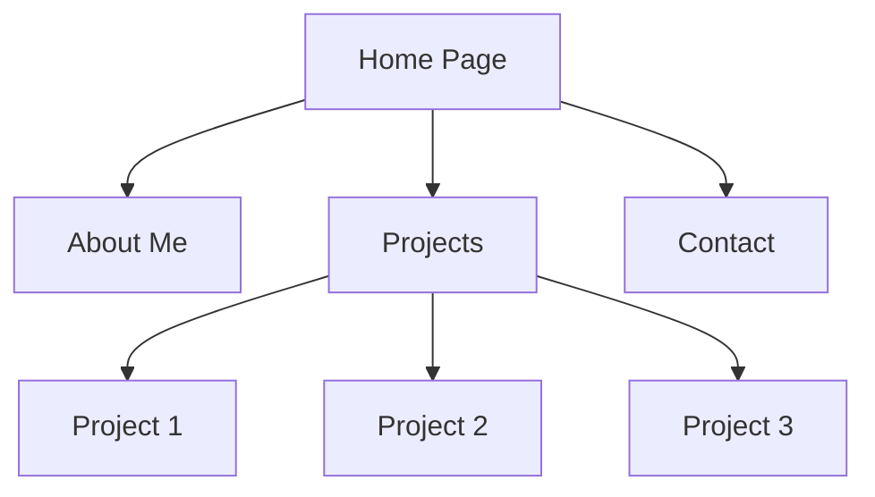

## 12.4.1 Building a Portfolio

In the competitive world of software development, a well-crafted portfolio can be your ticket to standing out from the crowd. While resumes and LinkedIn profiles provide a snapshot of your professional journey, a portfolio offers a deeper dive into your practical abilities and creative flair. This section will guide you through building a compelling portfolio that showcases your Flutter projects, skills, and experience, making a strong impression on potential employers or clients.

### The Importance of a Portfolio

A portfolio is more than just a collection of projects; it is a narrative of your journey as a developer. It demonstrates your ability to apply theoretical knowledge to real-world problems, showcasing your skills in a way that a resume cannot. Here are some reasons why a portfolio is crucial:

- **Demonstrates Practical Skills:** Unlike a resume, which lists skills, a portfolio shows them in action. It provides tangible evidence of your capabilities, allowing potential employers or clients to see your work firsthand.
- **Highlights Creativity and Problem-Solving:** A portfolio allows you to showcase your creativity and how you approach complex problems, providing insight into your thought process and problem-solving skills.
- **Builds Credibility:** A well-organized and visually appealing portfolio can enhance your credibility, showing that you take your work seriously and are committed to your craft.
- **Differentiates You from Others:** In a sea of resumes, a portfolio can set you apart by highlighting your unique projects and personal interests.

### Selecting Projects for Your Portfolio

Choosing the right projects to include in your portfolio is crucial. Here are some guidelines to help you make the best selections:

#### Diversity

Include a variety of applications to demonstrate your versatility as a developer. Consider showcasing projects that highlight different aspects of your skill set, such as:

- **UI-Focused Applications:** Projects that demonstrate your ability to create visually appealing and user-friendly interfaces.
- **Backend-Integrated Applications:** Applications that show your skills in integrating with backend services and handling data.
- **Animations and Transitions:** Projects that highlight your ability to create smooth and engaging animations.

#### Quality Over Quantity

It's better to have a few well-executed projects than a large number of mediocre ones. Choose projects that best showcase your skills and reflect your attention to detail and commitment to quality.

#### Personal Touch

Include passion projects that reflect your personal interests and values. These projects can provide insight into who you are as a person and what drives you as a developer.

### Presentation of Your Portfolio

How you present your portfolio is just as important as the projects you choose to include. Here are some tips for creating an engaging and professional presentation:

#### Online Presence

Having an online portfolio is essential in today's digital age. Consider using platforms like GitHub Pages, personal websites, or portfolio platforms such as Behance or Dribbble. These platforms allow you to reach a wider audience and make it easy for potential employers or clients to view your work.

#### Project Descriptions

For each project, provide a detailed description that includes:

- **Context:** Explain the purpose of the project and the problem it aims to solve.
- **Challenges Faced:** Describe any challenges you encountered during development and how you overcame them.
- **Solutions Implemented:** Highlight the solutions you implemented and the technologies you used.

#### Visuals

Visual elements can significantly enhance your portfolio. Include screenshots, videos, or live demos of your projects to give viewers a better understanding of your work. Consider using tools like Loom or GIFs to create engaging visual content.

### Code Accessibility

Making your code accessible to others is an important aspect of your portfolio. Here are some tips for sharing your code effectively:

#### GitHub Repositories

Share your code publicly on GitHub if possible. This not only demonstrates your transparency and willingness to share your work but also allows others to explore your code in detail. Organize your repositories with clear READMEs that provide an overview of the project, installation instructions, and any other relevant information.

#### Documentation

Documenting your code is a sign of professionalism and can make it easier for others to understand and use your work. Include comments in your code and consider creating separate documentation files that provide more detailed explanations of your codebase.

### Highlighting Your Skills

Your portfolio should highlight your skills and expertise in specific technologies and problem-solving. Here are some ways to do this:

#### Specific Technologies

Mention the specific technologies you used in each project, such as state management solutions (e.g., Provider, Bloc), APIs, databases, and any other relevant tools or frameworks. This helps potential employers or clients understand your technical expertise.

#### Problem-Solving

Describe complex problems you tackled in your projects and how you solved them. This can demonstrate your ability to think critically and creatively, as well as your perseverance in overcoming challenges.

### Testimonials and References

Including testimonials and references from clients, collaborators, or users can add credibility to your portfolio. These endorsements can provide valuable insights into your work ethic, communication skills, and ability to deliver results.

### Visual Aids and Portfolio Layout Examples

Creating a visually appealing portfolio is essential for making a strong impression. Here are some examples of effective portfolio layouts and project showcases:

#### Portfolio Layout Examples

Consider using a clean and modern design for your portfolio. Use consistent typography, colors, and spacing to create a cohesive look. Here are some layout ideas:

#### Project Showcases

For each project, create a dedicated page or section that includes:

- **Project Title and Description:** Provide a brief overview of the project.
- **Screenshots or Videos:** Include visual elements that showcase the project.
- **Technologies Used:** List the technologies and tools you used.
- **Challenges and Solutions:** Describe any challenges you faced and how you solved them.

### Writing Tips for Your Portfolio

When writing content for your portfolio, keep the following tips in mind:

#### Professionalism

Ensure all content is polished and error-free. Proofread your work and consider having someone else review it to catch any mistakes you might have missed.

#### Authenticity

Be genuine about your experiences and skills. Avoid exaggerating your abilities or achievements, as this can backfire if you are unable to meet expectations.

#### Updating Regularly

Keep your portfolio current by regularly adding new projects and updating existing ones. This shows that you are actively engaged in your work and continuously improving your skills.

### Conclusion

Building a compelling portfolio is an essential step in showcasing your Flutter expertise and making a strong impression on potential employers or clients. By carefully selecting projects, presenting them professionally, and highlighting your skills, you can create a portfolio that sets you apart and opens doors to new opportunities.

## Quiz Time!



### Why is a portfolio important for a developer?

- [x] It demonstrates practical skills beyond a resume.
- [ ] It replaces the need for a resume.
- [ ] It is only necessary for freelance developers.
- [ ] It is not important if you have a LinkedIn profile.

> **Explanation:** A portfolio provides tangible evidence of your skills and demonstrates your ability to apply theoretical knowledge to real-world problems, which a resume alone cannot do.

### What should be prioritized when selecting projects for your portfolio?

- [x] Quality over quantity.
- [ ] Quantity over quality.
- [ ] Projects that are easy to complete.
- [ ] Projects that are similar to each other.

> **Explanation:** It's better to have a few well-executed projects that showcase your skills than a large number of mediocre ones.

### Which platform is NOT recommended for hosting an online portfolio?

- [ ] GitHub Pages
- [ ] Personal websites
- [ ] Behance
- [x] Social media platforms

> **Explanation:** While social media can be used to share your work, it is not a dedicated platform for hosting a professional portfolio.

### What should be included in project descriptions?

- [x] Context, challenges faced, and solutions implemented.
- [ ] Only the project title.
- [ ] Just the code snippets.
- [ ] Personal opinions about the project.

> **Explanation:** Providing context, challenges faced, and solutions implemented gives a comprehensive view of the project and your role in it.

### How can you make your code accessible to others?

- [x] Share code publicly on GitHub with clear READMEs.
- [ ] Keep code private and only share upon request.
- [ ] Share code only in PDF format.
- [ ] Use proprietary formats to protect code.

> **Explanation:** Sharing code publicly on GitHub with clear READMEs allows others to explore your work and understand your coding practices.

### What is a sign of professionalism in a portfolio?

- [x] Well-documented code.
- [ ] Using complex jargon.
- [ ] Having many projects regardless of quality.
- [ ] Exaggerating skills and experiences.

> **Explanation:** Well-documented code demonstrates professionalism and makes it easier for others to understand and use your work.

### What should be highlighted in your portfolio to demonstrate problem-solving skills?

- [x] Complex problems tackled and solutions implemented.
- [ ] Only the final product.
- [ ] The number of lines of code written.
- [ ] The time taken to complete the project.

> **Explanation:** Highlighting complex problems and solutions demonstrates your ability to think critically and creatively.

### Why is it important to update your portfolio regularly?

- [x] To keep it current with recent work.
- [ ] To add more projects regardless of relevance.
- [ ] To replace old projects with new ones.
- [ ] To change the design frequently.

> **Explanation:** Regular updates show that you are actively engaged in your work and continuously improving your skills.

### What can add credibility to your portfolio?

- [x] Testimonials and references from clients or collaborators.
- [ ] Personal opinions about your work.
- [ ] Unverified claims about your skills.
- [ ] Only listing technologies used.

> **Explanation:** Testimonials and references provide valuable insights into your work ethic and ability to deliver results.

### True or False: A portfolio should only include projects that were completed successfully.

- [ ] True
- [x] False

> **Explanation:** Including projects with challenges or learning experiences can demonstrate your problem-solving skills and ability to learn from mistakes.


