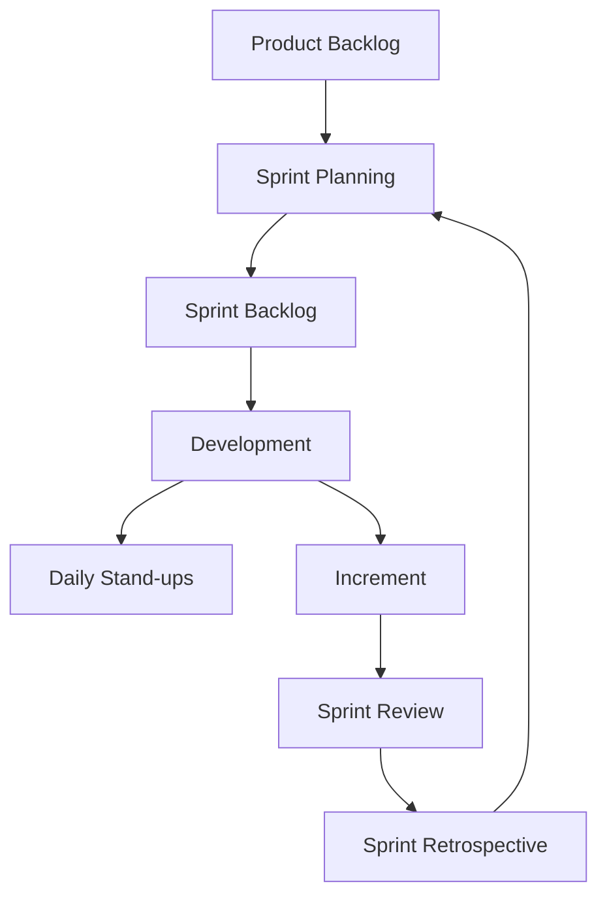
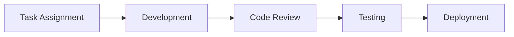

## 12.4.3 Joining a Development Team

Embarking on a journey as a Flutter developer within a professional development team is both exciting and challenging. This chapter aims to equip you with the knowledge and skills necessary to thrive in such environments. We will explore the dynamics of team roles, effective communication, collaboration tools, agile methodologies, and essential soft and technical skills. By the end of this section, you should feel prepared to contribute effectively to a development team and continue your professional growth.

### Team Dynamics

Understanding team dynamics is crucial for any developer joining a new team. Let's break down the core components:

#### Roles and Responsibilities

In a development team, roles can vary significantly depending on the project's size and complexity. Here are some common roles you might encounter:

- **Junior Developer:** Typically responsible for implementing features and fixing bugs under the guidance of more experienced developers. A junior developer is expected to learn quickly and adapt to the team's coding standards and practices.

- **Senior Developer:** Often takes on more complex tasks and provides mentorship to junior developers. They are responsible for architectural decisions and ensuring code quality.

- **Team Lead:** Oversees the development team, coordinates tasks, and ensures that the project aligns with business goals. The team lead also facilitates communication between developers and other stakeholders.

- **Product Owner:** Represents the customer and stakeholders, defining the product vision and prioritizing the backlog.

- **Scrum Master:** Facilitates agile ceremonies and helps the team adhere to agile practices, removing any impediments to progress.

Understanding these roles helps you navigate team interactions and know where to direct questions or feedback.

#### Communication

Clear and respectful communication is the backbone of any successful team. Here are some key practices:

- **Active Listening:** Pay attention to what others are saying and ask questions if something is unclear. This fosters mutual understanding and respect.

- **Constructive Feedback:** When providing feedback, focus on the issue, not the person. Use "I" statements to express how something affects you or the project.

- **Regular Updates:** Keep your team informed about your progress and any blockers you encounter. This can be done through daily stand-ups or regular check-ins.

### Collaboration Tools

Modern development teams rely on various tools to facilitate collaboration and streamline workflows. Here are some essential tools and practices:

#### Version Control Systems

Proficiency with version control systems like Git is essential. Here are some key concepts:

- **Branching Strategies:** Understand how to create and manage branches. Common strategies include Git Flow and GitHub Flow, which help organize work and facilitate parallel development.

- **Pull Requests:** Use pull requests to propose changes to the codebase. This allows for code review and discussion before merging changes.

- **Conflict Resolution:** Learn how to resolve merge conflicts, which occur when changes from different branches overlap.

```bash
git checkout -b feature/new-feature
git push origin feature/new-feature
```

#### Project Management Software

Tools like Jira, Asana, or Trello help teams track progress and manage tasks. Familiarize yourself with these tools to understand how tasks are assigned, tracked, and completed.

- **Jira:** Often used in agile environments, Jira allows teams to create user stories, plan sprints, and track progress.

- **Asana/Trello:** These tools offer a more visual approach to task management, using boards and cards to represent tasks and workflows.

#### Code Review Processes

Participating in code reviews is a critical part of the development process. Here are some tips:

- **Review Thoroughly:** Check for code quality, adherence to coding standards, and potential bugs.

- **Provide Constructive Feedback:** Focus on the code, not the coder. Offer suggestions for improvement and acknowledge well-written code.

- **Be Open to Feedback:** Accept feedback gracefully and use it as an opportunity to learn and improve.

### Agile Methodologies

Agile methodologies promote iterative development and continuous improvement. Let's explore some key concepts:

#### Scrum and Kanban

Understanding Scrum and Kanban can help you adapt to different team workflows:

- **Scrum:** Involves working in sprints, which are time-boxed iterations of work. Key ceremonies include daily stand-ups, sprint planning, sprint reviews, and retrospectives.

- **Kanban:** Focuses on continuous delivery and uses a visual board to manage work in progress. It emphasizes limiting work in progress to improve flow.



#### Iterative Development

Agile emphasizes iterative development, where work is done in small, manageable increments. This allows for regular feedback and adjustments, leading to better outcomes.

### Soft Skills

Soft skills are just as important as technical skills in a team environment. Here are some to focus on:

#### Problem-Solving

Effective problem-solving involves collaboration and creativity. Work with your team to brainstorm solutions and evaluate their feasibility.

#### Adaptability

Be open to feedback and new ideas. The tech industry is constantly evolving, and adaptability is key to staying relevant and effective.

#### Time Management

Meet deadlines and manage your workload effectively. Use tools like calendars and task lists to prioritize tasks and allocate time efficiently.

### Technical Skills

Technical skills are the foundation of your contributions to the team. Here are some areas to focus on:

#### Code Standards

Adhering to team coding guidelines ensures consistency and readability. Familiarize yourself with the team's coding standards and best practices.

#### Testing and QA

Write tests to ensure your code works as expected and fix bugs collaboratively. Testing frameworks like Flutter's `test` package can help automate this process.

```dart
import 'package:flutter_test/flutter_test.dart';

void main() {
  test('Counter increments smoke test', () {
    int counter = 0;
    counter++;
    expect(counter, 1);
  });
}
```

#### Documentation

Maintain clear documentation to ensure a shared understanding among team members. This includes code comments, README files, and project wikis.

### Professional Development

Continuous learning and development are crucial for career growth. Here are some ways to stay engaged:

#### Mentorship

Seek and offer mentorship within your team. Mentorship provides valuable insights and accelerates learning.

#### Continuous Learning

Engage in team learning activities, workshops, or training sessions. Stay updated with the latest trends and technologies in the Flutter ecosystem.

### Visual Aids

Visual aids can enhance understanding and communication within the team. Here are some examples:

#### Workflow Diagrams

Use diagrams to represent team processes, from task assignment to deployment. This helps visualize workflows and identify areas for improvement.



#### Sample Code Review Checklist

A checklist can guide you through the code review process, ensuring you cover all critical aspects:

- [ ] Code follows team coding standards.
- [ ] Code is well-documented.
- [ ] Tests are included and pass.
- [ ] No obvious bugs or performance issues.
- [ ] Code is modular and reusable.

### Writing Tips

When writing documentation or communicating with your team, keep these tips in mind:

#### Realism

Be honest about the challenges and rewards of working in a team environment. Acknowledge that conflicts may arise, but emphasize the benefits of collaboration.

#### Actionable Tips

Offer practical advice for common scenarios, such as how to handle disagreements or manage workload effectively.

#### Encouragement

Promote the benefits of teamwork, such as shared knowledge, support, and the opportunity to learn from others.

## Quiz Time!



### What is the primary responsibility of a junior developer in a team?

- [x] Implementing features and fixing bugs under guidance
- [ ] Overseeing the development team
- [ ] Defining the product vision
- [ ] Facilitating agile ceremonies

> **Explanation:** Junior developers typically focus on implementing features and fixing bugs while learning from more experienced team members.

### Which tool is commonly used for version control in development teams?

- [x] Git
- [ ] Asana
- [ ] Trello
- [ ] Slack

> **Explanation:** Git is a widely used version control system that helps manage code changes and collaboration among developers.

### What is a key benefit of using Scrum in agile development?

- [x] Time-boxed iterations for regular feedback
- [ ] Unlimited work in progress
- [ ] Eliminating the need for documentation
- [ ] Avoiding team meetings

> **Explanation:** Scrum uses time-boxed sprints to allow for regular feedback and adjustments, improving project outcomes.

### What is the purpose of a code review?

- [x] Ensure code quality and adherence to standards
- [ ] Assign tasks to team members
- [ ] Plan project timelines
- [ ] Conduct daily stand-ups

> **Explanation:** Code reviews help maintain code quality and ensure adherence to coding standards by allowing team members to review and discuss changes.

### Which soft skill is crucial for adapting to changes in a team environment?

- [x] Adaptability
- [ ] Rigidity
- [ ] Stubbornness
- [ ] Indifference

> **Explanation:** Adaptability is essential for adjusting to new ideas, feedback, and changes in the tech industry.

### What should you focus on when providing feedback during a code review?

- [x] The code, not the coder
- [ ] The coder's personality
- [ ] The coder's past mistakes
- [ ] The coder's appearance

> **Explanation:** Feedback should focus on the code itself, offering constructive suggestions for improvement without personal criticism.

### Which tool is often used for tracking tasks and project progress in agile teams?

- [x] Jira
- [ ] Git
- [ ] Slack
- [ ] Visual Studio Code

> **Explanation:** Jira is commonly used in agile environments to track tasks, plan sprints, and manage project progress.

### What is the role of a Scrum Master in a development team?

- [x] Facilitating agile ceremonies and removing impediments
- [ ] Implementing features
- [ ] Defining the product vision
- [ ] Overseeing the development team

> **Explanation:** The Scrum Master facilitates agile ceremonies and helps the team adhere to agile practices by removing obstacles to progress.

### What is an important aspect of iterative development?

- [x] Working in small, manageable increments
- [ ] Completing the entire project in one go
- [ ] Avoiding feedback
- [ ] Ignoring customer requirements

> **Explanation:** Iterative development involves working in small increments, allowing for regular feedback and adjustments to improve outcomes.

### True or False: Clear documentation is unnecessary in a development team.

- [ ] True
- [x] False

> **Explanation:** Clear documentation is essential for ensuring a shared understanding among team members and facilitating collaboration.


