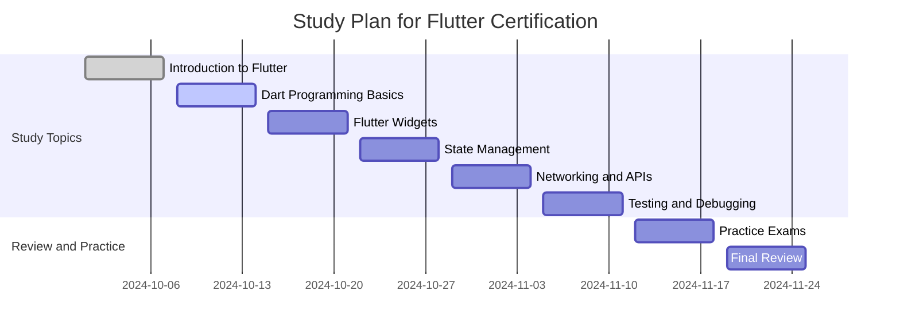
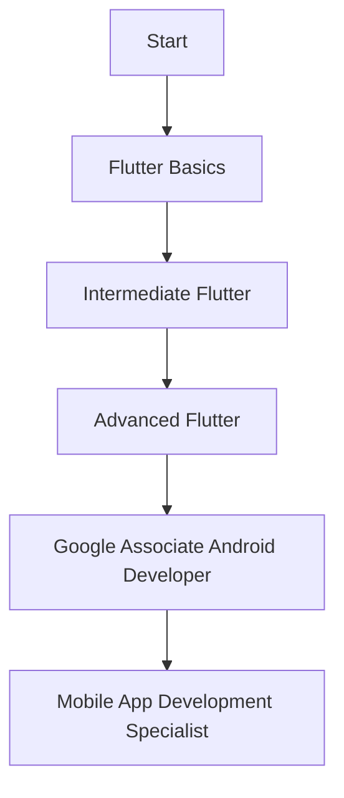

## 12.4.4 Continuous Learning and Certification

In the fast-paced world of technology, the only constant is change. As a Flutter developer, staying ahead of the curve is not just beneficial—it’s essential. Continuous learning and certification can propel your career, opening doors to new opportunities and ensuring you remain a valuable asset in the ever-evolving tech landscape. This section explores the importance of lifelong learning, the resources available to you, and the benefits of pursuing certifications.

### The Importance of Lifelong Learning

#### Technology Evolution

The tech industry is characterized by rapid advancements and innovations. New frameworks, tools, and best practices emerge regularly, and Flutter is no exception. As a Flutter developer, keeping up with these changes is crucial. Continuous learning allows you to adapt to new technologies, ensuring your skills remain relevant and competitive.

#### Career Advancement

Learning is a powerful tool for career growth. By expanding your knowledge and skills, you position yourself for promotions and new roles. Employers value professionals who are proactive about their development, and continuous learning demonstrates your commitment to excellence and adaptability.

### Learning Resources

#### Online Courses

Online platforms offer a wealth of courses tailored to Flutter development. Here are some recommended platforms:

- **Udemy**: Offers a variety of Flutter courses ranging from beginner to advanced levels.
- **Coursera**: Provides courses from top universities and institutions, often with certification options.
- **LinkedIn Learning**: Features courses that focus on practical skills and real-world applications.

These platforms allow you to learn at your own pace, making them ideal for balancing work and study.

#### Books and Tutorials

Books and tutorials are invaluable resources for deepening your understanding of Flutter. Some essential readings include:

- *Flutter in Action* by Eric Windmill
- *Beginning Flutter: A Hands-On Guide to App Development* by Marco L. Napoli
- Official Flutter documentation and tutorials available on the [Flutter website](https://flutter.dev/docs).

These resources provide comprehensive insights into Flutter development, from basic concepts to advanced techniques.

#### Workshops and Bootcamps

For immersive learning experiences, consider attending workshops and bootcamps. These programs offer hands-on training and the opportunity to learn from experienced instructors. They are particularly beneficial for those who thrive in interactive and collaborative environments.

### Certification Opportunities

#### Official Certifications

While Flutter-specific certifications are still emerging, Google offers related certifications that can enhance your credibility as a developer. For instance, the **Google Associate Android Developer** certification covers foundational skills applicable to Flutter development.

#### Related Certifications

In addition to Flutter-specific credentials, consider certifications in related areas such as mobile app development, UX/UI design, and software engineering. These certifications can broaden your skill set and increase your versatility as a developer.

### Benefits of Certification

#### Credibility

Certifications enhance your professional credibility, signaling to employers and clients that you possess verified skills and knowledge. They serve as a testament to your expertise and dedication to your craft.

#### Structured Learning

Pursuing a certification provides a structured learning path, guiding you through essential topics and ensuring comprehensive coverage of the subject matter. This structure can motivate you to stay on track and achieve your learning goals.

### Preparing for Certification

#### Study Plans

Creating a study plan is crucial for effective preparation. Outline a schedule that covers all exam topics, allocating time for review and practice. A well-organized plan helps you manage your time efficiently and reduces stress as the exam date approaches.



#### Practice Exams

Taking practice exams is an effective way to assess your readiness. They help you familiarize yourself with the exam format and identify areas where you need further study. Many certification providers offer sample tests, and online forums often have additional resources.

#### Community Support

Joining study groups or forums can provide valuable support and insights. Engaging with a community of learners allows you to share experiences, ask questions, and gain different perspectives. Platforms like [Reddit](https://www.reddit.com/r/FlutterDev/) and [Stack Overflow](https://stackoverflow.com/questions/tagged/flutter) are excellent places to connect with other Flutter developers.

### Applying Knowledge

#### Projects

Implementing what you learn in practical projects is crucial for reinforcing your knowledge. Building real-world applications helps you understand how theoretical concepts apply in practice and enhances your problem-solving skills.

#### Teaching Others

Teaching is a powerful way to solidify your understanding. Consider mentoring junior developers, writing blog posts, or creating tutorials. Sharing your knowledge not only benefits others but also deepens your own comprehension.

### Visual Aids

#### Certification Pathways

Visualizing certification pathways can help you plan your learning journey. Below is an example of a potential certification track for a Flutter developer:



#### Study Plan Templates

Organizing your study efforts is easier with a template. Here’s a basic structure you can customize:

```plaintext
Study Plan Template
-------------------
1. Goals
   - Define your certification goals and objectives.

2. Topics
   - List all topics covered in the certification exam.

3. Schedule
   - Create a timeline for studying each topic.

4. Resources
   - Identify books, courses, and other materials.

5. Practice
   - Plan time for practice exams and review.

6. Review
   - Allocate time for final review before the exam.
```

### Writing Tips

#### Motivation

Continuous learning and certification can significantly enhance your career prospects. By staying updated with the latest technologies and validating your skills through certifications, you position yourself as a leader in the field.

#### Balance

While certifications are valuable, practical experience is equally important. Strive to balance formal education with hands-on projects and real-world applications. This combination ensures you are well-rounded and capable of tackling diverse challenges.

#### Accessibility

Learning resources are available for different styles and budgets. Whether you prefer online courses, books, or interactive workshops, there are options to suit your needs. Take advantage of free resources and community support to maximize your learning potential.

## Quiz Time!



### Why is continuous learning important for Flutter developers?

- [x] To keep up with rapid technological changes
- [ ] To avoid learning new skills
- [ ] To reduce career opportunities
- [ ] To focus solely on current knowledge

> **Explanation:** Continuous learning is crucial to stay updated with the rapid changes in technology and to enhance career opportunities.

### Which platform is NOT recommended for online Flutter courses?

- [ ] Udemy
- [ ] Coursera
- [x] MySpace
- [ ] LinkedIn Learning

> **Explanation:** MySpace is not a platform for online courses. Udemy, Coursera, and LinkedIn Learning are recommended platforms.

### What is a benefit of certification?

- [x] Enhances professional credibility
- [ ] Guarantees a job
- [ ] Eliminates the need for practical experience
- [ ] Decreases learning motivation

> **Explanation:** Certification enhances professional credibility by validating skills and knowledge.

### What should a study plan include?

- [x] Goals, topics, schedule, resources, practice, and review
- [ ] Only practice exams
- [ ] A list of unrelated topics
- [ ] A single book to read

> **Explanation:** A comprehensive study plan should include goals, topics, a schedule, resources, practice exams, and review sessions.

### How can teaching others benefit your learning?

- [x] Reinforces your knowledge
- [ ] Decreases your understanding
- [x] Helps others learn
- [ ] Makes you forget the material

> **Explanation:** Teaching others reinforces your knowledge and helps others learn, enhancing your understanding of the material.

### What is a potential certification for Flutter developers?

- [x] Google Associate Android Developer
- [ ] Microsoft Office Specialist
- [ ] Adobe Photoshop Expert
- [ ] Cisco Certified Network Associate

> **Explanation:** The Google Associate Android Developer certification is relevant for Flutter developers.

### Which resource is NOT typically used for learning Flutter?

- [ ] Books
- [ ] Online courses
- [ ] Workshops
- [x] Cooking classes

> **Explanation:** Cooking classes are not relevant to learning Flutter. Books, online courses, and workshops are common resources.

### What is the role of practice exams in certification preparation?

- [x] Assess readiness and identify areas for improvement
- [ ] Guarantee passing the exam
- [ ] Replace the need for studying
- [ ] Serve as the only study material

> **Explanation:** Practice exams help assess readiness and identify areas that need further study.

### How can community support aid in learning?

- [x] Provides insights and different perspectives
- [ ] Isolate you from other learners
- [ ] Discourages asking questions
- [ ] Limits access to resources

> **Explanation:** Community support provides valuable insights, different perspectives, and encourages interaction with other learners.

### True or False: Certifications alone are sufficient for career advancement.

- [ ] True
- [x] False

> **Explanation:** Certifications are valuable, but practical experience and continuous learning are also essential for career advancement.


