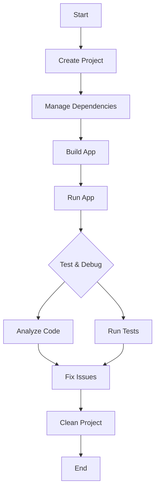

## 13.1.2 Useful Flutter CLI Commands

In the fast-paced world of mobile app development, efficiency is key. The Flutter Command-Line Interface (CLI) is a powerful tool that can significantly enhance your productivity by allowing you to perform a wide range of tasks directly from the terminal. Whether you're creating a new project, building your app, or managing dependencies, the Flutter CLI provides a streamlined way to handle these tasks. This section will serve as a comprehensive guide to the most useful Flutter CLI commands, helping you to integrate them into your development workflow effectively.

### Introduction to Flutter CLI

The Flutter CLI is an indispensable tool for developers working with Flutter. It provides a command-line interface to interact with the Flutter SDK, enabling you to create, build, test, and run Flutter apps with ease. By leveraging the CLI, you can automate repetitive tasks, manage dependencies, and quickly switch between different development environments. The convenience of performing these tasks from the terminal or command prompt cannot be overstated, especially when working on large projects or in a team setting.

### Common Commands

Let's dive into some of the most commonly used Flutter CLI commands that you'll encounter in your development journey.

#### Project Creation and Management

Creating and managing Flutter projects is one of the primary tasks you'll perform using the CLI. Here are some essential commands to get you started:

- **Creating a New Project:**

  ```bash
  flutter create my_app
  ```

  This command creates a new Flutter project named `my_app`. You can customize the project creation process using additional options:

  - `--org`: Specifies the organization identifier, e.g., `com.example`.
  - `--description`: Provides a description for your project.
  - `--platforms`: Specifies the platforms for which the project should be created, such as `android`, `ios`, `web`.

  **Example:**

  ```bash
  flutter create --org com.example --description "A new Flutter app" --platforms android,ios my_app
  ```

- **Managing Dependencies:**

  - **Fetching Packages:**

    ```bash
    flutter pub get
    ```

    This command fetches the packages listed in your `pubspec.yaml` file, ensuring that all dependencies are available for your project.

  - **Upgrading Packages:**

    ```bash
    flutter pub upgrade
    ```

    Use this command to upgrade your project's dependencies to the latest compatible versions.

#### Building and Running Apps

Once your project is set up, you'll want to build and run your app. The Flutter CLI provides several commands to facilitate this process:

- **Running the App:**

  ```bash
  flutter run
  ```

  This command runs your app on the connected device or emulator. You can specify additional options to customize the run configuration:

  - `-d [device_id]`: Specifies the device on which to run the app.
  - `--release`, `--debug`, `--profile`: Specifies the build mode.

  **Example:**

  ```bash
  flutter run -d emulator-5554 --release
  ```

- **Building an Android APK:**

  ```bash
  flutter build apk
  ```

  This command builds an Android APK file for your app. You can use options to customize the build:

  - `--release`: Builds a release version of the APK.
  - `--obfuscate`: Obfuscates Dart code to enhance security.

  **Example:**

  ```bash
  flutter build apk --release --obfuscate
  ```

#### Testing and Debugging

Testing and debugging are crucial aspects of app development. The Flutter CLI provides commands to help you ensure your app is robust and error-free:

- **Running Tests:**

  ```bash
  flutter test
  ```

  This command runs unit and widget tests for your project, helping you catch bugs early in the development process.

- **Analyzing Code:**

  ```bash
  flutter analyze
  ```

  Use this command to perform static analysis of your code, identifying potential issues and improving code quality.

- **Checking the Development Environment:**

  ```bash
  flutter doctor
  ```

  This command checks your development environment for necessary dependencies and reports any issues. It's a great way to ensure your setup is ready for Flutter development.

  **Example Output:**

  ```
  Doctor summary (to see all details, run flutter doctor -v):
  [✓] Flutter (Channel stable, 2.5.3, on macOS 11.6 20G165 darwin-x64, locale en-US)
  [✓] Android toolchain - develop for Android devices (Android SDK version 31.0.0)
  [✓] Xcode - develop for iOS and macOS
  [✓] Chrome - develop for the web
  [✓] Android Studio (version 2020.3)
  [✓] VS Code (version 1.60.2)
  [✓] Connected device (1 available)
  ```

#### Device and Emulator Management

Managing devices and emulators is another area where the Flutter CLI shines. Here are some commands to help you with this task:

- **Listing Devices:**

  ```bash
  flutter devices
  ```

  This command lists all connected devices and emulators, allowing you to choose where to run your app.

- **Managing Emulators:**

  ```bash
  flutter emulators
  ```

  This command lists available emulators. You can launch a specific emulator using:

  ```bash
  flutter emulators --launch [emulator_id]
  ```

#### Cleaning Project Build Artifacts

Over time, your project may accumulate build artifacts that can cause issues. The Flutter CLI provides a command to clean these artifacts:

- **Cleaning the Project:**

  ```bash
  flutter clean
  ```

  This command deletes the `build/` and `dart_tool/` directories, helping to resolve build issues and free up disk space.

### Advanced Commands

For more advanced use cases, the Flutter CLI offers additional commands that can enhance your development workflow:

#### Code Generation

- **Running Build Runner:**

  ```bash
  flutter pub run build_runner build
  ```

  This command runs the build runner for code generation tasks, such as generating JSON serialization code.

#### Version Management

- **Upgrading Flutter SDK:**

  ```bash
  flutter upgrade
  ```

  Use this command to upgrade your Flutter SDK to the latest version, ensuring you have access to the latest features and improvements.

- **Switching Flutter Channels:**

  ```bash
  flutter channel [channel_name]
  ```

  This command allows you to switch between different Flutter channels (`stable`, `beta`, `dev`, `master`), giving you access to different levels of stability and new features.

### Tips for Using the CLI

To make the most of the Flutter CLI, consider the following tips:

- **Create Aliases:**

  Create aliases in your terminal for frequently used commands to save time. For example, you can create an alias for `flutter run`:

  ```bash
  alias frun='flutter run'
  ```

- **Explore Help Options:**

  Use `flutter --help` and `flutter [command] --help` to explore more options and learn about additional commands.

### Visual Aids

To help you visualize the workflow of building and running an app using CLI commands, consider the following flowchart:



### Conclusion

Mastering the Flutter CLI commands can significantly enhance your development efficiency, allowing you to focus more on building great apps and less on managing your development environment. By integrating these commands into your workflow, you'll be well-equipped to handle the challenges of mobile app development with ease.

## Quiz Time!



### What command is used to create a new Flutter project?

- [x] `flutter create my_app`
- [ ] `flutter new my_app`
- [ ] `flutter init my_app`
- [ ] `flutter start my_app`

> **Explanation:** The `flutter create my_app` command is used to create a new Flutter project named `my_app`.

### How do you fetch packages listed in `pubspec.yaml`?

- [x] `flutter pub get`
- [ ] `flutter pub install`
- [ ] `flutter get packages`
- [ ] `flutter fetch packages`

> **Explanation:** The `flutter pub get` command fetches the packages listed in `pubspec.yaml`.

### Which command is used to run the app on a connected device?

- [x] `flutter run`
- [ ] `flutter execute`
- [ ] `flutter start`
- [ ] `flutter launch`

> **Explanation:** The `flutter run` command is used to run the app on a connected device or emulator.

### What option is used with `flutter run` to specify the build mode?

- [x] `--release`
- [ ] `--build`
- [ ] `--mode`
- [ ] `--compile`

> **Explanation:** The `--release`, `--debug`, and `--profile` options specify the build mode for `flutter run`.

### How do you build an Android APK in release mode?

- [x] `flutter build apk --release`
- [ ] `flutter build android --release`
- [ ] `flutter apk build --release`
- [ ] `flutter release apk`

> **Explanation:** The `flutter build apk --release` command builds an Android APK in release mode.

### Which command performs static analysis of the code?

- [x] `flutter analyze`
- [ ] `flutter lint`
- [ ] `flutter check`
- [ ] `flutter inspect`

> **Explanation:** The `flutter analyze` command performs static analysis of the code to identify possible issues.

### What command lists all connected devices and emulators?

- [x] `flutter devices`
- [ ] `flutter list devices`
- [ ] `flutter show devices`
- [ ] `flutter connected`

> **Explanation:** The `flutter devices` command lists all connected devices and emulators.

### How do you clean project build artifacts?

- [x] `flutter clean`
- [ ] `flutter purge`
- [ ] `flutter clear`
- [ ] `flutter reset`

> **Explanation:** The `flutter clean` command deletes the `build/` and `dart_tool/` directories to resolve build issues.

### Which command upgrades the Flutter SDK to the latest version?

- [x] `flutter upgrade`
- [ ] `flutter update`
- [ ] `flutter refresh`
- [ ] `flutter renew`

> **Explanation:** The `flutter upgrade` command upgrades the Flutter SDK to the latest version.

### True or False: The `flutter channel` command is used to switch between different Flutter channels.

- [x] True
- [ ] False

> **Explanation:** The `flutter channel` command allows you to switch between different Flutter channels, such as `stable`, `beta`, `dev`, and `master`.


