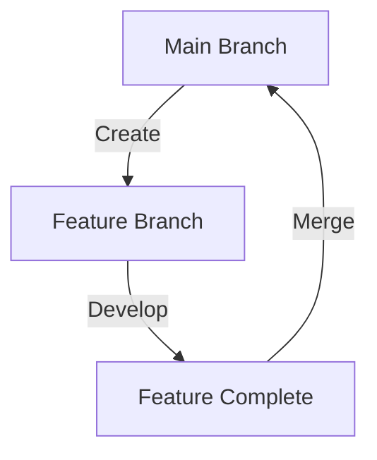

## 13.1.3 Git Commands

In the world of software development, managing code efficiently is crucial for both individual developers and teams. Git, a distributed version control system, is the backbone of modern software development, enabling developers to track changes, collaborate seamlessly, and maintain a history of code modifications. This section will guide you through essential Git commands, helping you manage your code repositories effectively and enhance your development workflow.

### Introduction to Git

Git is a powerful version control system that allows developers to track changes in their codebase over time. It is designed to handle everything from small to very large projects with speed and efficiency. Git enables multiple developers to work on the same project simultaneously without overwriting each other's changes, making it an indispensable tool for collaboration.

#### Why Use Git?

- **Version Control:** Git keeps a history of every change made to your code, allowing you to revert to previous versions if needed.
- **Collaboration:** Multiple developers can work on the same project simultaneously, with Git managing the integration of their changes.
- **Branching and Merging:** Git's branching model allows developers to work on new features or bug fixes in isolation before merging them into the main codebase.
- **Distributed System:** Every developer has a complete copy of the project history, making it resilient to data loss.

### Basic Git Workflow Commands

Understanding the basic Git workflow is essential for managing your code effectively. Let's explore some fundamental commands that form the backbone of Git operations.

#### Initializing and Cloning Repositories

Before you can start using Git, you need to initialize a repository or clone an existing one.

- **`git init`:** This command initializes a new Git repository in the current directory. It's the starting point for tracking changes in a new project.

  ```bash
  git init
  ```

- **`git clone [repository_url]`:** This command clones an existing repository from a URL, creating a local copy on your machine.

  ```bash
  git clone https://github.com/user/repository.git
  ```

#### Staging and Committing Changes

Once you have a repository, you'll frequently stage and commit changes as you develop.

- **`git status`:** Displays the status of changes in the working directory, showing which files are staged, unstaged, or untracked.

  ```bash
  git status
  ```

- **`git add [file_name]`:** Stages a specific file for commit, preparing it to be included in the next snapshot of the repository.

  ```bash
  git add example.dart
  ```

- **`git add .`:** Stages all changes in the directory, making it easier to prepare multiple files for commit.

  ```bash
  git add .
  ```

- **`git commit -m "Commit message"`:** Commits the staged changes with a descriptive message, creating a new snapshot in the repository's history.

  ```bash
  git commit -m "Add new feature to the app"
  ```

#### Branching and Merging

Branching is a powerful feature in Git that allows you to work on different parts of a project simultaneously.

- **`git branch`:** Lists all branches in the repository, highlighting the current branch.

  ```bash
  git branch
  ```

- **`git branch [branch_name]`:** Creates a new branch, allowing you to develop features or fix bugs in isolation.

  ```bash
  git branch feature-branch
  ```

- **`git checkout [branch_name]`:** Switches to the specified branch, changing the working directory to match the branch's state.

  ```bash
  git checkout feature-branch
  ```

- **`git merge [branch_name]`:** Merges the specified branch into the current branch, integrating changes.

  ```bash
  git merge feature-branch
  ```



#### Fetching and Pulling Updates

Keeping your local repository up-to-date with the remote repository is crucial for collaboration.

- **`git fetch`:** Retrieves updates from the remote repository without merging them into your local branch.

  ```bash
  git fetch
  ```

- **`git pull`:** Fetches and merges updates from the remote repository into your current branch.

  ```bash
  git pull
  ```

#### Pushing Changes

After committing changes locally, you'll often need to push them to a remote repository.

- **`git push`:** Pushes committed changes to the remote repository, updating the branch.

  ```bash
  git push
  ```

- **`git push origin [branch_name]`:** Pushes a specific branch to the remote repository, useful for sharing feature branches.

  ```bash
  git push origin feature-branch
  ```

### Advanced Git Commands

Beyond the basics, Git offers advanced commands for undoing changes, stashing work, and viewing history.

#### Undoing Changes

Mistakes happen, and Git provides several ways to undo changes.

- **`git checkout -- [file_name]`:** Discards changes in the working directory for the specified file, reverting it to the last committed state.

  ```bash
  git checkout -- example.dart
  ```

- **`git reset HEAD~1`:** Reverts the last commit, moving changes back to the staging area.

  ```bash
  git reset HEAD~1
  ```

- **`git revert [commit_hash]`:** Creates a new commit that reverses the changes from a specific commit, preserving history.

  ```bash
  git revert abc123
  ```

#### Stashing Changes

Sometimes you need to switch branches or work on something else without committing incomplete work.

- **`git stash`:** Saves changes for later use and cleans the working directory.

  ```bash
  git stash
  ```

- **`git stash apply`:** Applies stashed changes to the working directory, allowing you to continue where you left off.

  ```bash
  git stash apply
  ```

#### Viewing History

Understanding the history of changes is crucial for tracking progress and debugging.

- **`git log`:** Shows the commit history, providing detailed information about each commit.

  ```bash
  git log
  ```

- **`git log --oneline`:** Displays a simplified commit history, showing one commit per line.

  ```bash
  git log --oneline
  ```

### Collaboration Commands

Git excels at enabling collaboration, with commands designed for working with remote repositories and facilitating code reviews.

#### Working with Remote Repositories

Remote repositories allow teams to collaborate on projects, sharing changes and updates.

- **`git remote -v`:** Lists remote repositories, showing their URLs.

  ```bash
  git remote -v
  ```

- **`git remote add [name] [url]`:** Adds a new remote repository, allowing you to push and pull changes.

  ```bash
  git remote add origin https://github.com/user/repository.git
  ```

#### Pull Requests and Code Reviews

Pull requests are a key feature of platforms like GitHub and GitLab, enabling developers to propose changes and request reviews.

- **Pull Requests:** Allow developers to propose changes to a repository, facilitating discussion and review before merging.

- **Code Reviews:** Encourage best practices by having peers review changes, improving code quality and knowledge sharing.

### Tips for Effective Git Usage

To make the most of Git, consider these best practices:

#### Commit Messages

- Write clear and concise commit messages that describe the changes made.
- Use the imperative mood (e.g., "Add feature" instead of "Added feature").

#### Branch Naming Conventions

- Use meaningful branch names that describe the purpose of the branch (e.g., `feature/login-page`).
- Follow a consistent naming convention across your team.

#### Regular Commits

- Commit changes frequently to keep track of progress and make it easier to identify issues.
- Smaller, frequent commits are easier to review and manage than large, infrequent ones.

### Visual Aids

#### Command Examples

Throughout this section, we've used code blocks to display Git commands, making it easy to follow along and practice.

#### Diagrams

We've included flowcharts to illustrate branching and merging processes, helping you visualize how Git manages changes.

#### Screenshots

Consider using screenshots of Git status and log outputs to familiarize yourself with what to expect when running these commands.

### Conclusion

Mastering Git commands is essential for any developer looking to manage their code effectively and collaborate with others. By understanding the basics and exploring advanced features, you'll be well-equipped to handle any version control challenge that comes your way.

## Quiz Time!



### What is the purpose of the `git init` command?

- [x] To initialize a new Git repository in the current directory
- [ ] To clone an existing repository
- [ ] To commit changes to a repository
- [ ] To merge branches

> **Explanation:** The `git init` command initializes a new Git repository in the current directory, setting up the necessary files for version control.

### Which command is used to stage all changes in the directory?

- [ ] `git commit`
- [ ] `git status`
- [x] `git add .`
- [ ] `git push`

> **Explanation:** The `git add .` command stages all changes in the directory, preparing them for the next commit.

### How do you switch to a different branch in Git?

- [ ] `git merge [branch_name]`
- [x] `git checkout [branch_name]`
- [ ] `git branch [branch_name]`
- [ ] `git pull [branch_name]`

> **Explanation:** The `git checkout [branch_name]` command switches to the specified branch, updating the working directory to match that branch's state.

### What does the `git fetch` command do?

- [ ] Merges updates from the remote repository
- [x] Retrieves updates from the remote repository without merging
- [ ] Pushes changes to the remote repository
- [ ] Deletes a branch

> **Explanation:** The `git fetch` command retrieves updates from the remote repository without merging them into your local branch, allowing you to review changes before integrating them.

### Which command is used to discard changes in the working directory for a specific file?

- [ ] `git commit`
- [ ] `git add`
- [x] `git checkout -- [file_name]`
- [ ] `git push`

> **Explanation:** The `git checkout -- [file_name]` command discards changes in the working directory for the specified file, reverting it to the last committed state.

### What is the purpose of the `git stash` command?

- [x] To save changes for later use and clean the working directory
- [ ] To commit changes to the repository
- [ ] To merge branches
- [ ] To delete a branch

> **Explanation:** The `git stash` command saves changes for later use and cleans the working directory, allowing you to switch contexts without committing incomplete work.

### How can you view a simplified commit history?

- [ ] `git status`
- [ ] `git add`
- [x] `git log --oneline`
- [ ] `git push`

> **Explanation:** The `git log --oneline` command displays a simplified commit history, showing one commit per line for easy reading.

### What is a pull request?

- [ ] A command to pull changes from a remote repository
- [x] A proposal to merge changes into a repository, often used for code review
- [ ] A command to push changes to a remote repository
- [ ] A method to discard changes in the working directory

> **Explanation:** A pull request is a proposal to merge changes into a repository, often used for code review and discussion before integration.

### Why is it important to write clear commit messages?

- [x] To describe the changes made and facilitate understanding among team members
- [ ] To increase the size of the repository
- [ ] To make the repository private
- [ ] To delete old commits

> **Explanation:** Clear commit messages describe the changes made, facilitating understanding among team members and making it easier to track progress and identify issues.

### True or False: Git is a centralized version control system.

- [ ] True
- [x] False

> **Explanation:** False. Git is a distributed version control system, meaning each developer has a complete copy of the project history, making it resilient to data loss.


