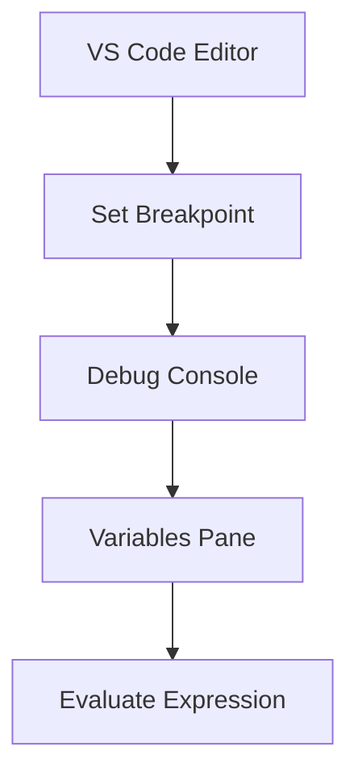
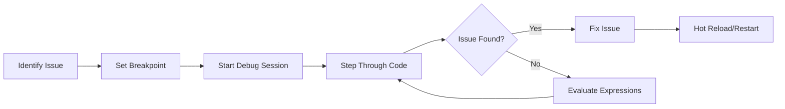

## 13.1.4 Debugging Shortcuts

Debugging is an integral part of the software development process, especially in mobile app development where user experience is paramount. In Flutter, a comprehensive understanding of debugging tools and shortcuts can significantly enhance your productivity and efficiency. This section will guide you through the essential debugging shortcuts and techniques in Flutter, utilizing popular IDEs like Visual Studio Code and Android Studio, as well as the powerful Flutter DevTools.

### Understanding Debugging Tools

Before diving into shortcuts and techniques, it's crucial to familiarize yourself with the debugging tools available in your development environment. Both Visual Studio Code and Android Studio offer robust debugging capabilities tailored for Flutter development.

#### Visual Studio Code

Visual Studio Code (VS Code) is a lightweight yet powerful code editor that supports Flutter development through extensions. It provides a seamless debugging experience with features like breakpoints, variable inspection, and a debug console.

#### Android Studio

Android Studio, the official IDE for Android development, offers comprehensive support for Flutter. It includes advanced debugging features such as the Flutter Inspector, which allows you to examine the widget tree and layout issues.

#### Flutter DevTools

Flutter DevTools is a suite of performance and debugging tools for Flutter applications. It provides in-depth analysis of your app's performance, including memory usage, CPU profiling, and network requests.

### Debugging Shortcuts and Techniques

Mastering debugging shortcuts can drastically reduce the time spent identifying and fixing issues in your Flutter applications. Let's explore some of the most effective shortcuts and techniques.

#### Setting Breakpoints

Breakpoints allow you to pause the execution of your code at specific lines, enabling you to inspect the state of your application.

- **In Visual Studio Code:**
  - Click in the gutter next to the line number or use `F9` to toggle a breakpoint.
  
- **In Android Studio:**
  - Click in the gutter or use `Ctrl + F8` (`Cmd + F8` on macOS) to set a breakpoint.

#### Starting a Debug Session

Initiating a debug session lets you run your application in debug mode, providing access to various debugging tools.

- **Visual Studio Code:**
  - Use `F5` to start a debug session.

- **Android Studio:**
  - Click the Debug button or use `Shift + F9`.

#### Stepping Through Code

Stepping through code allows you to execute your program line by line, helping you understand the flow and identify issues.

- **Step Over:**
  - `F10` in both VS Code and Android Studio.

- **Step Into:**
  - `F11` in VS Code; `F7` in Android Studio.

- **Step Out:**
  - `Shift + F11` in VS Code; `Shift + F8` in Android Studio.

#### Evaluating Expressions

During a debug session, you can evaluate expressions to inspect the current state of variables and expressions.

- Use the Debug Console in VS Code or the Evaluate Expression window in Android Studio.

#### Inspecting Variables

Inspecting variables is crucial for understanding the current state of your application.

- Hover over variables to see their current values.
- Use the Variables pane to watch variable states and changes.

#### Conditional Breakpoints

Conditional breakpoints allow you to pause execution only when certain criteria are met, making them useful for isolating specific issues.

- Right-click on a breakpoint to add conditions in both VS Code and Android Studio.

#### Debugging Widgets

Flutter's widget-based architecture can sometimes lead to complex UI issues. Use the following tools to debug widgets effectively:

- **Flutter Inspector:** Examine the widget tree and layout issues.
- **debugPrint and debugDumpApp:** Use these functions to print widget information to the console.

### Hot Reload and Hot Restart

Flutter's hot reload and hot restart features are invaluable for rapid development and debugging.

#### Hot Reload

Hot reload allows you to inject updated source code into the running Dart Virtual Machine (VM) without losing the current state.

- Use `r` in the terminal or click the Hot Reload button in your IDE.

#### Hot Restart

Hot restart completely restarts your application, losing the current state but ensuring all code changes are applied.

- Use `R` in the terminal or the corresponding IDE button.

### Common Debugging Shortcuts

Familiarize yourself with these common shortcuts to streamline your debugging workflow.

#### Visual Studio Code

- `Ctrl + Shift + F5` (`Cmd + Shift + F5`): Restart debugger.
- `Shift + F5`: Stop debugging.
- `Ctrl + Shift + M` (`Cmd + Shift + M`): Show Problems panel.

#### Android Studio

- `Alt + F9` (`Option + F9`): Resume program.
- `Alt + F8` (`Option + F8`): Evaluate expression.
- `Ctrl + Alt + F5` (`Cmd + Option + F5`): Drop frame.

### Advanced Techniques

For more complex debugging scenarios, consider using advanced techniques and tools.

#### Using the Dart Observatory

The Dart Observatory is a powerful tool for profiling and inspecting Dart applications. It provides insights into memory usage, CPU profiling, and more.

#### Logging and Error Tracking

Implement logging mechanisms to capture errors in production. Tools like Sentry and Firebase Crashlytics can help you track and analyze errors in real-time.

### Visual Aids

To enhance your understanding, let's look at some visual aids that illustrate the debugging process.

#### IDE Screenshots

Below is an annotated screenshot showing how to set breakpoints and use debugging windows in Visual Studio Code.

#### Flowcharts

Here's a flowchart mapping out the debugging process from identifying an issue to resolving it.

### Writing Tips

When debugging, it's essential to maintain a practical focus and clarity. Use real-world examples that readers are likely to encounter, and explain technical terms related to debugging. Encourage readers by assuring them that debugging is a vital skill that improves with practice.

### Conclusion

Debugging is an essential skill for any Flutter developer. By mastering the tools and techniques outlined in this section, you can efficiently identify and resolve issues, leading to a smoother development process and a more robust application. Remember, practice makes perfect, and the more you debug, the more proficient you'll become.

## Quiz Time!



### What is the shortcut to start a debug session in Visual Studio Code?

- [x] F5
- [ ] F9
- [ ] Ctrl + F5
- [ ] Shift + F9

> **Explanation:** In Visual Studio Code, pressing F5 starts a debug session.

### Which tool allows you to examine the widget tree in a Flutter app?

- [x] Flutter Inspector
- [ ] Dart Observatory
- [ ] Debug Console
- [ ] Variables Pane

> **Explanation:** The Flutter Inspector is used to examine the widget tree and layout issues in a Flutter app.

### How do you set a breakpoint in Android Studio?

- [x] Ctrl + F8 (Cmd + F8 on macOS)
- [ ] F9
- [ ] Shift + F8
- [ ] Alt + F9

> **Explanation:** In Android Studio, you set a breakpoint by clicking in the gutter or using Ctrl + F8 (Cmd + F8 on macOS).

### What is the purpose of a conditional breakpoint?

- [x] To pause execution only when certain criteria are met
- [ ] To stop execution at every line
- [ ] To evaluate expressions
- [ ] To restart the debugger

> **Explanation:** Conditional breakpoints pause execution only when specific conditions are met, allowing for more targeted debugging.

### Which shortcut is used for hot reload in the terminal?

- [x] r
- [ ] R
- [ ] Ctrl + R
- [ ] Shift + R

> **Explanation:** Typing 'r' in the terminal triggers a hot reload in Flutter.

### What does the Dart Observatory provide?

- [x] Profiling and inspecting Dart applications
- [ ] Widget tree examination
- [ ] Debugging console
- [ ] Variable inspection

> **Explanation:** The Dart Observatory provides profiling and inspection tools for Dart applications.

### Which shortcut stops debugging in Visual Studio Code?

- [x] Shift + F5
- [ ] Ctrl + Shift + F5
- [ ] F5
- [ ] Alt + F9

> **Explanation:** Shift + F5 stops debugging in Visual Studio Code.

### How can you evaluate expressions in Android Studio?

- [x] Alt + F8 (Option + F8 on macOS)
- [ ] Ctrl + F8
- [ ] F8
- [ ] Shift + F8

> **Explanation:** Alt + F8 (Option + F8 on macOS) is used to evaluate expressions in Android Studio.

### What is the shortcut to step over code in Visual Studio Code?

- [x] F10
- [ ] F11
- [ ] Shift + F11
- [ ] Ctrl + F10

> **Explanation:** F10 is used to step over code in Visual Studio Code.

### Hot restart in Flutter does what?

- [x] True
- [ ] False

> **Explanation:** Hot restart completely restarts the app, losing the current state but applying all code changes.


