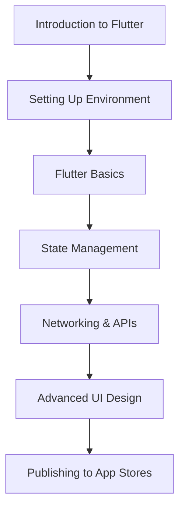
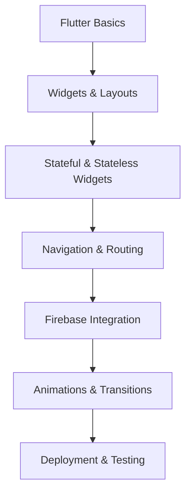
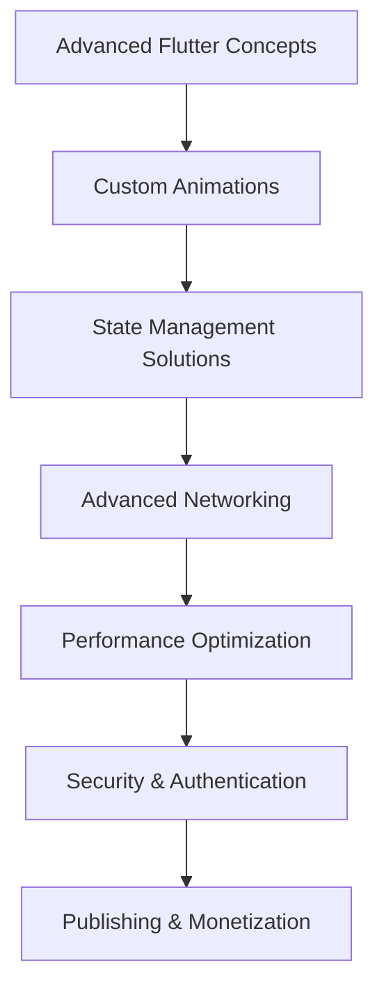

## 13.2.3 Online Courses and Videos

In the rapidly evolving world of mobile app development, staying updated with the latest technologies and frameworks is crucial. Flutter, a UI toolkit by Google, has gained immense popularity for building natively compiled applications for mobile, web, and desktop from a single codebase. To help you master Flutter and Dart, we've curated a list of top online courses and video resources that cater to different skill levels. Whether you're a beginner looking to get started or an experienced developer aiming to enhance your skills, these resources offer structured learning paths with expert guidance.

### Online Courses

#### "The Complete 2023 Flutter & Dart Development Bootcamp with Angela Yu"

- **Platform:** [Udemy](https://www.udemy.com/course/flutter-bootcamp-with-dart/)
- **Overview:**
  - This comprehensive course covers everything from the basics of Flutter and Dart to advanced concepts. It's designed to take you from zero to hero in Flutter development.
- **Features:**
  - Interactive projects and quizzes to reinforce learning.
  - Lifetime access to course materials, allowing you to learn at your own pace.
  - Regular updates to keep the content relevant with the latest Flutter releases.

**Course Outline:**

- **Skill Level:** Beginner to Intermediate
- **Community Feedback:** Highly rated for its engaging teaching style and comprehensive content.

#### "Learn Flutter & Dart to Build iOS & Android Apps" by Maximilian Schwarzmüller

- **Platform:** [Udemy](https://www.udemy.com/course/learn-flutter-dart-to-build-ios-android-apps/)
- **Overview:**
  - This in-depth course focuses on practical applications and projects, providing a hands-on approach to learning Flutter.
- **Features:**
  - Real-world projects to apply your knowledge.
  - Detailed explanations of core concepts and best practices.
  - Access to a supportive community of learners and instructors.

**Course Outline:**

- **Skill Level:** Intermediate
- **Community Feedback:** Praised for its clarity and depth, especially in explaining complex topics.

#### "Flutter Development" Nanodegree Program

- **Platform:** [Udacity](https://www.udacity.com/course/flutter-nanodegree--nd013)
- **Overview:**
  - This advanced program is designed for developers looking to build professional-level Flutter apps. It covers advanced topics and industry best practices.
- **Features:**
  - Project-based learning with real-world scenarios.
  - Mentorship and career services to help you succeed in the tech industry.
  - Access to a network of industry experts and peers.

**Course Outline:**

- **Skill Level:** Advanced
- **Community Feedback:** Valued for its rigorous curriculum and practical approach to learning.

### YouTube Channels

#### Flutter Official Channel

- **Overview:**
  - The official Flutter YouTube channel offers a wealth of resources, including tutorials, the "Widget of the Week" series, and updates on the latest Flutter features.
- **Features:**
  - Direct insights from the Flutter team.
  - Short, focused videos that are easy to digest.
  - Regular updates and new content.

**Channel Highlights:**

- **Widget of the Week:** A series that explores different Flutter widgets, showcasing their functionality and use cases.
- **Flutter in Focus:** Deep dives into specific Flutter topics and best practices.

#### Fireship

- **Overview:**
  - Fireship provides quick, informative videos on Flutter and related technologies, making it a great resource for developers looking to learn efficiently.
- **Features:**
  - Concise, high-quality videos that cover a wide range of topics.
  - Engaging presentation style that keeps viewers interested.
  - Regularly updated content to reflect the latest trends and technologies.

**Channel Highlights:**

- **10-Minute Flutter Apps:** Quick tutorials that guide you through building complete Flutter apps in a short time.
- **Tech Explainers:** Videos that break down complex topics into easy-to-understand segments.

#### The Net Ninja

- **Overview:**
  - The Net Ninja offers a series of beginner-friendly Flutter tutorials, perfect for those just starting their journey in Flutter development.
- **Features:**
  - Step-by-step tutorials that build on each other.
  - Clear explanations and practical examples.
  - A supportive community of learners.

**Channel Highlights:**

- **Flutter for Beginners:** A series that introduces the basics of Flutter and Dart, helping new developers get started.
- **Advanced Flutter Tutorials:** More complex topics for those looking to deepen their understanding of Flutter.

### Why These Courses and Channels?

#### Expert Instructors

These courses and channels are taught by experienced developers and educators who bring a wealth of knowledge and practical insights to their teaching. Their expertise ensures that you receive high-quality instruction and guidance throughout your learning journey.

#### Comprehensive Content

The resources cover a wide range of topics, from fundamental concepts to advanced techniques, ensuring a well-rounded understanding of Flutter and Dart. With practical exercises and real-world projects, you'll gain hands-on experience that prepares you for real-world development challenges.

#### Accessibility

All the recommended courses and channels are available online, often with flexible pacing options. This allows you to learn at your own speed and convenience, making it easier to fit learning into your schedule.

### Visual Aids

To give you a better idea of what to expect, here are some visual aids showcasing course outlines and YouTube channel thumbnails:

**Course Screenshots:**

- **Angela Yu's Course:**

- **Maximilian Schwarzmüller's Course:**

**Channel Thumbnails:**

- **Flutter Official Channel:**

- **Fireship:**

### Recommendations Based on Skill Level

- **Beginners:** Start with "The Complete 2023 Flutter & Dart Development Bootcamp with Angela Yu" or "The Net Ninja" YouTube channel to build a solid foundation.
- **Intermediate Learners:** "Learn Flutter & Dart to Build iOS & Android Apps" by Maximilian Schwarzmüller offers more depth and practical applications.
- **Advanced Developers:** The "Flutter Development" Nanodegree Program on Udacity provides advanced topics and industry insights.

### Direct Links

- [The Complete 2023 Flutter & Dart Development Bootcamp with Angela Yu](https://www.udemy.com/course/flutter-bootcamp-with-dart/)
- [Learn Flutter & Dart to Build iOS & Android Apps by Maximilian Schwarzmüller](https://www.udemy.com/course/learn-flutter-dart-to-build-ios-android-apps/)
- [Flutter Development Nanodegree Program](https://www.udacity.com/course/flutter-nanodegree--nd013)
- [Flutter Official Channel](https://www.youtube.com/c/flutterdev)
- [Fireship](https://www.youtube.com/c/Fireship)
- [The Net Ninja](https://www.youtube.com/c/TheNetNinja)

### Community Feedback

These courses and channels have received positive reviews and ratings from learners worldwide. They are praised for their engaging content, expert instruction, and practical approach to teaching Flutter and Dart.

## Quiz Time!



### Which course is recommended for beginners to start learning Flutter?

- [x] The Complete 2023 Flutter & Dart Development Bootcamp with Angela Yu
- [ ] Flutter Development Nanodegree Program
- [ ] Learn Flutter & Dart to Build iOS & Android Apps by Maximilian Schwarzmüller
- [ ] Fireship YouTube Channel

> **Explanation:** Angela Yu's course is designed to take beginners from zero to hero in Flutter development.

### What is a unique feature of the Fireship YouTube channel?

- [x] Quick, informative videos on Flutter and related technologies
- [ ] Long, detailed lectures on Flutter
- [ ] Only covers basic Flutter concepts
- [ ] Focuses solely on Dart programming

> **Explanation:** Fireship is known for its concise, high-quality videos that cover a wide range of topics efficiently.

### Which platform offers the "Flutter Development" Nanodegree Program?

- [x] Udacity
- [ ] Udemy
- [ ] Coursera
- [ ] edX

> **Explanation:** The "Flutter Development" Nanodegree Program is available on Udacity.

### What series does the Flutter Official Channel offer to explore different widgets?

- [x] Widget of the Week
- [ ] Flutter Widgets Explained
- [ ] Weekly Widget Wonders
- [ ] Widgets 101

> **Explanation:** "Widget of the Week" is a series on the Flutter Official Channel that explores different Flutter widgets.

### Which course provides mentorship and career services?

- [x] Flutter Development Nanodegree Program
- [ ] The Complete 2023 Flutter & Dart Development Bootcamp with Angela Yu
- [ ] Learn Flutter & Dart to Build iOS & Android Apps by Maximilian Schwarzmüller
- [ ] The Net Ninja YouTube Channel

> **Explanation:** The Nanodegree Program on Udacity includes mentorship and career services.

### What is the focus of Maximilian Schwarzmüller's Flutter course?

- [x] Practical applications and projects
- [ ] Theoretical concepts only
- [ ] Basic Flutter introduction
- [ ] Advanced Dart programming

> **Explanation:** Maximilian's course focuses on practical applications and projects to provide a hands-on learning experience.

### Which YouTube channel is recommended for beginner-friendly Flutter tutorials?

- [x] The Net Ninja
- [ ] Fireship
- [ ] Flutter Official Channel
- [ ] Maximilian Schwarzmüller

> **Explanation:** The Net Ninja offers a series of beginner-friendly Flutter tutorials.

### What is a common feature of the recommended online courses?

- [x] Lifetime access to course materials
- [ ] Limited access for one year
- [ ] Only available offline
- [ ] No practical exercises

> **Explanation:** The recommended courses offer lifetime access to course materials, allowing learners to study at their own pace.

### Which course is known for its engaging teaching style and comprehensive content?

- [x] The Complete 2023 Flutter & Dart Development Bootcamp with Angela Yu
- [ ] Flutter Development Nanodegree Program
- [ ] Learn Flutter & Dart to Build iOS & Android Apps by Maximilian Schwarzmüller
- [ ] Fireship YouTube Channel

> **Explanation:** Angela Yu's course is highly rated for its engaging teaching style and comprehensive content.

### True or False: The "Flutter Development" Nanodegree Program is designed for beginners.

- [ ] True
- [x] False

> **Explanation:** The Nanodegree Program is designed for advanced learners looking to build professional-level Flutter apps.


