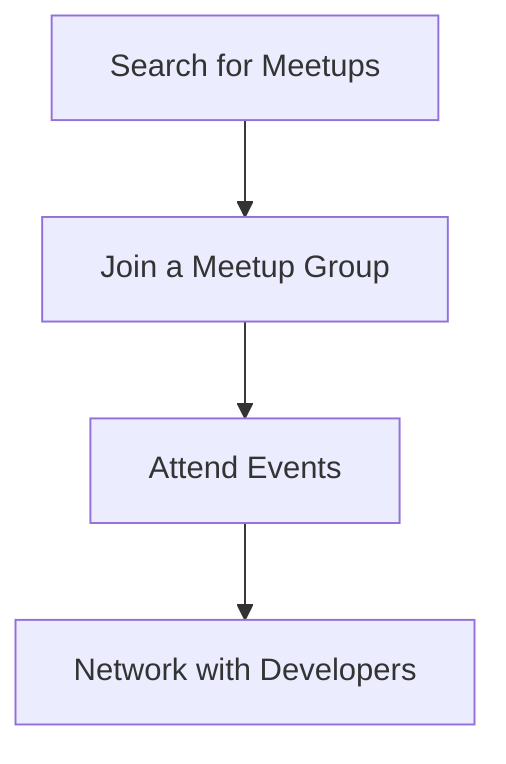

---

linkTitle: "13.2.4 Community Forums and Support"
title: "Community Forums and Support: Navigating the Flutter Developer Ecosystem"
description: "Explore the vibrant community forums and support channels available for Flutter developers to enhance learning, collaboration, and project success."
categories:
- Flutter Development
- Community Engagement
- Developer Support
tags:
- Flutter
- Community
- Support
- Forums
- Developer Resources
date: 2024-10-25
type: docs
nav_weight: 13240

canonical: "https://fluttermasterylibrary.com/2/13/2/4"
license: "© 2023 Tokenizer Inc. CC BY-NC-SA 4.0"
---

## 13.2.4 Community Forums and Support

Embarking on your journey to publish your first Flutter app is an exciting venture filled with learning opportunities and challenges. One of the most valuable resources at your disposal is the vibrant and supportive Flutter community. This section will guide you through the various forums and support channels where you can seek help, share knowledge, and connect with other Flutter developers. Whether you're troubleshooting a tricky bug, looking for feedback on your app, or simply wanting to stay updated with the latest in Flutter development, these platforms are invaluable.

### Online Forums

Online forums are a cornerstone of the developer community, providing a platform for asking questions, sharing solutions, and engaging in discussions. Here are some of the most popular forums for Flutter developers:

#### Stack Overflow (Flutter Tag)

- **[Stack Overflow Flutter Questions](https://stackoverflow.com/questions/tagged/flutter)**
- **Purpose:** Stack Overflow is a question-and-answer site where developers can ask technical questions and receive answers from the community. The Flutter tag is specifically dedicated to questions related to Flutter development.

**How to Use Stack Overflow Effectively:**

1. **Search Before You Ask:** Before posting a new question, search the existing questions to see if your issue has already been addressed.
2. **Be Specific:** Clearly describe your problem, including what you have tried and any error messages you are encountering.
3. **Use Code Snippets:** Include relevant code snippets to help others understand your issue better.
4. **Tag Appropriately:** Use the appropriate tags to categorize your question, making it easier for others to find and answer.

**Example Code Snippet:**

```dart
// Example of a Flutter widget that might be causing an issue
class MyWidget extends StatelessWidget {
  @override
  Widget build(BuildContext context) {
    return Container(
      child: Text('Hello, Flutter!'),
    );
  }
}
```

#### Reddit r/FlutterDev

- **[r/FlutterDev](https://www.reddit.com/r/FlutterDev/)**
- **Purpose:** This subreddit is a community-driven platform where developers can participate in discussions, share their projects, and stay updated on the latest news in the Flutter ecosystem.

**Engaging with r/FlutterDev:**

1. **Participate in Discussions:** Engage with posts by commenting and sharing your insights or experiences.
2. **Share Your Projects:** Showcase your Flutter projects to receive feedback and suggestions from the community.
3. **Stay Informed:** Follow discussions about new Flutter releases, tools, and libraries.

### Official Channels

The Flutter team maintains several official channels to facilitate real-time communication and collaboration among developers.

#### Flutter Community Slack

- **[Join Flutter Slack](https://flutter.dev/community)**
- **Purpose:** Slack is a real-time messaging platform where developers can chat with each other, organized by specific topics or interests.

**Getting the Most Out of Flutter Slack:**

1. **Join Relevant Channels:** Participate in channels that match your interests or areas where you need support.
2. **Engage in Real-Time Discussions:** Use Slack for quick questions or to engage in ongoing discussions.
3. **Respect Community Guidelines:** Follow the community guidelines to maintain a positive and respectful environment.

#### Flutter Discord Server

- **[Flutter Community Discord](https://discord.gg/flutter)**
- **Purpose:** Discord is another real-time communication platform where developers can engage in discussions, find collaborations, and get support.

**Navigating the Flutter Discord Server:**

1. **Explore Different Channels:** Discord servers are organized into channels based on topics, such as #general, #help, and #showcase.
2. **Collaborate on Projects:** Find other developers to collaborate with on open-source projects or hackathons.
3. **Participate in Events:** Join community events and discussions hosted on Discord.

### Local Meetups

Networking with local developers can provide additional support and opportunities for collaboration. Meetup.com is a great resource for finding Flutter meetups in your area.

#### Meetup.com

- **Purpose:** Meetup.com allows you to search for local Flutter meetups, where you can network with other developers, attend workshops, and participate in talks.

**Finding and Joining Meetups:**

1. **Search for Flutter Meetups:** Use Meetup.com to find groups and events related to Flutter development in your area.
2. **Attend Events:** Participate in workshops, talks, and networking events to learn from others and share your experiences.
3. **Connect with Local Developers:** Build relationships with other developers in your community for support and collaboration.

**Visual Aid: Map of Meetup Locations**



### Contributing to the Community

Contributing to the Flutter community not only helps others but also enhances your own skills and reputation as a developer.

#### GitHub Repositories

- **Purpose:** Participating in open-source projects on GitHub is a great way to contribute to the community and improve your coding skills.

**How to Contribute:**

1. **Find Projects:** Search for Flutter projects on GitHub that interest you and align with your skills.
2. **Submit Pull Requests:** Contribute code improvements, bug fixes, or new features to existing projects.
3. **Engage with Maintainers:** Communicate with project maintainers to understand the project's needs and guidelines.

#### Community Events

- **Purpose:** Events like Flutter Engage, hackathons, and conferences provide opportunities to learn, network, and contribute to the community.

**Participating in Events:**

1. **Attend Conferences:** Participate in conferences to learn from industry experts and connect with other developers.
2. **Join Hackathons:** Engage in hackathons to work on projects, learn new skills, and collaborate with others.
3. **Stay Informed:** Follow announcements for upcoming events and participate actively.

### Visual Aids and Screenshots

Including visual aids such as screenshots and maps can enhance your understanding of how to navigate these platforms.

#### Example Screenshot of a Forum Interface


#### Map of Local Meetup Locations


### Writing Tips

When engaging with the Flutter community, it's important to maintain a welcoming and respectful tone. Here are some tips for effective communication:

#### Inclusivity

- **Encourage Participation:** Welcome developers of all levels to participate in discussions and share their experiences.
- **Be Respectful:** Treat others with respect and kindness, regardless of their skill level or background.

#### Etiquette Tips

- **Ask Questions Respectfully:** When asking questions, be polite and appreciative of the help you receive.
- **Contribute Positively:** Share your knowledge and experiences to help others in the community.

#### Accessibility

- **Ensure Active Links:** Make sure all links are active and lead directly to the relevant resources.
- **Provide Clear Instructions:** When sharing resources or solutions, provide clear and concise instructions.

### Conclusion

The Flutter community is a rich and diverse ecosystem that offers numerous opportunities for learning, collaboration, and support. By actively participating in forums, official channels, local meetups, and community events, you can enhance your skills, build valuable connections, and contribute to the growth of the Flutter ecosystem. Remember to engage respectfully and inclusively, and take advantage of the wealth of resources available to you.

## Quiz Time!



### Which platform is specifically designed for asking technical questions and receiving answers from the developer community?

- [x] Stack Overflow
- [ ] Reddit
- [ ] Discord
- [ ] Meetup.com

> **Explanation:** Stack Overflow is a question-and-answer site where developers can ask technical questions and receive answers from the community.

### What is the primary purpose of the r/FlutterDev subreddit?

- [ ] Real-time chat
- [x] Community-driven discussions and project sharing
- [ ] Organizing local meetups
- [ ] Hosting hackathons

> **Explanation:** The r/FlutterDev subreddit is a platform for community-driven discussions, sharing projects, and staying updated on Flutter news.

### Which platform offers real-time messaging organized by specific topics or interests?

- [x] Slack
- [ ] Meetup.com
- [ ] Reddit
- [ ] GitHub

> **Explanation:** Slack is a real-time messaging platform where developers can chat with each other, organized by specific topics or interests.

### How can you contribute to open-source projects on GitHub?

- [x] Submit pull requests
- [ ] Attend conferences
- [ ] Join Slack channels
- [ ] Post questions on Stack Overflow

> **Explanation:** You can contribute to open-source projects on GitHub by submitting pull requests with code improvements, bug fixes, or new features.

### What is the benefit of attending local Flutter meetups?

- [ ] Real-time chat with developers
- [x] Networking with local developers and attending workshops
- [ ] Asking technical questions
- [ ] Sharing projects online

> **Explanation:** Attending local Flutter meetups allows you to network with local developers, attend workshops, and participate in talks.

### Which platform is used for organizing and finding local meetups?

- [ ] Stack Overflow
- [ ] Slack
- [ ] Discord
- [x] Meetup.com

> **Explanation:** Meetup.com is used for organizing and finding local meetups related to various interests, including Flutter development.

### What should you do before posting a new question on Stack Overflow?

- [x] Search existing questions
- [ ] Join a Slack channel
- [ ] Attend a meetup
- [ ] Submit a pull request

> **Explanation:** Before posting a new question on Stack Overflow, you should search the existing questions to see if your issue has already been addressed.

### Which event provides opportunities to learn from industry experts and connect with other developers?

- [x] Conferences
- [ ] Subreddits
- [ ] GitHub repositories
- [ ] Slack channels

> **Explanation:** Conferences provide opportunities to learn from industry experts and connect with other developers.

### How can you engage with the Flutter community on Discord?

- [x] Explore different channels and collaborate on projects
- [ ] Post questions on Stack Overflow
- [ ] Attend local meetups
- [ ] Submit pull requests

> **Explanation:** On Discord, you can explore different channels, collaborate on projects, and participate in community events and discussions.

### True or False: Inclusivity and respect are important when engaging with the Flutter community.

- [x] True
- [ ] False

> **Explanation:** Inclusivity and respect are crucial when engaging with the Flutter community to maintain a welcoming and supportive environment.




