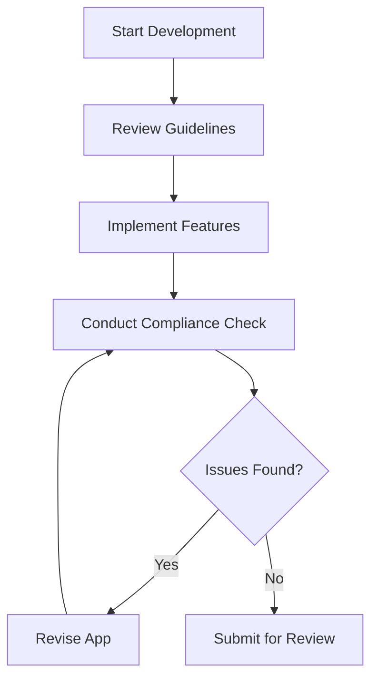

## 13.3.1 App Store Guidelines

Publishing an app on major platforms like the Apple App Store and Google Play Store is a significant milestone for any developer. However, this process comes with its own set of challenges, primarily ensuring compliance with each platform's guidelines. These guidelines are crucial as they not only protect users but also maintain the quality and integrity of the app ecosystem. In this section, we will delve into the essential guidelines provided by Apple and Google, offering insights and practical advice to help you navigate these requirements successfully.

### Understanding the Importance of App Store Guidelines

Before diving into the specifics, it's important to understand why these guidelines exist. Both Apple and Google have established comprehensive policies to:

- **Protect User Privacy and Security:** Ensuring that apps handle user data responsibly and securely.
- **Maintain App Quality and Performance:** Guaranteeing that apps meet certain standards of functionality and user experience.
- **Ensure Legal Compliance:** Making sure apps adhere to local laws and regulations.
- **Promote Fair Business Practices:** Regulating monetization strategies to prevent exploitation.

Adhering to these guidelines is not just about avoiding rejection; it's about building trust with your users and contributing to a healthy app ecosystem.

### Apple App Store Guidelines

Apple's App Store Review Guidelines are detailed and cover a wide range of topics. Here are the key sections you should focus on:

#### 1. Safety

**Link:** [Apple App Store Review Guidelines - Safety](https://developer.apple.com/app-store/review/guidelines/#safety)

- **User Privacy:** Apps must clearly explain how user data is collected, used, and shared. Implement robust privacy policies and ensure compliance with data protection laws like GDPR.
- **Objectionable Content:** Avoid content that could be considered offensive, insensitive, or inappropriate. This includes hate speech, pornography, and excessively violent content.
- **Physical Harm:** Apps should not encourage or facilitate physical harm. This includes apps that promote dangerous activities or provide medical advice without proper qualifications.

#### 2. Performance

**Link:** [Apple App Store Review Guidelines - Performance](https://developer.apple.com/app-store/review/guidelines/#performance)

- **App Completeness:** Ensure your app is fully functional and free of bugs before submission. Incomplete or beta versions are likely to be rejected.
- **Beta Testing:** Use TestFlight for beta testing and gather user feedback to improve your app before the final release.
- **Hardware Compatibility:** Make sure your app performs well on all supported devices and screen sizes.

#### 3. Business

**Link:** [Apple App Store Review Guidelines - Business](https://developer.apple.com/app-store/review/guidelines/#business)

- **In-App Purchases:** Use Apple's in-app purchase system for digital goods and services. Ensure transparency in pricing and subscription terms.
- **Subscriptions:** Clearly explain subscription terms, including pricing, duration, and auto-renewal options. Provide a straightforward way for users to manage their subscriptions.
- **Monetization Strategies:** Avoid manipulative or deceptive monetization practices. Ensure ads are clearly distinguishable from app content.

#### 4. Design

**Link:** [Apple App Store Review Guidelines - Design](https://developer.apple.com/app-store/review/guidelines/#design)

- **User Interface Standards:** Follow Apple's Human Interface Guidelines to create intuitive and visually appealing interfaces.
- **Navigation:** Ensure easy and logical navigation throughout your app. Avoid complex or confusing menu structures.

#### 5. Legal

**Link:** [Apple App Store Review Guidelines - Legal](https://developer.apple.com/app-store/review/guidelines/#legal)

- **Compliance with Local Laws:** Ensure your app complies with all applicable laws and regulations in the regions where it will be available.
- **Intellectual Property Rights:** Respect the intellectual property rights of others. Avoid using copyrighted material without permission.

### Google Play Store Guidelines

Google Play's Developer Program Policies are equally comprehensive. Key sections include:

#### 1. Restricted Content

**Link:** [Google Play Developer Program Policies - Restricted Content](https://play.google.com/about/developer-content-policy/#restricted)

- **Prohibited Content:** Avoid content that promotes violence, illegal activities, or harassment. This includes hate speech, graphic violence, and sexually explicit material.
- **Sensitive Events:** Be cautious with content related to sensitive events, such as natural disasters or political conflicts.

#### 2. Privacy and Security

**Link:** [Google Play Developer Program Policies - Privacy and Security](https://play.google.com/about/developer-content-policy/#privacy-security)

- **User Data Handling:** Clearly disclose how user data is collected, used, and shared. Obtain user consent before accessing sensitive information.
- **Permissions:** Request only the permissions necessary for your app's functionality. Avoid requesting access to sensitive data without a clear justification.
- **Transparency:** Provide a privacy policy that is easily accessible to users.

#### 3. Monetization and Ads

**Link:** [Google Play Developer Program Policies - Monetization and Ads](https://play.google.com/about/developer-content-policy/#monetization-ads)

- **In-App Purchases:** Clearly disclose the terms and conditions of in-app purchases. Avoid deceptive pricing practices.
- **Ads Placement:** Ensure ads do not interfere with app functionality. Avoid placing ads in a way that could lead to accidental clicks.
- **Ad Content:** Ensure ad content is appropriate and complies with Google's ad policies.

#### 4. Developer Policy Center

**Link:** [Google Play Developer Policy Center](https://play.google.com/about/developer-content-policy/)

- **Additional Resources:** Access a wealth of resources on policies, best practices, and compliance tips. Stay informed about policy updates and changes.

### Using the Guidelines

#### Regular Review

App store guidelines are subject to change. It's crucial to review them regularly to ensure ongoing compliance. Set a schedule to check for updates, especially before major app updates or new releases.

#### Compliance Checks

Integrate guideline compliance into your development process. Conduct regular audits of your app to identify potential issues. Consider creating a compliance checklist based on the guidelines to streamline this process.

### Practical Steps for Ensuring Compliance

1. **Educate Your Team:** Ensure everyone involved in the app development process understands the importance of compliance and is familiar with the guidelines.
2. **Use Automated Tools:** Leverage automated tools and services to check for common compliance issues, such as privacy policy generators and code analysis tools.
3. **Engage with the Community:** Participate in developer forums and communities to stay informed about common pitfalls and best practices.
4. **Seek Legal Advice:** If you're unsure about certain legal aspects, consult with a legal professional to ensure your app complies with all relevant laws and regulations.

### Conclusion

Navigating the app store guidelines can seem daunting, but with careful attention to detail and a proactive approach, you can ensure your app meets all necessary requirements. By prioritizing user privacy, app performance, and legal compliance, you not only increase your chances of successful publication but also build a trustworthy and reliable product for your users.

## Quiz Time!



### Which section of the Apple App Store Guidelines focuses on user privacy and objectionable content?

- [x] Safety
- [ ] Performance
- [ ] Business
- [ ] Design

> **Explanation:** The Safety section of the Apple App Store Guidelines covers user privacy, objectionable content, and physical harm.

### What is a key focus of the Performance section in Apple's guidelines?

- [x] App completeness and hardware compatibility
- [ ] In-app purchases
- [ ] User interface standards
- [ ] Compliance with local laws

> **Explanation:** The Performance section focuses on app completeness, beta testing, and hardware compatibility.

### Which guideline section should you consult for information on in-app purchases and subscriptions?

- [ ] Safety
- [ ] Performance
- [x] Business
- [ ] Design

> **Explanation:** The Business section of the Apple App Store Guidelines covers in-app purchases, subscriptions, and monetization strategies.

### What is a critical aspect of the Design section in Apple's guidelines?

- [ ] User data handling
- [ ] In-app purchases
- [x] User interface standards
- [ ] Legal compliance

> **Explanation:** The Design section emphasizes user interface standards and best practices for navigation.

### Which section of the Google Play Store Guidelines deals with prohibited content like violence and harassment?

- [x] Restricted Content
- [ ] Privacy and Security
- [ ] Monetization and Ads
- [ ] Developer Policy Center

> **Explanation:** The Restricted Content section addresses prohibited content such as violence, illegal activities, and harassment.

### What should you regularly review to ensure ongoing compliance with app store guidelines?

- [ ] App design
- [x] Guidelines updates
- [ ] User reviews
- [ ] Marketing strategies

> **Explanation:** Regularly reviewing guidelines updates is crucial for ensuring ongoing compliance with app store policies.

### Which tool can help automate the process of checking for compliance issues?

- [ ] Manual testing
- [ ] User feedback
- [x] Automated tools
- [ ] Marketing analysis

> **Explanation:** Automated tools can help identify common compliance issues, streamlining the compliance check process.

### What is a recommended practice for staying informed about app store guideline changes?

- [ ] Ignore updates
- [x] Participate in developer forums
- [ ] Focus only on app design
- [ ] Rely solely on automated tools

> **Explanation:** Participating in developer forums and communities helps stay informed about guideline changes and best practices.

### Which section of the Google Play Store Guidelines should you consult for user data handling policies?

- [ ] Restricted Content
- [x] Privacy and Security
- [ ] Monetization and Ads
- [ ] Developer Policy Center

> **Explanation:** The Privacy and Security section covers user data handling, permissions, and transparency.

### True or False: Adhering to app store guidelines is only important to avoid app rejection.

- [ ] True
- [x] False

> **Explanation:** Adhering to app store guidelines is crucial not only to avoid rejection but also to build trust with users and contribute to a healthy app ecosystem.


