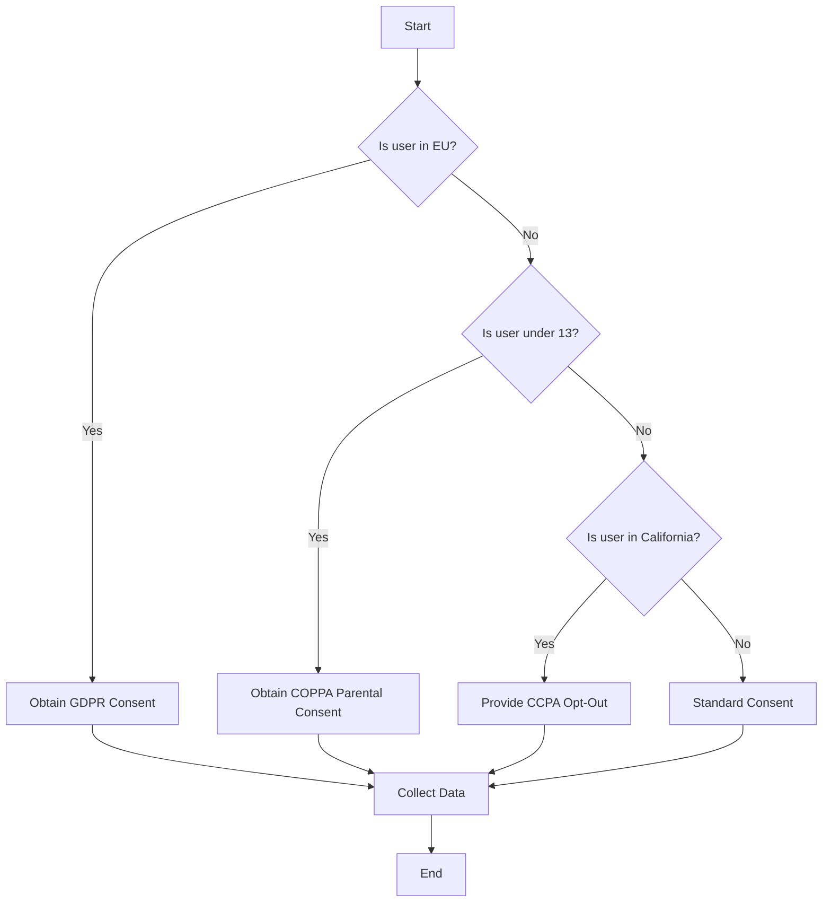

## 13.3.2 Privacy Laws and Regulations

In the digital age, privacy has become a paramount concern for users and developers alike. As a mobile app developer, understanding and complying with privacy laws and regulations is not just a legal obligation but also a crucial aspect of building trust with your users. This section delves into the key privacy laws affecting mobile app development, including the General Data Protection Regulation (GDPR), the Children's Online Privacy Protection Act (COPPA), and the California Consumer Privacy Act (CCPA). We will explore their scopes, key requirements, and provide practical guidance on implementing compliance measures.

### General Data Protection Regulation (GDPR)

The GDPR is a comprehensive data protection law that applies to all organizations processing personal data of individuals within the European Union (EU). Its primary aim is to give individuals control over their personal data and simplify the regulatory environment for international businesses.

#### Scope

The GDPR applies to any app or service that collects or processes personal data from users located in the EU, regardless of where the app developer is based. This extraterritorial reach means that even if your app is developed outside the EU, you must comply with GDPR if you have users in the EU.

#### Key Requirements

1. **Explicit Consent**: Before collecting any personal data, you must obtain explicit consent from users. This means providing clear and understandable information about what data is being collected and for what purpose.

2. **Data Subject Rights**: Users have the right to access their data, correct inaccuracies, and request deletion. Your app must provide mechanisms to facilitate these rights.

3. **Data Protection Officer (DPO)**: If your app processes large amounts of personal data or sensitive data, you may need to appoint a DPO to oversee compliance.

4. **Data Breach Notification**: In the event of a data breach, you must notify the relevant authorities within 72 hours and inform affected users without undue delay.

#### Resources

For more detailed information, visit the [EU GDPR Information Portal](https://eugdpr.org/).

### Children's Online Privacy Protection Act (COPPA)

COPPA is a U.S. federal law designed to protect the privacy of children under the age of 13. It imposes certain requirements on operators of websites or online services directed to children or that knowingly collect personal information from children.

#### Scope

COPPA applies to apps that are directed to children under 13 in the United States or that knowingly collect personal information from children under 13.

#### Key Requirements

1. **Parental Consent**: Obtain verifiable parental consent before collecting, using, or disclosing personal information from children.

2. **Privacy Notices**: Provide clear and comprehensive privacy notices to parents detailing the information collected from children and how it is used.

3. **Data Minimization**: Collect only the information necessary for the app's operation and ensure it is securely stored.

#### Resources

For guidance on compliance, refer to the [FTC COPPA FAQs](https://www.ftc.gov/tips-advice/business-center/guidance/childrens-online-privacy-protection-rule-six-step-compliance).

### California Consumer Privacy Act (CCPA)

The CCPA is a state statute intended to enhance privacy rights and consumer protection for residents of California, USA. It provides California residents with specific rights regarding their personal information.

#### Scope

The CCPA applies to businesses that collect personal information from California residents and meet certain thresholds, such as having annual gross revenues over $25 million.

#### Key Requirements

1. **Data Collection Disclosure**: Inform users about the categories of personal information collected and the purposes for which it is used.

2. **Opt-Out Rights**: Allow users to opt-out of the sale of their personal information and provide a "Do Not Sell My Personal Information" link on your app or website.

3. **Access and Deletion Rights**: Users have the right to request access to their personal information and request its deletion.

#### Resources

For more information, visit the [California Attorney General CCPA Page](https://oag.ca.gov/privacy/ccpa).

### Implementing Compliance

Ensuring compliance with privacy laws is an ongoing process that involves several key components:

#### Privacy Policies

Draft clear and comprehensive privacy policies that outline your data collection practices, the purposes of data use, and how users can exercise their rights. Make these policies easily accessible within your app.

#### Consent Mechanisms

Implement user consent prompts and settings that allow users to easily provide or withdraw consent for data collection. Use clear language and avoid legal jargon to ensure users understand what they are consenting to.

#### Data Security

Implement robust data security measures to protect user data from unauthorized access, disclosure, or destruction. This includes using encryption, secure data storage, and regular security audits.

### Best Practices

#### Stay Informed

Privacy laws and regulations are constantly evolving. Stay informed about changes in legislation and new regulations that may affect your app. Subscribe to legal and industry newsletters, and participate in relevant forums and discussions.

#### Legal Consultation

Consult with legal professionals who specialize in data privacy to ensure your app complies with applicable laws. They can provide valuable insights and help you navigate complex legal requirements.

### Visual Aids

#### Compliance Checklist

Here is a checklist to help you achieve compliance with privacy laws:

- [ ] Identify applicable privacy laws for your app.
- [ ] Draft and publish a comprehensive privacy policy.
- [ ] Implement user consent mechanisms.
- [ ] Appoint a Data Protection Officer if necessary.
- [ ] Establish procedures for data subject rights requests.
- [ ] Conduct regular data security audits.

#### Flowcharts

Below is a flowchart illustrating the decision process for obtaining user consent for data collection:

### Conclusion

Understanding and complying with privacy laws such as GDPR, COPPA, and CCPA is essential for mobile app developers. Not only does it help you avoid legal penalties, but it also builds trust with your users by demonstrating your commitment to protecting their personal information. By implementing the guidelines and best practices outlined in this section, you can ensure your app is compliant and ready for the app store.

## Quiz Time!



### Which regulation applies to apps collecting data from users in the European Union?

- [x] GDPR
- [ ] COPPA
- [ ] CCPA
- [ ] HIPAA

> **Explanation:** GDPR applies to any app or service that collects or processes personal data from users located in the EU.

### What is a key requirement of COPPA?

- [x] Obtain verifiable parental consent before collecting data from children under 13.
- [ ] Allow users to opt-out of data collection.
- [ ] Appoint a Data Protection Officer.
- [ ] Provide a "Do Not Sell My Personal Information" link.

> **Explanation:** COPPA requires verifiable parental consent before collecting personal information from children under 13.

### Which law gives California residents specific rights regarding their personal information?

- [ ] GDPR
- [ ] COPPA
- [x] CCPA
- [ ] HIPAA

> **Explanation:** The CCPA provides California residents with specific rights regarding their personal information.

### What must you do in the event of a data breach under GDPR?

- [x] Notify relevant authorities within 72 hours.
- [ ] Immediately delete all user data.
- [ ] Suspend all data collection activities.
- [ ] Notify users within 24 hours.

> **Explanation:** GDPR requires notification of relevant authorities within 72 hours of a data breach.

### What should a privacy policy include?

- [x] Data collection practices and user rights.
- [ ] Only the app's terms of service.
- [ ] A list of all third-party services used.
- [ ] The app's source code.

> **Explanation:** A privacy policy should outline data collection practices and how users can exercise their rights.

### What is the purpose of a Data Protection Officer under GDPR?

- [x] To oversee compliance with data protection laws.
- [ ] To manage app development.
- [ ] To handle customer support inquiries.
- [ ] To conduct marketing campaigns.

> **Explanation:** A Data Protection Officer oversees compliance with data protection laws and regulations.

### What is a key requirement of the CCPA?

- [x] Allow users to opt-out of the sale of their personal information.
- [ ] Obtain parental consent for all users.
- [ ] Encrypt all user data.
- [ ] Provide free services to California residents.

> **Explanation:** The CCPA requires businesses to allow users to opt-out of the sale of their personal information.

### What is a best practice for staying compliant with privacy laws?

- [x] Monitor legislation changes and consult legal professionals.
- [ ] Only update privacy policies once a year.
- [ ] Ignore user complaints about privacy.
- [ ] Collect as much data as possible.

> **Explanation:** Staying informed about legislation changes and consulting legal professionals are best practices for compliance.

### Which of the following is NOT a requirement under GDPR?

- [ ] Obtain explicit consent for data collection.
- [ ] Allow users to access and delete their data.
- [ ] Notify authorities of data breaches within 72 hours.
- [x] Provide free services to EU residents.

> **Explanation:** Providing free services to EU residents is not a requirement under GDPR.

### True or False: The GDPR only applies to companies based in the EU.

- [ ] True
- [x] False

> **Explanation:** GDPR applies to any organization processing personal data of individuals within the EU, regardless of where the organization is based.


