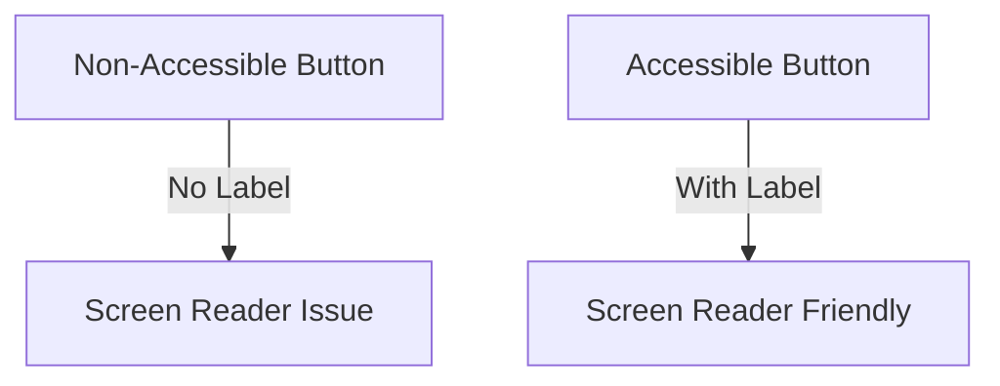

## 13.3.3 Accessibility Standards

Creating accessible applications is not just a legal obligation but a moral one. By ensuring your Flutter app is accessible, you open the doors to a wider audience, including users with disabilities, and comply with standards like the Web Content Accessibility Guidelines (WCAG) and platform-specific accessibility guidelines. This section will guide you through the essentials of making your Flutter app accessible, providing practical tips, code examples, and resources.

### Understanding Accessibility

#### Importance of Accessibility

Accessibility in app development is about inclusivity. It ensures that everyone, regardless of their abilities, can use your app effectively. Beyond the ethical implications, there are legal requirements in many jurisdictions that mandate accessibility compliance. Failing to meet these standards can lead to legal consequences and exclude a significant portion of potential users.

#### Accessibility Standards

The Web Content Accessibility Guidelines (WCAG) 2.1 are the benchmark for web and app accessibility. These guidelines provide a comprehensive framework for making content more accessible to people with disabilities, including those with visual, auditory, physical, speech, cognitive, language, learning, and neurological disabilities.

Key principles of WCAG include:

- **Perceivable:** Information and user interface components must be presentable to users in ways they can perceive.
- **Operable:** User interface components and navigation must be operable.
- **Understandable:** Information and the operation of the user interface must be understandable.
- **Robust:** Content must be robust enough to be interpreted reliably by a wide variety of user agents, including assistive technologies.

#### Platform-Specific Guidelines

Each platform has its own set of accessibility guidelines:

- **Apple's Accessibility Programming Guide:** Provides detailed instructions for making iOS apps accessible. [Apple Accessibility Guide](https://developer.apple.com/accessibility/)
- **Google's Accessibility Guidance:** Offers best practices for Android apps. [Google Accessibility Guide](https://developer.android.com/guide/topics/ui/accessibility)

### Key Accessibility Considerations

#### Semantic Widgets

Using semantic widgets in Flutter is crucial for accessibility. These widgets convey meaning and context to assistive technologies, such as screen readers.

- **Example:** Use `Text` widgets for textual content rather than painting text directly on a `Canvas`.

#### Color Contrast

Ensure sufficient contrast between text and background colors to make your app readable for users with visual impairments.

- **Tool:** Use online contrast checkers to verify color contrast ratios.

#### Text Scaling

Support dynamic type and user font size preferences to accommodate users with visual impairments.

- **Implementation:** Use `MediaQuery` to adjust text size based on user settings.

#### Keyboard Navigation

Enable full navigation through your app using a keyboard, which is essential for users who cannot use touch screens.

- **Implementation:** Ensure all interactive elements are focusable and navigable via keyboard shortcuts.

#### Screen Readers

Test your app with screen readers like VoiceOver for iOS and TalkBack for Android to ensure that all interactive elements are accessible.

### Implementing Accessibility in Flutter

#### Semantics Widget

The `Semantics` widget in Flutter is used to annotate the widget tree with semantic information, which is crucial for assistive technologies.

```dart
Semantics(
  label: 'Submit button',
  hint: 'Double tap to submit your form',
  child: ElevatedButton(
    onPressed: () {
      // Submit action
    },
    child: Text('Submit'),
  ),
)
```

#### Accessible Widgets

Flutter provides a range of widgets designed with accessibility in mind. Use these widgets to ensure your app is accessible by default.

- **Example:** Use `ListView` for lists instead of manually creating scrollable areas.

#### Testing Tools

Utilize accessibility tools and plugins to audit your app's accessibility.

- **Flutter Accessibility Scanner:** A tool that helps identify accessibility issues in your Flutter app.

### Resources

#### Flutter Accessibility Guide

The official Flutter documentation provides a comprehensive guide on accessibility, including best practices and examples. [Flutter Accessibility Documentation](https://flutter.dev/docs/development/accessibility)

#### WCAG Guidelines

For a deeper understanding of accessibility standards, refer to the WCAG 2.1 guidelines. [WCAG 2.1 Overview](https://www.w3.org/TR/WCAG21/)

### Visual Aids

#### Code Examples

Below is a comparison of non-accessible and accessible UI elements:

**Non-Accessible Button:**

```dart
GestureDetector(
  onTap: () {
    // Action
  },
  child: Container(
    color: Colors.blue,
    child: Text('Click Me'),
  ),
)
```

**Accessible Button:**

```dart
Semantics(
  button: true,
  label: 'Click Me button',
  child: ElevatedButton(
    onPressed: () {
      // Action
    },
    child: Text('Click Me'),
  ),
)
```

#### Before and After

Visualizing the difference between non-accessible and accessible designs can be enlightening. Consider the following diagram illustrating a simple UI element before and after accessibility improvements:



### Writing Tips

#### Empathy

When designing for accessibility, put yourself in the shoes of users with disabilities. Consider how they will interact with your app and what barriers they might face.

#### Practical Steps

Implementing accessibility can be straightforward if you follow these steps:

1. **Audit your app:** Use accessibility testing tools to identify issues.
2. **Use semantic widgets:** Ensure all UI elements are properly labeled.
3. **Test with screen readers:** Regularly test your app with VoiceOver and TalkBack.
4. **Gather feedback:** Engage with users with disabilities to gather feedback and make improvements.

#### Resources

For further learning, explore the following resources:

- **Books:** "Designing Accessible Websites" by Sarah Horton and Whitney Quesenbery.
- **Online Courses:** Coursera and Udemy offer courses on accessibility in app development.
- **Community:** Join forums and groups focused on accessibility to stay updated on best practices.

## Quiz Time!



### What is the primary goal of accessibility in app development?

- [x] Inclusivity and ensuring all users can access the app
- [ ] Increasing app performance
- [ ] Reducing app size
- [ ] Enhancing app aesthetics

> **Explanation:** Accessibility aims to make apps usable for everyone, including those with disabilities, ensuring inclusivity.

### Which guidelines are considered the benchmark for web and app accessibility?

- [x] WCAG 2.1
- [ ] ISO 9001
- [ ] GDPR
- [ ] PCI DSS

> **Explanation:** The Web Content Accessibility Guidelines (WCAG) 2.1 are the standard for ensuring web and app accessibility.

### What is the purpose of the `Semantics` widget in Flutter?

- [x] To provide semantic information to assistive technologies
- [ ] To enhance app performance
- [ ] To improve app design
- [ ] To manage app state

> **Explanation:** The `Semantics` widget annotates the widget tree with information that assistive technologies can use.

### Which tool can be used to check color contrast for accessibility?

- [x] Online contrast checkers
- [ ] Code analyzers
- [ ] Performance profilers
- [ ] Debuggers

> **Explanation:** Online contrast checkers help ensure sufficient contrast between text and background colors for accessibility.

### What should be tested with screen readers like VoiceOver and TalkBack?

- [x] All interactive elements
- [ ] Only images
- [x] Navigation flow
- [ ] Only text content

> **Explanation:** Screen readers should be used to test all interactive elements and navigation flow to ensure accessibility.

### Which of the following is NOT a principle of WCAG?

- [ ] Perceivable
- [ ] Operable
- [ ] Understandable
- [x] Editable

> **Explanation:** WCAG principles include Perceivable, Operable, Understandable, and Robust, but not Editable.

### What is a key consideration for text in accessible apps?

- [x] Support for dynamic type and user font size preferences
- [ ] Fixed font size
- [x] High contrast with background
- [ ] Decorative fonts

> **Explanation:** Accessible apps should support dynamic type and ensure high contrast for readability.

### Why is keyboard navigation important in accessibility?

- [x] It allows users who cannot use touch screens to navigate the app
- [ ] It improves app performance
- [ ] It enhances app design
- [ ] It reduces app size

> **Explanation:** Keyboard navigation is crucial for users who rely on keyboards instead of touch screens.

### Which resource provides a comprehensive guide on Flutter accessibility?

- [x] Flutter Accessibility Documentation
- [ ] Apple Developer Guide
- [ ] Android Developer Guide
- [ ] ISO Standards

> **Explanation:** The Flutter Accessibility Documentation offers detailed guidance on making Flutter apps accessible.

### True or False: Accessibility only benefits users with disabilities.

- [ ] True
- [x] False

> **Explanation:** While accessibility primarily aids users with disabilities, it also improves the overall user experience for everyone.


