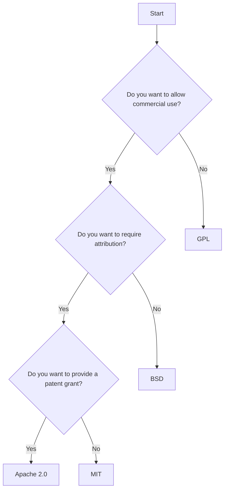

## 13.3.4 Licensing and Open Source Usage

In the world of software development, open-source code is a powerful resource that can accelerate your app development process. However, using open-source code comes with responsibilities and legal obligations. This section will guide you through the intricacies of open-source licenses, ensuring you comply with legal requirements while respecting the contributions of others.

### Understanding Open Source Licenses

Open-source licenses are legal frameworks that dictate how software can be used, modified, and distributed. Understanding these licenses is crucial for any developer who wants to incorporate open-source code into their projects.

#### Common Licenses

There are several open-source licenses, each with its own terms and conditions. Here are some of the most common ones:

- **MIT License**: A permissive license that allows for reuse with minimal restrictions. It requires attribution to the original authors.
- **Apache 2.0 License**: Similar to the MIT License but includes an express grant of patent rights from contributors to users.
- **GNU General Public License (GPL)**: A copyleft license that requires derivative works to be licensed under the same terms.
- **BSD License**: Another permissive license with minimal restrictions, similar to the MIT License.

#### Key Terms

Understanding key terms related to open-source licenses is essential:

- **Copyleft**: A licensing practice that allows derivative works but requires them to be released under the same license.
- **Attribution**: The requirement to credit the original creators of the code.
- **Distribution**: The act of making software available to others, which may trigger certain license obligations.

### Using Open Source Libraries

When incorporating open-source libraries into your Flutter app, it's important to ensure compliance with the respective licenses.

#### Compliance

To comply with open-source licenses, you must:

- **Review License Terms**: Carefully read the license terms of any library you plan to use.
- **Adhere to Conditions**: Follow any conditions set forth by the license, such as providing attribution or sharing modifications.

#### Attribution

Many open-source licenses require you to acknowledge the original authors. This can be done in your app's documentation, about section, or within the code itself.

#### Restrictions

Be aware of licenses that impose restrictions, such as the GPL, which requires you to release derivative works under the same license.

### Contributing to Open Source

Contributing to open-source projects is a great way to give back to the community. When doing so, consider the following:

#### Licensing Your Code

Choose an appropriate license for your projects. Consider using a permissive license like MIT or Apache 2.0 to encourage widespread use.

#### Community Standards

When contributing to open-source projects, adhere to community standards and guidelines. Respect the project's code of conduct and follow contribution guidelines.

### Avoiding Legal Issues

To avoid legal issues when using open-source code, follow these best practices:

#### Third-Party Code

Vet code from unknown sources to ensure it complies with open-source licensing terms. Avoid using code with unclear or missing licenses.

#### Proprietary Code

Do not include proprietary code in your open-source projects without permission. Doing so can lead to legal disputes.

### Resources

To further your understanding of open-source licenses, consider the following resources:

- **[Choose an Open Source License](https://choosealicense.com/)**: A helpful guide for selecting the right license for your project.
- **Legal Tools**: Use tools like [FOSSA](https://fossa.com/) or [WhiteSource](https://www.whitesourcesoftware.com/) to analyze the licenses of your dependencies.

### Visual Aids

#### License Comparison Table

Below is a comparison table summarizing the differences between common open-source licenses:

| License      | Permissive | Copyleft | Patent Grant | Attribution Required |
|--------------|------------|----------|--------------|----------------------|
| MIT          | Yes        | No       | No           | Yes                  |
| Apache 2.0   | Yes        | No       | Yes          | Yes                  |
| GPL          | No         | Yes      | No           | Yes                  |
| BSD          | Yes        | No       | No           | Yes                  |

#### Flowchart: Decision-Making Process for Selecting Licenses

Below is a flowchart to help you decide which open-source license to choose for your project:

### Writing Tips

#### Clarity

Explain legal concepts in understandable terms. Avoid jargon and provide clear definitions.

#### Actionable Advice

Provide steps to ensure compliance with open-source licenses. Encourage readers to document their use of open-source code and to seek legal advice if needed.

#### Emphasize Respect

Highlight the importance of respecting the work of others. Encourage readers to contribute back to the open-source community whenever possible.

## Quiz Time!



### What is a key characteristic of the MIT License?

- [x] It is a permissive license with minimal restrictions.
- [ ] It requires derivative works to be licensed under the same terms.
- [ ] It does not allow commercial use.
- [ ] It includes a patent grant.

> **Explanation:** The MIT License is known for being permissive, allowing for reuse with minimal restrictions, and requiring only attribution.

### Which license requires derivative works to be licensed under the same terms?

- [ ] MIT License
- [ ] Apache 2.0 License
- [x] GPL
- [ ] BSD License

> **Explanation:** The GPL is a copyleft license that requires derivative works to be licensed under the same terms.

### What does "attribution" mean in the context of open-source licenses?

- [x] Crediting the original creators of the code.
- [ ] Releasing derivative works under the same license.
- [ ] Providing a patent grant.
- [ ] Restricting commercial use.

> **Explanation:** Attribution means giving credit to the original authors of the code, often required by open-source licenses.

### What should you do to comply with open-source licenses when using libraries?

- [x] Review and adhere to the license terms.
- [ ] Ignore the license terms.
- [ ] Only use proprietary libraries.
- [ ] Avoid using any open-source libraries.

> **Explanation:** To comply with open-source licenses, you must review and adhere to the license terms of any library you use.

### Which license includes an express grant of patent rights?

- [ ] MIT License
- [x] Apache 2.0 License
- [ ] GPL
- [ ] BSD License

> **Explanation:** The Apache 2.0 License includes an express grant of patent rights from contributors to users.

### What is a common requirement of many open-source licenses?

- [x] Attribution
- [ ] Commercial restriction
- [ ] No distribution
- [ ] No modification

> **Explanation:** Many open-source licenses require attribution, meaning you must credit the original authors.

### What is the purpose of a copyleft license?

- [x] To require derivative works to be licensed under the same terms.
- [ ] To allow unrestricted use of the code.
- [ ] To prohibit commercial use.
- [ ] To provide a patent grant.

> **Explanation:** A copyleft license requires derivative works to be licensed under the same terms, ensuring the same freedoms are preserved.

### What should you avoid including in your open-source projects without permission?

- [x] Proprietary code
- [ ] Open-source libraries
- [ ] Documentation
- [ ] Attribution

> **Explanation:** Including proprietary code without permission can lead to legal disputes, so it should be avoided.

### What is a benefit of contributing to open-source projects?

- [x] Giving back to the community
- [ ] Avoiding legal obligations
- [ ] Using proprietary code
- [ ] Ignoring license terms

> **Explanation:** Contributing to open-source projects allows you to give back to the community and improve your skills.

### True or False: The BSD License is a copyleft license.

- [ ] True
- [x] False

> **Explanation:** The BSD License is a permissive license, not a copyleft license. It allows for reuse with minimal restrictions.



By understanding and respecting open-source licenses, you can leverage the power of open-source software while ensuring legal compliance and contributing positively to the developer community.
