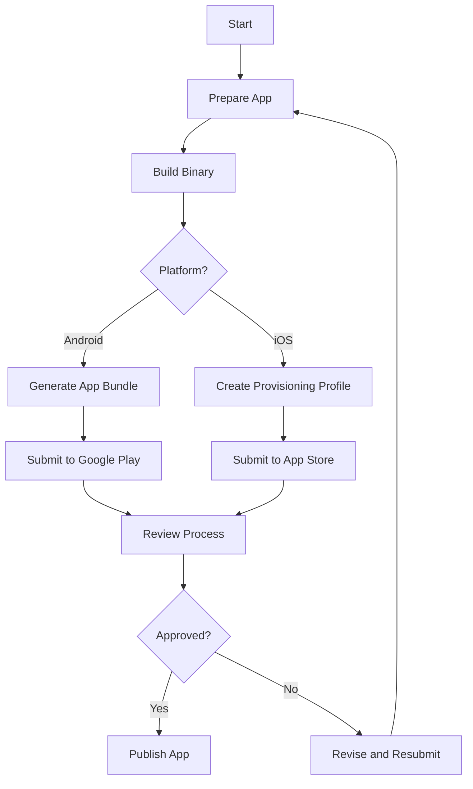

## 13.4.3 App Store Terminology

Publishing a Flutter app to the app store involves navigating a myriad of terms and processes. Understanding these terms is crucial for a smooth submission and successful app launch. This section will demystify key app store terminology, providing you with the knowledge needed to confidently publish your app.

### Understanding App Store Terminology

The app store ecosystem is rich with specific jargon that can be overwhelming for first-time publishers. Here, we break down the essential terms you need to know.

#### App Bundle

**Definition:** An App Bundle is a publishing format for Android apps that includes all compiled code and resources but defers APK generation and signing to Google Play.

**Context:** When you build your Flutter app for release, you can choose to generate an App Bundle. This format allows Google Play to optimize the APK for each user's device, reducing the download size and improving the installation process.

**Example:**
```bash
flutter build appbundle
```

**Benefits:**
- **Optimized Delivery:** Google Play generates optimized APKs for different device configurations.
- **Reduced Size:** Users download only the code and resources needed for their specific device.

#### APK (Android Package Kit)

**Definition:** The APK is the package file format used to distribute and install apps on Android devices.

**Context:** While the App Bundle is used for publishing, the APK is the format that actually gets installed on the user's device. Developers often generate APKs for testing purposes before publishing.

**Example:**
```bash
flutter build apk
```

**Key Points:**
- **Direct Installation:** APKs can be sideloaded onto devices for testing.
- **Testing:** Useful for testing app functionality on different devices before release.

#### Binary

**Definition:** The Binary is the compiled version of your app submitted to the app store.

**Context:** In both Android and iOS ecosystems, the binary is what you submit to the app store for review. It contains your app's compiled code and resources.

**Key Considerations:**
- **Versioning:** Ensure your binary version matches the version declared in your app's metadata.
- **Testing:** Thoroughly test your binary before submission to avoid rejections.

#### Provisioning Profile

**Definition:** A Provisioning Profile is a file that links your signing certificate with your app and devices, allowing you to install and run apps on Apple devices.

**Context:** For iOS apps, provisioning profiles are crucial for both development and distribution. They ensure that your app is authorized to run on specific devices and is signed with the correct credentials.

**Types:**
- **Development:** Used for testing apps on physical devices during development.
- **Distribution:** Used for submitting your app to the App Store.

#### SKU (Stock Keeping Unit)

**Definition:** The SKU is a unique identifier for your app used in the App Store.

**Context:** SKUs help you manage and track your app in the store. They are particularly useful for managing multiple apps or versions.

**Best Practices:**
- **Uniqueness:** Ensure each app has a unique SKU.
- **Consistency:** Use a consistent naming convention for easy management.

#### Sandbox Testing

**Definition:** Sandbox Testing is a testing environment that mimics the live app store environment for testing in-app purchases.

**Context:** Before launching your app, it's crucial to test in-app purchases to ensure they work correctly. The sandbox environment allows you to simulate purchase flows without real transactions.

**Steps for Sandbox Testing:**
1. **Create Test Accounts:** Set up test user accounts in your app store console.
2. **Configure App:** Ensure your app is configured to use the sandbox environment.
3. **Test Scenarios:** Test various purchase scenarios, including successful purchases and cancellations.

### Visual Aids

To further clarify these concepts, let's look at some visual aids.

#### Flowchart: App Submission and Review Process

Below is a flowchart illustrating the typical app submission and review process for both Android and iOS platforms.



#### Table: Comparison of Terms Across App Stores

The following table compares similar terms across the Apple App Store and Google Play Store.

| Term                  | Apple App Store                   | Google Play Store         |
|-----------------------|-----------------------------------|---------------------------|
| App Bundle            | Not Applicable                    | Yes                       |
| APK                   | Not Applicable                    | Yes                       |
| Binary                | Yes                               | Yes                       |
| Provisioning Profile  | Yes                               | Not Applicable            |
| SKU                   | Yes                               | Yes                       |
| Sandbox Testing       | Yes                               | Yes                       |

### Best Practices and Common Pitfalls

Understanding these terms is just the beginning. Here are some best practices and common pitfalls to avoid:

#### Best Practices

- **Stay Updated:** App store guidelines and processes change frequently. Keep abreast of the latest updates.
- **Thorough Testing:** Test your app thoroughly in both development and sandbox environments.
- **Documentation:** Maintain detailed documentation of your app's versions, SKUs, and provisioning profiles.

#### Common Pitfalls

- **Ignoring Guidelines:** Failing to adhere to app store guidelines can lead to rejection.
- **Version Mismatch:** Ensure your app's version number is consistent across all submissions.
- **Incomplete Testing:** Skipping sandbox testing can result in in-app purchase issues post-launch.

### Conclusion

Mastering app store terminology is a critical step in the app publishing journey. By understanding these terms and their contexts, you can navigate the submission process with confidence and increase your chances of a successful app launch.

## Quiz Time!



### What is an App Bundle?

- [x] A publishing format for Android apps that includes all compiled code and resources but defers APK generation and signing to Google Play.
- [ ] The package file format used to distribute and install apps on Android devices.
- [ ] A file that links your signing certificate with your app and devices.
- [ ] A unique identifier for your app used in the App Store.

> **Explanation:** An App Bundle is a publishing format that allows Google Play to optimize APKs for different device configurations.

### What does APK stand for?

- [ ] Apple Package Kit
- [x] Android Package Kit
- [ ] Application Package Kit
- [ ] App Publishing Kit

> **Explanation:** APK stands for Android Package Kit, which is the file format used to distribute and install apps on Android devices.

### What is a Binary in app publishing?

- [x] The compiled version of your app submitted to the app store.
- [ ] A unique identifier for your app used in the App Store.
- [ ] A testing environment that mimics the live app store environment.
- [ ] A file that links your signing certificate with your app and devices.

> **Explanation:** A Binary is the compiled version of your app that you submit to the app store for review.

### What is the purpose of a Provisioning Profile?

- [ ] To generate APKs for Android devices.
- [ ] To uniquely identify your app in the App Store.
- [x] To link your signing certificate with your app and devices, allowing you to install and run apps on Apple devices.
- [ ] To test in-app purchases in a sandbox environment.

> **Explanation:** A Provisioning Profile is used to authorize your app to run on specific Apple devices and is essential for both development and distribution.

### Which of the following is true about SKUs?

- [x] They are unique identifiers for your app used in the App Store.
- [ ] They are used to test in-app purchases.
- [x] They help manage and track your app in the store.
- [ ] They are files that link your signing certificate with your app.

> **Explanation:** SKUs are unique identifiers that help manage and track your app in the store.

### What is Sandbox Testing used for?

- [x] Testing in-app purchases in a simulated environment.
- [ ] Generating optimized APKs for different devices.
- [ ] Linking your signing certificate with your app.
- [ ] Identifying your app uniquely in the App Store.

> **Explanation:** Sandbox Testing allows you to test in-app purchases without real transactions, simulating the live app store environment.

### Which term is specific to the Apple App Store?

- [x] Provisioning Profile
- [ ] App Bundle
- [x] SKU
- [ ] APK

> **Explanation:** Provisioning Profiles are specific to the Apple ecosystem, used to authorize apps on Apple devices.

### What is the main benefit of using an App Bundle?

- [x] Optimized delivery of APKs for different device configurations.
- [ ] Direct installation on Android devices.
- [ ] Linking signing certificates with apps.
- [ ] Unique identification of apps in the store.

> **Explanation:** The main benefit of an App Bundle is that it allows Google Play to generate optimized APKs for different device configurations, reducing download size.

### What does a Binary contain?

- [x] Compiled code and resources of your app.
- [ ] A unique identifier for your app.
- [ ] A file linking your signing certificate with your app.
- [ ] A testing environment for in-app purchases.

> **Explanation:** A Binary contains the compiled code and resources of your app, which is submitted to the app store.

### True or False: An APK can be used for both publishing and testing purposes.

- [x] True
- [ ] False

> **Explanation:** True. An APK can be used for testing by sideloading onto devices and is also the format that gets installed on user devices after publishing.


