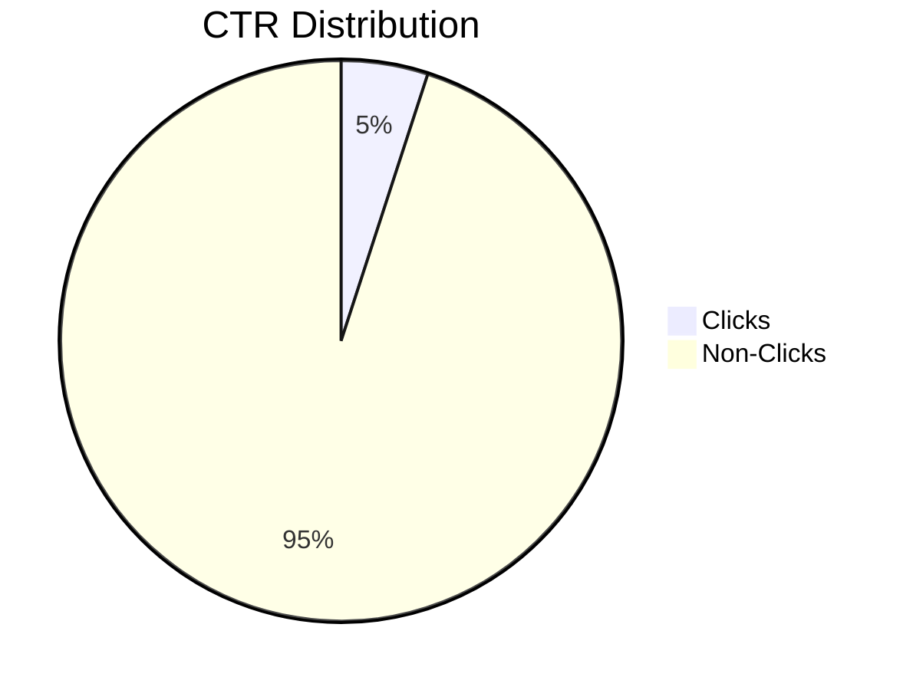
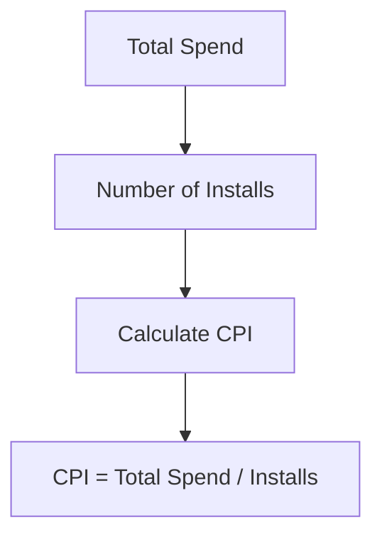
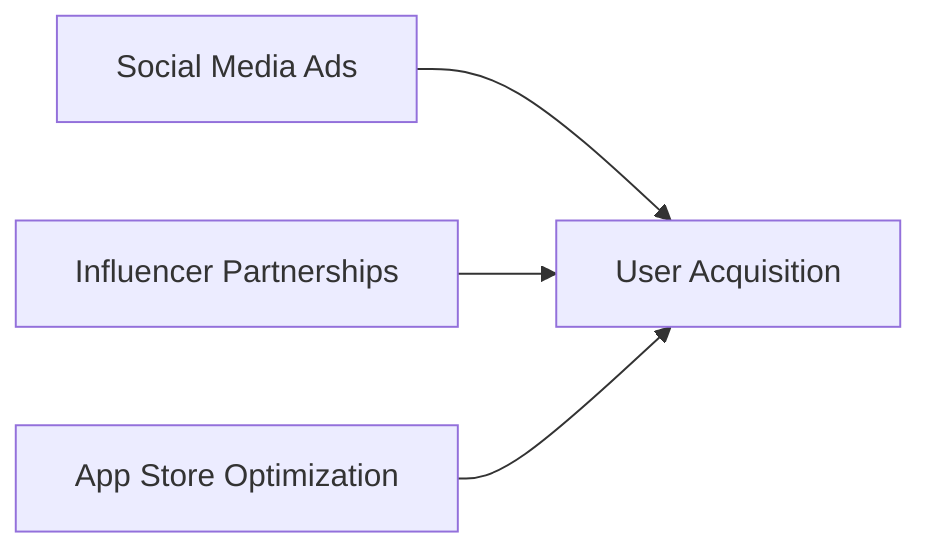
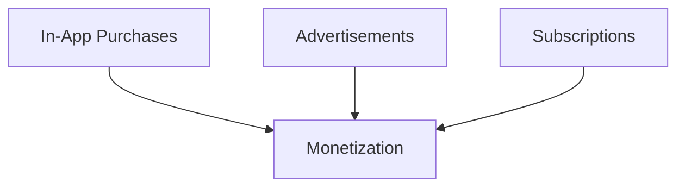

## 13.4.4 Business and Marketing Terms for App Developers

In the journey from developing a Flutter app to successfully publishing it on the App Store, understanding key business and marketing terms is crucial. These terms not only help in navigating the commercial landscape but also in making informed decisions that can significantly impact your app's success. This section will delve into essential business and marketing terminology relevant to app developers, providing clear definitions, practical examples, and visual aids to enhance understanding.

### ROI (Return on Investment)

**Definition:** ROI is a performance measure used to evaluate the efficiency of an investment. It is calculated as:

 \text{ROI} = \frac{\text{Gain from Investment} - \text{Cost of Investment}}{\text{Cost of Investment}} 

**Applicability:** For app developers, understanding ROI is crucial when assessing the effectiveness of marketing campaigns, development costs, or any other investment related to the app.

**Example:** Suppose you spend $1,000 on a marketing campaign and it generates $2,000 in additional revenue. The ROI would be:

 \text{ROI} = \frac{2000 - 1000}{1000} = 1 \text{ or } 100\% 

This indicates a 100% return on your investment, meaning you doubled your money.

**Visual Aid:**

```mermaid
graph TD;
    A[Investment Cost] --> B[Gain from Investment];
    B --> C[Calculate ROI];
    C --> D[ROI = (Gain - Cost) / Cost];
```

### CTR (Click-Through Rate)

**Definition:** CTR is the ratio of users who click on a specific link or advertisement to the total number of users who view it, expressed as a percentage.

 \text{CTR} = \left( \frac{\text{Number of Clicks}}{\text{Number of Impressions}} \right) \times 100 

**Applicability:** CTR is a critical metric for app developers running online advertising campaigns. It helps in understanding the effectiveness of ads in driving traffic to your app's landing page or download page.

**Example:** If an ad is shown 1,000 times and receives 50 clicks, the CTR would be:

 \text{CTR} = \left( \frac{50}{1000} \right) \times 100 = 5\% 

**Visual Aid:**



### CPI (Cost Per Install)

**Definition:** CPI is the cost incurred by an advertiser when a user installs an app through their advertisement. It is a common pricing model in mobile app marketing.

**Applicability:** Understanding CPI helps app developers budget their marketing efforts and measure the cost-effectiveness of their user acquisition strategies.

**Example:** If you spend $500 on a campaign and acquire 100 installs, the CPI would be:

 \text{CPI} = \frac{500}{100} = 5 \text{ dollars per install} 

**Visual Aid:**



### User Acquisition

**Definition:** User acquisition refers to the process of gaining new users for an app through marketing activities. It involves strategies to attract users to download and engage with the app.

**Applicability:** Effective user acquisition strategies are vital for app growth. Developers need to understand different channels and tactics to maximize user acquisition efforts.

**Example:** Utilizing social media ads, influencer partnerships, and app store optimization (ASO) are common user acquisition strategies.

**Visual Aid:**



### Monetization

**Definition:** Monetization is the strategy of generating revenue from an app. Common methods include in-app purchases, subscriptions, and advertisements.

**Applicability:** Developers must choose the right monetization model that aligns with their app's purpose and user base to ensure sustainable revenue.

**Example:** A gaming app might use in-app purchases for virtual goods, while a news app might offer subscriptions for premium content.

**Visual Aid:**



### Additional Terms and Concepts

#### LTV (Lifetime Value)

**Definition:** LTV is the predicted net profit attributed to the entire future relationship with a customer. It helps in understanding the long-term value of a user.

**Example:** If a user generates $10 in revenue per month and is expected to use the app for 12 months, the LTV is $120.

#### Churn Rate

**Definition:** Churn rate is the percentage of users who stop using an app within a given period. It is a critical metric for understanding user retention.

**Example:** If an app has 1,000 users at the start of the month and 100 users leave by the end, the churn rate is 10%.

#### ASO (App Store Optimization)

**Definition:** ASO is the process of optimizing mobile apps to rank higher in an app store's search results. The higher the app ranks, the more visible it is to potential users.

**Example:** Optimizing app titles, descriptions, and keywords can improve search rankings and increase downloads.

#### ARPU (Average Revenue Per User)

**Definition:** ARPU is the average revenue generated per user, typically calculated on a monthly or yearly basis.

**Example:** If an app generates $10,000 in a month and has 1,000 active users, the ARPU is $10.

### Practical Application and Best Practices

Understanding these business and marketing terms is just the beginning. Applying them effectively requires strategic planning and execution. Here are some best practices:

- **Regularly Monitor Metrics:** Continuously track metrics like ROI, CTR, and CPI to assess the effectiveness of your marketing strategies and make data-driven decisions.
- **Optimize User Acquisition Channels:** Experiment with different user acquisition channels to find the most cost-effective methods for your app.
- **Focus on User Retention:** Reducing churn rate and increasing LTV should be a priority to ensure long-term success.
- **Iterate on Monetization Strategies:** Test different monetization models to find the best fit for your app and user base.

### Common Pitfalls and Optimization Tips

- **Ignoring User Feedback:** User feedback is invaluable for improving app features and user experience, which can enhance retention and reduce churn.
- **Overlooking ASO:** Neglecting app store optimization can lead to lower visibility and fewer downloads.
- **Underestimating the Importance of Analytics:** Without proper analytics, it's challenging to understand user behavior and optimize marketing efforts effectively.

### Conclusion

Mastering these business and marketing terms will empower you as an app developer to navigate the commercial aspects of app development with confidence. By applying these concepts strategically, you can enhance your app's visibility, user base, and revenue potential.

## Quiz Time!



### What does ROI stand for in app development?

- [x] Return on Investment
- [ ] Rate of Interest
- [ ] Revenue of Investment
- [ ] Return on Income

> **Explanation:** ROI stands for Return on Investment, a measure used to evaluate the efficiency of an investment.

### How is CTR calculated?

- [x] (Number of Clicks / Number of Impressions) × 100
- [ ] (Number of Impressions / Number of Clicks) × 100
- [ ] (Total Revenue / Total Clicks) × 100
- [ ] (Total Clicks / Total Revenue) × 100

> **Explanation:** CTR is calculated as (Number of Clicks / Number of Impressions) × 100, representing the percentage of users who click on a link.

### What does CPI refer to in mobile app marketing?

- [x] Cost Per Install
- [ ] Click Per Impression
- [ ] Cost Per Impression
- [ ] Click Per Install

> **Explanation:** CPI stands for Cost Per Install, the cost incurred by an advertiser when a user installs an app through their advertisement.

### What is the primary goal of user acquisition?

- [x] Gaining new users for an app
- [ ] Increasing app store rankings
- [ ] Reducing app development costs
- [ ] Enhancing app security

> **Explanation:** User acquisition focuses on gaining new users for an app through various marketing activities.

### Which of the following is a monetization strategy?

- [x] In-App Purchases
- [ ] User Feedback
- [x] Advertisements
- [ ] App Store Optimization

> **Explanation:** In-App Purchases and Advertisements are common monetization strategies for generating revenue from an app.

### What does LTV stand for?

- [x] Lifetime Value
- [ ] Long-Term Value
- [ ] Lasting Total Value
- [ ] Limited Time Value

> **Explanation:** LTV stands for Lifetime Value, the predicted net profit attributed to the entire future relationship with a customer.

### How is churn rate calculated?

- [x] (Number of Users Lost / Total Users at Start) × 100
- [ ] (Total Users at Start / Number of Users Lost) × 100
- [x] (Number of Users Lost / Total Users at End) × 100
- [ ] (Total Users at End / Number of Users Lost) × 100

> **Explanation:** Churn rate is calculated as (Number of Users Lost / Total Users at Start) × 100, indicating the percentage of users who stop using an app.

### What is ASO in the context of app development?

- [x] App Store Optimization
- [ ] Application Security Operations
- [ ] Automated Software Optimization
- [ ] Advanced System Operations

> **Explanation:** ASO stands for App Store Optimization, the process of optimizing mobile apps to rank higher in an app store's search results.

### What does ARPU measure?

- [x] Average Revenue Per User
- [ ] Annual Revenue Per User
- [ ] Average Rate Per User
- [ ] Annual Rate Per User

> **Explanation:** ARPU measures the Average Revenue Per User, typically calculated on a monthly or yearly basis.

### True or False: Ignoring user feedback can lead to increased churn rates.

- [x] True
- [ ] False

> **Explanation:** Ignoring user feedback can lead to dissatisfaction and increased churn rates as users may feel their needs are not being addressed.


