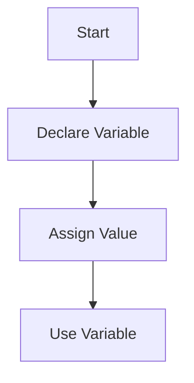

## 2.1.1 Declaring Variables

In the world of programming, variables are fundamental building blocks. They serve as containers for storing data values, which can be manipulated and used throughout your code. In Dart, the language underpinning Flutter, understanding how to declare and use variables is crucial for writing efficient and effective code. This section will guide you through the essentials of variable declaration in Dart, covering syntax, conventions, and best practices.

### Understanding Variable Declaration in Dart

Dart offers a flexible yet robust system for declaring variables, allowing developers to choose between inferred types and explicit typing. This flexibility is one of Dart's strengths, enabling both concise and clear code. Let's delve into the various ways you can declare variables in Dart.

#### Variable Declaration Syntax

In Dart, variables can be declared using the `var`, `final`, `const`, or explicit type keywords. Each of these keywords serves a distinct purpose and offers different capabilities:

- **`var`**: Allows Dart to infer the type of the variable based on the assigned value.
- **`final`**: Declares a variable that can be set only once.
- **`const`**: Declares a compile-time constant.
- **Explicit Type**: Specifies the type of the variable explicitly, such as `int`, `double`, `String`, or `bool`.

##### Example: Declaring Variables with `var`

The `var` keyword is a versatile tool in Dart, allowing the language to infer the type of the variable from the assigned value. This can lead to more concise code while maintaining type safety.

```dart
var name = 'Alice'; // Dart infers this as a String
var age = 30;       // Dart infers this as an int
```

Despite using `var`, Dart ensures type safety. Once a variable is assigned a type, it cannot be reassigned a value of a different type.

##### Example: Declaring Variables with Explicit Types

Explicit typing involves specifying the type of a variable at the time of declaration. This approach can enhance code readability and clarity, especially in complex applications.

```dart
String city = 'New York';
int zipCode = 10001;
```

Using explicit types can be beneficial when you want to make the intended use of a variable clear to anyone reading your code. It also helps in scenarios where type inference might not be straightforward.

### Using the `var` Keyword

The `var` keyword is a convenient way to declare variables without explicitly stating their type. Dart's type inference system automatically determines the type based on the assigned value. This feature allows for cleaner and more concise code.

#### Type Safety with `var`

Even though `var` does not require you to specify a type, Dart's type system ensures that once a variable is assigned a type, it remains consistent throughout its scope. This means you cannot reassign a `var` variable to a value of a different type.

```dart
var score = 100; // Inferred as int
// score = 'High'; // Error: A value of type 'String' can't be assigned to a variable of type 'int'.
```

### Explicit Typing

While `var` offers convenience, there are scenarios where explicit typing is preferable. Explicit types can improve code readability and make the developer's intentions clearer.

#### When to Use Explicit Types

- **Complex Codebases**: In larger projects, explicit types can make the code easier to understand and maintain.
- **API Development**: When developing APIs, explicit types can help define clear interfaces.
- **Type Clarity**: In situations where type inference might be ambiguous, explicit types provide clarity.

##### Example: Using Explicit Types

```dart
double temperature = 98.6;
bool isRaining = false;
```

Explicit typing is particularly useful when dealing with complex data structures or when the variable's role is not immediately obvious from its initial value.

### Naming Conventions

Choosing meaningful names for your variables is essential for writing readable and maintainable code. Dart follows the lowercaseCamelCase convention for variable names, which is a widely adopted practice in many programming languages.

#### Best Practices for Naming Variables

- **Descriptive Names**: Use names that clearly describe the variable's purpose or content.
- **Avoid Reserved Words**: Do not use Dart's reserved words as variable names.
- **Consistency**: Stick to a consistent naming convention throughout your codebase.

##### Example: Naming Variables

```dart
var userName = 'JohnDoe';
int userAge = 25;
bool isLoggedIn = true;
```

By adhering to these conventions, you ensure that your code remains understandable and maintainable, both for yourself and for others who may work with your code.

### Mutable vs. Immutable Variables

Understanding the difference between mutable and immutable variables is crucial for effective programming. In Dart, variables declared with `var` and explicit types are mutable by default, meaning their values can be changed after they are initially set.

#### Mutable Variables

Mutable variables allow you to change their values during the program's execution. This is useful for variables that need to be updated frequently, such as counters or accumulators.

##### Example: Mutable Variable

```dart
var counter = 0;
counter = counter + 1; // Reassigning a new value to counter
```

In this example, `counter` is mutable, allowing its value to be updated as needed.

#### Immutable Variables

Immutable variables, on the other hand, cannot be changed once they are set. In Dart, you can create immutable variables using the `final` or `const` keywords.

- **`final`**: The variable can be set only once and is initialized at runtime.
- **`const`**: The variable is a compile-time constant and must be initialized with a constant value.

##### Example: Immutable Variables

```dart
final String country = 'USA';
// country = 'Canada'; // Error: A final variable can only be set once.

const double pi = 3.14159;
// pi = 3.14; // Error: A const variable is a compile-time constant.
```

Using immutable variables can enhance the safety and predictability of your code, especially in concurrent or multi-threaded environments.

### Visualizing Variable Declaration

To better understand the process of variable declaration and assignment, let's visualize it using a flowchart. This flowchart illustrates the steps involved in declaring a variable, assigning a value, and using the variable in your code.



This simple flowchart highlights the sequential nature of variable declaration and assignment, providing a clear overview of the process.

### Encouraging Experimentation

As you learn about variable declaration in Dart, it's important to experiment and practice. Try declaring your own variables using different methods and observe how Dart handles type inference and type safety. Use a Dart editor or an online Dart playground to test your code and gain hands-on experience.

### Common Pitfalls and Troubleshooting

While working with variables in Dart, you may encounter some common pitfalls. Here are a few tips to help you avoid these issues:

- **Type Mismatch**: Ensure that the value assigned to a variable matches its inferred or explicit type.
- **Uninitialized Variables**: Always initialize variables before using them to avoid runtime errors.
- **Immutable Reassignment**: Remember that `final` and `const` variables cannot be reassigned once set.

By being mindful of these potential issues, you can write more robust and error-free code.

### Conclusion

Mastering variable declaration in Dart is a fundamental skill that will serve you well as you progress in your Flutter app development journey. By understanding the different ways to declare variables, the importance of naming conventions, and the distinction between mutable and immutable variables, you'll be well-equipped to write clean, efficient, and maintainable code.

As you continue to explore Dart and Flutter, remember to practice and experiment with variable declaration. This hands-on approach will reinforce your understanding and help you become a more proficient developer.

## Quiz Time!



### Which keyword allows Dart to infer the type of a variable?

- [x] var
- [ ] final
- [ ] const
- [ ] explicit

> **Explanation:** The `var` keyword allows Dart to infer the type of a variable based on the assigned value.

### What is the primary benefit of using explicit types in Dart?

- [x] Improved code readability
- [ ] Faster execution
- [ ] Reduced memory usage
- [ ] Increased complexity

> **Explanation:** Explicit types improve code readability by making the developer's intentions clear.

### Which of the following is a mutable variable declaration?

- [x] var counter = 0;
- [ ] final int maxCount = 100;
- [ ] const double pi = 3.14159;
- [ ] String name = 'Alice';

> **Explanation:** Variables declared with `var` are mutable by default, allowing their values to be changed.

### What is the naming convention for variables in Dart?

- [x] lowercaseCamelCase
- [ ] UppercaseCamelCase
- [ ] snake_case
- [ ] kebab-case

> **Explanation:** Dart uses the lowercaseCamelCase convention for variable names.

### Which keyword is used to declare a compile-time constant?

- [ ] var
- [ ] final
- [x] const
- [ ] static

> **Explanation:** The `const` keyword is used to declare compile-time constants in Dart.

### What happens if you try to reassign a value to a `final` variable?

- [ ] The program crashes
- [ ] The value changes
- [x] A compile-time error occurs
- [ ] The variable becomes mutable

> **Explanation:** A compile-time error occurs because `final` variables can only be set once.

### Which of the following is a valid variable name in Dart?

- [x] userAge
- [ ] 1stUser
- [ ] user-age
- [ ] user age

> **Explanation:** `userAge` follows Dart's naming conventions and is a valid variable name.

### What is the result of trying to assign a `String` value to an `int` variable?

- [x] A type mismatch error
- [ ] The value is converted
- [ ] The program runs without error
- [ ] The variable becomes a `String`

> **Explanation:** A type mismatch error occurs because Dart enforces type safety.

### Which keyword should you use for a variable that is initialized at runtime and cannot be changed?

- [ ] var
- [x] final
- [ ] const
- [ ] static

> **Explanation:** The `final` keyword is used for variables that can be set only once and are initialized at runtime.

### True or False: Variables declared with `var` are immutable by default.

- [ ] True
- [x] False

> **Explanation:** Variables declared with `var` are mutable by default, meaning their values can be changed.


