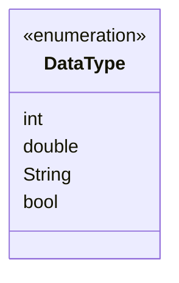

## 2.1.2 Basic Data Types

In the journey from zero to publishing your first Flutter app, understanding the basic data types in Dart is a crucial step. Dart, the programming language used by Flutter, provides a set of fundamental data types that form the building blocks for any application. These data types allow you to store and manipulate data efficiently, ensuring your app performs as expected. This section will delve into Dart's core data types: `int`, `double`, `String`, and `bool`. We'll explore their characteristics, usage, and how to convert between them, all while providing practical examples and tips.

### Overview of Data Types

Data types in Dart are essential for defining the kind of data a variable can hold. They help the compiler understand how to handle the data and optimize the performance of your application. The four basic data types in Dart are:

- **`int`**: Represents whole numbers.
- **`double`**: Represents floating-point numbers, or numbers with decimal points.
- **`String`**: Represents sequences of characters, or text.
- **`bool`**: Represents Boolean values, either `true` or `false`.

Understanding these types will enable you to choose the appropriate type for different kinds of data, ensuring your app is both efficient and effective.

### Integers (`int`)

The `int` data type in Dart is used to represent whole numbers, which are numbers without a decimal point. This includes both positive and negative numbers, as well as zero. Integers are commonly used in scenarios where fractional values are not required, such as counting items, indexing arrays, or managing loop iterations.

#### Common Operations with `int`

Dart provides a variety of operations that can be performed on integers, including:

- **Arithmetic Operations**: Addition, subtraction, multiplication, and division.
- **Bitwise Operations**: Operations like AND, OR, XOR, and NOT.
- **Comparison Operations**: Checking equality or inequality, and comparing greater or lesser values.

Here's a simple example demonstrating some common operations with integers:

```dart
int a = 10;
int b = 3;

// Arithmetic operations
int sum = a + b; // 13
int difference = a - b; // 7
int product = a * b; // 30
double quotient = a / b; // 3.3333333333333335

// Bitwise operations
int andResult = a & b; // 2
int orResult = a | b; // 11

// Comparison operations
bool isEqual = a == b; // false
bool isGreater = a > b; // true
```

#### Real-Life Example

Consider a shopping cart application where you need to keep track of the number of items a user wants to purchase. The `int` data type would be ideal for storing the quantity of each item:

```dart
int quantity = 5;
```

### Doubles (`double`)

The `double` data type is used to represent floating-point numbers, which are numbers that have a decimal point. This type is crucial when dealing with precise calculations, such as financial transactions, measurements, or scientific computations.

#### Precision Considerations

While `double` provides a way to handle decimal numbers, it's important to be aware of precision issues. Due to the way floating-point numbers are represented in memory, some numbers cannot be represented exactly, which can lead to small errors in calculations. This is a common pitfall when working with floating-point arithmetic.

Here's an example of using `double` in Dart:

```dart
double price = 9.99;
double discount = 0.15;
double discountedPrice = price * (1 - discount); // 8.4915
```

#### Real-Life Example

In a financial application, you might use `double` to represent the price of an item:

```dart
double price = 19.99;
```

### Strings (`String`)

The `String` data type is used to represent sequences of characters, or text. Strings are ubiquitous in programming, used for everything from displaying messages to storing user input.

#### String Literals, Concatenation, and Interpolation

Dart offers several ways to work with strings:

- **String Literals**: Defined using single or double quotes.
- **Concatenation**: Combining multiple strings using the `+` operator.
- **Interpolation**: Embedding expressions within a string using `${}` syntax.

Here's an example demonstrating these concepts:

```dart
String firstName = 'John';
String lastName = 'Doe';

// Concatenation
String fullName = firstName + ' ' + lastName; // 'John Doe'

// Interpolation
String greeting = 'Hello, $firstName $lastName!'; // 'Hello, John Doe!'
```

#### Real-Life Example

In a user registration form, you might use `String` to store the user's name:

```dart
String userName = 'Alice';
```

### Booleans (`bool`)

The `bool` data type is used to represent Boolean values, which are either `true` or `false`. Booleans are fundamental in control flow, allowing you to make decisions and control the execution of your code based on conditions.

#### Common Uses in Control Flow

Booleans are often used in conditional statements, such as `if`, `else`, and `while` loops, to determine the flow of execution:

```dart
bool isLoggedIn = true;

if (isLoggedIn) {
  print('Welcome back!');
} else {
  print('Please log in.');
}
```

#### Real-Life Example

In an e-commerce application, you might use a `bool` to indicate whether a product is in stock:

```dart
bool inStock = true;
```

### Type Conversion

Dart provides methods to convert between different data types, which is often necessary when dealing with user input or performing calculations. Here are some common type conversion methods:

- **`toString()`**: Converts a number to a string.
- **`int.parse()`**: Converts a string to an integer.
- **`double.parse()`**: Converts a string to a double.

Here's an example demonstrating type conversion:

```dart
String countStr = '42';
int count = int.parse(countStr); // 42

double temperature = 98.6;
String tempStr = temperature.toString(); // '98.6'
```

### Visual Aids

To summarize the basic data types in Dart, here's a visual representation using a Mermaid.js diagram:



### Best Practices and Common Pitfalls

When working with Dart's basic data types, keep the following best practices and common pitfalls in mind:

- **Choose the Right Type**: Use `int` for whole numbers, `double` for decimals, `String` for text, and `bool` for true/false values.
- **Be Aware of Precision**: When using `double`, be mindful of precision issues that can arise with floating-point arithmetic.
- **Use Interpolation**: Prefer string interpolation over concatenation for readability and performance.
- **Handle Type Conversion Carefully**: Ensure that conversions between types are handled properly to avoid runtime errors.

### Encouragement to Practice

To solidify your understanding of Dart's basic data types, try declaring variables of different types and performing operations on them. Experiment with type conversion and explore how different data types interact with each other.

## Quiz Time!



### Which data type would you use to store a person's age?

- [x] int
- [ ] double
- [ ] String
- [ ] bool

> **Explanation:** Age is typically represented as a whole number, making `int` the appropriate data type.


### What is the result of the following code snippet: `double result = 5 / 2;`?

- [ ] 2
- [ ] 2.5
- [x] 2.5
- [ ] 3

> **Explanation:** The division of two integers in Dart results in a `double`, so `5 / 2` yields `2.5`.


### How would you convert the string `'123'` to an integer in Dart?

- [x] int.parse('123')
- [ ] '123'.toInt()
- [ ] int('123')
- [ ] parseInt('123')

> **Explanation:** The correct method to convert a string to an integer in Dart is `int.parse()`.


### Which of the following is a valid string interpolation in Dart?

- [x] 'Hello, $name!'
- [ ] 'Hello, ' + name + '!'
- [ ] 'Hello, ${name}!'
- [ ] 'Hello, name!'

> **Explanation:** Both `$name` and `${name}` are valid interpolations in Dart strings.


### What will be the output of the following code: `bool isEqual = (3 == 3);`?

- [x] true
- [ ] false
- [ ] 3
- [ ] null

> **Explanation:** The expression `(3 == 3)` evaluates to `true`, so `isEqual` is `true`.


### Which data type is used to represent text in Dart?

- [ ] int
- [ ] double
- [x] String
- [ ] bool

> **Explanation:** The `String` data type is used to represent sequences of characters, or text.


### What is the purpose of the `toString()` method in Dart?

- [x] Converts a number to a string
- [ ] Converts a string to a number
- [ ] Converts a boolean to a string
- [ ] Converts a string to a boolean

> **Explanation:** The `toString()` method is used to convert a number to a string representation.


### How do you represent a floating-point number in Dart?

- [ ] int
- [x] double
- [ ] String
- [ ] bool

> **Explanation:** The `double` data type is used to represent floating-point numbers in Dart.


### What is the result of the following operation: `bool result = !true;`?

- [ ] true
- [x] false
- [ ] null
- [ ] undefined

> **Explanation:** The `!` operator negates the boolean value, so `!true` is `false`.


### True or False: In Dart, you can use both single and double quotes to define a string.

- [x] True
- [ ] False

> **Explanation:** Dart allows you to define strings using either single or double quotes.



By understanding and mastering these basic data types, you'll be well-equipped to handle data effectively in your Flutter applications, paving the way for more complex programming concepts and ultimately, a successful app launch.
