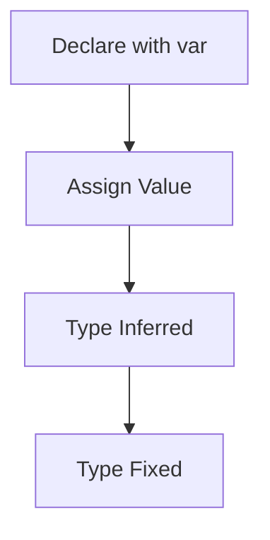

## 2.1.3 Type Inference and Type Safety

In the journey from zero to publishing your first Flutter app, understanding Dart's type system is crucial. Dart, the language behind Flutter, offers a robust type system that combines the flexibility of dynamic typing with the safety of static typing. This section delves into the concepts of type inference and type safety, providing you with the tools to write more reliable and maintainable code.

### Understanding Type Inference with `var`

Type inference is a powerful feature in Dart that allows the compiler to deduce the type of a variable based on the value assigned to it. This is achieved using the `var` keyword. When you declare a variable with `var`, Dart infers the type at compile time, making your code cleaner and reducing the need for explicit type annotations.

#### Example of Type Inference

Consider the following code snippet:

```dart
var score = 100; // Inferred as int
var average = 75.5; // Inferred as double
```

In this example, Dart automatically infers that `score` is an `int` and `average` is a `double`. This inference happens at compile time, ensuring that the types are fixed after the initial assignment.

#### Type Fixation

Once a type is inferred, it is fixed and cannot be changed. Attempting to assign a value of a different type to the variable will result in a compile-time error. This behavior enforces type safety and prevents runtime errors that could occur due to type mismatches.

```dart
var count = 10;
// count = 'ten'; // This will cause a compile-time error
```

In the above example, trying to assign a string to `count`, which was inferred as an `int`, results in an error, highlighting the importance of type safety.

### Static Type Checking

Dart employs static type checking, which means that type errors are caught at compile time rather than at runtime. This approach not only enhances performance but also improves code reliability by catching potential errors early in the development process.

#### Benefits of Static Type Checking

1. **Early Error Detection**: Errors are detected during compilation, allowing developers to fix issues before the code is executed.
2. **Improved Code Quality**: Static type checking enforces type consistency, reducing the likelihood of type-related bugs.
3. **Enhanced Readability**: Code with explicit types is easier to read and understand, as it clearly communicates the developer's intent.

### Type Safety Benefits

Type safety is a cornerstone of Dart's design, providing several benefits that contribute to writing robust applications.

#### Prevention of Type Mismatch Errors

Type safety ensures that variables are used consistently according to their declared or inferred types. This prevents common errors such as type mismatches, which can lead to unexpected behavior or crashes.

```dart
int add(int a, int b) {
  return a + b;
}

void main() {
  print(add(5, 10)); // Correct usage
  // print(add('five', 10)); // Compile-time error
}
```

In this example, the `add` function expects two integers. Attempting to pass a string results in a compile-time error, preventing a potential runtime issue.

#### Encouraging Best Practices

Type safety encourages developers to adopt best practices, such as using explicit types where necessary and leveraging type inference for cleaner code. This balance helps maintain code clarity while ensuring type correctness.

### Dynamic Typing with `dynamic`

While Dart is statically typed, it also supports dynamic typing through the `dynamic` keyword. This allows variables to hold values of any type, providing flexibility in certain scenarios.

#### When to Use `dynamic`

The `dynamic` type is useful when you need to work with values of unknown types, such as when interacting with JSON data or handling user input. However, it's important to use `dynamic` judiciously, as it bypasses type safety checks.

```dart
dynamic value = 'Hello';
value = 123; // Allowed, but type safety is lost
```

In this example, `value` can hold both a string and an integer, but this flexibility comes at the cost of type safety.

#### Risks of Using `dynamic`

1. **Loss of Type Safety**: Using `dynamic` removes compile-time type checks, increasing the risk of runtime errors.
2. **Reduced Code Clarity**: Code that relies heavily on `dynamic` can become difficult to read and maintain, as the variable types are not explicitly defined.

### Visualizing Type Inference and Assignment

To better understand the process of type inference and assignment in Dart, consider the following flowchart:



This flowchart illustrates how a variable declared with `var` undergoes type inference and becomes type-fixed after the initial assignment.

### Best Practices for Type Safety

1. **Prefer Explicit Types**: Use explicit types for function parameters and return values to enhance readability and maintainability.
2. **Leverage Type Inference**: Use `var` for local variables where the type is obvious from the context.
3. **Avoid Overusing `dynamic`**: Reserve `dynamic` for situations where type flexibility is necessary, and ensure proper error handling.

### Common Pitfalls and Troubleshooting

#### Misunderstanding Type Inference

A common mistake is assuming that `var` allows for dynamic typing. Remember that `var` infers a fixed type at compile time, and attempting to change the type will result in an error.

#### Ignoring Type Errors

Ignoring compile-time type errors can lead to runtime issues. Always address type errors promptly to maintain code reliability.

### Conclusion

Understanding type inference and type safety in Dart is essential for writing robust Flutter applications. By leveraging these features, you can catch errors early, improve code quality, and ensure a smoother development process. Remember to use `var` for type inference, prefer explicit types for clarity, and use `dynamic` sparingly to maintain type safety.

## Quiz Time!



### What does Dart do when you declare a variable with `var`?

- [x] Infers the type at compile time
- [ ] Assigns a default type of `dynamic`
- [ ] Allows the type to change at runtime
- [ ] Requires an explicit type annotation

> **Explanation:** When you declare a variable with `var`, Dart infers the type at compile time based on the assigned value.

### What happens if you try to assign a different type to a `var` variable after its initial assignment?

- [x] It causes a compile-time error
- [ ] The type changes to the new value's type
- [ ] It causes a runtime error
- [ ] The variable becomes `dynamic`

> **Explanation:** Once a type is inferred for a `var` variable, it is fixed. Assigning a different type causes a compile-time error.

### What is a key benefit of static type checking in Dart?

- [x] Errors are caught at compile time
- [ ] It allows for dynamic typing
- [ ] It improves runtime performance
- [ ] It requires more code

> **Explanation:** Static type checking catches errors at compile time, allowing developers to fix issues before execution.

### Why should you use `dynamic` sparingly in Dart?

- [x] It bypasses type safety checks
- [ ] It improves code readability
- [ ] It enhances performance
- [ ] It is the default type for all variables

> **Explanation:** Using `dynamic` removes compile-time type checks, increasing the risk of runtime errors.

### Which of the following is a benefit of type safety?

- [x] Prevention of type mismatch errors
- [ ] Increased flexibility in variable usage
- [ ] Reduced code readability
- [ ] Slower compile times

> **Explanation:** Type safety prevents type mismatch errors, ensuring variables are used consistently according to their types.

### What does the `dynamic` type allow in Dart?

- [x] Variables to hold values of any type
- [ ] Variables to change type at compile time
- [ ] Variables to be type-checked at compile time
- [ ] Variables to be used only in specific functions

> **Explanation:** The `dynamic` type allows variables to hold values of any type, providing flexibility but at the cost of type safety.

### How does type inference improve code readability?

- [x] By reducing the need for explicit type annotations
- [ ] By allowing variables to change type
- [ ] By requiring explicit types for all variables
- [ ] By enforcing strict type checks at runtime

> **Explanation:** Type inference reduces the need for explicit type annotations, making the code cleaner and easier to read.

### What is a potential risk of ignoring compile-time type errors?

- [x] Increased likelihood of runtime issues
- [ ] Improved performance
- [ ] Enhanced code flexibility
- [ ] Reduced code maintenance

> **Explanation:** Ignoring compile-time type errors can lead to runtime issues, as potential problems are not addressed early.

### In which scenario is using `dynamic` appropriate?

- [x] When working with values of unknown types
- [ ] When strict type safety is required
- [ ] When optimizing for performance
- [ ] When defining constants

> **Explanation:** `dynamic` is appropriate when working with values of unknown types, such as JSON data or user input.

### True or False: Type inference in Dart allows a variable's type to change after its initial assignment.

- [x] False
- [ ] True

> **Explanation:** False. Once a type is inferred for a `var` variable, it is fixed and cannot change after the initial assignment.


