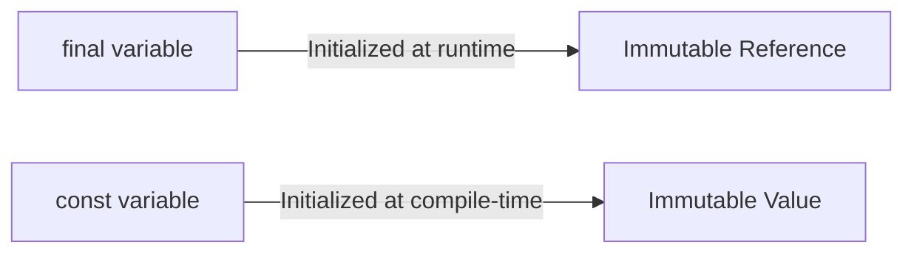

## 2.1.4 Constants and Final Variables

In the world of programming, especially when building robust applications with Flutter, understanding the nuances of immutability is crucial. This section will guide you through the concepts of `final` and `const` in Dart, helping you to write safer, more efficient, and maintainable code. We will explore what immutability means, when and how to use `final` and `const`, and the differences between them. By the end of this section, you'll have a solid grasp of these concepts and be able to apply them effectively in your Flutter projects.

### Understanding Immutability

Immutability refers to the state of an object or variable that cannot be changed after it has been created. In programming, immutable objects are those whose state cannot be modified after they are instantiated. This concept is pivotal for ensuring thread safety, reducing bugs, and optimizing performance. 

In Dart, immutability is achieved through the use of `final` and `const` keywords. These keywords allow you to declare variables that cannot be reassigned or modified, providing a layer of safety and predictability in your code.

### Using `final`

The `final` keyword in Dart is used to declare a variable that can be set only once. Once a `final` variable is assigned a value, it cannot be changed. However, the value itself can be a mutable object, such as a list or a map, which means the contents of the object can be modified, but the reference to the object cannot be changed.

#### Characteristics of `final` Variables

- **Initialized at Runtime**: `final` variables are initialized at runtime, meaning their value is determined when the program is running.
- **Immutable Reference**: The reference to the object is immutable, but the object itself can be mutable.

#### When to Use `final`

Use `final` when you have a variable whose value should not change after it is initialized, but the value itself might be a mutable object. This is particularly useful for variables that are dependent on runtime data, such as user input or system states.

#### Example of `final`

```dart
final currentTime = DateTime.now(); // Initialized at runtime
print('Current Time: $currentTime');
```

In this example, `currentTime` is a `final` variable that holds the current date and time. Once assigned, the reference to `currentTime` cannot be changed, but since `DateTime` is an immutable object, this distinction is more about the reference itself.

### Using `const`

The `const` keyword is used to define compile-time constants. These are variables whose values are determined at compile time and cannot be changed thereafter. Unlike `final`, `const` variables must be initialized with a constant value, which means they cannot depend on runtime data.

#### Characteristics of `const` Variables

- **Compile-time Constant**: `const` variables are evaluated and assigned at compile time.
- **Immutable Value**: Both the reference and the value are immutable.

#### When to Use `const`

Use `const` when you have a variable whose value is known at compile time and will never change. This is ideal for defining configuration values, fixed data, or any constant expressions.

#### Example of `const`

```dart
const pi = 3.14159; // Compile-time constant
print('Value of Pi: $pi');
```

In this example, `pi` is a `const` variable representing the mathematical constant π. Its value is fixed and known at compile time.

### Difference Between `final` and `const`

Understanding the difference between `final` and `const` is crucial for making informed decisions about which to use in your code.

- **Initialization Time**: `final` variables are initialized at runtime, while `const` variables are initialized at compile time.
- **Mutability**: `final` allows for mutable objects, whereas `const` requires the entire object to be immutable.
- **Use Cases**: Use `final` for runtime constants and `const` for compile-time constants.

#### Example Comparison

```dart
final numbers = [1, 2, 3];
// numbers.add(4); // Allowed, list is mutable, reference is final

const cities = ['London', 'Paris', 'Tokyo'];
// cities.add('New York'); // Error, cannot modify a const list
```

In this example, `numbers` is a `final` list, meaning the reference to the list is immutable, but the list itself can be modified. In contrast, `cities` is a `const` list, meaning neither the reference nor the contents can be changed.

### Practical Applications

Immutability offers several benefits in software development, particularly in Flutter applications:

- **Performance Optimization**: Immutable objects can be shared freely without the need for defensive copying, reducing memory usage and improving performance.
- **Thread Safety**: Immutable objects are inherently thread-safe, as their state cannot be changed, eliminating the risk of concurrent modifications.
- **Predictability**: Code that uses immutable variables is easier to understand and reason about, as the state of the variables is guaranteed not to change unexpectedly.

#### Scenario: Using `final` and `const` in Flutter

Consider a scenario where you are building a Flutter application that displays a list of products. You might use `final` for the list of products, as it could be loaded from a database or API at runtime, but use `const` for fixed configuration values such as tax rates or discount percentages.

```dart
final List<Product> products = fetchProductsFromApi();
const double taxRate = 0.07;
const double discount = 0.10;

double calculateFinalPrice(double price) {
  return price * (1 + taxRate) * (1 - discount);
}
```

In this example, `products` is a `final` list that is populated at runtime, while `taxRate` and `discount` are `const` values that are known at compile time.

### Visualizing `final` vs `const`

To better understand the relationship between `final` and `const`, consider the following diagram:



This diagram illustrates that `final` variables are initialized at runtime and have an immutable reference, whereas `const` variables are initialized at compile time and have an immutable value.

### Common Misconceptions

- **Misconception 1**: `final` and `const` are interchangeable. This is incorrect; they serve different purposes and are used in different contexts.
- **Misconception 2**: `final` makes the object immutable. In reality, `final` makes the reference immutable, not the object itself.
- **Misconception 3**: `const` can be used with any value. `const` requires compile-time constants, so it cannot be used with values that are determined at runtime.

### Best Practices

- Use `final` for variables that should not be reassigned after initialization but may contain mutable objects.
- Use `const` for variables that are truly constant and known at compile time.
- Prefer immutability whenever possible to enhance code safety and maintainability.

### Conclusion

Understanding and effectively using `final` and `const` in Dart is essential for writing clean, efficient, and reliable Flutter applications. By leveraging these keywords, you can ensure that your code is both performant and easy to maintain. Remember to choose `final` for runtime constants and `const` for compile-time constants, and always strive for immutability to reap the benefits of safer and more predictable code.

## Quiz Time!



### What does it mean for a variable to be immutable?

- [x] It cannot be changed after it is created.
- [ ] It can be changed only once.
- [ ] It can be changed multiple times.
- [ ] It can be changed only at runtime.

> **Explanation:** An immutable variable is one that cannot be changed after it is created.

### Which keyword is used to declare a variable that can be set only once at runtime?

- [x] final
- [ ] const
- [ ] var
- [ ] dynamic

> **Explanation:** The `final` keyword is used to declare a variable that can be set only once at runtime.

### Which keyword is used for compile-time constants?

- [x] const
- [ ] final
- [ ] var
- [ ] dynamic

> **Explanation:** The `const` keyword is used for compile-time constants.

### What is the main difference between `final` and `const`?

- [x] `final` is for runtime constants, `const` is for compile-time constants.
- [ ] `final` is for compile-time constants, `const` is for runtime constants.
- [ ] `final` and `const` are interchangeable.
- [ ] `final` makes objects immutable, `const` does not.

> **Explanation:** `final` is used for runtime constants, while `const` is used for compile-time constants.

### Can a `const` variable be initialized with a runtime value?

- [ ] Yes
- [x] No
- [ ] Only in certain cases
- [ ] Only if it's a string

> **Explanation:** A `const` variable must be initialized with a compile-time constant, not a runtime value.

### Which of the following is a valid use of `final`?

- [x] final currentTime = DateTime.now();
- [ ] const currentTime = DateTime.now();
- [ ] var currentTime = DateTime.now();
- [ ] dynamic currentTime = DateTime.now();

> **Explanation:** `final` is appropriate for runtime values like `DateTime.now()`.

### Which of the following is a valid use of `const`?

- [x] const pi = 3.14159;
- [ ] final pi = 3.14159;
- [ ] var pi = 3.14159;
- [ ] dynamic pi = 3.14159;

> **Explanation:** `const` is used for compile-time constants like the value of π.

### Can the contents of a `final` list be modified?

- [x] Yes
- [ ] No
- [ ] Only if it's a list of numbers
- [ ] Only if it's a list of strings

> **Explanation:** The contents of a `final` list can be modified, but the reference to the list cannot be changed.

### Can the contents of a `const` list be modified?

- [ ] Yes
- [x] No
- [ ] Only if it's a list of numbers
- [ ] Only if it's a list of strings

> **Explanation:** The contents of a `const` list cannot be modified.

### Is it true that `final` and `const` are used to declare immutable variables?

- [x] True
- [ ] False

> **Explanation:** Both `final` and `const` are used to declare immutable variables, but they differ in when they are initialized and how they are used.


