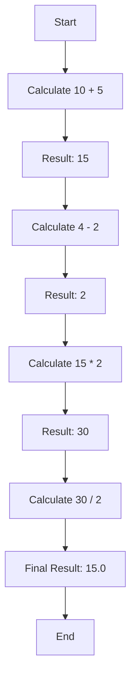

## 2.2.1 Arithmetic Operators

Arithmetic operators are fundamental tools in any programming language, and Dart is no exception. As you embark on your journey to develop Flutter applications, understanding these operators will empower you to perform a wide range of mathematical computations, from simple calculations to complex algorithms. In this section, we will delve into Dart's arithmetic operators, explore their usage, and provide practical examples relevant to app development.

### Overview of Arithmetic Operators

Dart provides a set of arithmetic operators that allow you to perform basic mathematical operations. These operators are essential for manipulating numerical data and are widely used in various programming scenarios. Let's take a closer look at each operator:

1. **Addition (`+`)**: Adds two operands.
2. **Subtraction (`-`)**: Subtracts the second operand from the first.
3. **Multiplication (`*`)**: Multiplies two operands.
4. **Division (`/`)**: Divides the first operand by the second, resulting in a double.
5. **Integer Division (`~/`)**: Divides the first operand by the second, resulting in an integer.
6. **Modulo (`%`)**: Returns the remainder of the division of the first operand by the second.

### Usage Examples

To understand how these operators work in practice, let's explore some code examples:

#### Basic Arithmetic Operations

```dart
void main() {
  int sum = 10 + 5; // 15
  int difference = 10 - 5; // 5
  int product = 10 * 5; // 50
  double quotient = 10 / 3; // 3.333...
  int intQuotient = 10 ~/ 3; // 3
  int remainder = 10 % 3; // 1

  print('Sum: $sum');
  print('Difference: $difference');
  print('Product: $product');
  print('Quotient: $quotient');
  print('Integer Quotient: $intQuotient');
  print('Remainder: $remainder');
}
```

In this example, we perform basic arithmetic operations using Dart's operators. Notice how the division operator (`/`) results in a double, while integer division (`~/`) returns an integer.

#### Complex Expressions

Arithmetic operators can be combined to form complex expressions. Dart follows the standard mathematical order of operations, often remembered by the acronym PEMDAS/BODMAS (Parentheses, Exponents, Multiplication and Division, Addition and Subtraction).

```dart
void main() {
  double result = (10 + 5) * 2 / (4 - 2); // 15.0
  print('Result: $result');
}
```

In this example, parentheses are used to control the order of operations, ensuring that addition and subtraction are performed before multiplication and division.

### Order of Operations

Understanding the order of operations is crucial when working with arithmetic expressions. Dart evaluates expressions based on the following precedence:

1. **Parentheses**: Expressions within parentheses are evaluated first.
2. **Multiplication and Division**: These operations are performed next, from left to right.
3. **Addition and Subtraction**: Finally, addition and subtraction are performed, from left to right.

This precedence ensures that expressions are evaluated in a predictable manner, allowing you to construct complex calculations with confidence.

### Common Applications in App Development

Arithmetic operators are not just theoretical constructs; they have practical applications in app development. Here are some examples of how you might use these operators in a Flutter application:

#### Calculating Totals

Suppose you're developing a shopping cart feature in an e-commerce app. You can use arithmetic operators to calculate the total cost of items in the cart.

```dart
void main() {
  double item1Price = 29.99;
  double item2Price = 49.99;
  int item1Quantity = 2;
  int item2Quantity = 1;

  double totalCost = (item1Price * item1Quantity) + (item2Price * item2Quantity);
  print('Total Cost: \$${totalCost.toStringAsFixed(2)}');
}
```

In this example, we calculate the total cost by multiplying the price of each item by its quantity and summing the results.

#### Averaging Values

Calculating averages is another common task in app development. For instance, you might want to display the average rating of a product based on user reviews.

```dart
void main() {
  List<int> ratings = [4, 5, 3, 4, 5];
  int totalRatings = ratings.length;
  int sumOfRatings = ratings.reduce((a, b) => a + b);

  double averageRating = sumOfRatings / totalRatings;
  print('Average Rating: ${averageRating.toStringAsFixed(1)}');
}
```

Here, we calculate the average rating by summing the ratings and dividing by the total number of ratings.

### Visualizing Complex Expressions

To better understand the flow of calculations in complex expressions, we can use a flowchart. Below is a Mermaid.js flowchart that illustrates the steps involved in evaluating the expression `(10 + 5) * 2 / (4 - 2)`.



This flowchart visually represents the order in which operations are performed, helping you grasp the sequence of calculations.

### Best Practices and Common Pitfalls

When working with arithmetic operators, it's important to keep a few best practices in mind:

- **Integer Division Quirks**: Be aware that integer division (`~/`) truncates the result, discarding any fractional part. This can lead to unexpected results if not handled carefully.
- **Division by Zero**: Always ensure that the divisor is not zero to avoid runtime errors. Consider adding checks or using exception handling to manage such cases.
- **Precision with Doubles**: When working with doubles, be mindful of precision issues. Use methods like `toStringAsFixed()` to control the number of decimal places when displaying results.

### Encouragement to Practice

The best way to become proficient with arithmetic operators is through practice. Experiment with different expressions, try out new combinations, and challenge yourself with real-world scenarios. As you gain confidence, you'll find that these operators become invaluable tools in your app development toolkit.

## Quiz Time!



### Which operator is used for integer division in Dart?

- [ ] /
- [x] ~/
- [ ] %
- [ ] *

> **Explanation:** The `~/` operator is used for integer division in Dart, which returns the quotient as an integer.

### What is the result of the expression `10 % 3`?

- [ ] 3
- [ ] 0
- [x] 1
- [ ] 2

> **Explanation:** The modulo operator `%` returns the remainder of the division of 10 by 3, which is 1.

### In the expression `(10 + 5) * 2 / (4 - 2)`, which operation is performed first?

- [x] 10 + 5
- [ ] 2 / (4 - 2)
- [ ] (10 + 5) * 2
- [ ] 4 - 2

> **Explanation:** According to the order of operations, expressions within parentheses are evaluated first, so `10 + 5` is calculated first.

### What is the result of `10 ~/ 3`?

- [x] 3
- [ ] 3.333...
- [ ] 0
- [ ] 1

> **Explanation:** The `~/` operator performs integer division, so `10 ~/ 3` results in 3, discarding the fractional part.

### Which of the following is a common application of arithmetic operators in app development?

- [x] Calculating totals
- [ ] Sending HTTP requests
- [ ] Managing state
- [ ] Handling user input

> **Explanation:** Arithmetic operators are commonly used to calculate totals, such as the total cost of items in a shopping cart.

### What does the expression `10 / 3` return in Dart?

- [ ] 3
- [ ] 0
- [x] 3.333...
- [ ] 1

> **Explanation:** The `/` operator performs division and returns a double, so `10 / 3` results in approximately 3.333...

### How can you ensure that a division operation does not result in a division by zero error?

- [x] Check if the divisor is zero before performing the division
- [ ] Use the modulo operator
- [ ] Always use integer division
- [ ] Avoid using division altogether

> **Explanation:** To prevent division by zero errors, you should check if the divisor is zero before performing the division.

### Which operator would you use to find the remainder of a division?

- [ ] /
- [ ] ~/
- [x] %
- [ ] *

> **Explanation:** The `%` operator is used to find the remainder of a division.

### What is the result of the expression `20 - 5 * 2`?

- [ ] 30
- [ ] 10
- [x] 10
- [ ] 0

> **Explanation:** According to the order of operations, multiplication is performed before subtraction, so `5 * 2` is calculated first, resulting in `20 - 10`, which equals 10.

### True or False: Dart follows the standard mathematical order of operations.

- [x] True
- [ ] False

> **Explanation:** Dart follows the standard mathematical order of operations, ensuring that expressions are evaluated in a predictable manner.



By mastering arithmetic operators, you lay a solid foundation for performing mathematical computations in your Flutter applications. Whether you're calculating totals, averages, or more complex expressions, these operators are essential tools in your development toolkit. Practice regularly, explore different scenarios, and soon you'll be leveraging these operators with confidence and precision.
